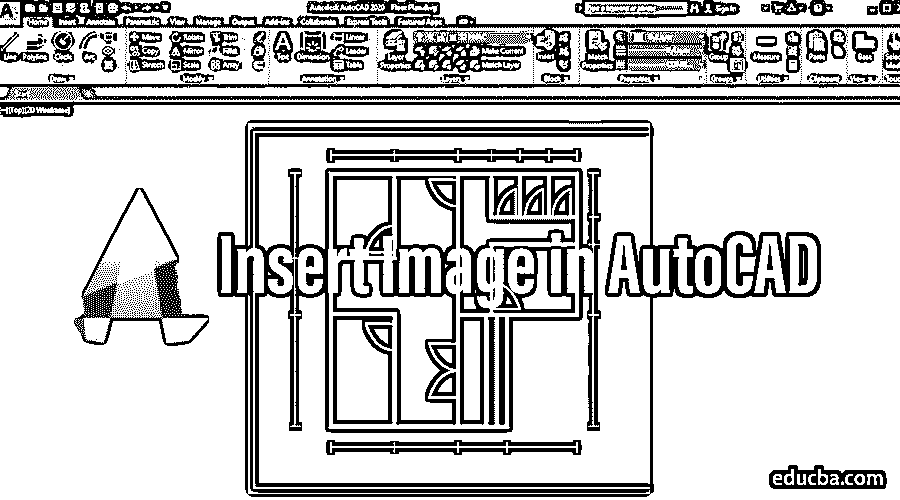
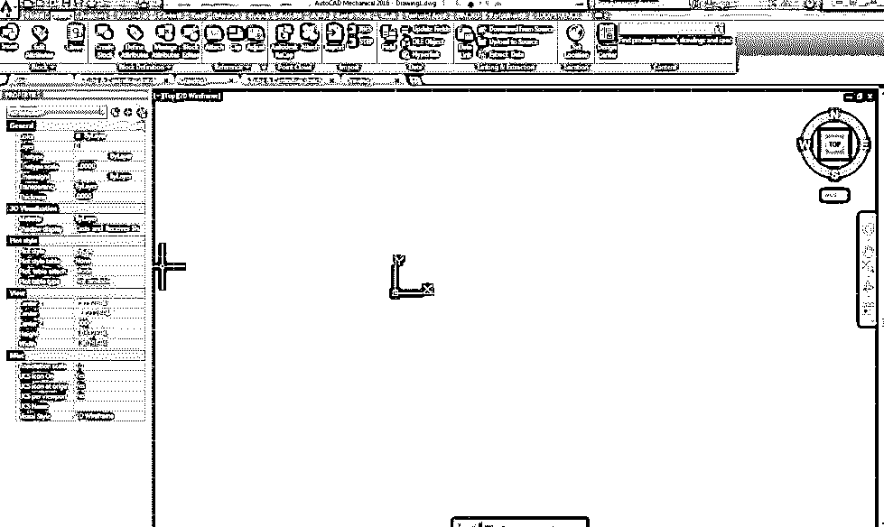
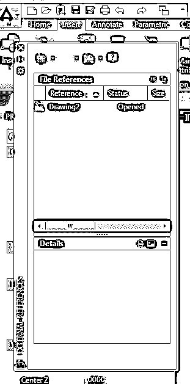
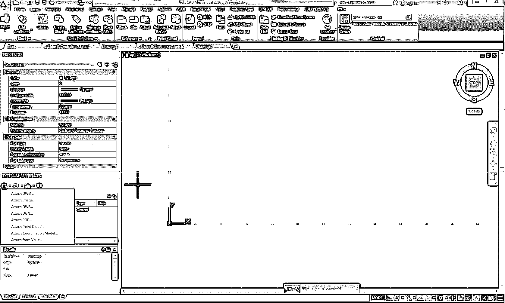
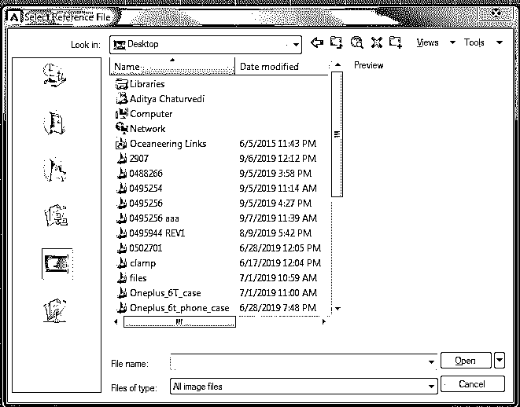
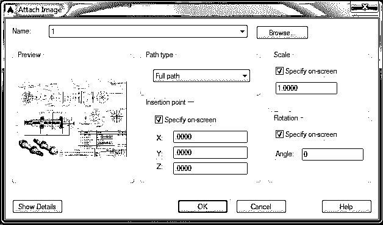
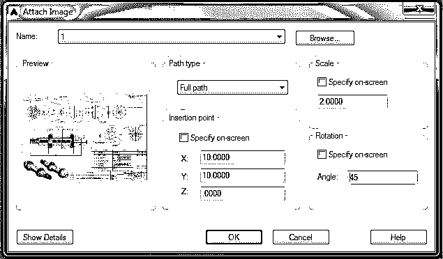
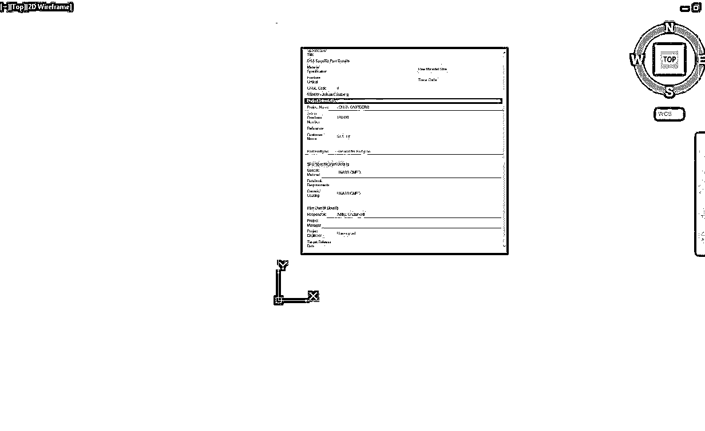
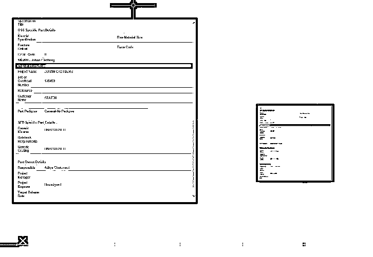
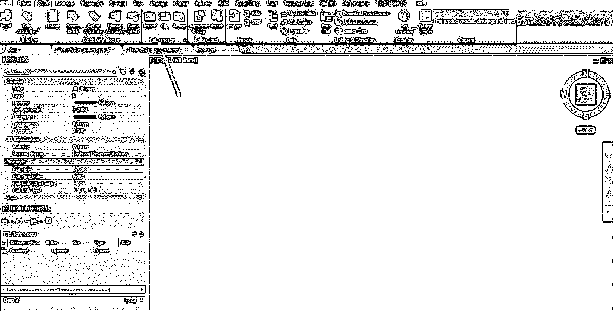

# 在 AutoCAD 中插入图像

> 原文：<https://www.educba.com/insert-image-in-autocad/>

## 什么是 AutoCAD？

AutoCAD 是一种绘图软件，建筑师、设计工程师可以在它的帮助下以 2D 3D 格式绘制设计。这是第一个帮助我们以数字格式绘制设计的软件。在此之前，人们习惯于在不同大小的图纸上画画。他们使用 A1、A2、A3 和 A4 大小的纸张来绘制对象。我们主要关注的是如何在本演示中在 Auto CAD 中插入图像。在本主题中，我们将学习在 AutoCAD 中插入图像。

### 如何在 AutoCAD 中插入图像？

在 Auto CAD 中插入图像的步骤。

<small>3D 动画、建模、仿真、游戏开发&其他</small>

#### 流程#1

**第 1 步–**点击窗口上作为快捷方式提供的 AutoCAD 图标，打开 AutoCAD 软件。AutoCAD 软件将出现在您的屏幕上，如下所示。

**步骤 2-**在 Auto CAD 命令框中输入命令图像，然后按回车键。屏幕上将出现一个对话框，如图所示。

**第 3 步–**然后点击出现在对话框最左上角的 DWG 文件夹。会出现一个小对话框，上面有许多选项，如附加 DWG、附加图像、附加 DWF 等。单击对话框上的附加图像选项。

**步骤 4—**屏幕上会出现一个弹出对话框。在 Auto CAD 软件上浏览你需要的图像。

**第五步—**你浏览完之后会弹出一个对话框，会询问你需要的图片的路径类型，插入点，缩放，旋转。将路径类型指定为“完整”,并按“确定”,将所有其他选项指定为“在屏幕上指定”。这样，您可以在 Auto CAD 窗口的任何位置插入图像。

**步骤 6-**如果您知道图像的确切位置和比例因子，那么您可以按如下所示输入位置和比例因子。

**第 7 步-**指定插入位置和旋转后，图像将出现在屏幕上，如图所示。

**第 8 步–**您也可以按照上述流程在同一窗口输入多幅图像。

#### 流程#2

您可以通过单击“插入”任务栏上的“附加”图标直接插入图像，并遵循步骤 5 到步骤 8 的相同过程。

因此，我们可以通过这两个过程在 Auto CAD 软件中插入图像。

### 推荐文章

这是在 AutoCAD 中插入图像的指南。在这里，我们讨论如何插入图像在 AutoCAD 一步一步给定的截图。您也可以阅读以下文章，了解更多信息——

1.  [AutoCAD 插件](https://www.educba.com/autocad-plugins/)
2.  [什么是 AutoCAD？](https://www.educba.com/what-is-autocad/)
3.  [AutoCAD 中的样条](https://www.educba.com/spline-in-autocad/)
4.  [AutoCAD 命令](https://www.educba.com/autocad-commands/)

