# AutoCAD 中的倒角

> 原文：<https://www.educba.com/chamfer-in-autocad/>

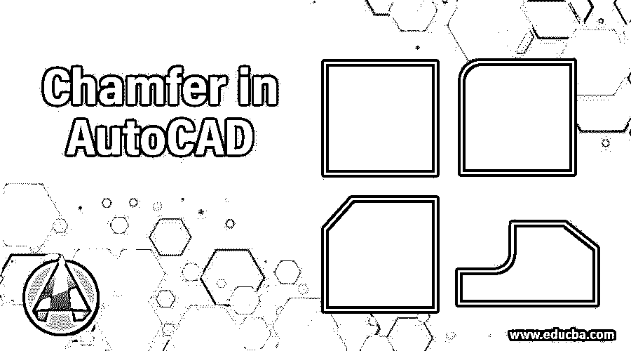

## AutoCAD 中倒角的介绍

AutoCAD 是许多设计专业人员使用的计算机辅助二维和三维设计软件。在这个软件中我们有许多不同类型的命令来简化我们的工作。倒角是 Auto Cad 软件中使我们的工作变得容易的命令之一。倒角是一个命令，通过输入特定的值，可以在任何距离或任何特定的角度切割任何 2d 形状的两个相邻边的角。在本文中，我们将通过一个例子来理解这个命令，并看看这个命令的工作技术。让我们开始讨论吧。

### 如何在 AutoCAD 中使用倒角命令？

倒角非常类似于 Auto Cad 软件的 fillet 命令。它们之间的区别是倒角作用于距离或角度，而圆角作用于圆弧。所以我们将以一种非常激动人心的方式来讨论它，但在开始之前，让我们看看这个软件的工作屏幕，以便更好地了解这个软件。

<small>3D 动画、建模、仿真、游戏开发&其他</small>

**步骤 1:** 在工作屏幕的顶部，有一个功能区，其中有许多不同类型的选项卡，使我们的工作变得简单，如主页选项卡、插入选项卡、注释等；在这下面，我们有一个工作窗口，我们可以在其中看到我们当前的绘图，在这下面，我们有一些导航工具来处理我们在窗口区域的工作。

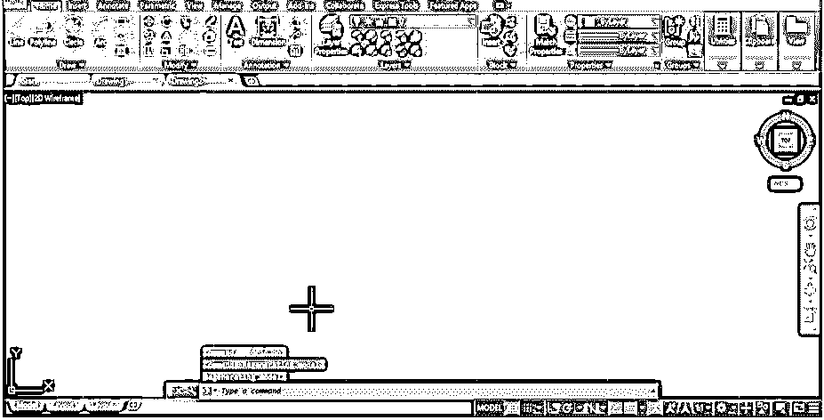

**步骤 2:** 让我们从主页选项卡的绘制菜单中选择一个矩形命令，绘制一个任意尺寸的矩形。

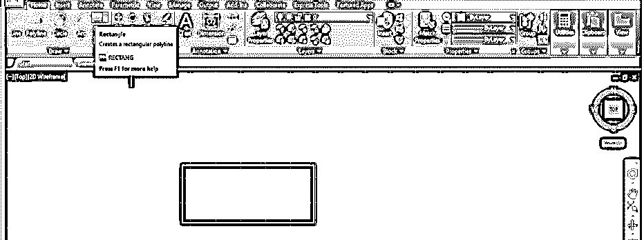

**第三步:**现在，点击该软件主页标签的修改菜单中的倒角命令。

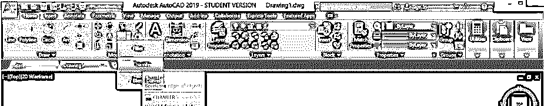

**步骤 4:** 一旦使用倒角命令，在倒角命令的参数框中，工作屏幕的底部会出现该命令的一些选项。我们将逐一讨论它们。

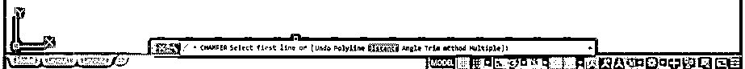

**第五步:**我们有两种方法在这个矩形上制作倒角；一是距离，二是角度。我们将首先采用距离法。对于距离，在 chamfer 命令的参数框中从键盘键入 D，然后按键盘的 Enter 键。

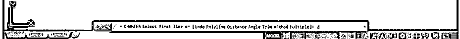

**第六步:**现在，它会要求你在倒角的第一行输入倒角距离的值。我会把它记为 1，然后按键盘上的回车键。

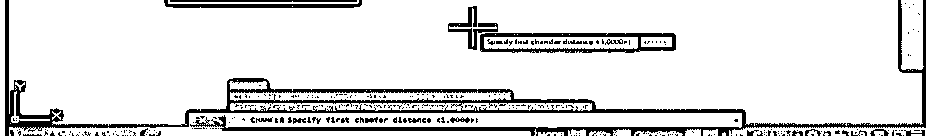

**步骤 7:** 现在，接下来，它将要求您输入第二个倒角距离，即输入第二个倒角线上的倒角值。我把它记为 2，然后按键盘上的回车键。

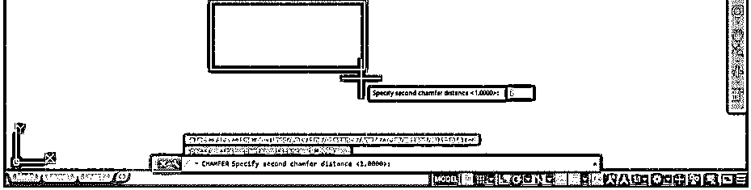

**步骤 8:** 现在点击选择矩形的第一条线。

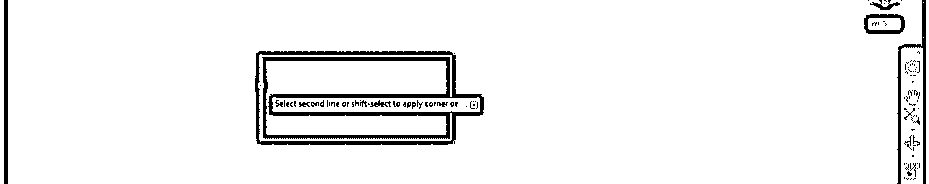

**步骤 9:** 然后点击要添加倒角的第二条线，然后按回车键应用命令。

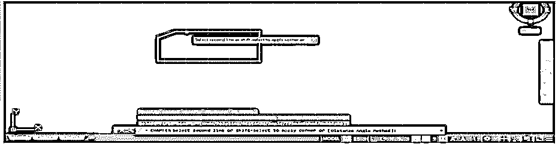

**步骤 10:** 现在，让我们分析一下这个命令的其他选项。再次使用倒角命令；对于切角命令，可以从键盘键入 CHA，然后按键盘的 enter 键。

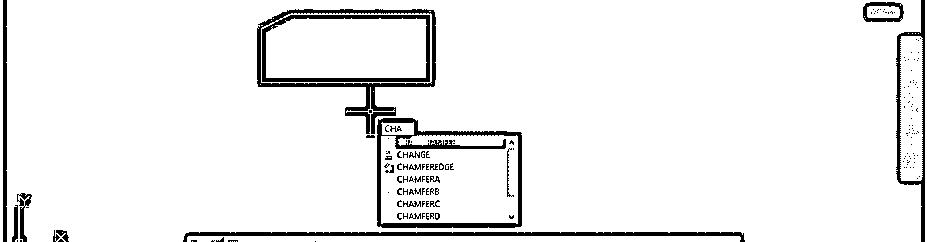

**步骤 11:** 现在从键盘输入 T，按键盘的 enter 键。您可以在该命令的参数框中键入 T，或者直接按下键盘上的 T 按钮。

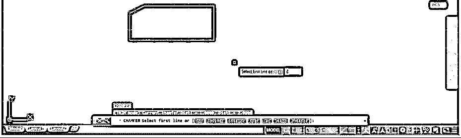

**第十二步:**现在，它会问你是否要修剪边缘。我会选择不修剪。让我们看看现在会发生什么。

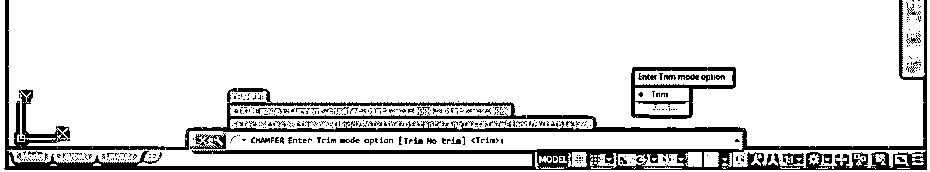

**步骤 13:** 现在按键盘上的 D 键，然后按键盘上的 enter 键。

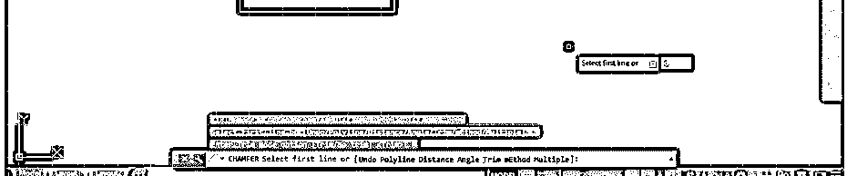

**第 14 步:**像我们在前面的步骤中一样，指定第一个倒角距离。我将再次把它记为 1，然后按下键盘的 enter 键。

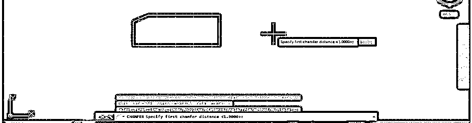

**步骤 15:** 现在指定第二个倒角距离。我把它记为 2，然后按键盘上的回车键。

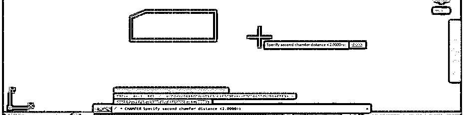

第 16 步:点击选择矩形的第一条线。

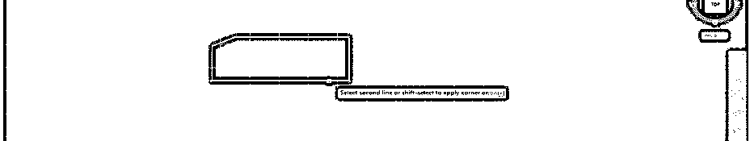

**步骤 17:** 然后点击选择这个矩形的第二条线。现在，您可以看到它在这些相邻边的拐角处对边进行了倒角，但拐角的边缘对我们来说是可见的，因为我们选择了“不修剪”选项。因此，如果你想让这个边缘在你的绘图中可见，那么就选择“无修剪”选项；否则，使用切角命令的修剪选项。

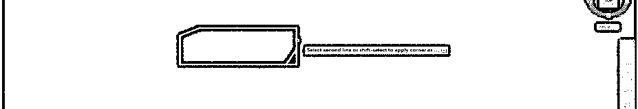

**步骤 18:** 现在，让我们来看看倒角命令的角度选项。对于角度，通过从键盘键入 CHA，然后按键盘的 enter 键，再次选择切角命令。现在按键盘上的 A 键，然后按键盘上的 enter 键。

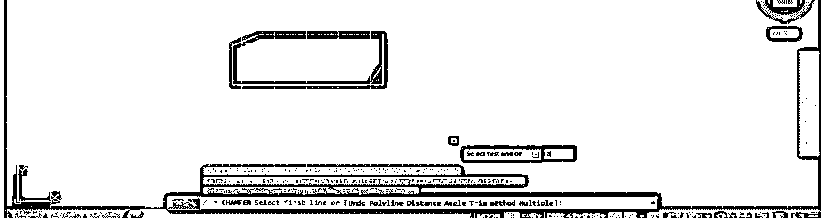

**步骤 19:** 现在，它会要求你指定倒角的长度。我会把它记为 1，然后按键盘上的回车键。

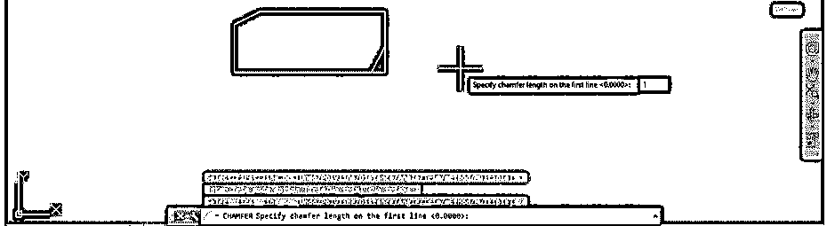

**步骤 20:** 现在，它会问你从第一条线开始倒角的角度。我将 30°作为倒角的角度，然后按下键盘上的回车键。

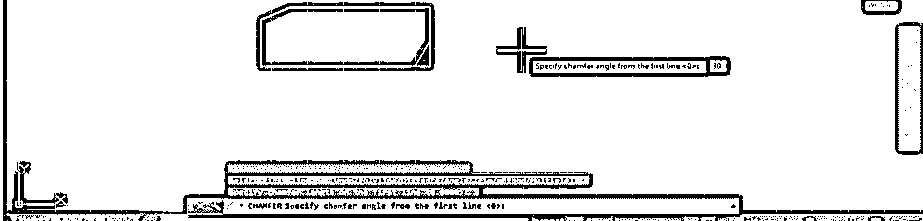

**步骤 21:** 现在选择倒角的第一条线，选择倒角的第二条线，然后按键盘的 enter 键。您的倒角将应用于 30 度。

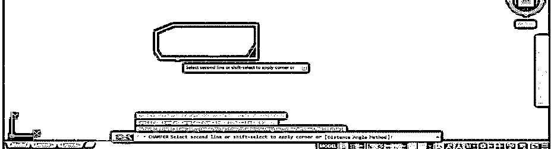

**第二十二步:**可以看到这个角度。要查看此角度，请转到“主页”选项卡的“注释”菜单的“角度尺寸”选项，并单击角度尺寸图标。

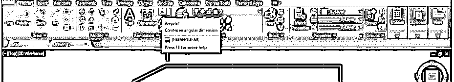

**步骤 23:** 现在点击选择你已经应用倒角的线。

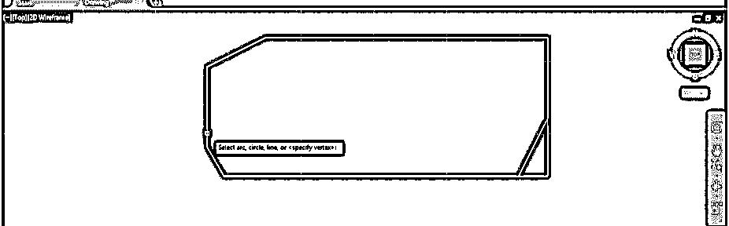

**步骤 24:** 现在点击倒角，像这样拖动。你可以看到角度是 30 度。

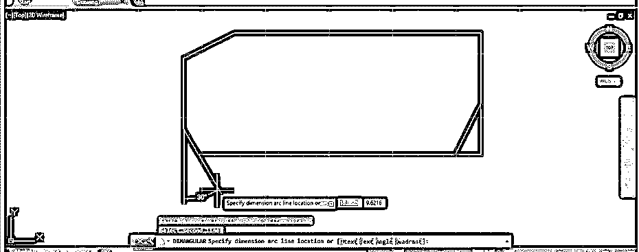

**第 25 步:**现在，让我们看看这个命令的“多个”选项。再次制作一个矩形并使用倒角命令，然后按键盘上的 D 键，然后像前面一样为第一条和第二条线指定倒角的距离。现在按键盘上的 M 键，然后按键盘上的 enter 键。

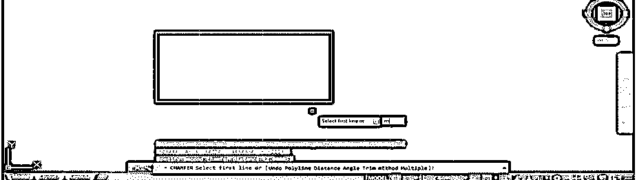

**第 26 步:**现在，你可以在矩形边上一个一个的点击进行多重倒角，而不用一次退出这个命令。

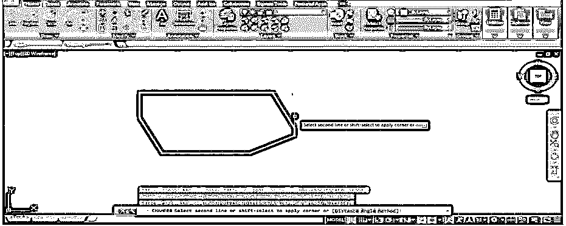

现在，让我们看看这个命令的 Poly 选项。现在，再次制作一个矩形，按照倒角命令的步骤，直到给出倒角的距离。现在按键盘上的 P 按钮，然后按键盘上的 enter 按钮。

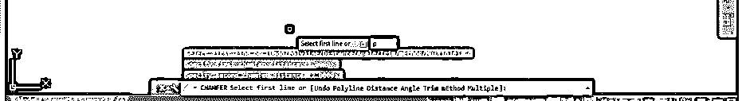

**步骤 28:** 现在，当你选择一个矩形时，它将对矩形的所有四个角进行倒角，同时指定尺寸。

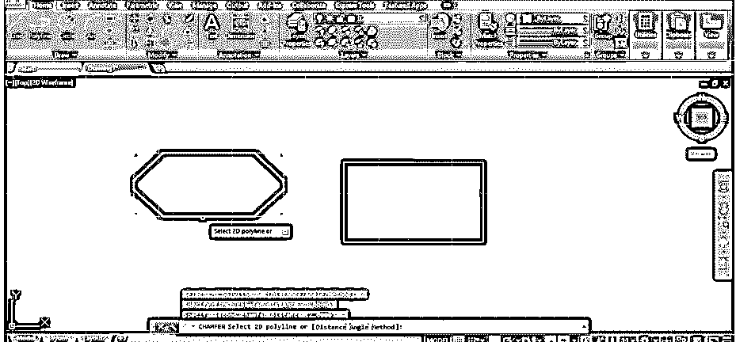

*   这样，您就可以在 Auto Cad 软件中使用 Chamfer 命令并处理其参数。

### 结论

阅读完本文后，您可以了解 AutoCAD 中的 Chamfer 命令，以及如何使用它来绘制工程设计中任何特定部分的好图。通过练习，你可以很好地掌握这个命令。

### 推荐文章

这是一个在 AutoCAD 中倒角的指南。在这里，我们讨论一个介绍，如何使用倒角在 AutoCAD 的一步一步的方式。您也可以浏览我们的其他相关文章，了解更多信息——

1.  [在 AutoCAD 中插入图像](https://www.educba.com/insert-image-in-autocad/)
2.  [AutoCAD 中的布局](https://www.educba.com/layout-in-autocad/)
3.  [AutoCAD 建筑](https://www.educba.com/autocad-architecture/)
4.  [AutoCAD 功能键](https://www.educba.com/autocad-function-keys/)
5.  [AutoCAD press pull 指南](https://www.educba.com/autocad-presspull/)
6.  [使用 Muebles AutoCAD 创建项目](https://www.educba.com/muebles-autocad/)
7.  [SketchUp AutoCAD |导入和导出 CAD 文件](https://www.educba.com/sketchup-autocad/)

