# AutoCAD 中的 2D 命令

> 原文：<https://www.educba.com/2d-command-in-autocad/>

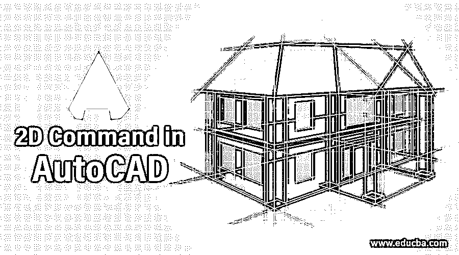

## AutoCAD 中的 2D 命令介绍

AutoCAD 是 Autodesk 开发的二维和三维计算机辅助设计软件。我们在 AutoCAD 中有不同类型的二维和三维命令，使我们的绘图工作变得容易。今天我们将讨论其中一个 2d 命令，并学习如何在绘图中的特定对象上添加图案，以将该对象与另一个对象区分开来。在本文中，我们将通过使用 auto cad 命令的 2d Command 命令来理解这个主题，并分析它的不同参数以了解它。让我们开始学习这个命令。

### 如何在 AutoCAD 中使用 2D 命令？

我们可以通过几个简单的步骤来理解它，并在遵循这些步骤后获得关于它的良好知识。但是在开始之前，让我们看一下这个软件的工作界面，以便我们在整个学习过程中更好地理解这个主题。

<small>3D 动画、建模、仿真、游戏开发&其他</small>

**步骤 1:** 在工作屏幕的顶部，有一个功能区，其中有不同类型的选项卡，如主页选项卡、注释选项卡、视图选项卡和其他一些用于管理该软件中不同类型命令的选项卡，在该功能区下方有工作窗口区域，我们可以在其中看到我们当前的工作，在该工作窗口下方有一些导航命令，用于处理我们的绘图工作。

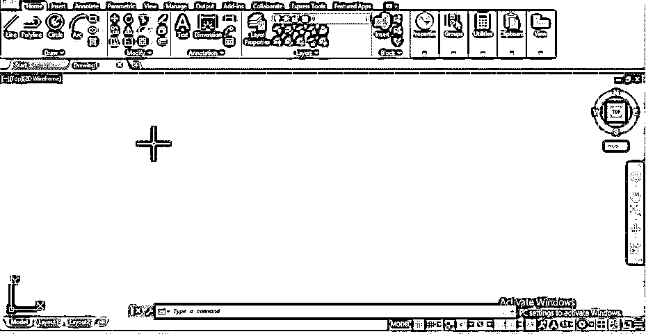

第二步:现在，让我们画一张画。确保要应用 2d 命令的绘图在形状上应该是闭合的。

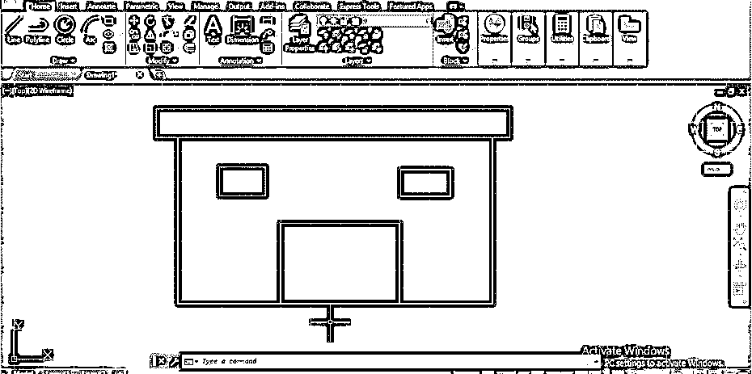

**步骤 3:** 现在，对于 2d Command 命令，在键盘上键入 H，然后按下键盘上的回车键，获得 2d Command 命令。

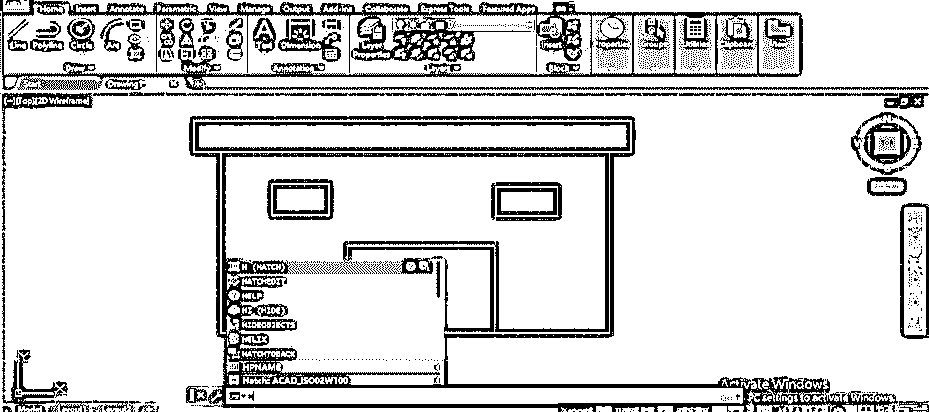

**第四步:**或者你可以进入主页标签的绘图菜单，点击这个 2d 命令命令图标。

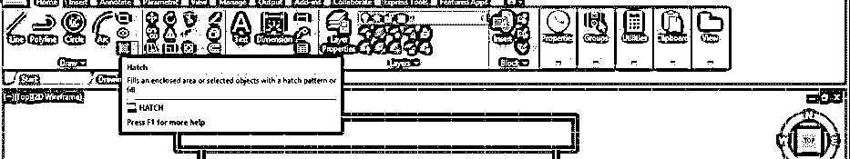

**第五步:**一旦你有了 2d Command 命令，那么 2d 命令创建选项卡就会像这样打开。这里我们有不同的 2d 命令参数。

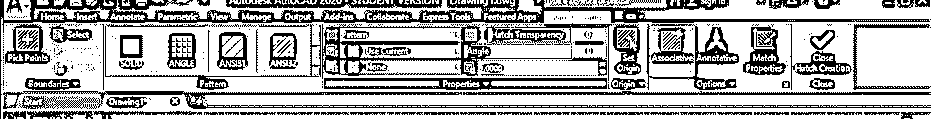

**第六步:**从 Pattern 选项卡中，你可以选择 2d 命令的类型，例如如果你想在土木工程的某个特定图纸上绘制砖状图案，那么你可以选择这个角图案。

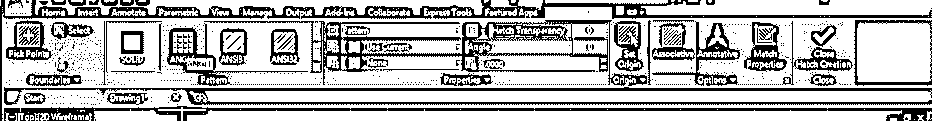

**第七步:**现在，你可以通过两种方法应用 2d 命令。首先是“选择点”方法，所以点击这个方法的图标。

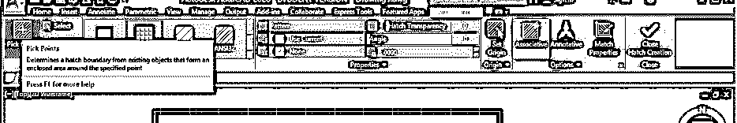

**步骤 8:** 然后，它会要求你在你想要应用 2d 命令的图形部分的边界内选择一个点。

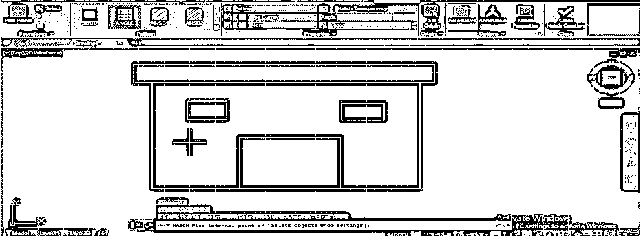

**第九步:**现在，一旦你做了一个点击，它会像这样应用到你的绘图上。

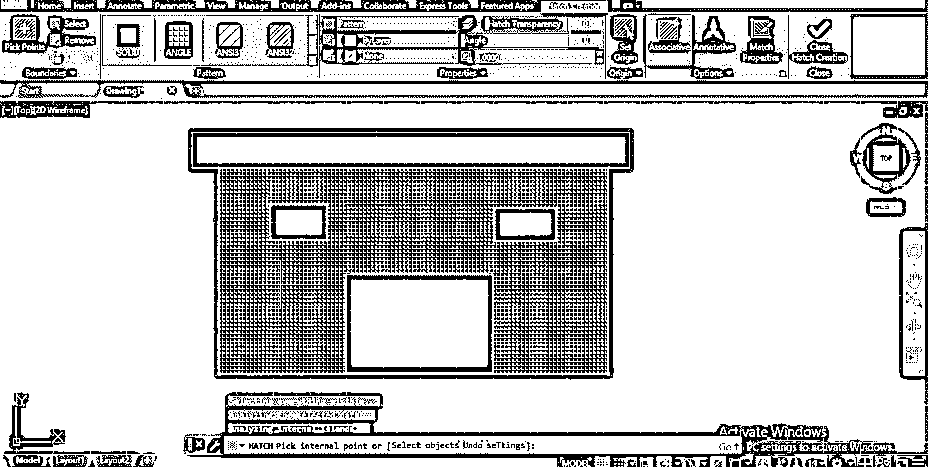

**步骤 10:** 第二种方法是选择边界对象，点击其图标。

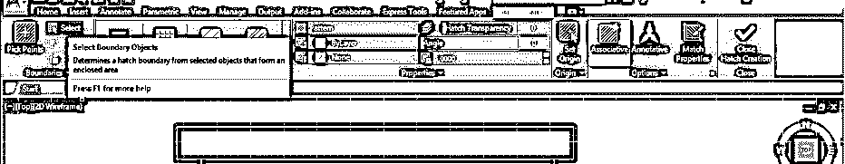

**步骤 11:** 然后它会让你选择要应用 2d 命令的对象边界，所以当你选择边界时，它会像这样覆盖整个块。所以，根据你的要求，你可以用任何一种方法来应用 2d 命令。

**第 12 步:**现在，如果你想在绘图中显示任何零件的横截面，那么你可以选择这种类型的 2d 命令模式。

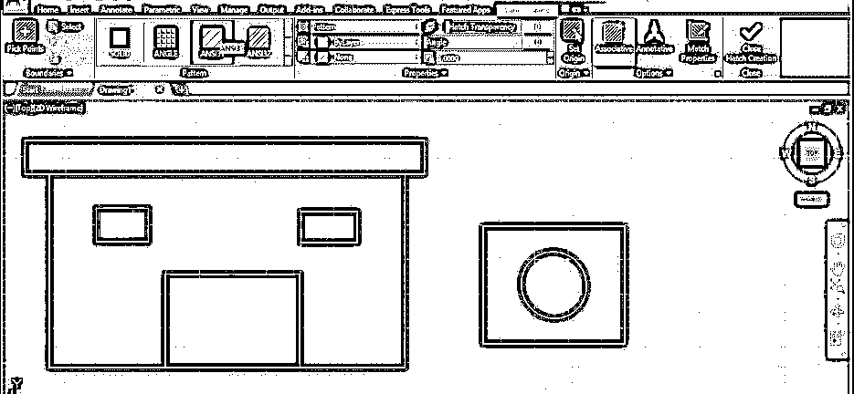

**步骤 13:** 现在，我想这样显示这个圆的横截面，所以我会用和前面一样的方法对它应用 2d 命令。

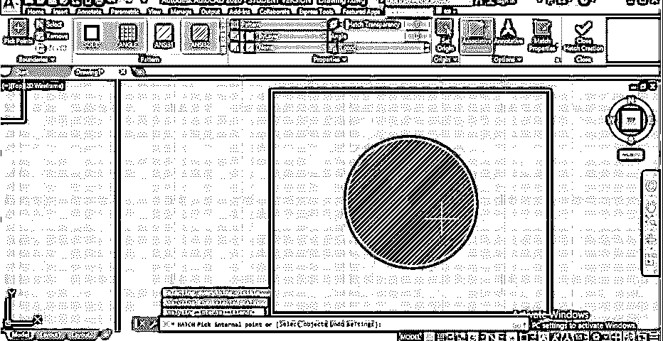

**步骤 14:** 现在，我们来讨论一下这个 2d Command 命令的其他选项。为此，我将再次在该图纸上应用 2d 命令，您可以看到在该命令的参数框中的工作屏幕末端有一些选项。所以点击列表中的设置选项。

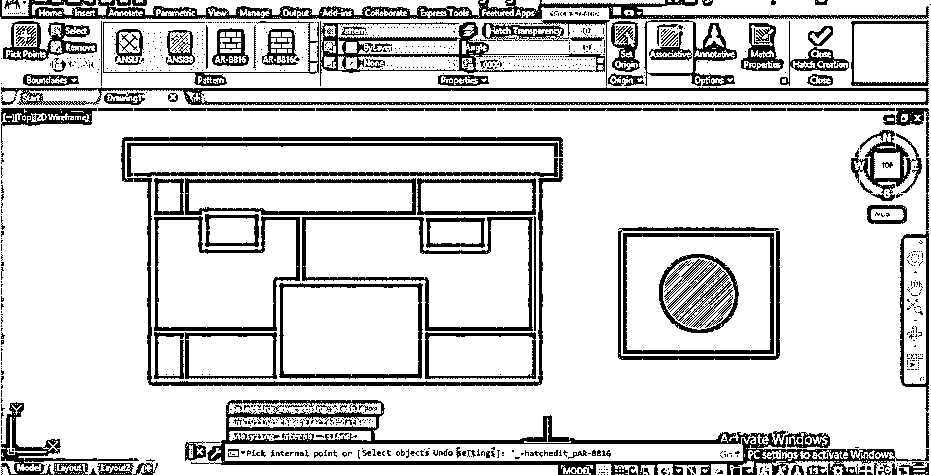

**步骤 15:** 点击一次，会打开一个 2d 命令设置框。您可以根据自己的需要对应用的 2d 命令进行更改。您也可以从该列表中更改 2d 命令的模式。

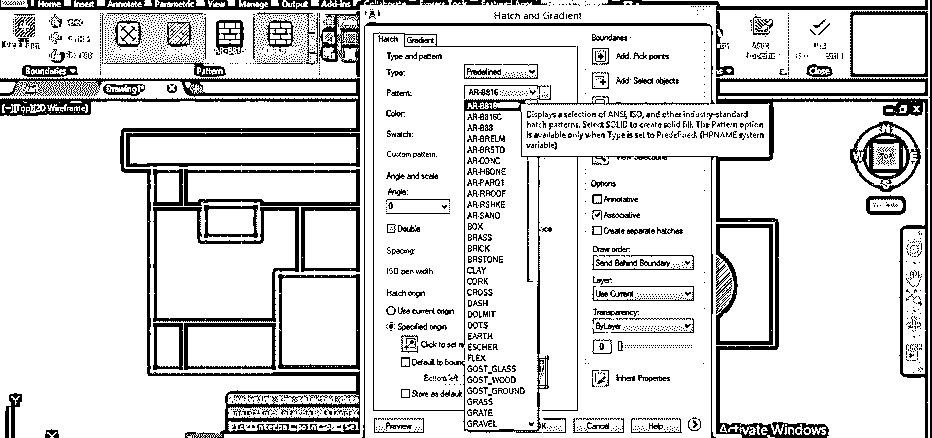

**步骤 16:** 如果你想应用一个特定颜色的 2d 命令，然后从这个列表中选择颜色，点击这个框的预览按钮。

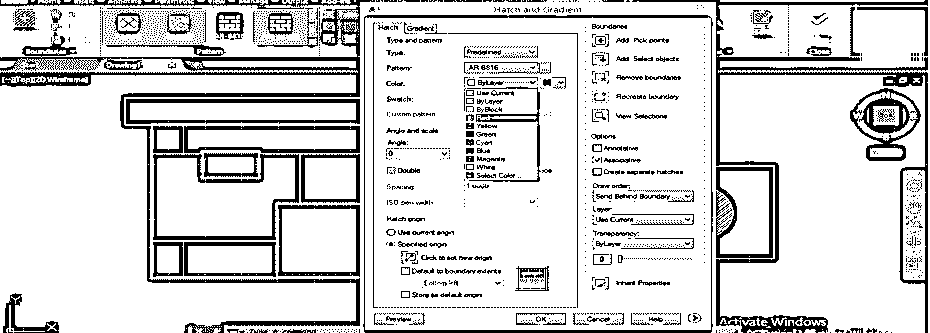

**第 17 步:**你的 2d 命令的颜色会变成红色，就像我设置的红色一样。

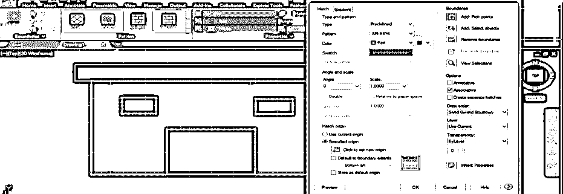

**步骤 18:** 你也可以从这个列表中选择一种颜色来填充 2d 命令块内的颜色。

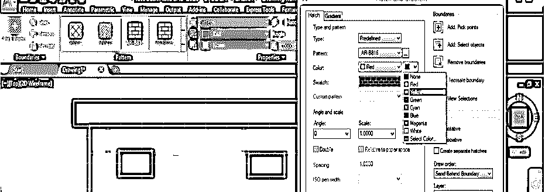

**第 19 步:**比如我选择一个黄色，然后点击预览按钮，那么就会是这个样子。

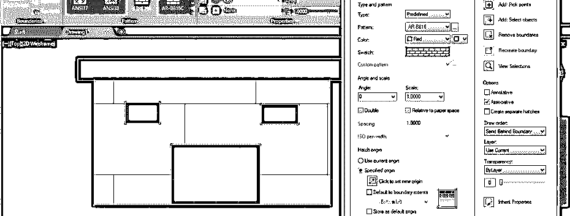

**第 20 步:**现在，您可以根据自己的需要增加或减少您的 2d 命令的比例。要更改它，只需点击比例框并输入您的值。

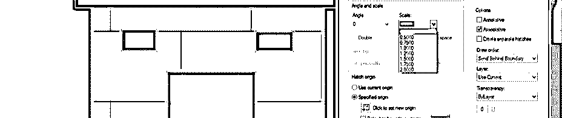

第 21 步:点击预览按钮，你的 2d 命令会变成这样，因为我按照我的要求缩小了它。

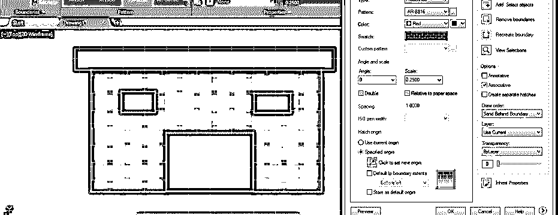

**步骤 22:** 接下来，你还可以通过改变这个框的角度选项框中的角度值来改变选中的 2d 命令的角度。比如我取 45 度作为 2d 命令角度，点击预览选项卡；然后，我的 2d 命令会像这样倾斜 45 度。

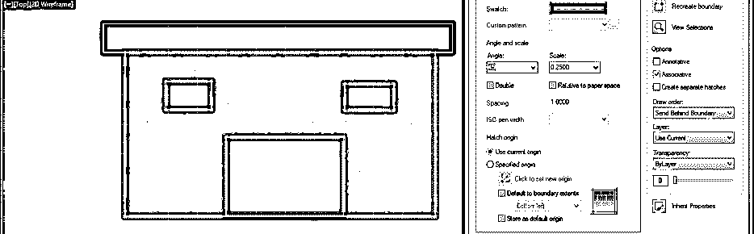

**步骤 23:** 您也可以通过查看图案的预览来更改图案，只需将鼠标光标移动到图案上，图案将在您选择的块中自动更改为预览。

**步骤 24:** 如果你想删除这个 2d 命令，那么点击 2d 命令创建选项卡的删除选项。

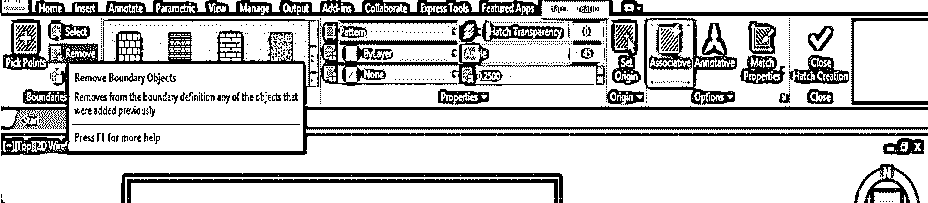

**步骤 25:** 然后它会要求你选择 2d 命令对象的边界，一旦你选择了它，2d 命令就会从你的对象中移除。

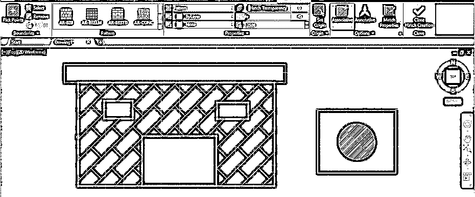

**步骤 26:** 你也可以从这个选项改变你选中的 2d 命令的颜色。

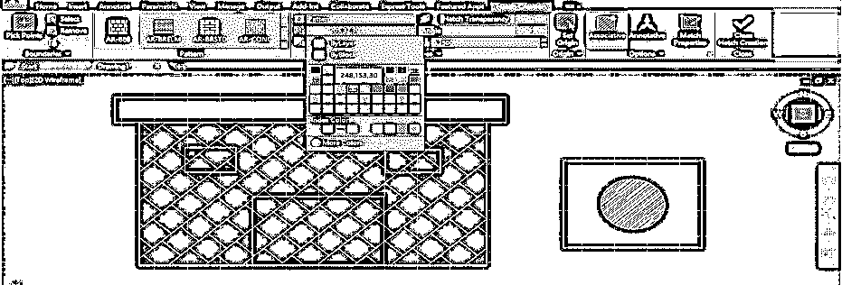

**步骤 27:** 您可以通过增加或减少 2d 命令透明度选项的值来增加或减少 2d 命令的可见性。

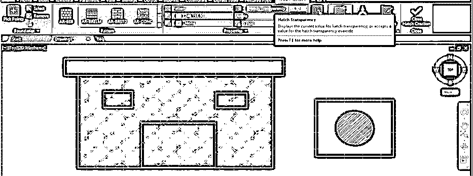

**步骤 28:** 你可以从这个选项中选择 2d 命令的原点。只要点击它。

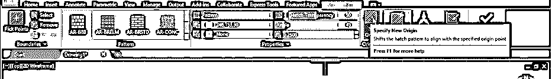

第 29 步:在你的物体上选择原点。例如，我选择此端点作为二维命令的原点。

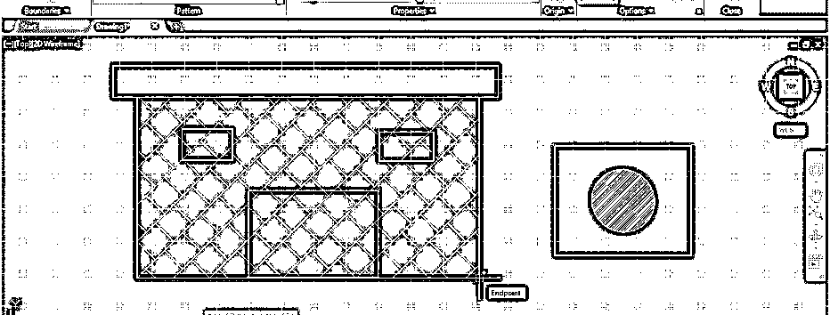

**步骤 30:** 然后，2d 指令的方向会这样变化。

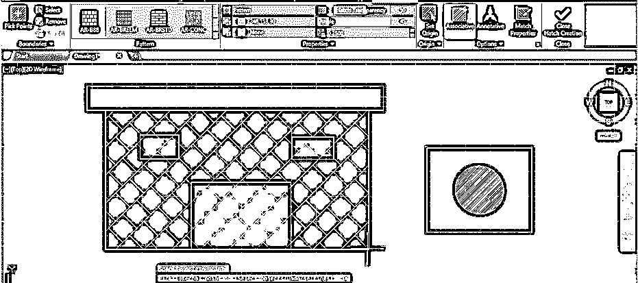

**步骤 31:** 现在，如果你想在另一个对象中再次使用你绘制的 2d 命令，那么点击 2d 命令创建选项的匹配属性选项。

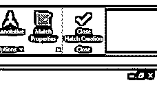

**步骤 32:** 然后点击你要应用这个 2d 命令的对象，这个 2d 命令也会像这样应用到你选择的对象上。

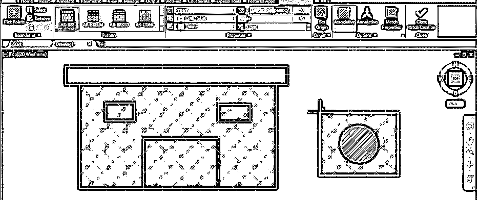

*   通过这种方式，您可以使用 auto cad 中的 2d Command 命令将图案应用到任何对象上，并非常容易地使用其参数。

### 推荐文章

这是在 AutoCAD 中使用 2D 命令的指南。在这里，我们讨论介绍以及如何处理它的参数，以便在特定对象的绘图上制作 2d 命令。您也可以浏览我们的其他相关文章，了解更多信息——

1.  [AutoCAD 命令](https://www.educba.com/autocad-commands/)
2.  [在 AutoCAD 中插入图像](https://www.educba.com/insert-image-in-autocad/)
3.  [AutoCAD 中的布局](https://www.educba.com/layout-in-autocad/)
4.  [AutoCAD 中的工具栏](https://www.educba.com/toolbars-in-autocad/)

