# AutoCAD 3D Rotate

> 原文：<https://www.educba.com/autocad-3d-rotate/>

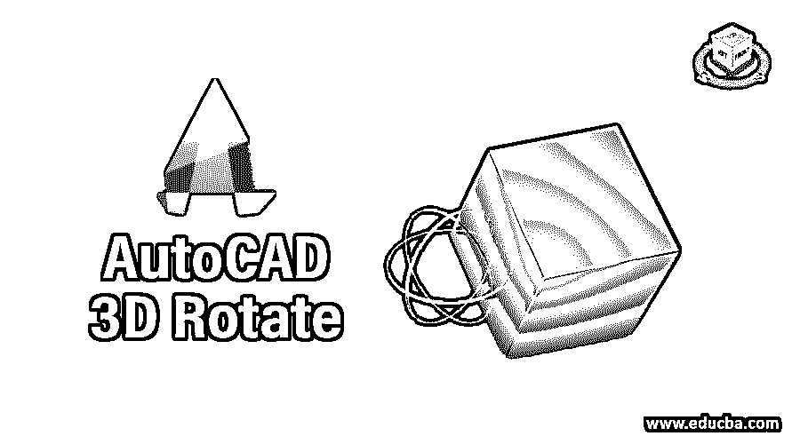

## AutoCAD 3D 旋转简介

AutoCad 是二维和三维计算机辅助设计软件，是 Autodesk 开发的最重要的工程制图设计软件。在这个软件中我们有许多不同类型的命令；一些用于 2d 工作，另一个用于 3d 建模工作。“三维旋转”是三维建模命令之一，通过它可以在所有三个轴(x 轴、y 轴和 z 轴)上旋转任何三维对象。在本文中，我们将通过一个使用该软件的 3d 建模命令制作的 3d 对象的例子来理解这个主题，并分析如何控制该 3d 旋转命令的参数。所以让我们开始讨论这个话题。

### 如何在 AutoCAD 中使用 3D Rotate？

在工作屏幕的顶部，有一个功能区，其中有许多用于管理该软件命令的选项卡；低于此；我们有一个工作窗口区，在这里我们可以看到我们当前的工作；导航立方体也位于该窗口的右上角，用于从不同的视图查看我们的对象，这些视图包括俯视图、正视图、侧视图和一些其他 3d 视图，在该窗口下方，我们有一个功能区，在该功能区上有许多导航命令，用于在该软件的项目期间处理工作。

<small>3D 动画、建模、仿真、游戏开发&其他</small>

**步骤 1:** 这是我们的 auto cad 软件的“制图和注释”工作区，默认情况下，当您启动 Auto Cad 软件时，该工作区设置在工作屏幕上。

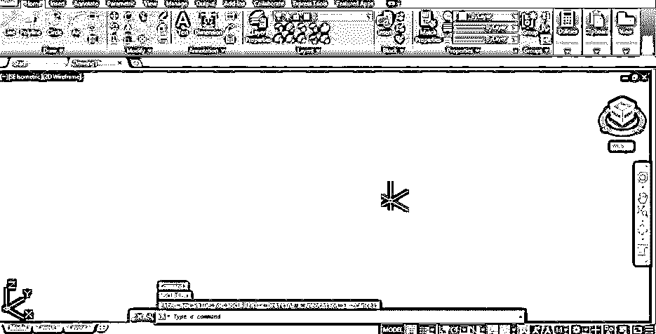

**第二步:**现在，为了学习 3d rotate，让我们将工作空间更改为 3d Basic，这是 3d 建模工作空间。要更改它，请转到工作区切换器选项，它位于该软件底部导航工具的功能区，然后单击它。从列表中选择 3d 基本选项，你的工作空间就会变成这样。

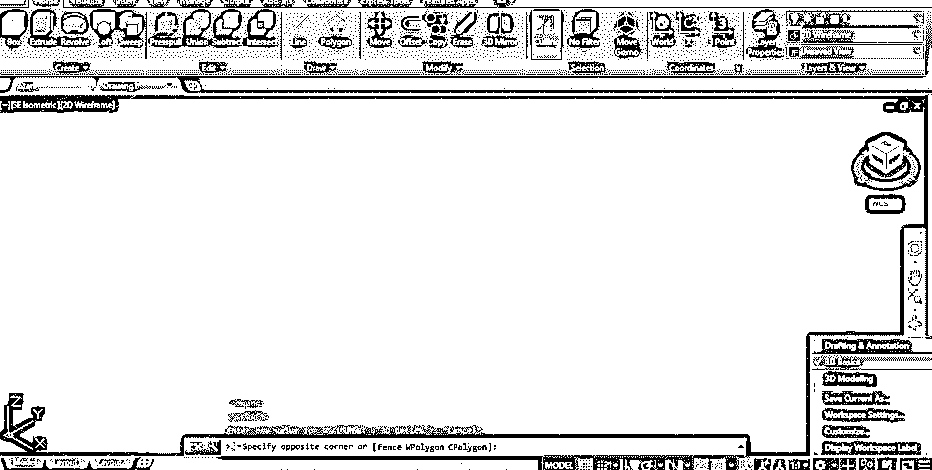

**第三步:**现在，让我们制作一个制作它的 3d 块；转到该软件主页选项卡的创建菜单的框命令，并单击它。

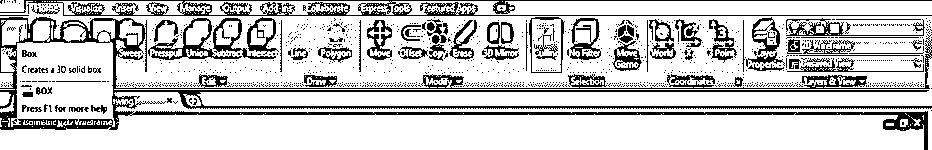

**第四步:**现在，画一个方框。要画一个盒子，首先，像这样画一个矩形作为盒子的底部。您可以输入这个矩形的值。

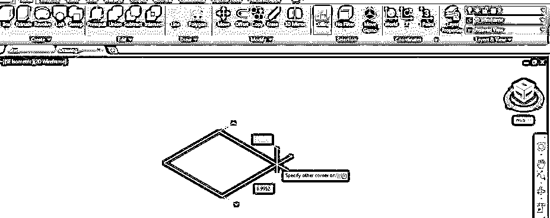

**第五步:**然后向上拖动鼠标光标，这样给出这个盒子的高度，或者你也可以输入制作它的高度值，然后点击完成这个命令。这是该对象的 2d 线框视图。

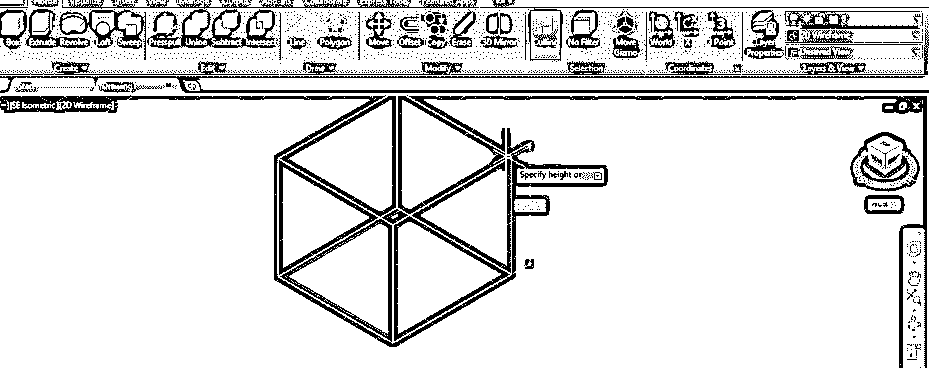

**第六步:**要把它变成阴影视图，进入视图风格控制选项并点击它，然后选择任何一个阴影选项。我将从列表中选择灰色阴影选项。

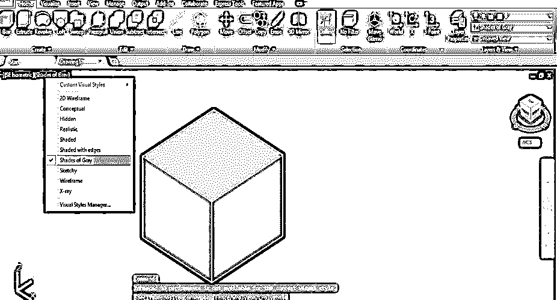

**第七步:**现在进入该软件首页标签的修改菜单，点击该菜单移动命令列表中的旋转命令图标。

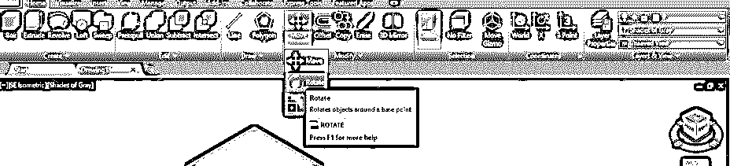

**第八步:**现在，它会要求你选择你要围绕其旋转盒子的对象的边缘。

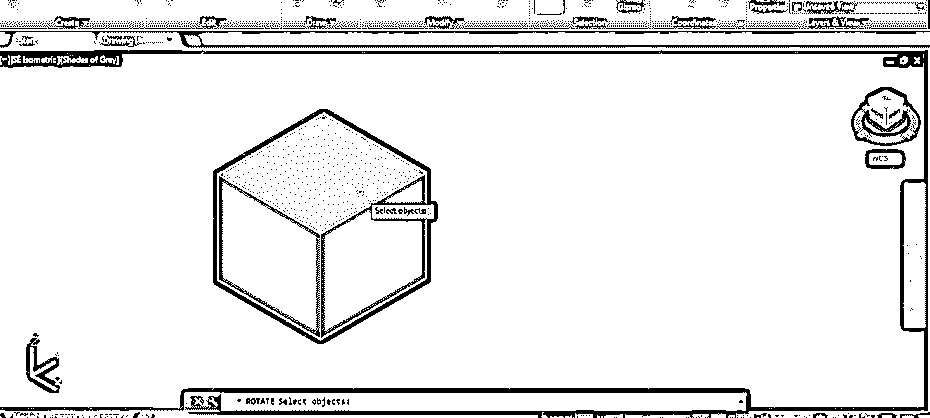

第九步:现在点击你想要旋转物体的点。

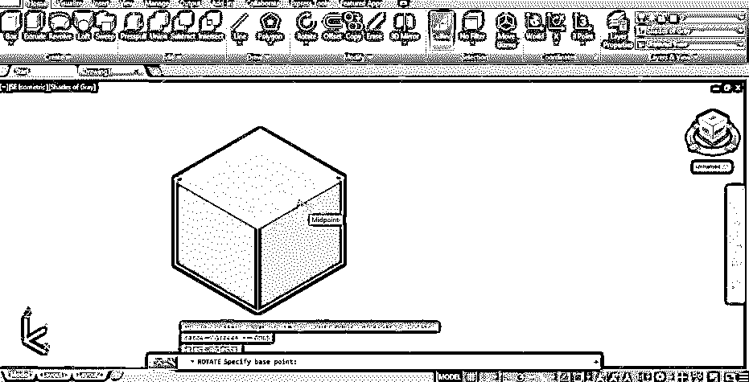

**步骤 10:** 现在，像这样移动鼠标光标，使你的对象围绕这个点向特定方向旋转，或者你可以输入你想要旋转的角度值。

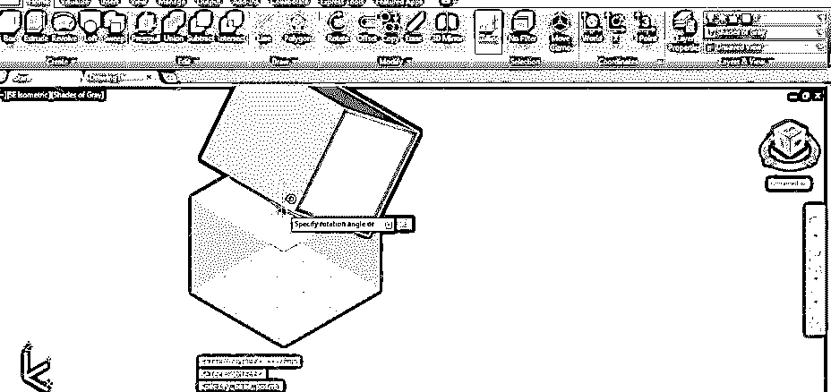

**第十一步:**你的物体会以你给定的旋转角度这样旋转。

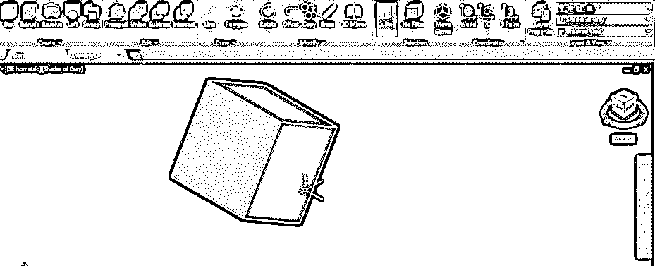

**步骤 12:** 现在，让我们分析一下在 Auto Cad 软件中旋转 3d 对象的另一种方法。对于这种方法，我们必须切换到该软件的另一个工作空间，即三维建模工作空间。要再次更改它，请转到工作窗口底部的工作区切换器选项，然后单击列表中的 3d 建模选项。

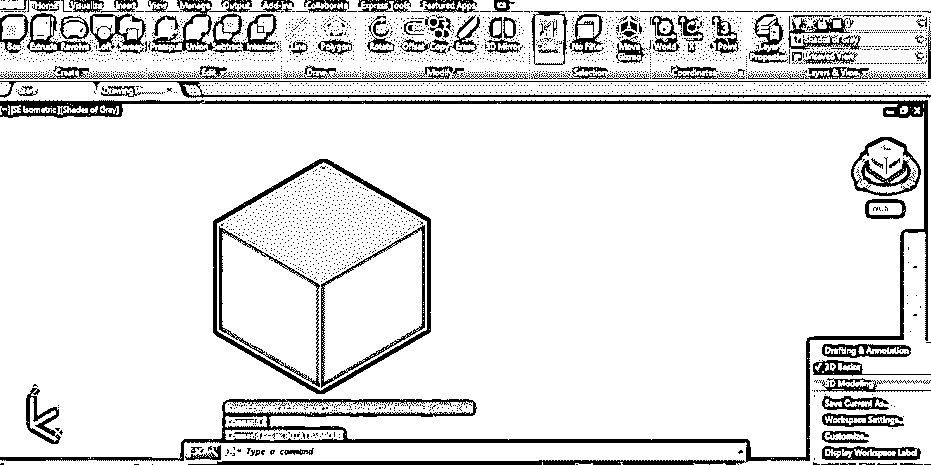

**第十三步:**现在，你的工作区会变成这样。现在点击 3d 旋转命令图标，这是在这个软件的主页标签的修改菜单的命令。

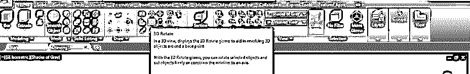

**步骤 14:** 现在，它会要求你通过点击选择你想要旋转的对象。因此，我将使用 3d 旋转命令单击这个 3d 框。

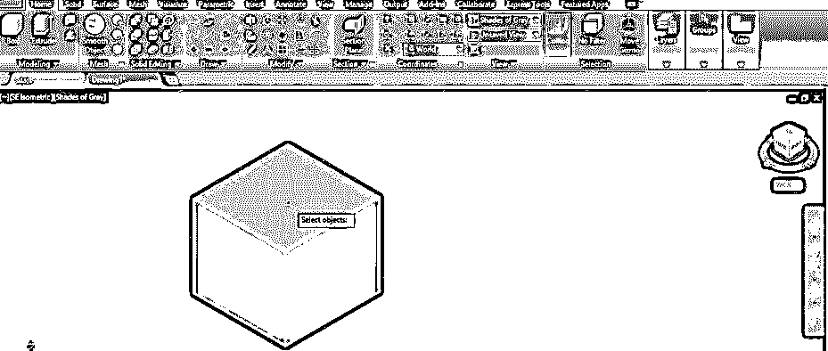

**第 15 步:**一旦你点击旋转，所有三个轴的圆圈将会像这样出现在这个盒子的中心。根据轴原点指示器的颜色，所有圆都有不同的颜色。

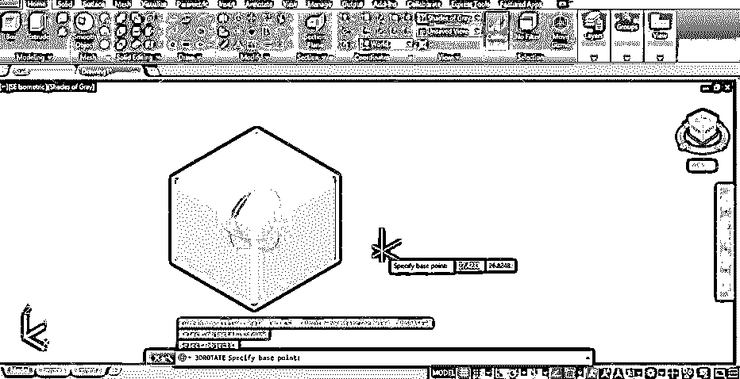

**步骤 16:** 现在，当你选择任何一个圆来沿着那个轴旋转这个物体时，那个圆的颜色会变成黄色，就像这样。

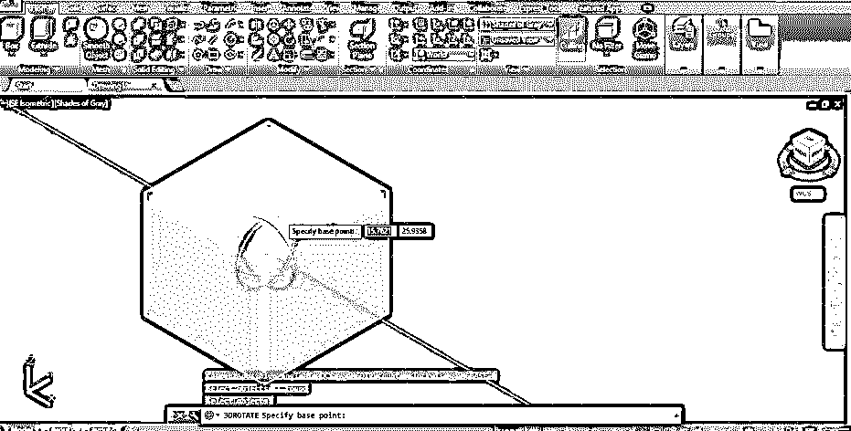

**步骤 17:** 现在，将鼠标光标放在这个圆上，移动鼠标光标来旋转它，或者你可以输入一个角度值来沿着这个轴旋转它。我将输入 60 度作为这个盒子沿 x 轴旋转的角度。

**步骤 18:** 您可以选择任意一个圆，沿选择轴圆旋转该对象。

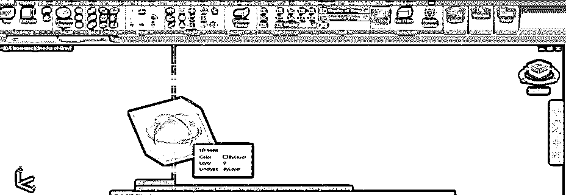

**步骤 19:** 你可以在这个 3d 盒子的任意一点移动这些旋转圆，通过按住这些圆的中心点，然后拖动它到你想要放置它的那个点，使它绕着那个点旋转。

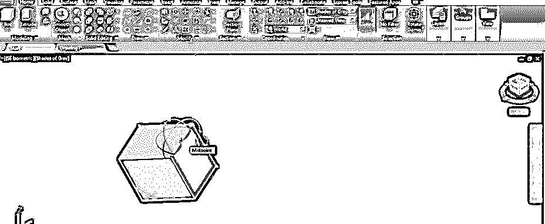

**步骤 20:** 现在，当你旋转这个盒子的时候，它会像这样绕着你选择的点旋转。你可以把这些圆放在盒子的边缘，盒子的角上，或者根据你的要求放在盒子的任何其他点上。

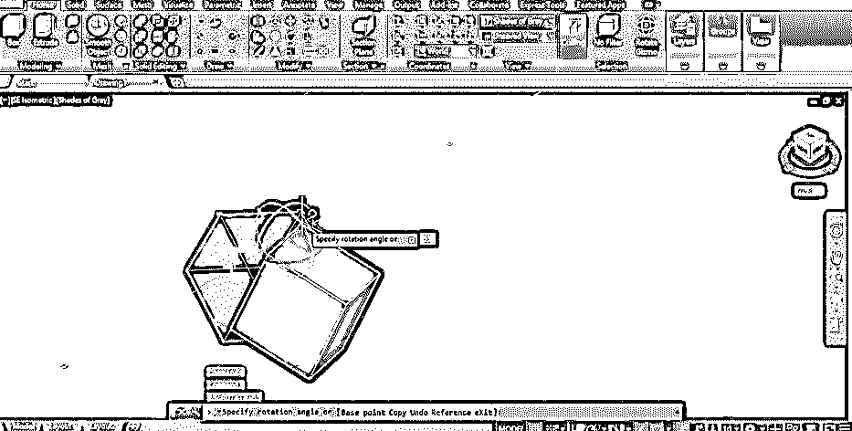

这样，您可以在 Auto Cad 软件中使用 3d 旋转命令，将 3d 对象旋转到您想要的角度，以制作特定的绘图形状。

### 推荐文章

这是一个 AutoCAD 三维旋转指南。在这里，我们讨论介绍，如何在 AutoCAD 中使用三维旋转，以及如何处理它的参数，使你想要的绘图形状的一部分。您也可以浏览我们的其他相关文章，了解更多信息——

1.  [AutoCAD 中的工具栏](https://www.educba.com/toolbars-in-autocad/)
2.  [学生用 AutoCAD】](https://www.educba.com/autocad-for-students/)
3.  [AutoCAD 中的布局](https://www.educba.com/layout-in-autocad/)
4.  [在 AutoCAD 中挤出](https://www.educba.com/extrude-in-autocad/)

