# AutoCAD 家具

> [https://www . educba . com/furniture-AutoCAD/](https://www.educba.com/muebles-autocad/)

## Muebles AutoCAD 简介

Auto Cad 是二维和三维计算机辅助设计软件，是工程设计专业人员使用最广泛的软件。我们在这个软件中有一些预置，使我们在这个软件中的工作变得容易。我们有许多不同类型元件的框图，可用于制作任何布局。Muebles 也是家具预设组之一，可用于任何特定项目面板的室内设计布局。在本文中，我们将了解如何在绘图中使用 Muebles 和 Howton import，并学习如何处理其参数。所以让我们开始讨论这个话题。

### 如何使用 AutoCAD 家具？

**步骤 1:** 在工作屏幕的顶部，有一个功能区，其中有许多选项卡，如主页选项卡、插入选项卡、注释选项卡和其他一些选项卡。这些选项卡帮助我们管理该软件中的不同命令。在这下面，我们有一个工作窗口屏幕，在其中我们可以看到我们当前的工作；在这些工作窗口下面，我们有一些导航选项，用于在工作过程中处理绘图参数。

<small>3D 动画、建模、仿真、游戏开发&其他</small>

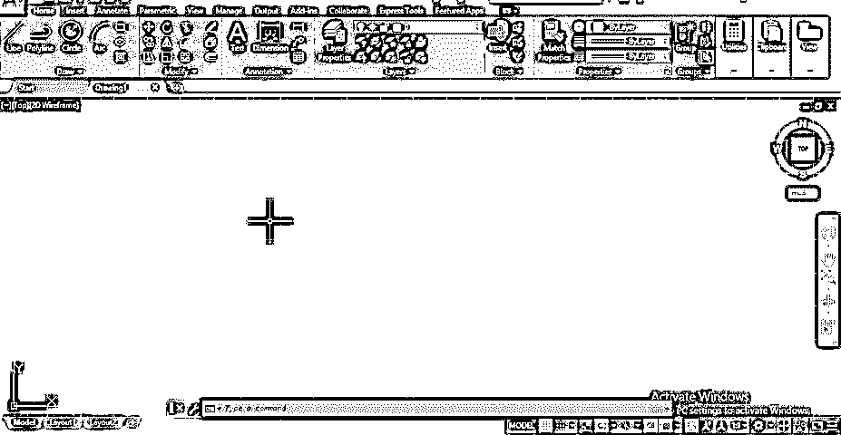

**第二步:**我们有了 auto Cad 软件设计中心的 muebles 数量。设计中心是 auto cad 的内置浏览器，通过它，您可以随时在绘图中获得不同类型的框图及其数据。您还可以从该设计中心将您自己的组件导入到您的任何项目中。要打开设计对话框，请点击该软件的视图选项卡。您可以在该选项卡的调色板菜单中找到设计中心图标。

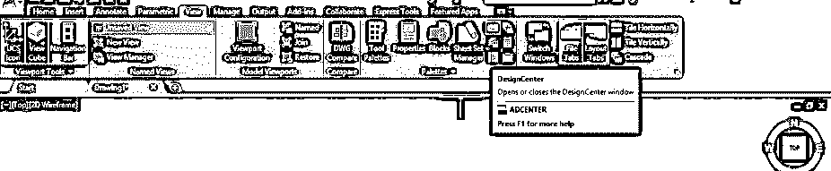

第三步:或者你可以在键盘上输入 DC，然后按键盘上的回车键，或者直接按键盘上的 Ctrl + 2 键。

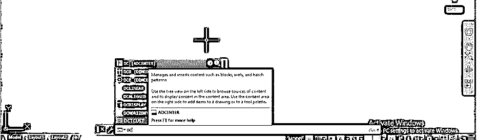

第四步:一旦你使用了任何一个选项。设计中心的一个对话框会这样打开。

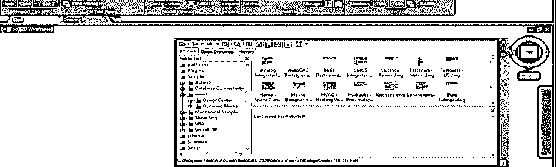

**步骤 5:** 在此对话框中，我们有不同的视图选项，例如树形视图，通过该视图，您可以找到个人计算机上设计中心文件夹的路径。打开此对话框后，它将自动打开设计中心的文件夹。

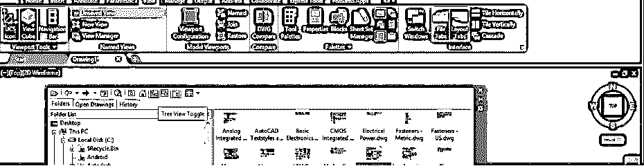

**第六步:**您可以点击预览按钮，在右侧窗口区域看到所选选项的预览。

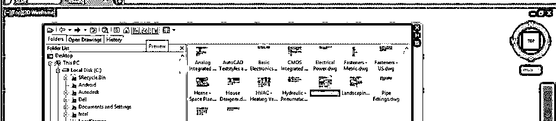

**第 7 步:**您可以通过从列表中选择任何人，根据您的适合性更改图标的大小。

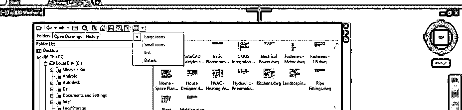

**步骤 8:** 如果您能够看到设计中心文件夹，请转到 c 盘的程序文件，并点击加号。

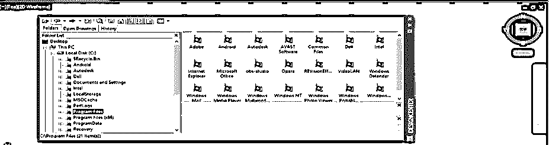

**步骤 9:** 然后点击 Autodesk 文件夹的加号，再点击 Auto Cad 2020 的加号。

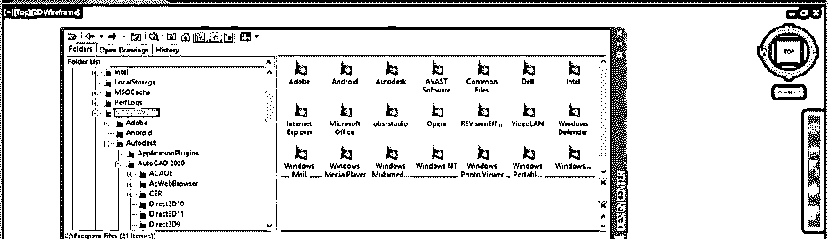

**第十步:**现在点击样本文件夹的加号，然后点击 en-us 文件夹，你会在样本文件夹列表中找到设计中心文件夹。

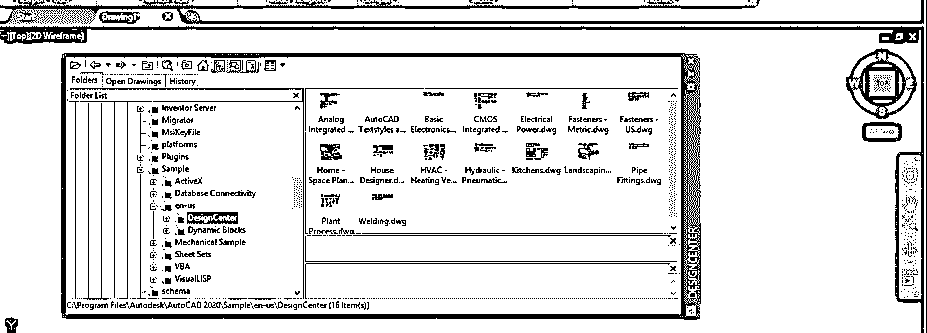

**步骤 11:** 现在，当您点击设计中心的加号时，设计中心中的组件列表将会打开。您可以根据需要选择组件的任何选项卡。

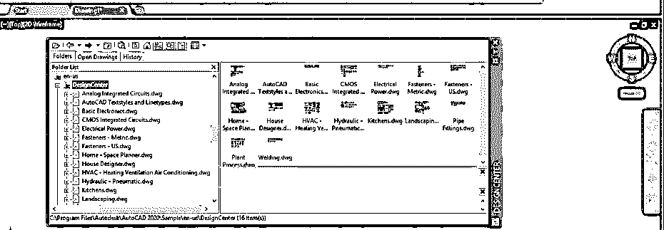

**第 12 步:**我们将点击“家居-空间规划”选项，因为我们将在本文中讨论 muebles。一旦你点击它，这个选项的一个组件的不同参数将被打开。您可以采用此选项的任何参数，例如，您可以采用此选项的组件框图，或者您可以采用选择组件的尺寸样式，还有一些其他选项可供您选择。

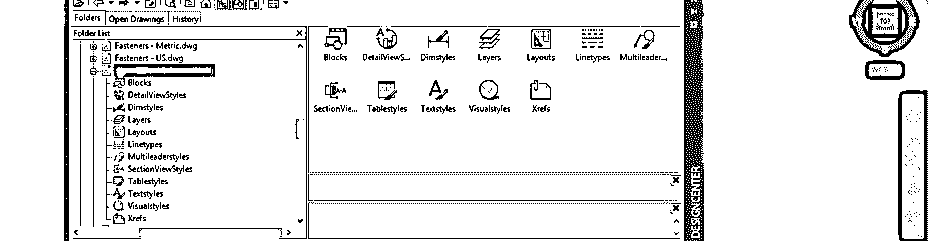

**第十三步:**在这里，我会通过选择这个选项的块来展示给你看。单击此块图标。

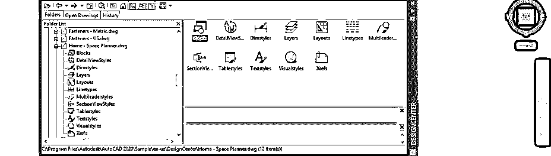

**步骤 14:** 该选项中的家具框图列表将被打开。现在，我想在我的绘图中使用这张大床，所以为了在我的绘图中导入它，我将双击它。

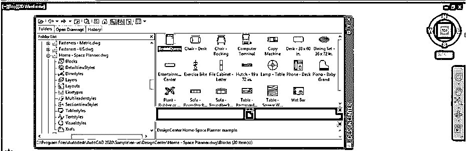

**第十五步:**双击后，会弹出一个插入对话框。您可以根据自己的需要更改此床的参数，然后按此对话框的“确定”按钮，将这些参数导入到您的图形中。

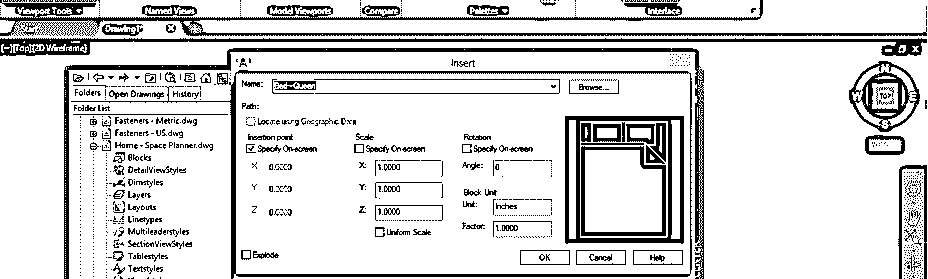

**第 16 步:**将它放在你的图纸中你想要的地方，然后点击将这个块留在合适的地方。

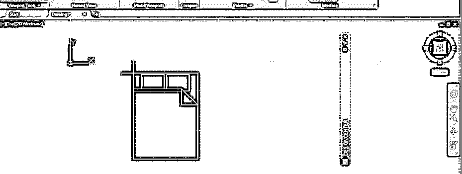

**第 17 步:**或者你可以直接从列表中选取，然后像这样放入你的绘图区域。

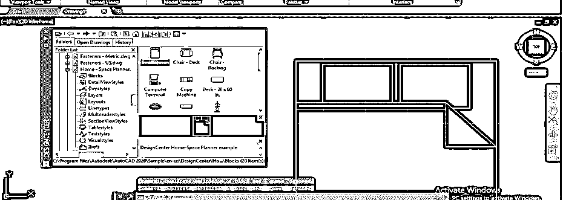

**第十八步:**现在我用同样的方法导入一个沙发，点击选择。当您选择它时，您可以看到在这个框图中只有一个锚点。

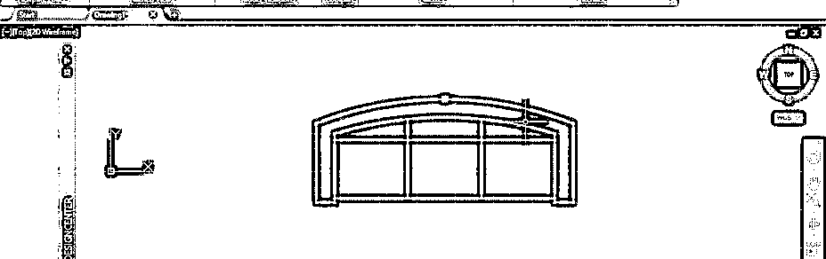

**第十九步:**点击这个锚点，按住；然后，您可以将此对象移动到图形中的任何其他位置。

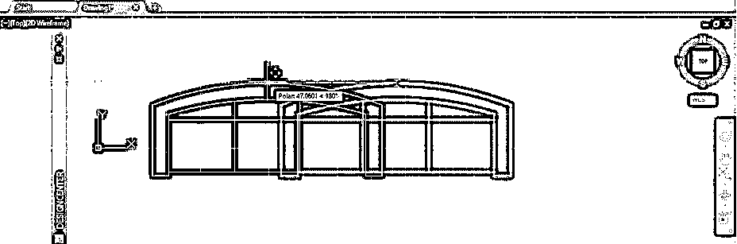

**步骤 20:** 现在再次点击这个点，按住点击，然后用鼠标右键点击。下拉列表会像这样打开。您可以使用任何一个选项对该框图进行适当的更改。比如我想旋转它；然后，我将单击旋转选项。

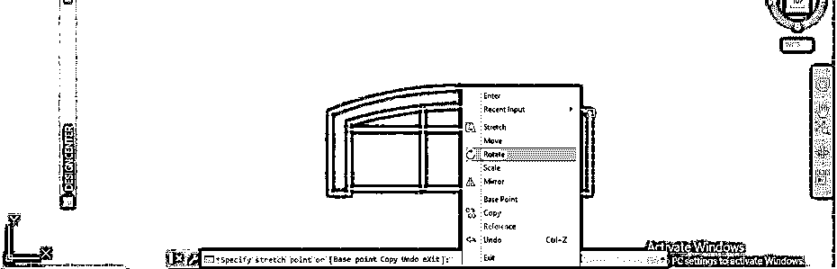

第 21 步:现在我可以把它旋转到我想要的角度。您可以手动将其旋转到所需的方向，或者通过键盘输入来输入旋转角度值。

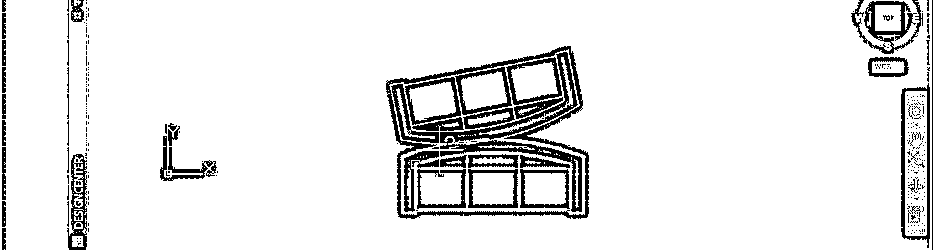

**步骤 22:** 如果您从列表中选择缩放选项，那么您可以像这样缩放该框图。

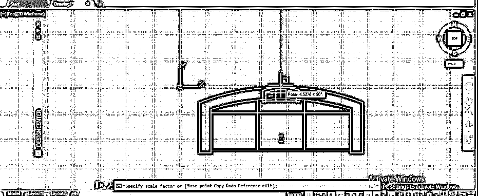

这样，您可以在 Auto Cad 中使用 muebles，并使用它来制作任何项目的良好平面布局。

### 结论

现在，看完这篇文章后，你可以理解什么是 Auto Cad 中的 muebles，以及如何将它们导入到你的绘图中，以便充分利用它们。您可以根据需要在一个图形中使用块数及其参数，从而节省时间。

### 推荐文章

这是一个关于 Muebles AutoCAD 的指南。在这里，我们一步一步地介绍 Muebles AutoCAD 和 mu ebles AutoCAD。您也可以浏览我们的其他相关文章，了解更多信息——

1.  [AutoCAD 中的布局](https://www.educba.com/layout-in-autocad/)
2.  [在 AutoCAD 中挤出](https://www.educba.com/extrude-in-autocad/)
3.  [在 AutoCAD 中插入图像](https://www.educba.com/insert-image-in-autocad/)
4.  [SketchUp AutoCAD 指南](https://www.educba.com/sketchup-autocad/)

