# Hatch AutoCAD

> 原文：<https://www.educba.com/hatch-autocad/>

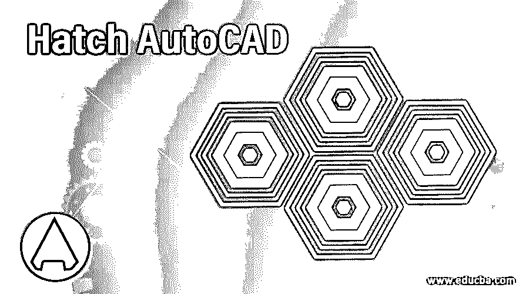

## 填充 AutoCAD 简介

Auto Cad 是 Autodesk 开发的二维和三维计算机辅助设计软件，是工程制图的设计软件。在这个软件中，我们有不同类型的 2d 和 3d 命令，使用户可以轻松地进行绘图。Hatch 是其中的一个命令。可以将 Hatch 定义为一个命令，通过该命令可以高亮显示任何元件的特定部分的横截面，或者在图形中应用图案来指定特定对象。在本文中，我们将讨论 auto cad 的 Hatch 命令，并分析其重要参数，以便更好地理解该命令。

### 如何在 AutoCAD 中使用 Hatch 命令？

我们只需简单的几步就可以在 AutoCAD 中使用 Hatch 您只需按照本文的说明在绘图中使用该命令，但在开始之前，让我们看一下该软件的工作屏幕，这样在我们学习该主题时就不会出现问题。

<small>3D 动画、建模、仿真、游戏开发&其他</small>

**步骤 1:** 在工作屏幕的顶部，有一个功能区，其中有许多不同类型的选项卡，如主页选项卡、注释选项卡、视图选项卡和其他一些用于管理该软件中不同命令的选项卡，在该功能区下方有一个工作窗口，我们可以在其中看到我们当前的工作，在该工作窗口下方有一些导航命令，用于在绘图过程中处理我们的工作。

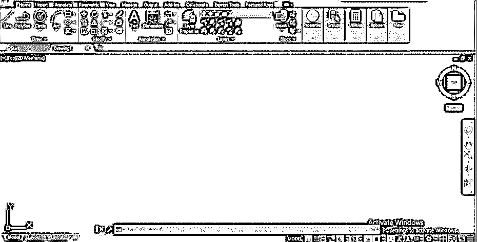

第二步:现在，让我们有一个应用阴影的图纸。我拍摄一个像这样的工程组件的前视图和俯视图。我想显示这个组件的横截面，所以我将使用阴影。

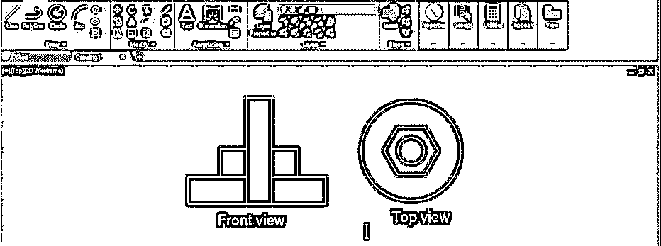

**步骤 3:** 现在点击主页选项卡绘图菜单的 Hatch 命令，或者你可以按下 H 键，然后按下 Hatch 命令键盘的 enter 键。

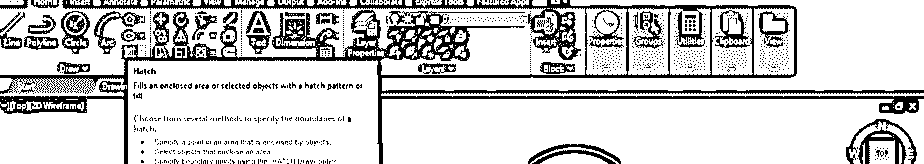

**步骤 4:** 一旦你使用 hatch 命令，该软件命令部分的 Hatch 创建选项卡将被打开。从“图案填充创建”选项卡的“图案”选项卡中选择要应用于对象的图案填充的图案。

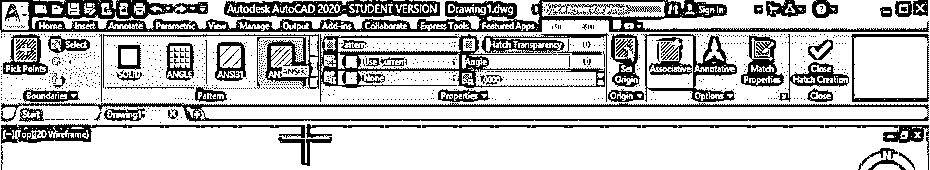

第五步:现在，你可以用两种方法在你的物体上应用阴影。我们将一个接一个地看到这两者。首先，点击这个选择点图标。

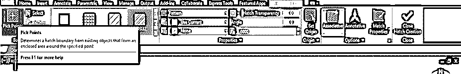

第六步:现在，它会要求你在你想要应用阴影的对象内选择一个点，当你把光标放在对象内时，阴影的预览将会出现，一旦你在对象内点击，你的阴影将应用到你的对象。

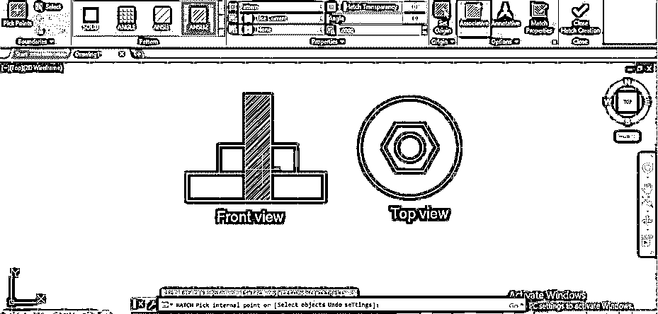

**第七步:**第二种方法是选择，所以点击选择图标。

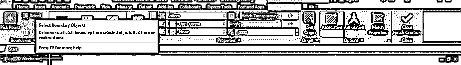

第八步:然后它会让你选择你想要应用阴影的对象的边界，当你点击边界时，阴影会像这样应用到你的对象上。

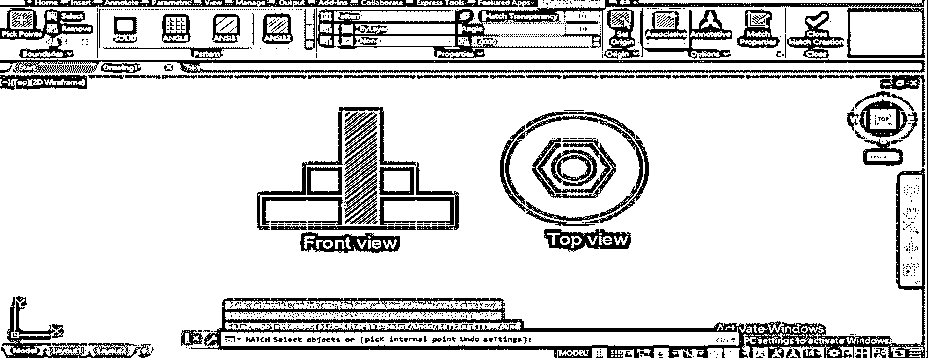

**第九步:**使用 Select 方法时，两种方法是有区别的；然后，它将覆盖所有的部分，这是在边界内，你选择的对象。

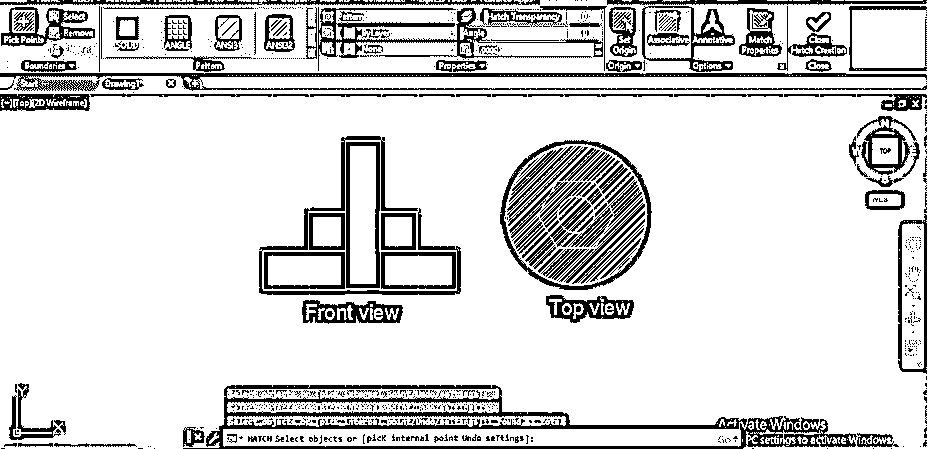

**步骤 10:** 但是如果你使用拾取点方法，它将只在所选对象上应用阴影，并将对象留在你所选的对象内。所以你可以根据你的要求采取任何方法。

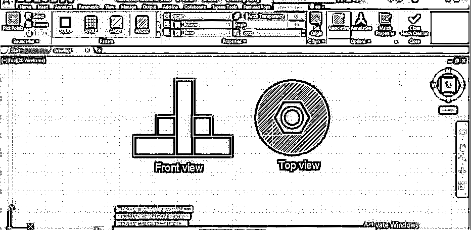

第 11 步:你可以在不同的物体上应用多种图案。要应用两种不同的填充图案，用与前面相同的方法在第一个对象上应用第一种图案，然后退出命令并再次转到 hatch 命令，然后在另一个对象上应用不同的填充图案。

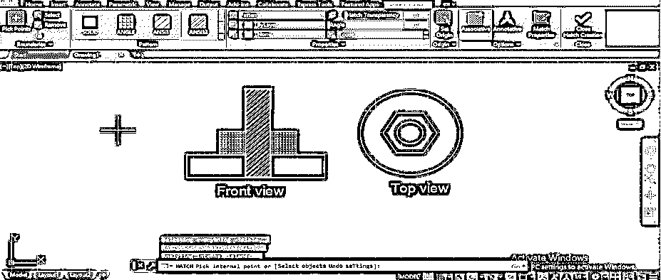

**步骤 12:** 你可以从这个选项改变阴影线的颜色。点击下拉箭头按钮，从这里选择你想要的颜色，然后阴影线的颜色将变成你选择的颜色。比如我选择红色，那么影线颜色就会变成红色。

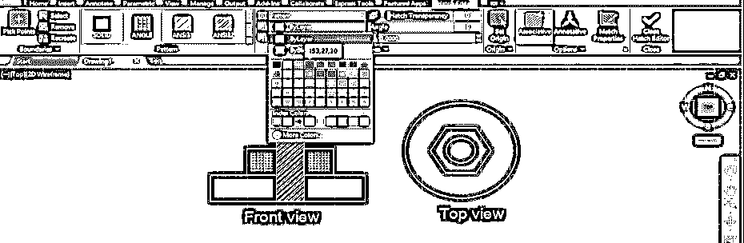

**步骤 13:** 你可以从这个选项中改变阴影块的填充颜色；只需点击此选项的下拉箭头按钮，选择您想要的颜色。我将选择黄色，然后阴影块颜色将变成黄色。

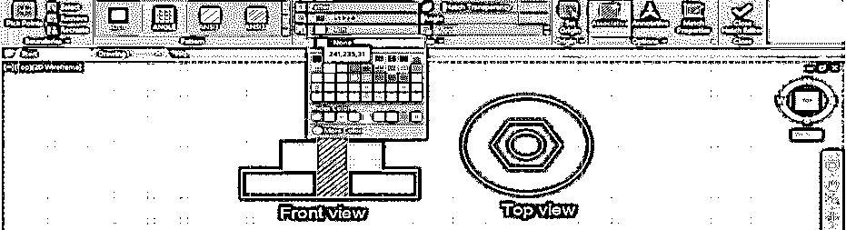

**第十四步:**如果你想增加影线的密度，那么就增加影线的比例。您可以通过此选项增加比例。例如，在选择图案填充后，我将该值增加到 2。

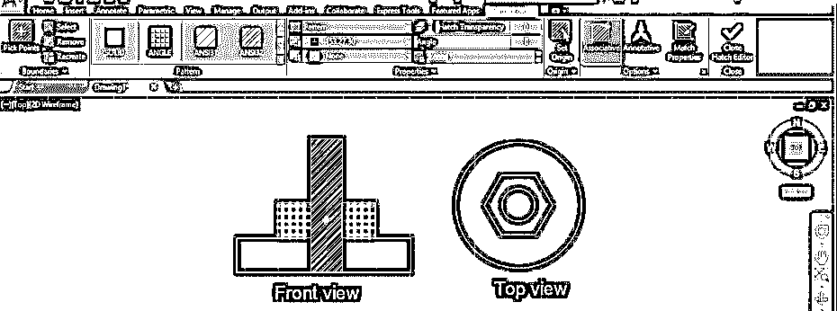

**第十五步:**然后，我的孵化区块的大小会这样增加。

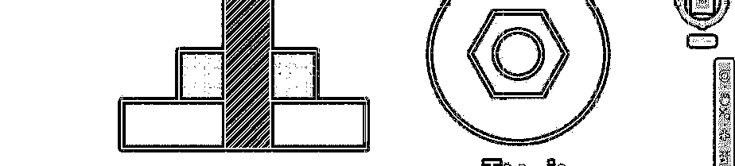

第 16 步:你也可以改变你的填充图案的角度。要更改角度，请选择您的影线，并在角度选项框中输入影线角度值；然后，舱口的角度会这样改变。

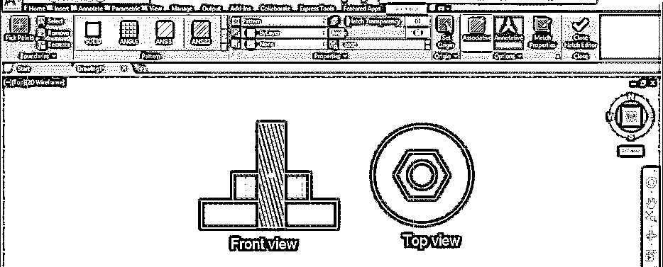

**步骤 17:** 如果你想降低影线的可见性，那么在选择你想要的影线后，降低影线透明度选项的值。我将把这个值改为 60。

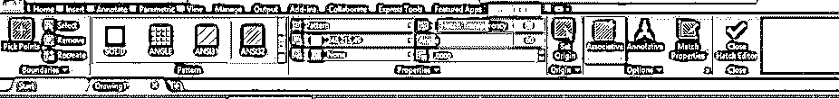

**第十八步:**然后，我选择的影线的能见度会这样降低。

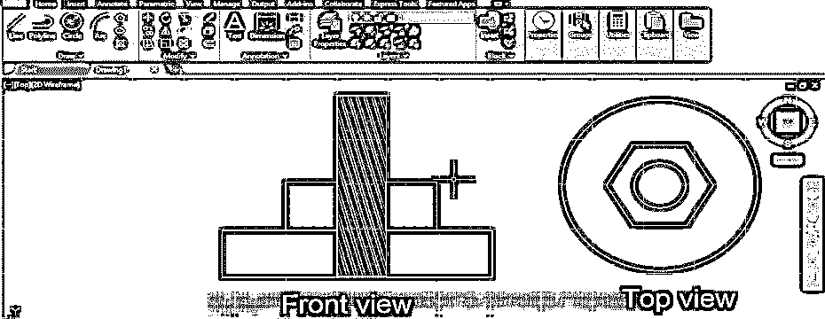

**第 19 步:**如果你想将你应用的任何对象的阴影复制到你的图形的另一个对象上，点击匹配属性选项图标。

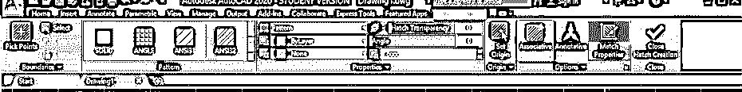

**步骤 20:** 然后点击选择你想要复制的影线。

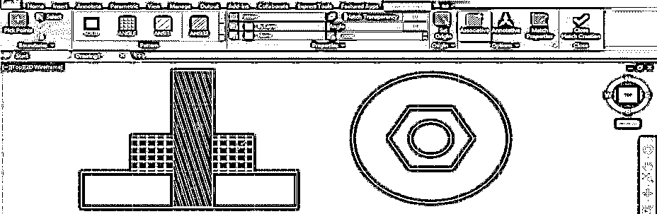

步骤 21: 然后点击你想要粘贴阴影的对象的边界。

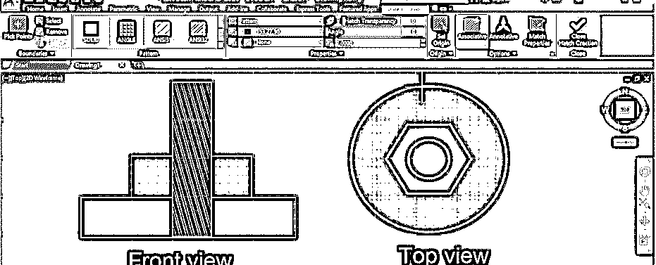

**步骤 22:** 你可以在物体上应用阴影时设置所有这些参数。只需点击 hatch 命令的设置选项，该选项位于该命令参数框中工作窗口的末端。

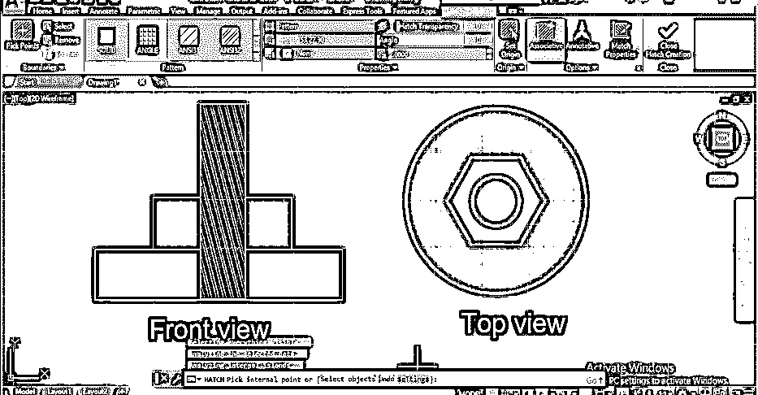

第 23 步:一旦你点击了这个选项，一个阴影设置框就会像这样打开。您可以在此框中进行所需的设置，并通过单击此框的预览选项卡来查看预览。

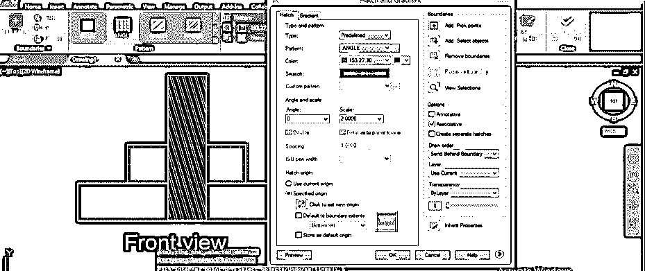

**步骤 24:** 如果你想从你的图纸中删除任何特定的影线，点击影线创建器选项卡的删除按钮。

**第 25 步:**点击你要删除阴影的对象的边界，然后按键盘的 enter 键，你的阴影将从你的对象中删除。

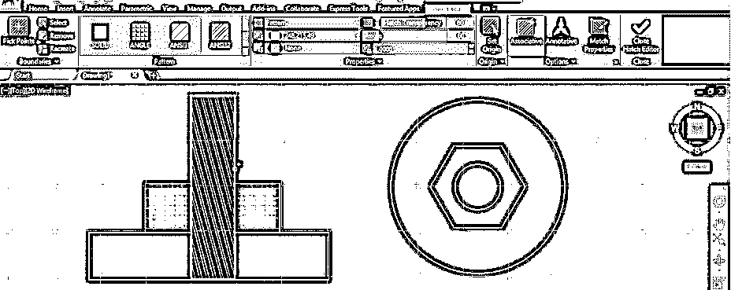

这样，您可以在 auto cad 中使用 hatch 命令。

### 结论

现在，看完这篇文章后，您可以理解什么是 hatch AutoCAD，以及如何处理它的参数以在绘图对象上制作图案和横截面。你可以通过练习掌握它。

### 推荐文章

这是一个 AutoCAD 的填充指南。在这里，我们讨论的介绍，如何使用 AutoCAD 的一步一步的方式。您也可以浏览我们的其他相关文章，了解更多信息——

1.  [AutoCAD 中的布局](https://www.educba.com/layout-in-autocad/)
2.  [AutoCAD 功能键](https://www.educba.com/autocad-function-keys/)
3.  [AutoCAD 中的模板](https://www.educba.com/template-in-autocad/)
4.  [SketchUp AutoCAD 指南](https://www.educba.com/sketchup-autocad/)

