# SketchUp AutoCAD

> 原文：<https://www.educba.com/sketchup-autocad/>

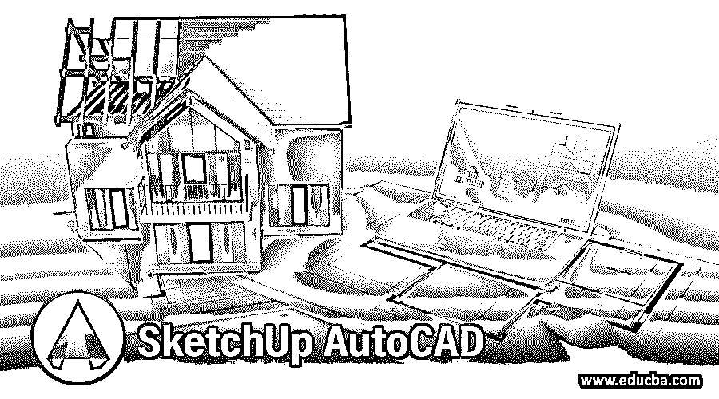

## SketchUp AutoCAD 简介

Auto Cad 是 2d 和 3d 计算机辅助设计软件，我们用于不同类型的工程分支。我们将它用于机械工程、土木工程、电气工程和其他一些领域。在建筑工程中，我们也用它来制作楼层平面图。如果我们谈论 Sketchup 软件，那么它就是我们制作不同类型布局的 3d 模型的软件。在本文中，我们将讨论如何在 SketchUp 软件中导入 Auto Cad 文件，并制作该文件的 3d 模型。所以让我们开始关于这个话题的讨论，并获取相关知识。

### 如何在 SketchUp 中导入 AutoCAD 文件？

我们可以非常容易地在 Sketchup 软件中使用 auto cad 文件，并制作该文件的 3d 模型。在 Sketchup 软件中制作 3d 建模非常容易。如果你想以学习为目的使用 Sketchup 软件，那么你可以直接在网站上使用，不需要下载，但是如果你想在你的电脑上拥有它，那么就从它的官网下载，并在你的工作中享受它。

<small>3D 动画、建模、仿真、游戏开发&其他</small>

**步骤 1:** 现在让我们开始学习在 SketchUp 软件中导入 Auto Cad 文件的步骤。

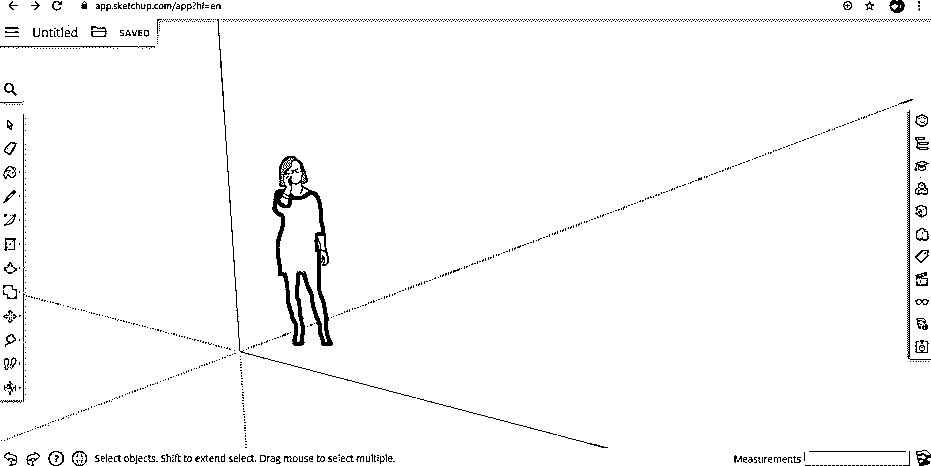

**第二步:**在 SketchUp 软件中导入一个 auto cad 文件，进入该文件夹图标，用鼠标点击。单击该文件夹图标后，将会打开一个下拉列表。点击此列表的插入选项，将文件导入此软件。

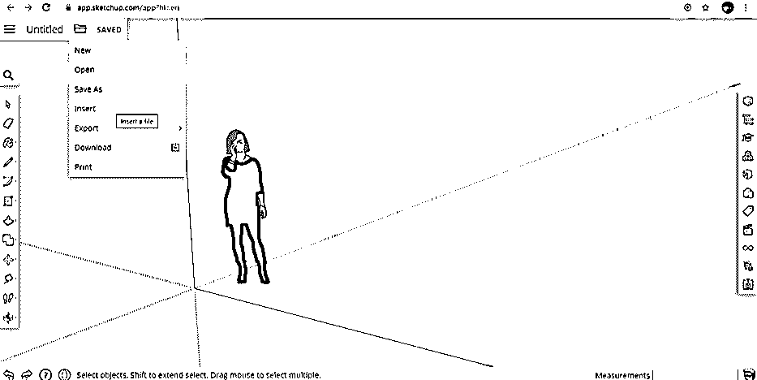

**步骤 3:** 一旦点击插入选项，这种类型的插入对话框将再次打开。在这里选择“你的电脑”选项，点击它从你的个人电脑导入任何文件。

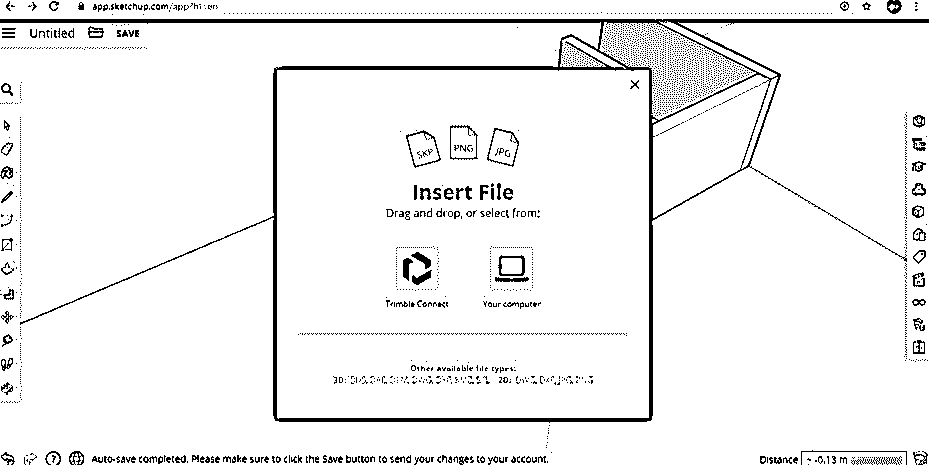

**第四步:**现在，当你点击计算机图标选择你想要导入到该软件中的 auto cad 文件时，会打开一个对话框。现在转到你个人电脑中保存 auto cad 文件的文件夹，然后点击选择它。现在单击此对话框的打开按钮。

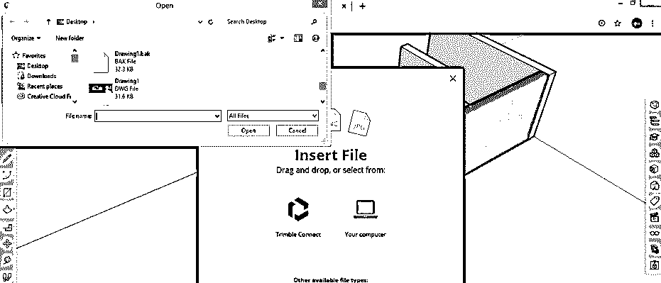

第五步:现在，它将向您显示一些导入参数。在“保留绘图原点”选项中勾选“开”,以指定该软件中绘图的原点，然后单击“导入”按钮，将 auto cad 文件导入 SketchUp 软件中。

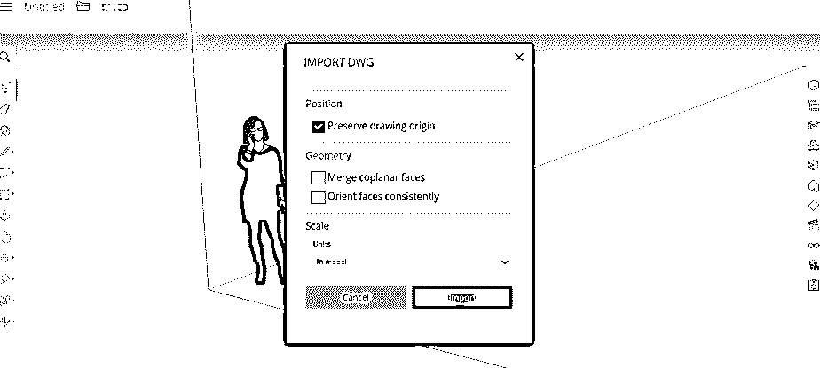

**步骤 6:** 将您的文件转换成该软件可接受的格式需要一些时间，然后将您的 auto cad 文件转换成 SketchUp 中可访问的格式，然后将其保存到 SketchUp 软件的导入/导出选项卡中。现在点击移动你的鼠标光标在你想要的文件的插入图标上，点击它在这个软件中有它。

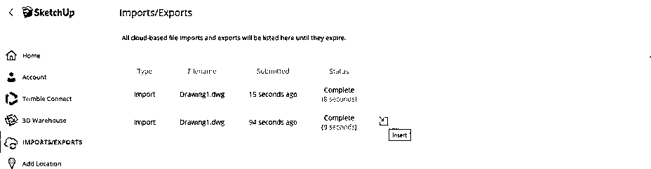

**第七步:**现在，你的 auto cad 文件会进入 SketchUp 软件的工作屏幕。现在把它放在你想要的地方**。**

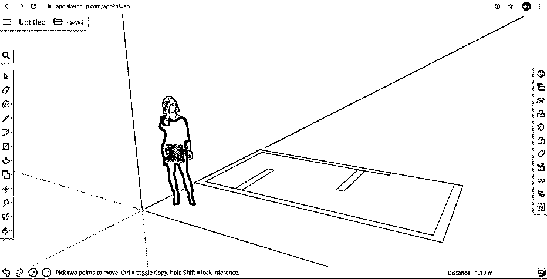

**第 8 步:**您可以通过按住鼠标的滚动按钮并移动鼠标光标来旋转视图，从而更改您布局的视图。

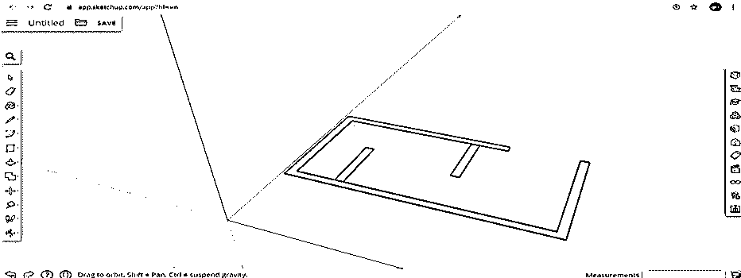

**第九步:**使用本软件的 scale 命令，您可以根据自己的需求缩放布局。点击左侧工具面板中的“缩放”命令，然后点击您的绘图中您想要缩放的特定点。

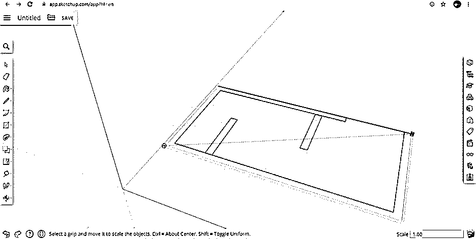

**步骤 10:** 您可以使用该软件的卷尺命令来测量您布局的尺寸，该命令可在左侧工具面板部分找到。

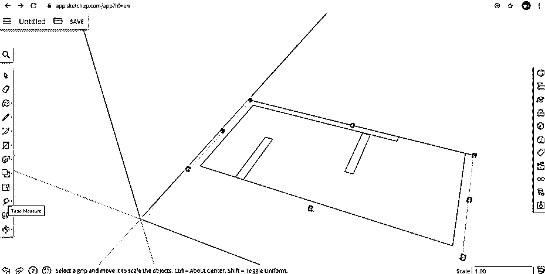

**步骤 11:** 点击卷尺命令，然后从你想要开始测量的地方点击起点，然后拖动到你想要测量的地方，然后它会显示你测量的尺寸，就像这样。

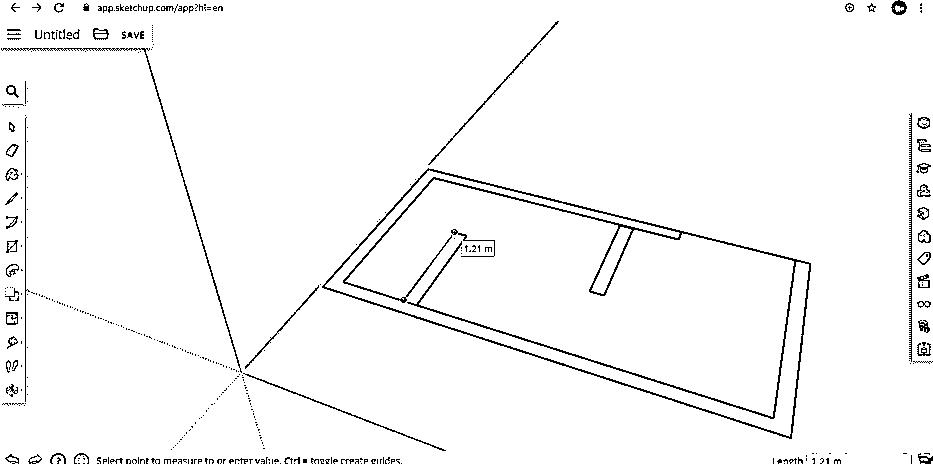

**步骤 12:** 您可以使用制作该布局墙壁的按/拉命令来制作其 3d 模型。通过按/拉命令，可以根据需要向上或向下拖动鼠标光标，向上或向下拉伸墙。所以从工具面板的工具列表中点击按/拉命令。

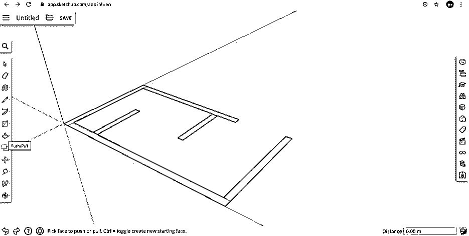

**步骤 13:** 现在，将该命令的鼠标光标放在墙壁中你想要转换的矩形的边界上。当你把光标放在边界上时，它会像这样填充一个点状图案。

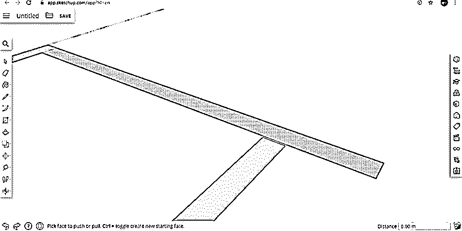

**第 14 步:**现在，你可以向上拖动鼠标光标，使所有你想要的高度。通过在所有墙上应用此命令，可以创建这种类型的三维模型。

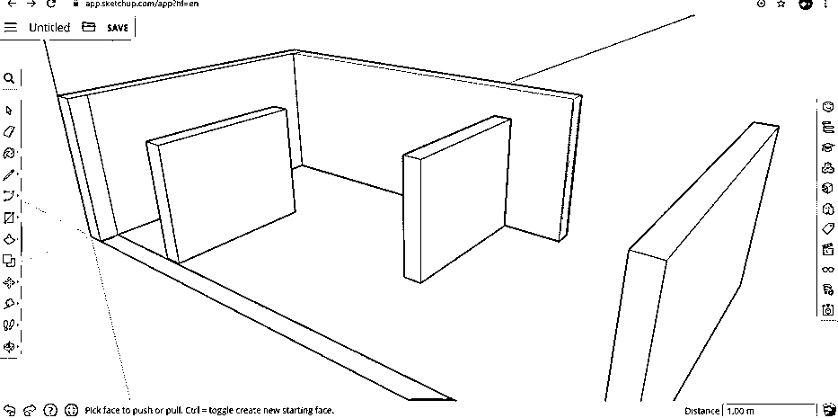

**第 15 步:**按住鼠标的滚动键，改变这个 3d 模型的视图，然后旋转它，再次使用按/拉命令，也挤压这个墙。

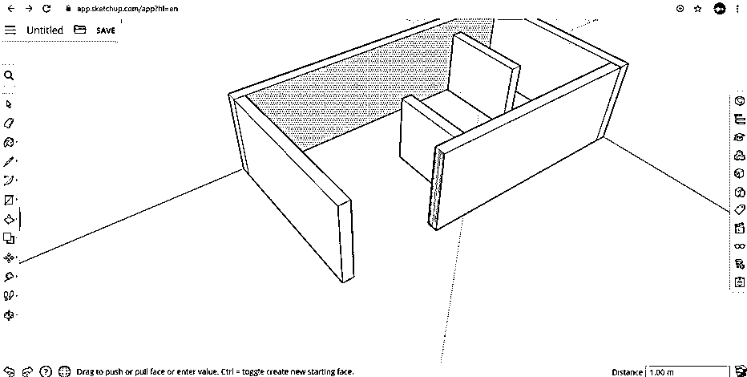

**步骤 16:** 你也可以通过这个按/拉命令来增加墙的厚度。对于增加，厚度选择你想要增加厚度的墙面，并将其向前拖动，然后输入你想要的厚度值，厚度将像这样变化。

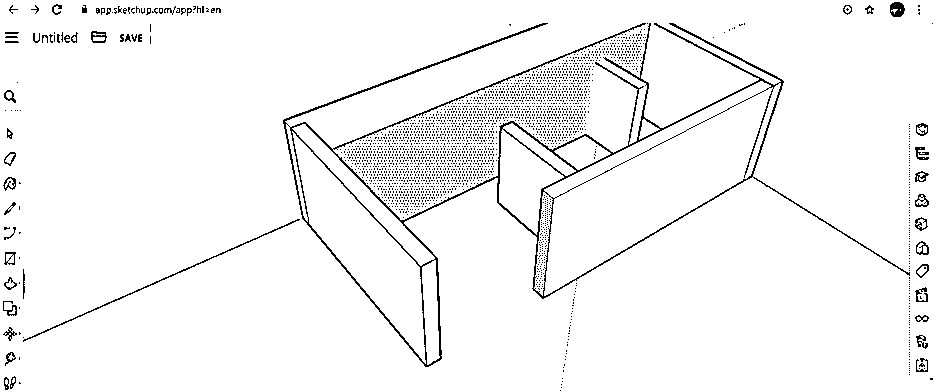

这样，您就可以使用 Sketchup 从 auto cad 的二维图形制作三维模型，并对其参数进行处理。

### 结论

现在，在这篇文章之后，你可以理解如何在 Sketchup 中导入一个 auto cad 文件，并使用它来制作该绘图的 3d 模型。通过使用该软件的不同命令和功能，您可以越来越多地在 SketchUp 中操作 2d 绘图来进行 3d 建模。

### 推荐文章

这是 SketchUp AutoCAD 的使用指南。在这里，我们讨论的介绍，如何使用 SketchUp AutoCAD 使用不同的命令和该软件的功能。您也可以浏览我们的其他相关文章，了解更多信息——

1.  [AutoCAD 功能键](https://www.educba.com/autocad-function-keys/)
2.  [在 AutoCAD 中插入图像](https://www.educba.com/insert-image-in-autocad/)
3.  [AutoCAD 中的线条](https://www.educba.com/lines-in-autocad/)
4.  [AutoCAD 建筑](https://www.educba.com/autocad-architecture/)

