# AutoCAD 中的扫掠

> 原文：<https://www.educba.com/sweep-in-autocad/>

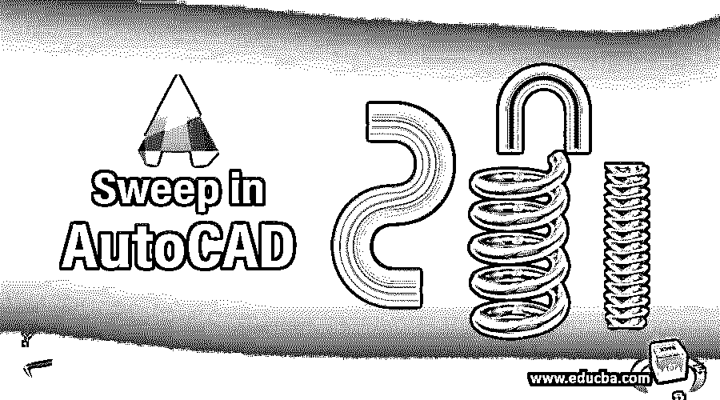

## AutoCAD 中扫掠的介绍

Auto Cad 是一种计算机辅助二维和三维设计软件，它在一些令人兴奋的命令的帮助下工作。Sweep 是这个软件的命令之一。通过 sweep 命令，我们可以通过将任何 2d 形状分配给特定路径来制作一个实体形状。在本文中，我们将通过一个示例来理解 sweep 命令，并学习如何在 Auto Cad 软件中处理 sweep 命令参数。“扫描命令”是该软件“主页”选项卡的“创建”菜单中的命令。所以让我们开始讨论 Auto Cad 软件中的这个命令。

### AutoCAD 中如何使用 Sweep？

我们可以很容易地在 Auto Cad 软件中使用 sweep 命令，只需以一种非常有趣的方式遵循一些简单的步骤，但是在开始学习该命令之前，让我们看一下该软件的工作屏幕，以便更好地理解本文中的主题。

<small>3D 动画、建模、仿真、游戏开发&其他</small>

**步骤 1:** 在工作屏幕的顶部，我们有一个不同选项卡的功能区，其中包含许多用于管理该软件工作的命令，在该功能区的下面；我们有一个工作窗口，我们可以在其中看到我们当前的图纸或项目，在这个窗口的右侧，我们有导航立方体，帮助我们从不同的角度看到我们的对象，如顶视图，侧视图，前视图，在这个工作屏幕的底部有一些导航工具，用于处理这个软件的工作。

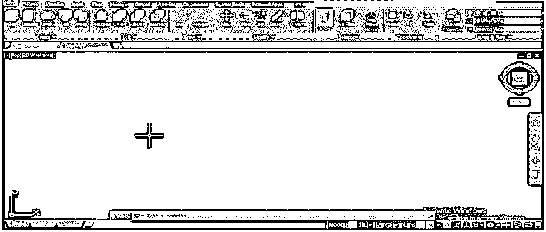

**步骤 2:** 现在，让我们从工作窗口底端的工作区切换选项将工作区切换到 3D 基础。

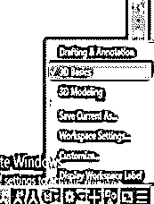

**第三步:**现在，让我们从主页选项卡的绘图菜单中点击 Arc 命令。

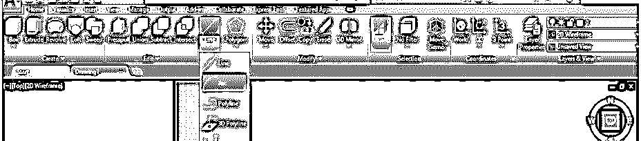

**第四步:**像这样画三个任意尺寸的圆弧。

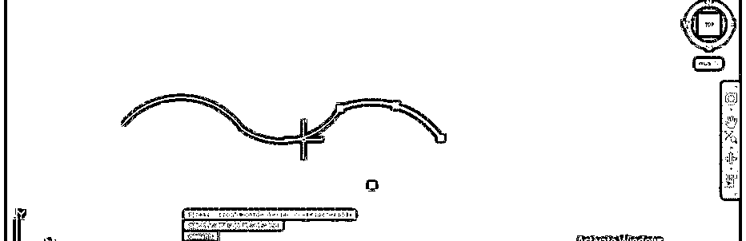

**步骤 5:** 现在使用连接命令来连接这些圆弧。对于 JOIN 命令，键入 Join 并按 enter 键。

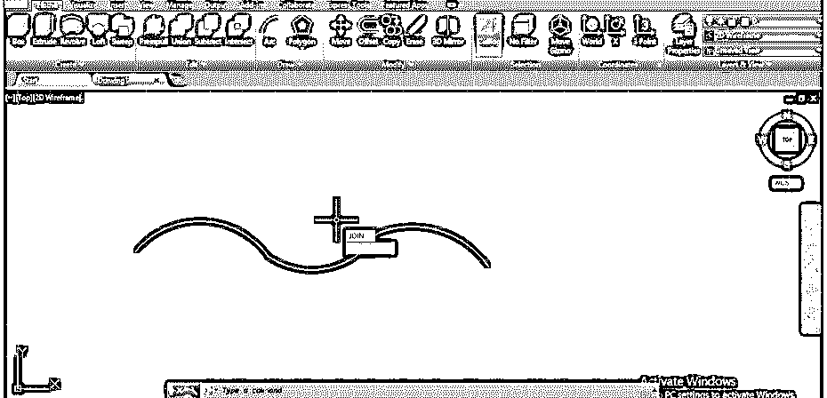

**步骤 6:** 现在用连接命令的光标逐个选择所有的弧，然后按回车键将它们连接成一个弧。

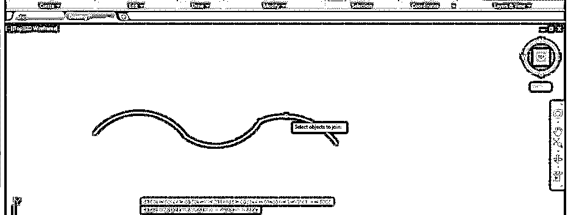

**第七步:**它会这样加入。

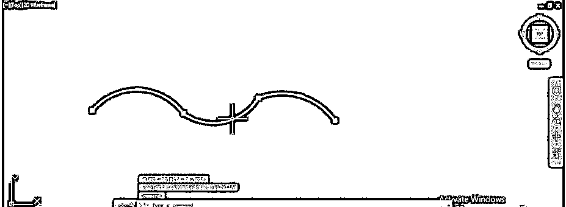

**第 8 步:**现在进入这个软件的视图控制选项，点击它来改变视图。

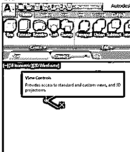

**第九步:**会打开一个下拉列表；通过单击，从下拉列表中选择东南等轴测选项，即东南视图。

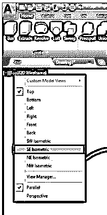

**步骤 10:** 现在，从主页标签的绘图菜单中点击多边形命令。

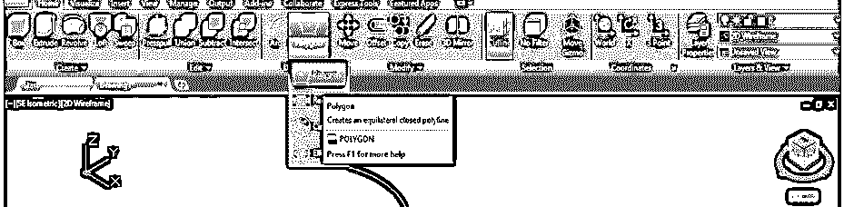

**步骤 11:** 现在会要求输入多边形的边长值。我将 6 作为我的多边形的边，然后按回车键。

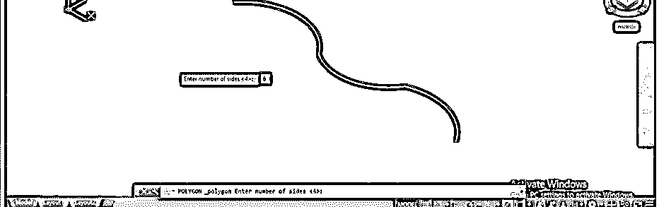

**第十二步:**现在拖动鼠标光标画一个六边形，也可以像这样手动给定这个六边形的圆的半径，然后按回车键。

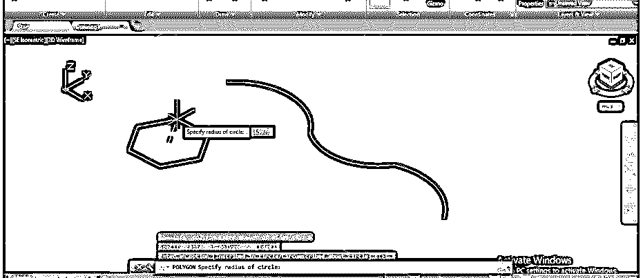

**第 13 步:**转到本软件的 go Sweep 命令，该命令在 Home 选项卡的 Create 菜单中，点击即可使用。

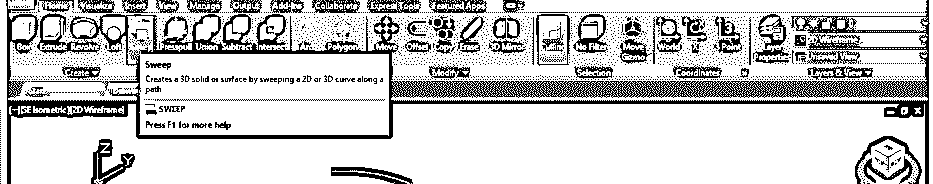

**第 14 步:**现在，它会让你选择你想扫的对象。因此，我将通过单击选择我的六边形，然后按键盘上的 enter 键。

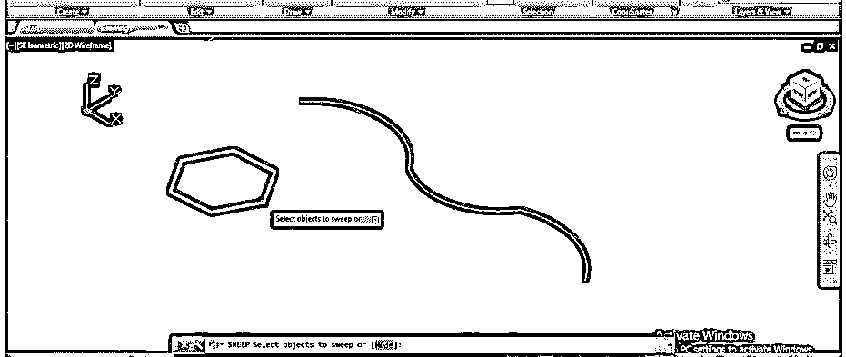

**第 15 步:**现在，它会让你选择你想要扫掠你的形状的路径。我将通过单击来选择这条曲线。

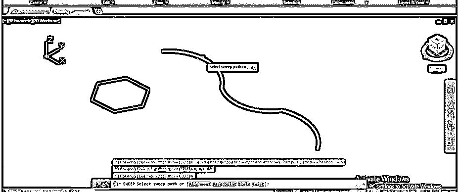

**第十六步:**然后按键盘上的 enter 键。一旦你按下键盘的回车键，它就会像这样扫过你的形状。这是扫掠造型的二维线框视图。

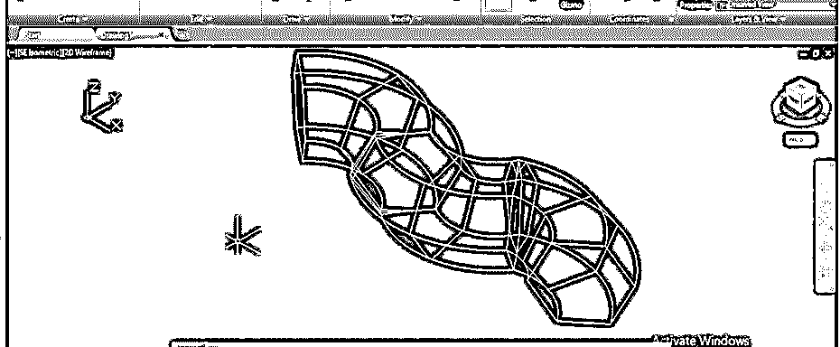

**第 17 步:**对于阴影视图，进入该软件的视觉风格控件并点击它。

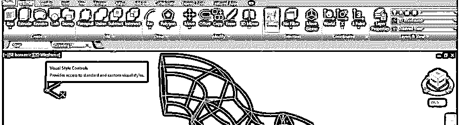

**第十八步:**会打开一个下拉列表；单击下拉列表中的阴影选项。

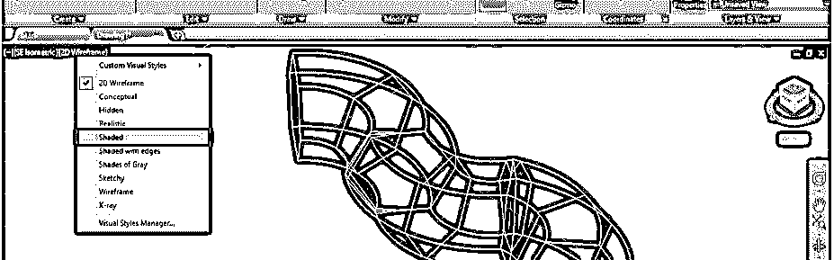

**第 19 步:**现在，一旦你点击阴影选项，它将看起来像这样。你可以选择不同的风格。

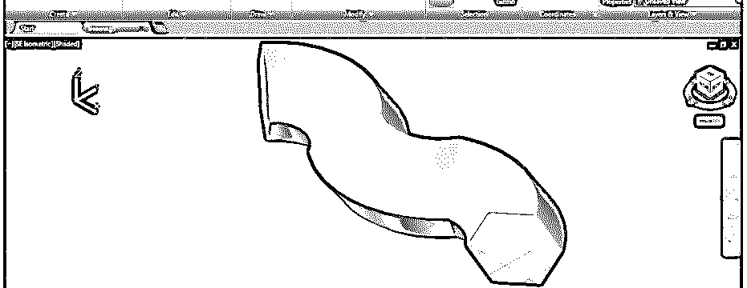

**步骤 20:** 现在，让我们分析一下 sweep 命令的其他选项。让我们从“主页”选项卡的“绘图”菜单中单击一个矩形命令来获得其他选项。

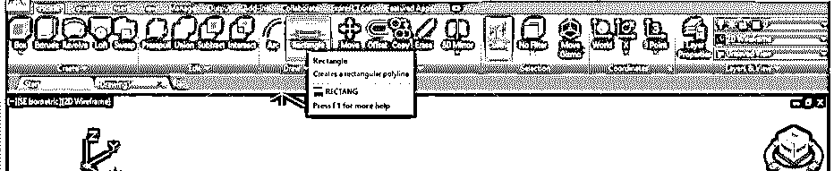

**步骤 21:** 画一个任意尺寸的矩形，然后进入本软件的查看控件，点击即可。现在点击列表前面的选项。

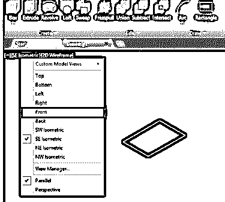

**第 22 步:**现在，从这个软件的 Home 标签的 Draw 菜单中取 Arc 命令，像这样画一个任意尺寸的圆弧。

**步骤 23:** 现在，再次从视图控制选项返回到西南等角视图，并再次从该软件主页选项卡的创建菜单中选择扫描命令。使用 sweep 命令选择矩形，然后按 enter 键。

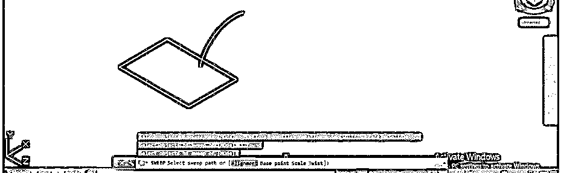

**步骤 24:** 现在转到 Sweep 命令的参数框，它在工作窗口的底端，在这里输入 A，然后按键盘的 enter 键。

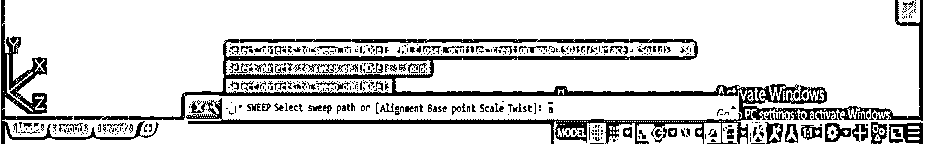

**步骤 25:** 现在，它会问你是否要在垂直截面上画一条扫描线。在此框中按键盘上的 Y 键表示“是”，然后按 enter 键。

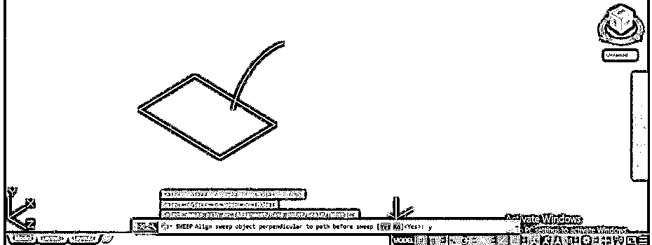

**步骤 26:** 然后选择一条路径，这条路径就是我们画的弧线，它会画出这样的形状。

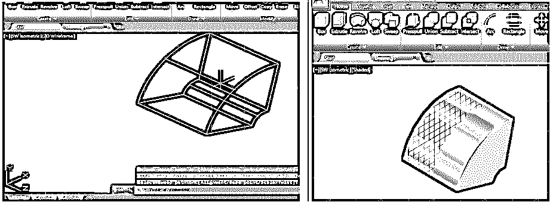

**第 27 步:**现在，让我们看看如果我们拒绝校准选项会发生什么。再次绘制与我们之前绘制的形状相同的形状。

**步骤 28:** 现在再次使用扫描命令，选择矩形，然后按键盘的回车键。现在按“A”键，然后按键盘上的 Enter 键。

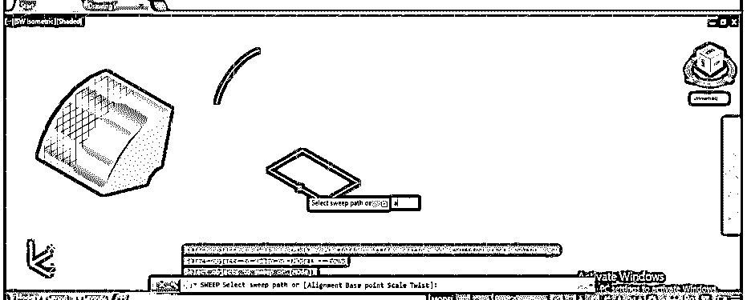

**步骤 29:** 现在，它会询问您对准选项是或否。这一次，我将在参数框中键入 N，然后按键盘上的 enter 键，表示“不”。

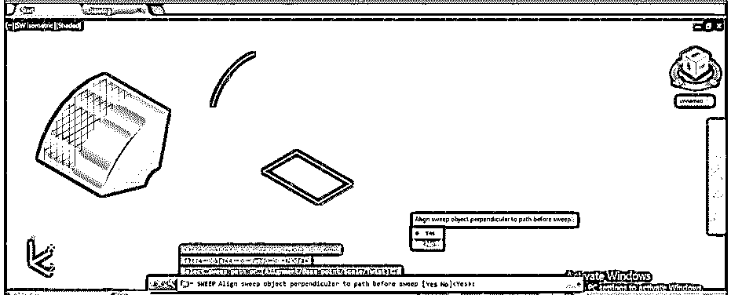

**步骤 30:** 现在选择你要画扫掠的路径，按下键盘的回车键。

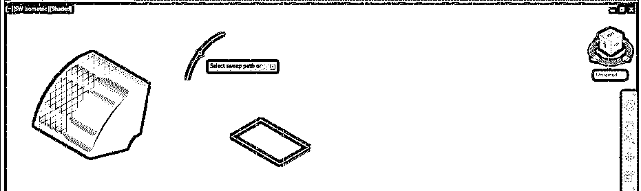

**第 31 步:**然后扫掠会形成这样的形状，不垂直于所做物体的横截面。您可以看到两个对象之间的差异。

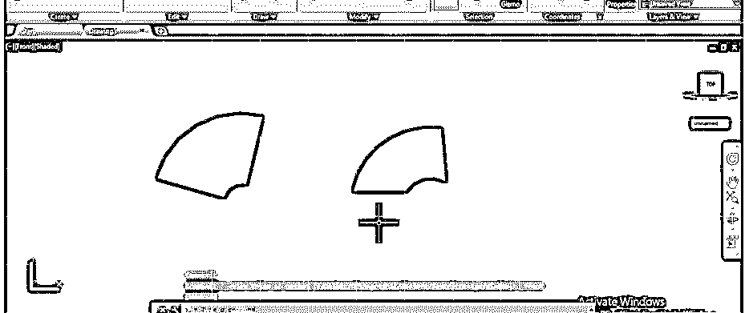

这样，您可以使用 sweep 命令的不同选项，并查看它们在 sweep 对象上的变化。您可以使用此命令来制作有效的对象。

### 结论–在 AutoCAD 中扫掠

现在，读完本文后，你可以理解“什么是 AutoCad 软件中的 sweep 命令，以及如何使用它的选项从该命令中获得最佳结果”。您可以对该命令的参数进行不同类型的修改，以使用该命令获得不同的形状对象。

### 推荐文章

这是一个在 AutoCAD 中扫掠的指南。在这里，我们讨论的介绍，如何使用扫在 AutoCAD 的一步一步的方式。您也可以浏览我们的其他相关文章，了解更多信息——

1.  [AutoCAD 中的线条](https://www.educba.com/lines-in-autocad/)
2.  [AutoCAD 中的工具栏](https://www.educba.com/toolbars-in-autocad/)
3.  [在 AutoCAD 中挤出](https://www.educba.com/extrude-in-autocad/)
4.  [AutoCAD 中的模板](https://www.educba.com/template-in-autocad/)
5.  [AutoCAD PressPull |使用](https://www.educba.com/autocad-presspull/)
6.  [AutoCAD 中的倒角|如何使用？](https://www.educba.com/chamfer-in-autocad/)

