# 在 AutoCAD 中旋转

> 原文：<https://www.educba.com/revolve-in-autocad/>

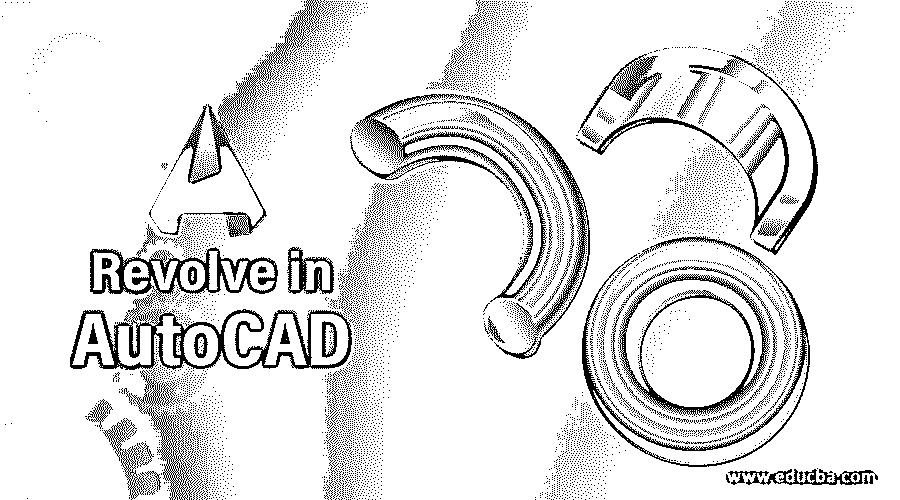

## AutoCAD 中旋转的介绍

AutoCAD 是 Autodesk 开发的二维和三维计算机辅助设计软件。在这个软件中，我们有许多不同类型的 2d 和 3d 命令用于绘图。在本文中，我们将讨论其中一个 3d 命令，旋转命令。您可以将 revolve command 理解为一个命令，通过该命令，您可以通过沿 x、y 或 z 轴旋转任何 2d 形状或任何特定对象来制作 3d 对象。在这里，我们将了解该命令的所有重要特性，并介绍该命令的重要参数，以便在我们的工作中获得最佳结果。

### 如何在 AutoCAD 中使用 Revolve 命令？

我们可以使用 auto cad 中的 revolve 命令，只需几个简单的步骤，没有任何问题。在了解这个话题之前，让我们先了解一下这个软件的工作屏幕，以便更好的理解这个话题。

<small>3D 动画、建模、仿真、游戏开发&其他</small>

**步骤 1:** 在工作屏幕的顶部，我们有一个功能区，其中有许多不同类型的选项卡，如主页选项卡、视图选项卡、插入选项卡、注释选项卡和其他一些选项卡；在这个下面，我们有一个工作窗口，我们可以在其中看到我们当前的工作，在这个工作窗口下面，我们有一些导航标签，使我们的绘图工作在这个软件中变得容易。

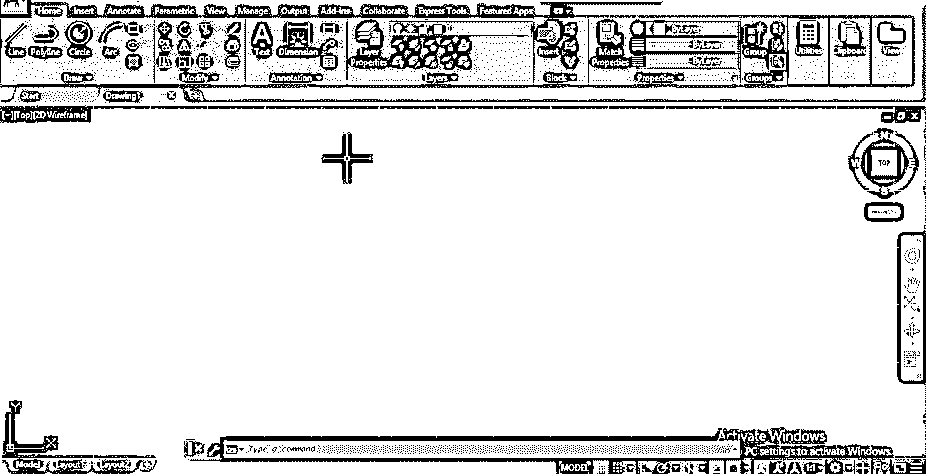

**第二步:**现在我们要把这个软件的工作区屏幕改成 3d basic for 3d commands for revolve command，因为 revolve 是 3d 命令。因此，要更改工作区屏幕，请转到工作区切换器选项，它位于工作屏幕底端的右侧。现在点击工作区切换器选项，并通过点击它从列表中选择 3d 基本选项。

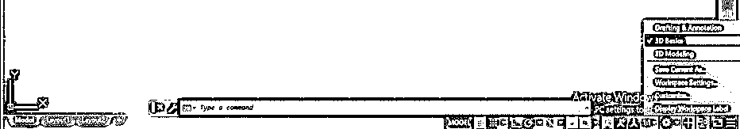

**第三步:**现在让我们通过 circle 命令在这个软件的前视图中做一个圆。

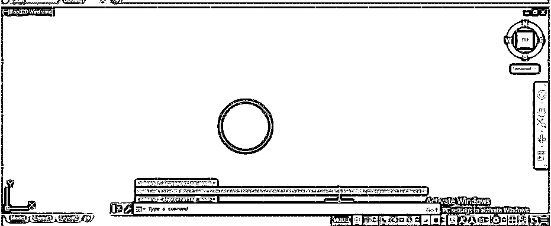

**步骤 4:** 现在，让我们从这个视图控制选项中改变我们的视图。因此，单击此选项，并从列表中选择等轴测选项。

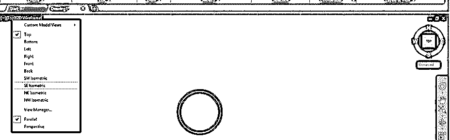

**步骤 5:** 现在转到 3d 基本工作空间屏幕主页菜单的创建选项卡，点击旋转命令图标，激活旋转命令。

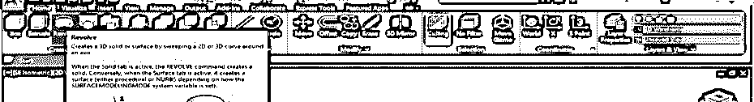

**第六步:**可以使用旋转命令的快捷键 REV，然后按键盘的 enter 键激活旋转命令。

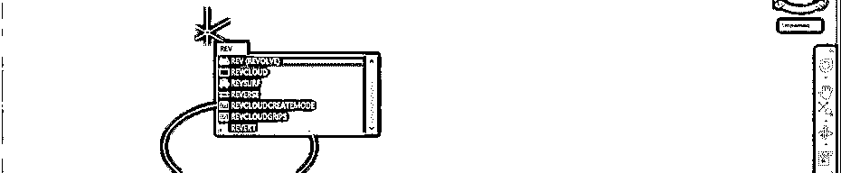

**第七步:**现在，它会让你选择对象。所以点击这个圆的边界来选择它。

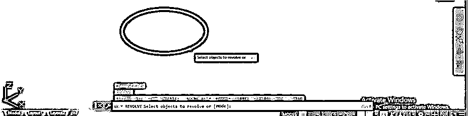

第八步:然后它会要求你给出你想要物体旋转的轴。我将给出 x 轴，然后按键盘上的 enter 键。

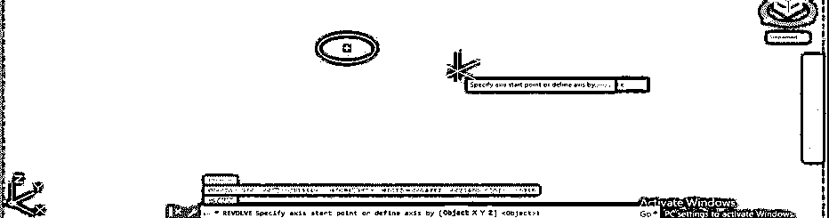

**第九步:**你的物体会这样旋转。

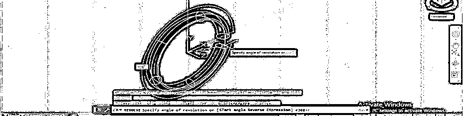

第十步:现在，它会要求你输入你想要旋转物体的启示值。我将输入 360 度作为旋转角度。你可以根据你的情况来拿。

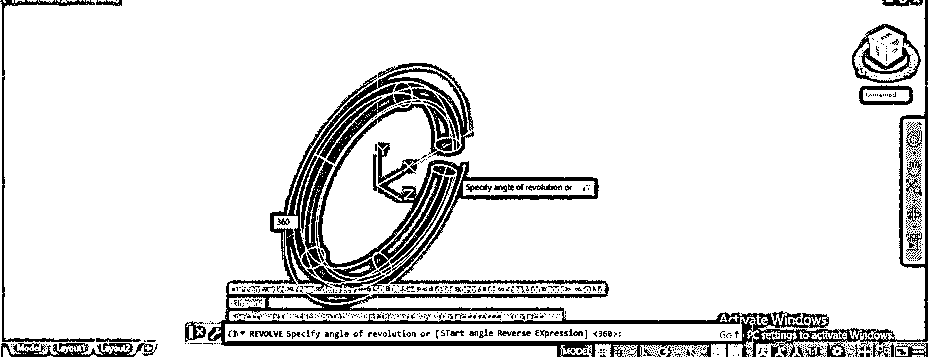

**第十一步:**你的物体会这样旋转。这是该 3d 对象的 2d 线框视图。

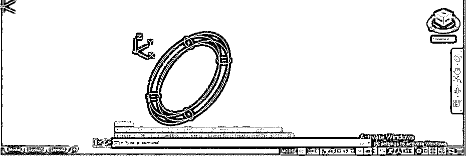

**步骤 12:** 你可以从这个软件的视图风格选项里把它改成阴影视图，这个选项在这个工作屏幕的左上角。

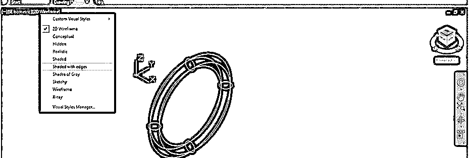

第 13 步:你的物体在阴影中看起来会像这样。

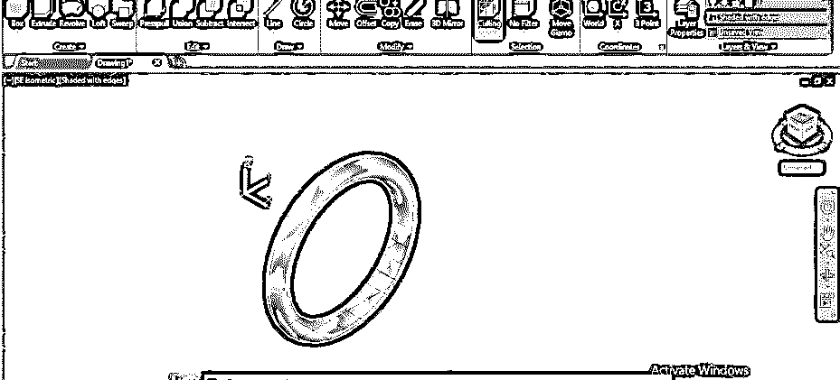

**步骤 14:** 你不能在物体的同一平面内旋转你的 2d 形状。比如我在 z 平面上画了这个圆，当我想通过在旋转命令中指定旋转的 z 轴来在 z 轴上旋转它的时候，再按键盘的 enter 键。

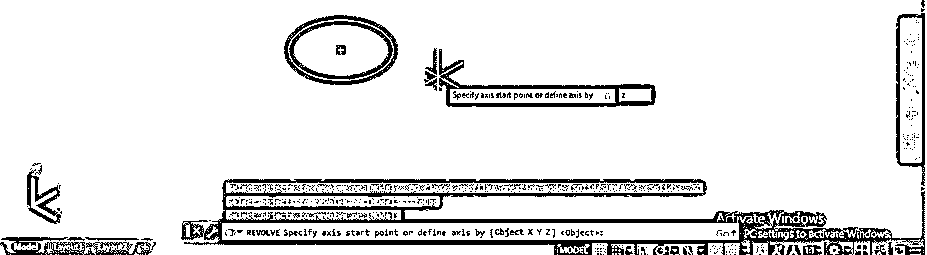

**步骤 15:** 然后，按下键盘的 enter 键后，你可以看到命令会显示这条信息:轴垂直于物体，所以不能旋转。

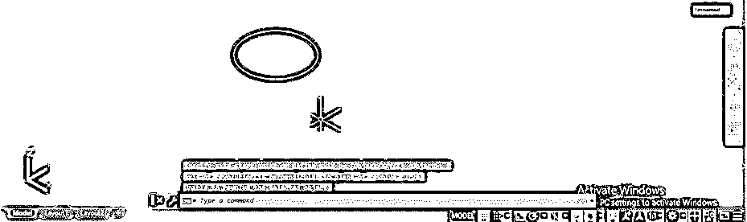

**步骤 16:** 现在，为了更好地理解该命令，让我们讨论该命令的其他选项。再次使用旋转命令。然后点击该命令参数框的模式选项。

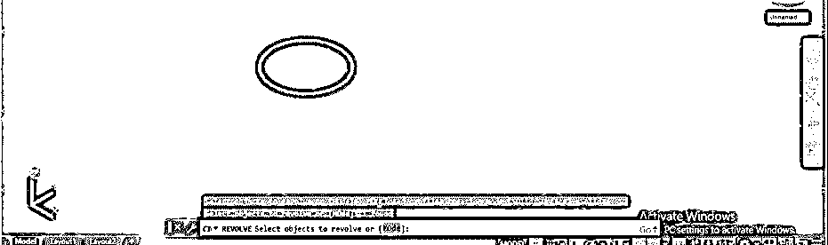

**第十七步:**现在这个命令的模式选项里有两个选项是实体和曲面。让我们逐一了解这两者。因此，我将首先单击实心选项。

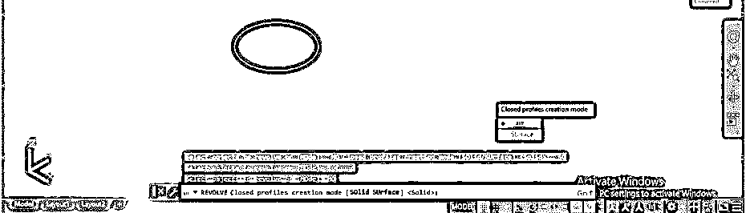

**第十八步:**现在，它会要求你给出想要旋转的轴。我将给出 Y 轴，然后按下键盘的 enter 键。

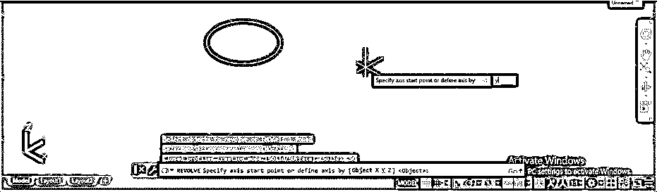

**第 19 步:**它会这样旋转。现在输入旋转角度。我会给它 180 度。

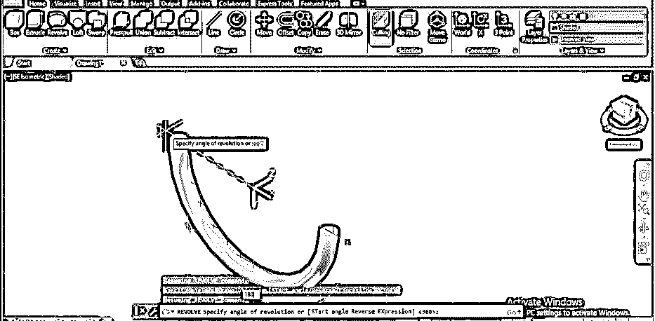

步骤 20: 现在，当你环绕这个 3d 形状时，你可以看到它是一个立体形状。因此，使用“实体”选项，您可以创建一个实体三维形状。

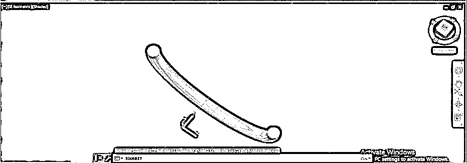

**步骤 21:** 现在再次使用 revolve 命令，遵循相同的步骤，然后在模式选项中选择表面选项。

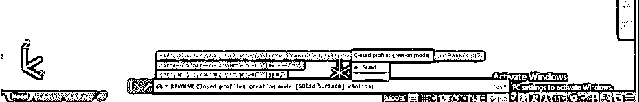

**步骤 22:** 再次给出旋转轴，然后按键盘的 enter 键，再按旋转角度。

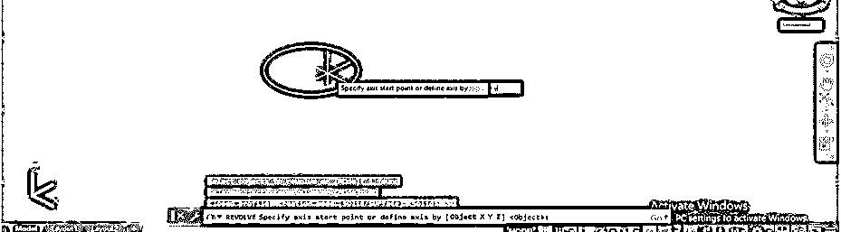

**步骤 23:** 现在，当你环绕这个形状，你可以看到这是空心的形状。因此，使用“曲面”选项，您可以只制作任何对象的曲面。

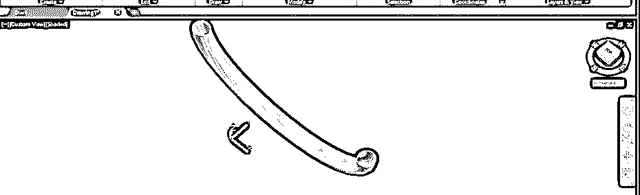

**步骤 24:** 现在，让我们再次拿 revolve 命令就可以选择这个圆，然后按键盘的 enter 键；您可以在该命令的参数部分看到两个选项，因此从该列表中选择对象选项。

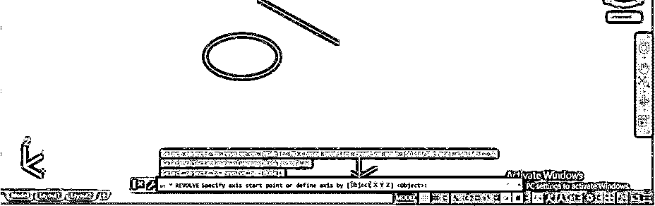

第 25 步:现在，它会让你选择你想让它绕着旋转的物体。我会点击这条线。

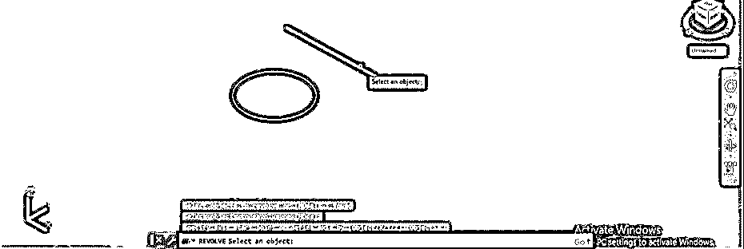

**第 26 步:**而你的物体会像这样绕着这条线旋转。

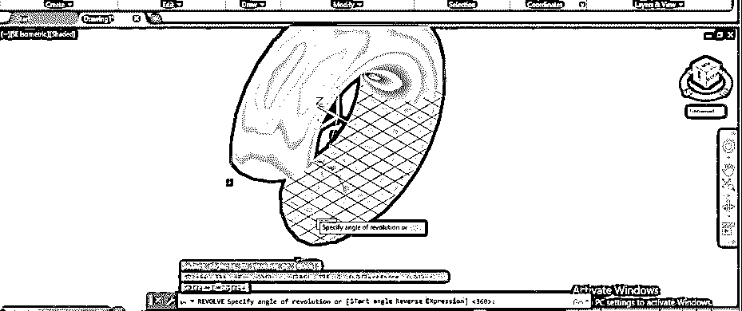

**第 27 步:**你可以根据你给出回转角度的值。

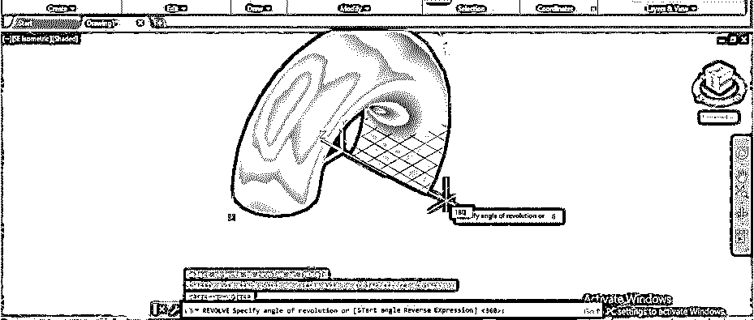

**步骤 28:** 你可以用这个 revolve 命令制作漂亮的物体。我画一个像这样的二维图形。确保要旋转的形状应该连接在一个对象中。

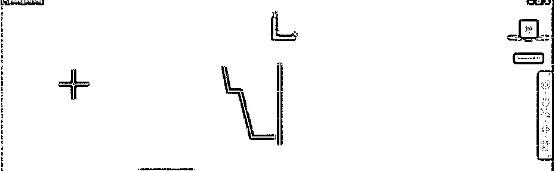

**步骤 29:** 现在，将视图更改为西南等轴视图。

步骤 30: 再次使用旋转命令，围绕这条线旋转这个图形。

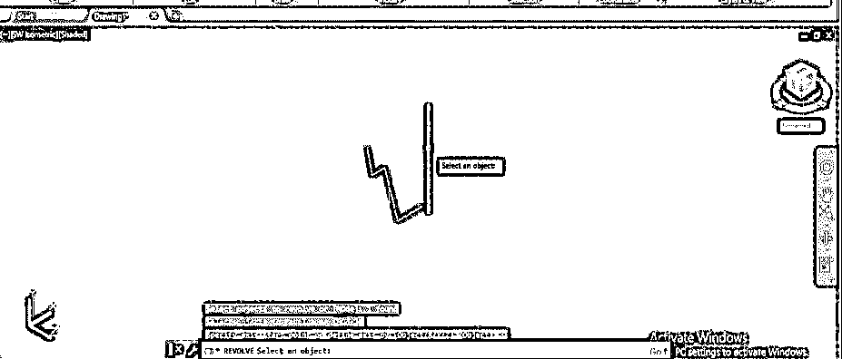

**第 31 步:**然后你的形状会这样旋转。

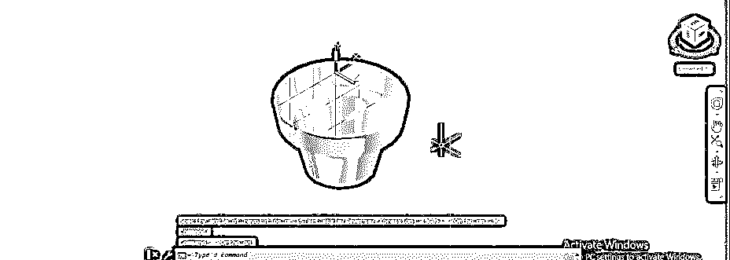

**步骤 32:** 所以，通过这种方式，你可以用这个命令制作一个对象。

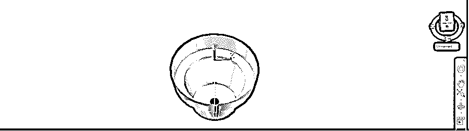

### 推荐文章

这是一个在 AutoCAD 中旋转的指南。在这里，我们讨论了介绍，如何使用 Autocad 中的旋转命令，以及如何使用它的重要参数来制作三维对象。您也可以浏览我们的其他相关文章，了解更多信息——

1.  [在 AutoCAD 中插入图像](https://www.educba.com/insert-image-in-autocad/)
2.  [AutoCAD 中的布局](https://www.educba.com/layout-in-autocad/)
3.  [AutoCAD 建筑](https://www.educba.com/autocad-architecture/)
4.  [AutoCAD 中的工具栏](https://www.educba.com/toolbars-in-autocad/)

