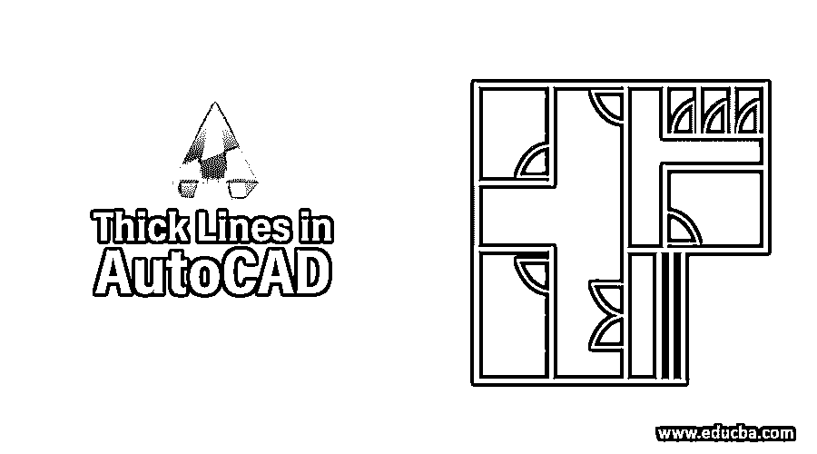

# AutoCAD 中的粗线

> 原文：<https://www.educba.com/thick-lines-in-autocad/>

## AutoCAD 中的粗线介绍

AutoCAD 软件包附带了一个标准线型库，其中包含 38 种不同的标准线型。线型可以是虚线、点、文字和符号的图案，也可以是连续的。“连续”线型以连续的实心图案显示对象。“按图层”线型显示具有指定给当前图层的线型的对象。“ByBlock”线型显示具有连续线型的对象，直到这些对象合并到一个块定义中。

### 线型的定义

AutoCAD 中的粗线需要线型名称。当您要加载线型或将线型指定给对象时，AutoCAD 会根据您指定给线型定义的名称来识别该线型。应选择线型定义的名称，以帮助用户通过名称识别线型。例如，线型名称 LINEFCX 不会让用户了解线的类型。但是，像 DASHDOT 这样的线型名称可以让用户更好地了解线的类型。

<small>3D 动画、建模、仿真、游戏开发&其他</small>

线型描述是线的文字表示。这种表示可以通过在键盘上使用破折号、点和空格来生成。代码中给出的图形用于显示线型的预览。线型描述不能超过 47 个字符。

### 如何在 AutoCAD 中创建线型？

在 AutoCAD 中创建线型之前，需要确定要生成的线的类型。在一张纸上画线，并测量组成这条线的每个元素的长度。您只需要定义直线的一段，因为当您绘制直线时，图案会重复。可以通过以下任何一种方法创建或修改线型:

*   使用文本编辑器，如记事本。
*   在 acad.lin 或 acadiso.lin 文件中添加新线型。
*   使用线型命令。

### AutoCAD 中不同类型的线

以下是 Autocad 中不同类型的线:

**1。连续**

**2。破折号**

**3。破折号**

**4。长点划线**

**5。长划双点**

**6。长划三点**

**7。圆点**

**8。长划短划**

**9。长划双短划**

10。破折号

**11。双点划线**

**12。虚线双点**

13。双点划线双点

**14。虚线三点**

15。双点划线三点

**线路命令:**

使用“直线”命令，可以绘制一条从一点到另一点的简单直线。当您拾取第一个点并将十字准线移动到第二个点的位置时，您将看到一条橡皮筋线，显示拾取第二个点时将在何处绘制该线。线对象有两个端点(第一个点和最后一个点)。您可以继续拾取点，AutoCAD 将在每个拾取点和前一个点之间绘制一条直线。绘制的每条线段都是一个单独的对象，可以根据需要移动或删除。要结束这个命令，只需按键盘上的回车键。

也可以通过在命令提示下输入线端点的坐标来绘制线，而不是从屏幕上拾取线的位置。这使我们能够在屏幕外画线。你也可以使用叫做直接距离输入的东西来画线。

创建直线段，步骤如下:

*   **选择:**画à线
*   **点击:**线图标或
*   **在命令提示符下键入:**行。命令:LINE 或 L
*   **按下:**回车
*   **从点中挑选:**
*   **选择:**指定下一个点
*   **选择:**指定下一点或【关闭/撤销】:
*   **按:**回车结束行序列
*   **键入:** U 撤消最后一段或
*   **键入:** C 创建一个封闭的多边形

AutoCAD 中的粗线为您提供了将对象分类分隔成图层的选项。将 AutoCAD 图层视为独立的透明胶片会有所帮助，有助于您组织图形。

使用层的好处之一是能够使它们可见和不可见。例如，您可以在图层上放置构造线和参考注释，然后在不使用图层时将其关闭。房屋平面图可以绘制在称为楼层的图层上，并以红色显示。平面图的尺寸可以绘制在名为 Dimension 的图层上，并以黄色显示。称为中心的图层可能包含蓝色中心线。

### 典型层

| **图层名称** | **颜色** | **线型** | **Lineweight** |
| Zero | 怀特（姓氏） | 连续的 | 0.50 毫米 |
| 边境 | 蓝绿色 | 连续的 | 0.20 毫米 |
| 中心 | 品红 | 中心 | 0.20 毫米 |
| 规模 | 蓝色 | 连续的 | 0.20 毫米 |
| 隐藏的 | 绿色的 | 隐藏的 | 0.30 毫米 |
| 笔记 | 品红 | 连续的 | 0.30 毫米 |
| 目标 | 红色 | 连续的 | 0.40 毫米 |
| 幽灵 | 黄色 | 幽灵 | 0.50 毫米 |

#### 创建新层

*   启动 AutoCAD 并打开名为 tmp1.dwg 的图形。
*   选择“绘图和注释”工作空间。
*   选择 Ribbon 主页选项卡，并在图层面板上选择图层属性按钮，或输入 LA，图层命令的命令别名。

这将进入图层命令并显示图层特性管理器选项板。首先，让我们创建层对象。

*   选择调色板顶部中心附近的新建层按钮。

这将创建一个默认名称为 Layer1 的新图层。请注意，名称 Layer1 会亮显，并且光标会出现在编辑方块中。

*   如上表所列，自己创建边界、中心、尺寸、隐藏、注释和幻影层。

#### 更改当前层

让我们改变当前层的对象。

*   选择对象并选择设置当前按钮。

对象现在是当前层。

*   关闭图层特性管理器选项板。

请注意，对象现在出现在“图层”面板的“图层”文本框中。

*   保存您的工作。

#### 分配颜色

图层特性管理器允许您为图层指定屏幕颜色。

*   选择图层属性按钮或输入 LA。
*   找到位于线型列标题左侧的颜色标题。如果颜色列。标题和颜色名称可见，请跳到步骤 5。如果没有，请继续执行步骤 3 和 4。
*   将指针放在两个标题之间，直到指针变为双箭头。
*   单击并向右拖动，直到颜色名称出现。
*   在对象右侧，选择颜色标题下的黑色方框。

出现“选择颜色”对话框。它包含一个调色板。调色板是颜色的选择，类似于艺术家的调色板。

### 结论

因此，在上文中，我们已经看到了可以对行和行类型执行的各种操作。

### 推荐文章

这是 AutoCAD 中粗线的指南。在这里，我们讨论的介绍，不同的线型在 AutoCAD 中，如何创建一个理解层详细。您也可以浏览我们的其他相关文章，了解更多信息——

1.  [Polyline in AutoCAD](https://www.educba.com/polyline-in-autocad/)
2.  [AutoCAD 中的线条](https://www.educba.com/lines-in-autocad/)
3.  [AutoCAD 中的样条](https://www.educba.com/spline-in-autocad/)
4.  [在 AutoCAD 中旋转](https://www.educba.com/revolve-in-autocad/)

