# AutoCAD 中的偏移

> 原文：<https://www.educba.com/offset-in-autocad/>

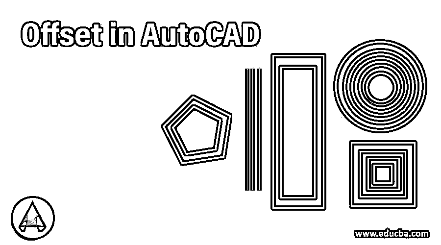

## AutoCAD 中的偏移介绍

AutoCAD 是一种二维和三维计算机辅助设计软件，被工程专业人员最广泛地用于他们的工程制图工作。在这个软件中，我们有不同类型的命令来帮助我们绘图。Offset 是 2d 命令之一，通过它，我们可以在平行方向的某个距离处复制任意 2d 图形，以节省我们反复绘制 2d 图形的时间。在本文中，我们将讨论该命令的所有主要参数，并了解在绘图工作中使用该命令制作任何 2d 形状的步骤。所以让我们开始讨论这个话题。

### 如何在 AutoCAD 中使用偏移命令？

我们可以在几个简单的步骤中使用 offset 命令，并通过该软件中的示例来理解它，但在开始之前，让我们看看该软件的工作屏幕，以便更好地理解本文中的主题。

<small>3D 动画、建模、仿真、游戏开发&其他</small>

**步骤 1:** 在工作屏幕的顶部，有一个功能区，其中有一些选项卡，用于处理该软件中的不同命令及其参数，如主页、视图、插图、注释等；在这个功能区下面，我们有一个工作窗口，我们可以在其中看到我们当前的工作，在这个工作窗口下面，我们有一些导航命令，用于处理我们的绘图工作。

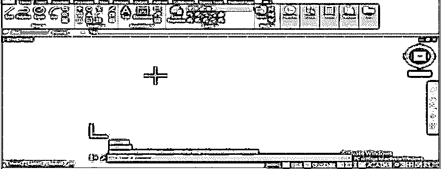

**第二步:**你可以在该软件的 Home 页签的修改菜单中找到该软件中的偏移命令，有这类图标。所以点击这个图标激活这个命令。

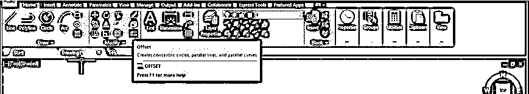

**步骤 3:** 或者您可以从键盘上键入 O 按钮，然后按下键盘上的 enter 按钮激活该命令。

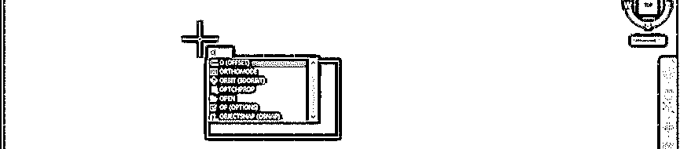

**第四步:**现在，让我们画一个矩形，里面有一个学习偏置命令的矩形命令。您可以对任何类型的二维形状使用“偏移”命令。现在，通过我们上面讨论的两个选项中的任何一个来接受偏置命令。现在，这个命令将要求你给出偏移距离，这意味着给出距离的值，在这个距离上你想要制作这个矩形的新副本。我将给出 2 作为我的偏移距离，然后按键盘的 enter 键。

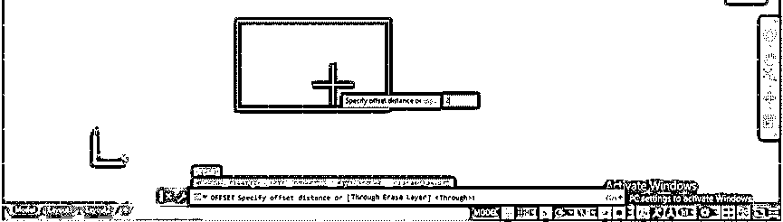

**步骤 5:** 现在，它会要求你选择你想要使用该偏置命令的对象，并给定偏置距离。我将选择这个矩形作为我的偏移对象，然后按键盘上的回车键。

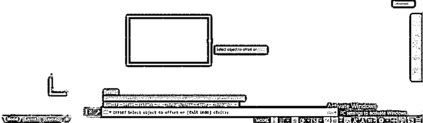

**第六步:**现在，你可以通过向你想要的方向拖动鼠标光标来偏移这个形状。例如，如果您想要在内部方向偏移此形状，请将鼠标光标拖动到此矩形内并单击。您的形状将按照您给定的偏移距离在该形状内部偏移。

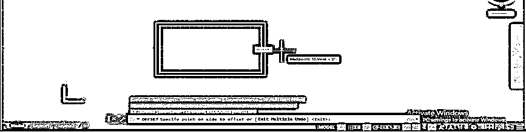

**第七步:**或者如果你想在这个矩形的外部方向偏移，那么对于外部方向，拖动你的鼠标光标到这个矩形之外并点击。您的形状将按照您给定的偏移距离偏移到该形状的外部。

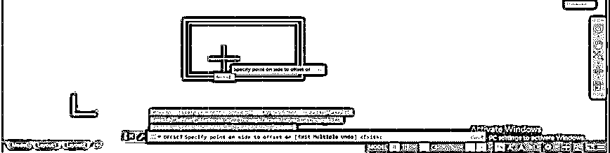

**第八步:**现在可以再次抵消了；只需用同样的命令选择对象，按下键盘的回车键。

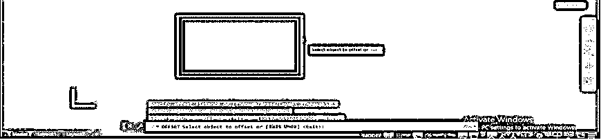

**第 9 步:**然后，在这个矩形的你想要的边上点击，进行另一次偏移。您可以使用一个命令进行多次偏移。我将再次单击这个矩形的外部。

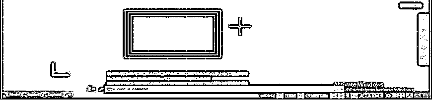

**第十步:**现在，让我们逐一讨论一下这个命令的不同选项。您可以在该命令的参数部分看到使用该偏移命令的一些选项。在这里点击这个命令的'通过'选项，或者你可以从键盘上按下 T 键键盘上的回车键来获得这个选项的偏置命令。

**步骤 11:** 现在，它会要求你选择对象，然后按回车键。

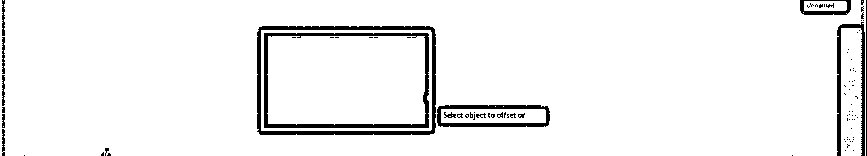

**第十二步:**现在，它不会要求你给出偏移距离。这一次，您可以在任意距离偏移这个矩形的副本。

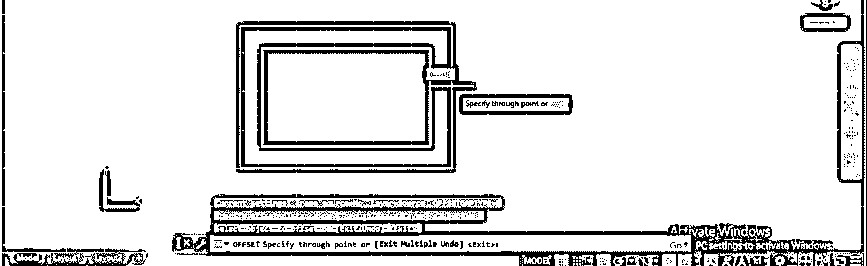

**步骤 13:** 现在再次选择一个对象，按下 enters 键，用同样的方法再复制一份。

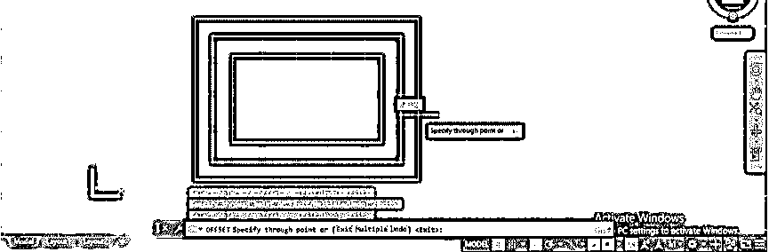

**第 14 步:**下一个选项是“擦除”，所以点击该命令的擦除选项，或者你可以按键盘上的 E 键，然后按键盘上的回车键进入该偏移命令选项。

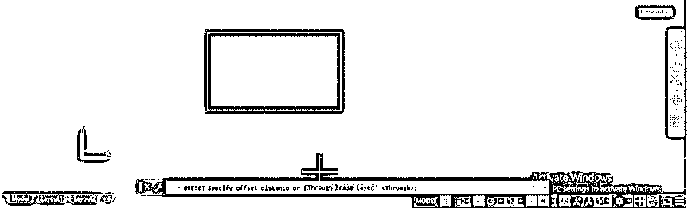

**第十五步:**现在，它会问你是否要在偏移后擦除原来的形状。我会选择是。

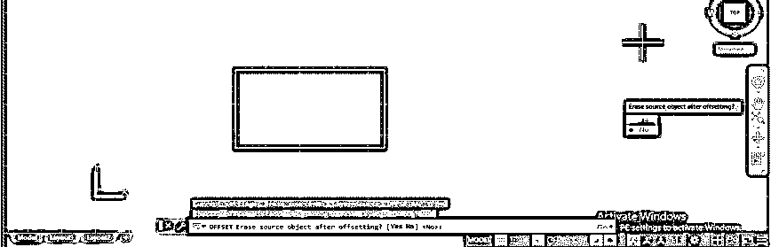

**第十六步:**现在，它会要求你给出偏移距离。我将输入 2 作为偏移距离，然后按键盘的 enter 键。

**步骤 17:** 现在选择你想要偏移的对象，按下键盘的回车键。我将用鼠标点击来选择这个矩形。

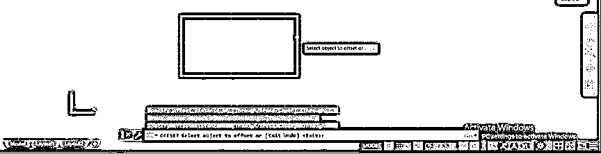

**第 18 步:**现在将鼠标光标向你想要偏移该对象的方向拖动。我将把鼠标光标拖到这个矩形之外，然后点击一下；然后，它将按照给定的偏移距离偏移对象，并从图形中删除原始对象。

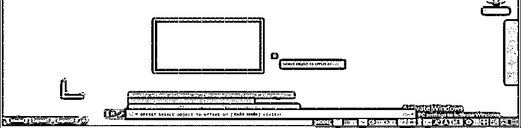

**步骤 19:** 现在这个命令的下一个选项是多个选项。因此，再次使用该软件的偏置命令，输入偏置距离值，然后按键盘的 enter 键。现在选择要偏移的对象。现在你会在这个命令的参数框中看到一些选项；从这里通过点击选择多个选项。你可以按键盘上的 M 键，然后按键盘上的 enter 键。

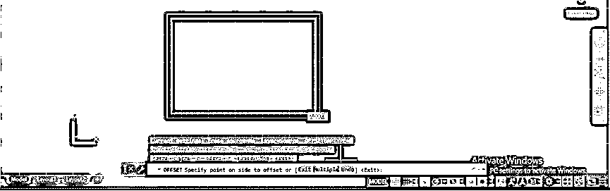

**第 20 步:**现在，您可以将该矩形复制多份，而无需反复选择该矩形，然后按键盘上的 Esc 键退出该偏移命令。

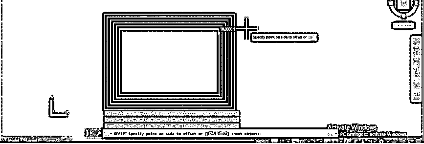

### 结论

现在，看完这篇文章后，你可以很容易地理解什么是 AutoCAD 中的偏移，以及如何处理它的参数，以便在 auto cad 的绘图工作中获得最佳结果。经过练习，你可以很好地掌握这个软件的不同类型的 2d 命令。

### 推荐文章

这是 AutoCAD 中的偏移指南。这里我们讨论一个介绍，如何在 AutoCAD 中一步一步地使用偏移。您也可以浏览我们的其他相关文章，了解更多信息——

1.  [AutoCAD 中的线条](https://www.educba.com/lines-in-autocad/)
2.  [AutoCAD 中的极坐标阵列](https://www.educba.com/polar-array-in-autocad/)
3.  [在 AutoCAD 中扫掠](https://www.educba.com/sweep-in-autocad/)
4.  [AutoCAD 中的倒角](https://www.educba.com/chamfer-in-autocad/)

