# AutoCAD 中的放样

> 原文：<https://www.educba.com/loft-in-autocad/>

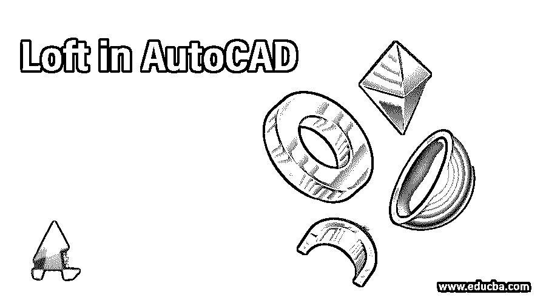

## AutoCAD 中放样的介绍

Auto Cad 是 Autodesk 开发的二维和三维绘图计算机辅助软件。在这个软件中，我们有一种不同类型的命令来简化我们的绘图工作。放样是其中的一个命令，通过它我们可以用这个命令引导二维图形来制作一个弯曲的三维图形；通过这篇文章你会明白的。在本文中，我们将理解这个命令，并查看它的不同参数，通过这些参数，我们可以在任何 2d 形状上使用它来制作 3d 曲线形状。让我们开始讨论吧。

### 如何在 AutoCAD 中使用 Loft？

我们可以通过几个简单的步骤以一种非常令人兴奋的方式理解 AutoCAD 中的 Loft，但在开始学习该软件之前。让我们看看这个软件的工作屏幕，这样在我们学习本文的过程中就不会有问题。

<small>3D 动画、建模、仿真、游戏开发&其他</small>

**步骤 1:** 在工作屏幕的顶部有一个不同选项卡的功能区，这些选项卡有不同类型的命令，使我们的工作变得简单，例如主页、插入、注释和许多其他命令，在这个功能区下面，我们有一个工作窗口区域，您可以在其中看到您当前的绘图或工作，这个工作窗口还有一个导航立方体，通过它您可以从不同的视图选项，例如俯视图、前视图和侧视图，看到您的绘图，在这个窗口下面，我们有一些导航工具，用于在我们的工作过程中处理不同类型的工具。

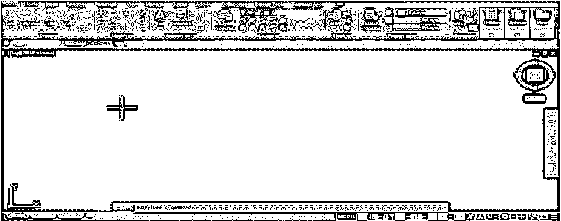

**步骤 2:** 现在转到该软件的右下角，从工作区设置列表中选择“3D 基础”选项。

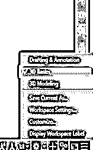

**步骤 3:** 现在转到工作窗口的左上角，然后点击括号中的顶部选项，并从列表中选择东南视图选项。

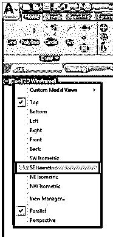

**步骤 4:** 现在，从主页选项卡的绘制菜单中点击矩形命令，然后像这样绘制两个不同尺寸的矩形。

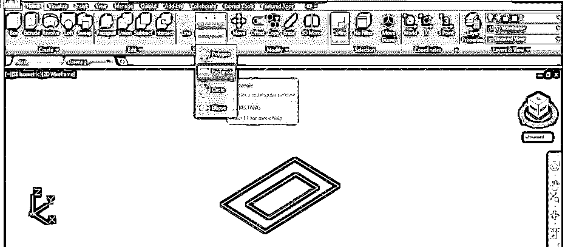

**第五步:**或者你可以在键盘上输入 REC，然后按下键盘上的‘Enter’键，得到矩形命令，然后画出这两个矩形。

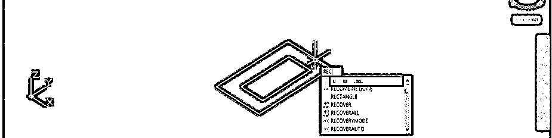

**第六步:**现在，让我们来一个圆形命令。对于圆，该命令转到“主页”选项卡的“绘图”菜单，用鼠标按钮单击“圆”命令的图标，然后像这样在这两个矩形的中心绘制一个任意半径的圆。

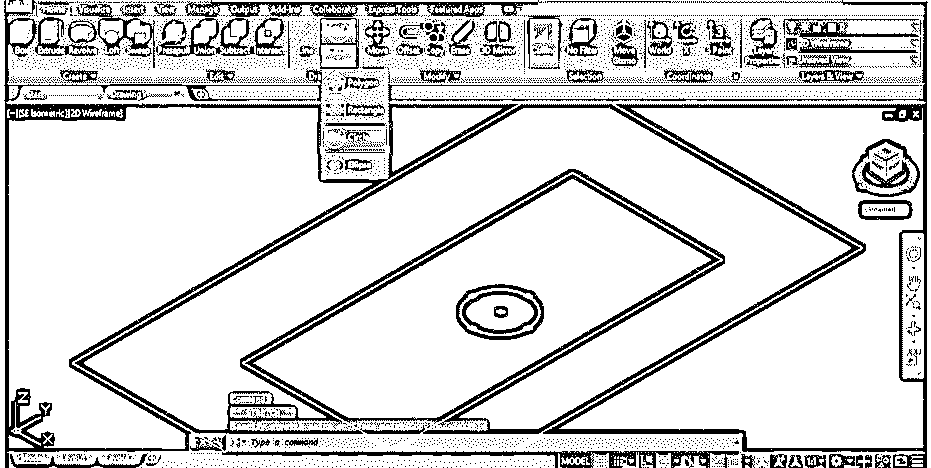

**第七步:**或者你可以按键盘上的 C 键，然后按回车键进行画圆命令，然后画这个圆。

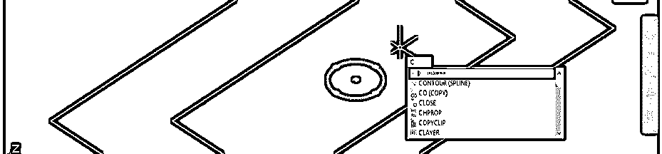

**第 8 步:**现在，从“主页”选项卡的“修改”菜单中点击“移动”命令。

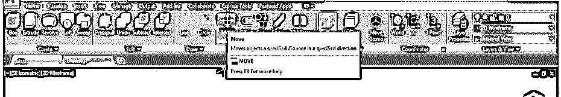

**步骤 9:** 现在，该命令将要求您选择您想要移动的对象，通过点击它并按下键盘上的回车键来选择该圆。

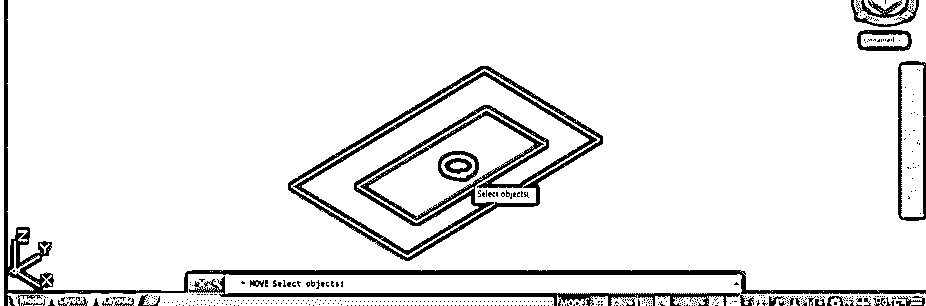

**步骤 10:** 现在指定你想要移动这个圆的点。我将单击这个圆的中心点，并在某个高度向上拖动它，以像这样移动它。

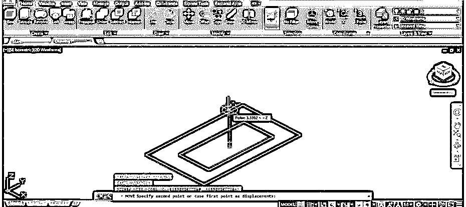

**步骤 11:** 再次按下键盘的“enter”按钮，重复移动命令，然后点击选择内部矩形，然后按下键盘的 Enter 按钮。现在在上面的高度向上拖动它，像这样转圈。

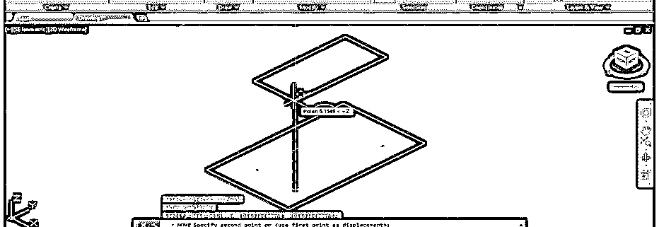

**步骤 12:** 现在进入主页选项卡的“创建”菜单，点击放样命令的图标。

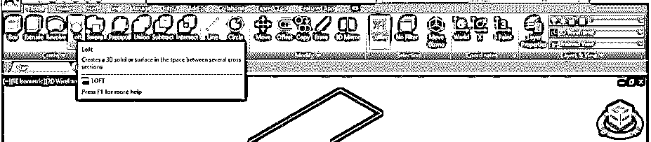

**步骤 13:** 现在依次一个一个的选择这些形状。

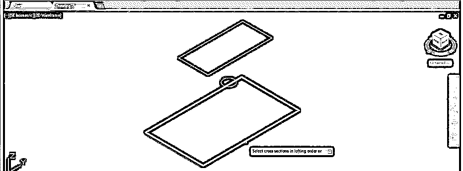

**第十四步:**我先选择底部的矩形，然后画圆，再选择上部的矩形。

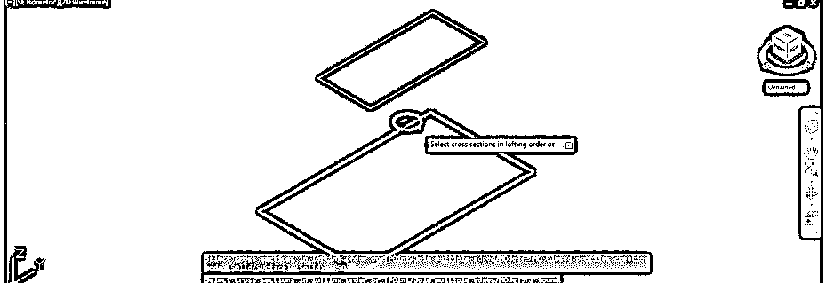

**第 15 步:**一旦你按顺序选择了它们，放样命令就会做出一个这样的 3d 形状。这是这个物体的线框视图。

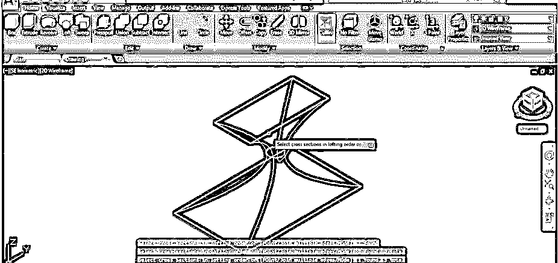

第十六步:现在按下键盘上的“回车”键。一旦你按下“输入”按钮，一个放样命令列表将会打开。从列表中选择“仅交叉选项”。这意味着您想要在该对象的横截面中应用放样命令。

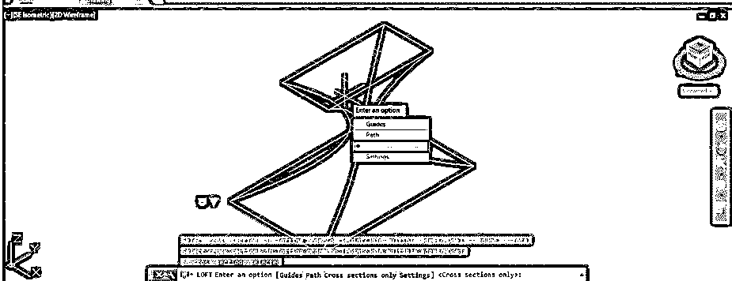

**步骤 17:** 现在点击 2d 线框选项，并从列表中选择阴影选项，以查看该对象的阴影视图，如下所示。

**第 18 步:**现在我已经画了这种类型的图，我们将对这张图应用放样命令。

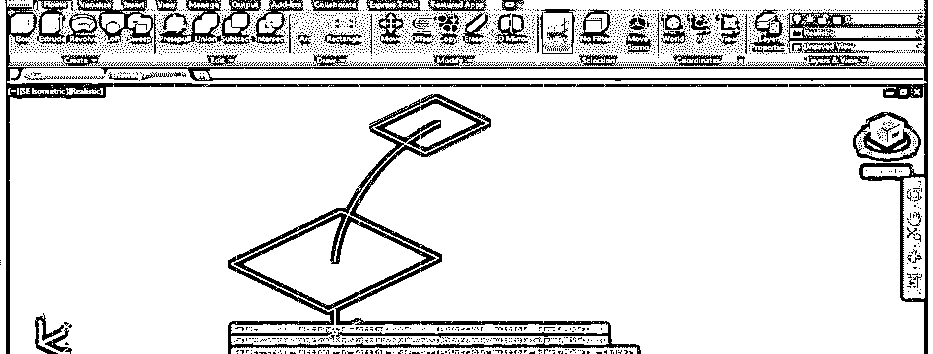

**步骤 19:** 使用放样命令，依次选择底部矩形和上部矩形。现在按键盘上的“回车”键。现在点击打开的放样命令列表的路径选项，然后按键盘的回车键。

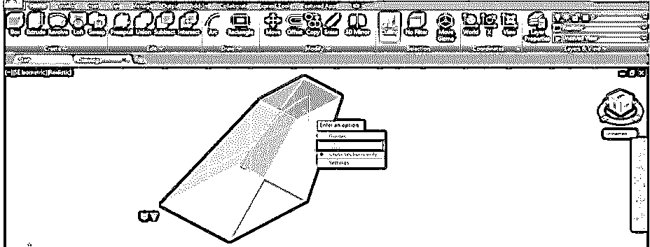

**步骤 20:** 一旦你按下键盘的‘Enter’键，它会要求你指定你想要应用放样命令的路径，所以我会点击这个弧，因为我想要在这个弧周围放样。

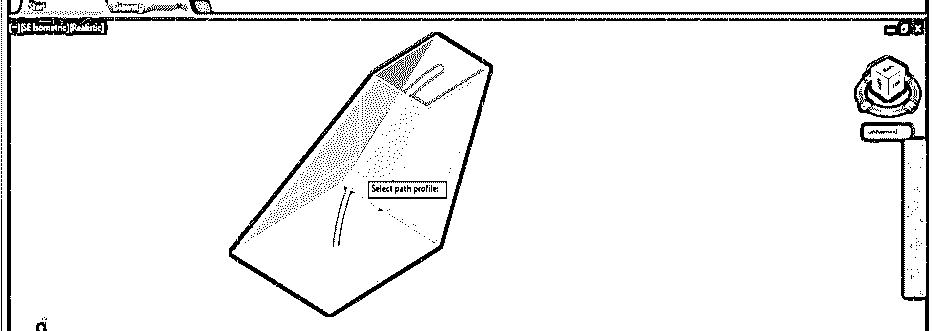

**步骤 21:** 一旦你点击这个，arc loft 就会做出这种类型的 3d 形状。

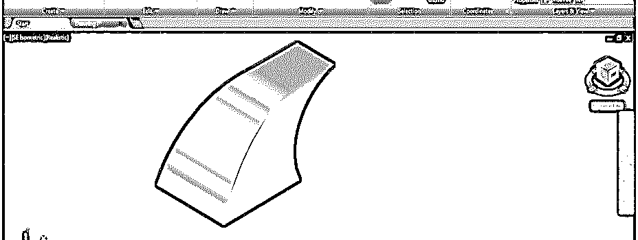

**步骤 22:** 可以看到这个物体的线框视图。

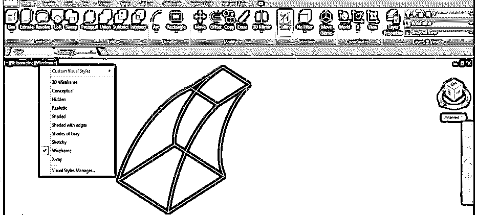

**步骤 23:** 再次使用放样命令，选择底部矩形，然后选择上部矩形，然后按键盘的回车键。现在点击打开列表中的指南选项。

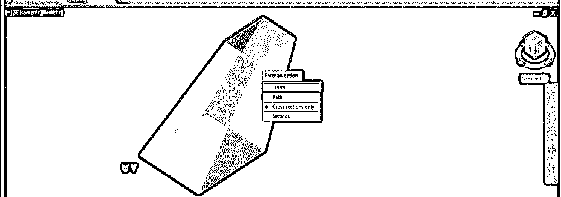

**步骤 24:** 现在，用鼠标光标逐个选择这些线，因为我想引导放样命令绕过这些线。

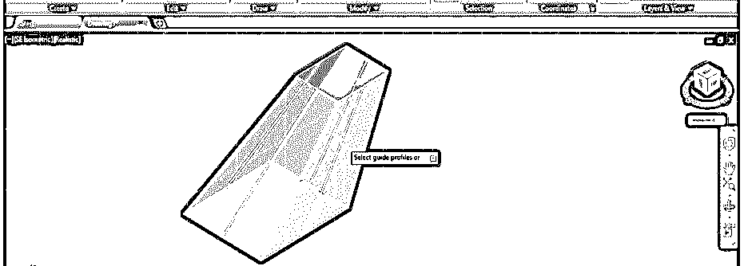

第 25 步:一旦你点击这些线条，放样命令会做出这样的形状。

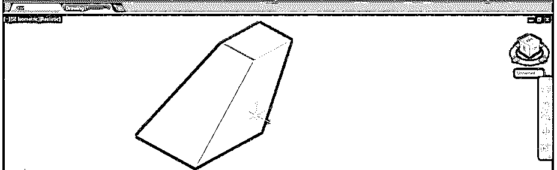

**步骤 26:** 现在，让我们看看这个放样命令的设置选项。使用放样命令，像前面一样选择形状，然后按键盘上的“回车”键，然后点击打开列表中的设置选项。

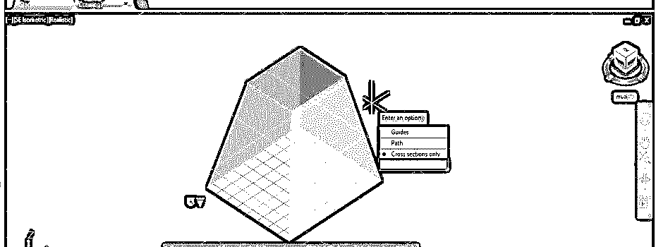

**步骤 27:** 现在，一个放样设置框将被打开。在“垂直于”选项中，我们有一些子选项；如果我选择“开始横截面”选项，那么我们的放样形状将如下所示。

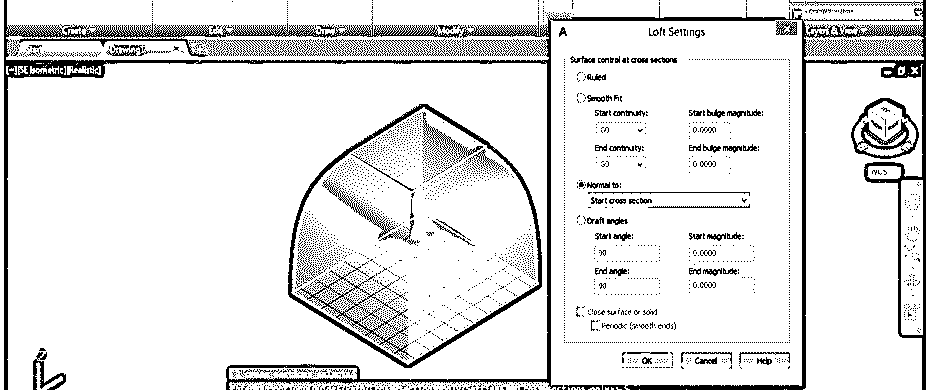

**第 28 步:**逐个选择这些选项就可以看到变化。

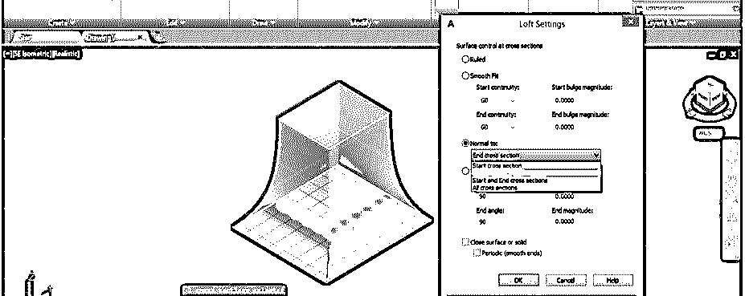

**第 29 步:**你可以从拔模角度选项改变拔模角度，并可以看到改变。

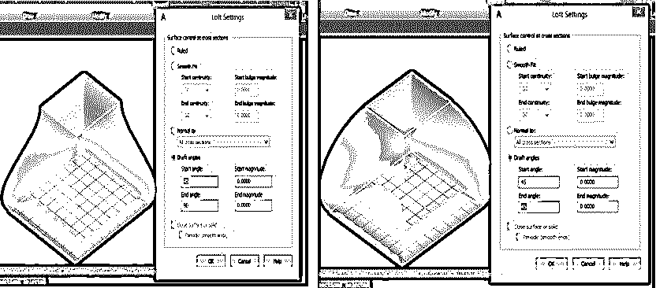

**步骤 30:** 您也可以改变拔模斜度的大小值，以查看该形状的变化。

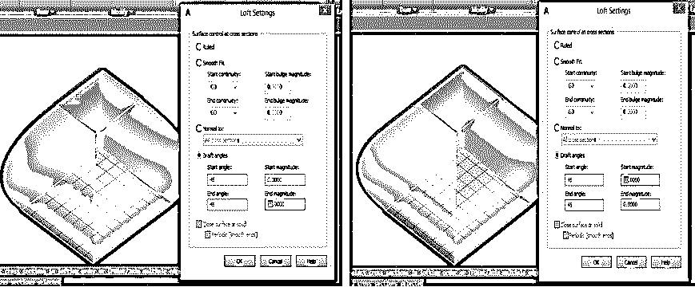

通过这种方式，您可以使用该软件中的 Loft 命令在 Auto Cad 绘图工作中获得您想要的形状。

### 结论

现在，通读这篇文章后，你可以理解“什么是 Auto Cad 软件中的放样命令”和“如何处理该放样命令的参数”以便在 Auto Cad 绘图中获得最佳结果。在实践之后，您可以在工作中很好地使用这个命令。

### 推荐文章

这是在 AutoCAD 中放样的指南。在这里，我们讨论了介绍以及如何创建一个简单的，一步一步的方式在 AutoCAD 放样。您也可以浏览我们的其他相关文章，了解更多信息——

1.  [AutoCAD 中的模板](https://www.educba.com/template-in-autocad/)
2.  [AutoCAD 插件](https://www.educba.com/autocad-plugins/)
3.  [AutoCAD press pull 指南](https://www.educba.com/autocad-presspull/)
4.  [AutoCAD 中的倒角|如何使用？](https://www.educba.com/chamfer-in-autocad/)
5.  [AutoCAD 3D 旋转指南](https://www.educba.com/autocad-3d-rotate/)
6.  【autocad 家具指南
7.  [SketchUp AutoCAD 指南](https://www.educba.com/sketchup-autocad/)

