# AutoCAD Stretch

> 原文：<https://www.educba.com/autocad-stretch/>

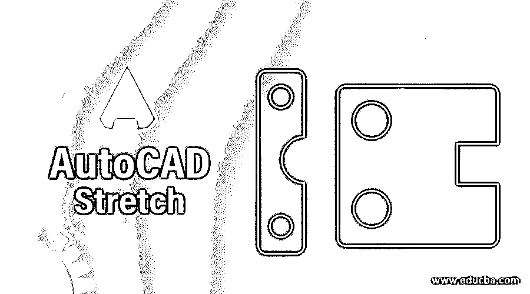

## AutoCAD 拉伸简介

AutoCAD 是图形专业人员使用的计算机辅助设计软件，用于制作不同类型的建筑、机械和其他工程的 2d 绘图和 3d 模型。Auto CAD 有一系列的命令来简化它的工作。拉伸是其中的一个命令。我们可以使用拉伸命令来拉伸 Auto CAD 软件中任何二维图形的任何特定部分。在本文中，我们将通过该软件的 2d 形状来理解 Stretch 的命令，并且我们还将理解使用该命令的技术，以便在我们使用该软件的过程中不会出现问题。让我们开始讨论吧。

### AutoCAD 中如何使用拉伸？

我们可以使用这个软件中的拉伸命令，使我们的工作变得容易，也节省了我们的工作时间。我们将通过几个步骤的学习来理解它，但在此之前，让我们看看这个软件的用户界面，以便更好地理解贯穿本文的这个主题。

<small>3D 动画、建模、仿真、游戏开发&其他</small>

**步骤 1:** 在该软件的顶部有一些选项卡，这些选项卡具有不同类型的命令和处理参数，用于在 AutoCAD 软件中管理和绘制图形，在这些选项卡下面，有工作窗口，我们可以在其中看到我们绘制的对象，在该窗口的右侧，我们有一个方向指示器和视口立方体，通过它，您可以管理您的图形视图。这些视图可以是顶视图、前视图、左视图、 在这个软件底部的窗口下面，我们有一些导航标签，用于操作这个软件的工作窗口。

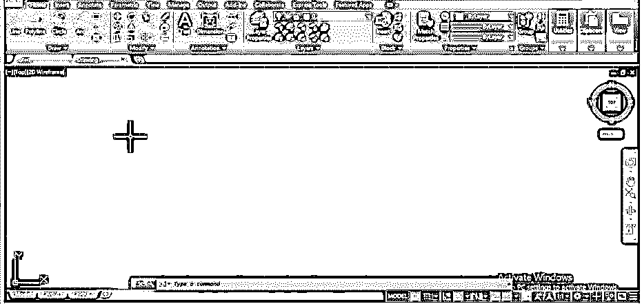

**第二步:**让我们有一个矩形命令用于我们的学习。对于矩形命令，转到“主页”选项卡“绘图”菜单的命令，然后用鼠标按钮单击矩形命令图标。

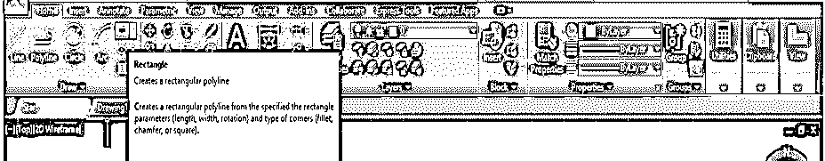

**步骤 3:** 现在，通过指定第一个点并使用鼠标光标将其拖至所需长度来绘制一个矩形，或者您可以借助键盘按钮在值输入框中输入您所需的值，然后按下键盘的 enter 按钮来应用该矩形形状的参数。

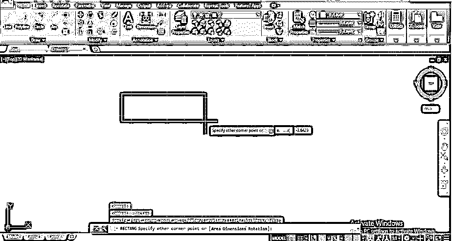

**步骤 4:** 现在，让我们转到这个软件的拉伸命令。您可以从「首页」( Home)标签的「修改」( Modify)选单中，按一下「拉伸」( stretch)指令图示来取得它。

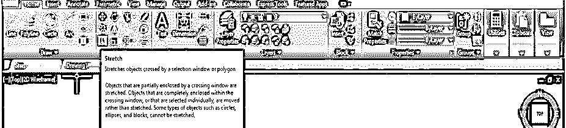

**步骤 5:** 或者您可以简单地按下键盘上的“S”按钮，然后按回车键激活拉伸命令。

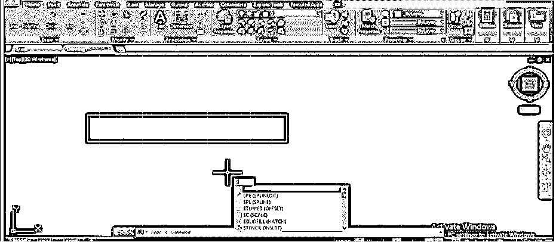

**步骤 6:** 或者你可以从键盘上键入‘STR’并从打开的命令下拉列表中选择拉伸命令。

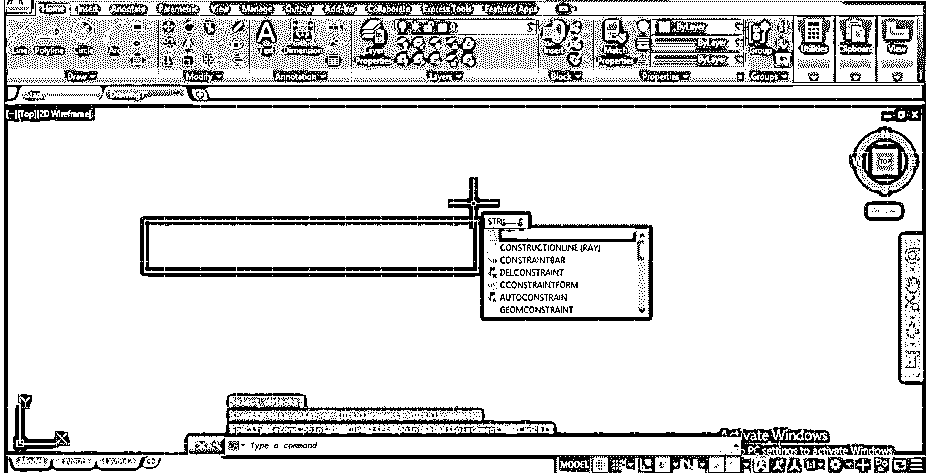

**步骤 7:** 现在，该命令将要求您选择一个对象，因此通过用方形鼠标光标点击该对象来选择该对象。

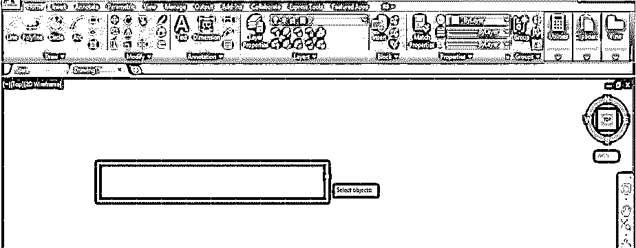

**第八步:**现在，它会要求你指定要拉伸的点。选择那个点；根据你的选择，这个点可能在物体内部，也可能在物体外部。

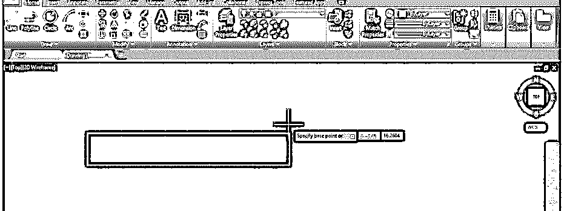

**第九步:**现在，当你拉伸你的物体时，它不会拉伸；它只会像这样移动，因为使用“拉伸”命令选择对象与其他命令有所不同。因此，您有必要了解选择对象的正确方法，以便对任何对象使用拉伸命令。所以让我们来讨论一下这个技巧。

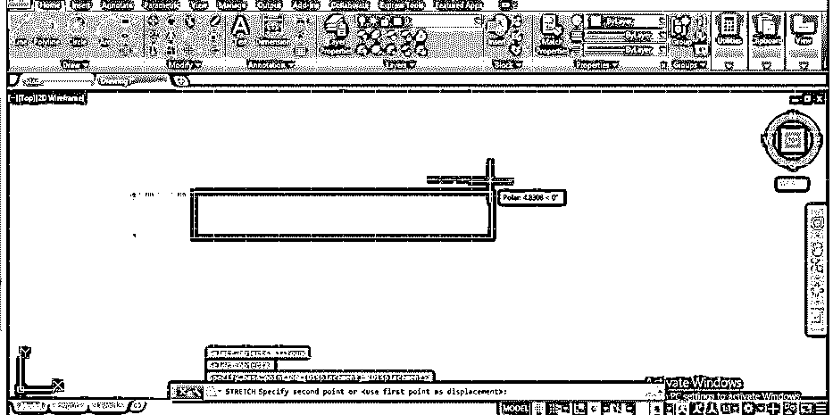

**步骤 10:** 通过按下键盘上的“S”按钮执行拉伸命令，然后按下键盘上的“Enter”按钮。现在使用一个正方形选择框来选择你想要用拉伸命令拉伸的对象部分。确保像这样从下到上拖动选择方形框。现在，选择一个对象后，按下键盘上的“输入”按钮。

步骤 11: 现在指定一个点，你要围绕这个点拉伸你的物体的截面。您可以选择对象内部或外部的任何点，或者通过键盘输入为该点指定任何值。

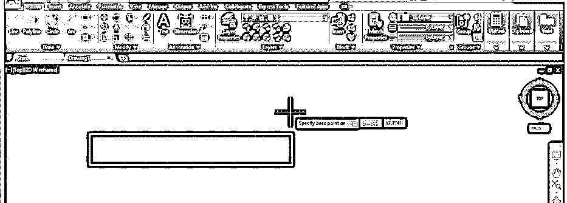

**第 12 步:**现在向你想要拉伸的方向拖动这些部分。您可以像这样向选定对象的外部方向拉伸它。

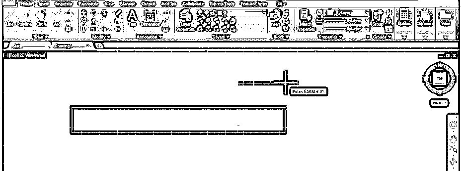

**第 13 步:**或者像这样通过向那个方向拖动鼠标光标来选择对象的向内方向。

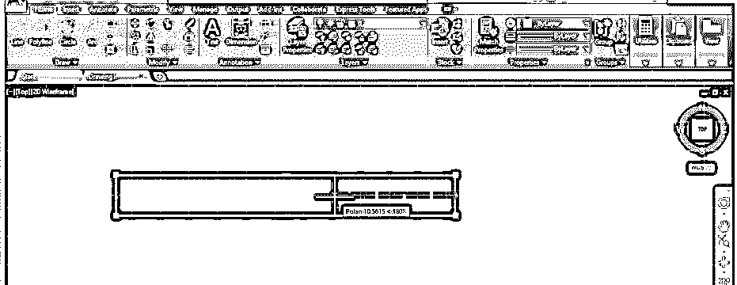

第 14 步:你也可以像这样以任何特定的角度拉伸这个特定的部分，或者你可以通过键盘输入你想要倾斜的角度值。

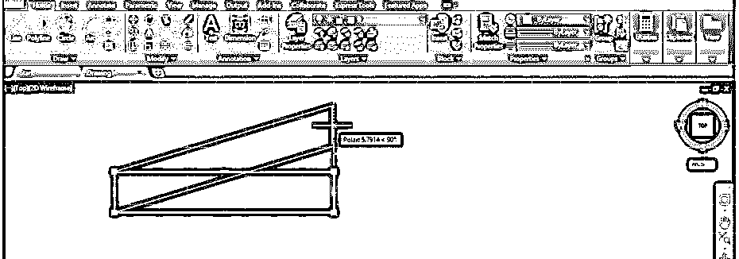

**步骤 15:** 现在，让我们看看“我们能在圆上使用拉伸命令吗？”为此，让我们从该软件主页选项卡的绘图菜单的命令列表中选择一个圆形命令，方法是单击圆形命令图标。

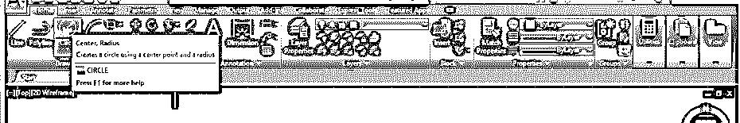

**步骤 16:** 现在，像这样画一个任意半径的圆。

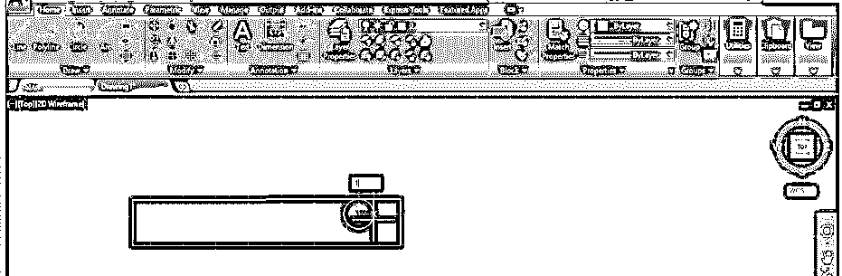

**步骤 17:** 现在，再次从修改主页选项卡的菜单中选择拉伸命令，或按下“S”按钮，然后从键盘上输入按钮。

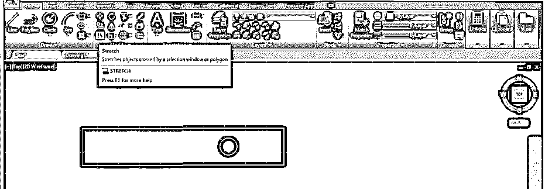

**步骤 18:** 现在用这个拉伸命令，用一个方形选择框选择这个圆，并按下键盘上的回车键。

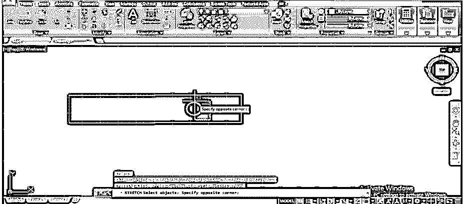

**步骤 19:** 现在指定你想要拉伸这个圆的点。您可以通过键盘输入这个圆内外的任何点或该点的输入值。

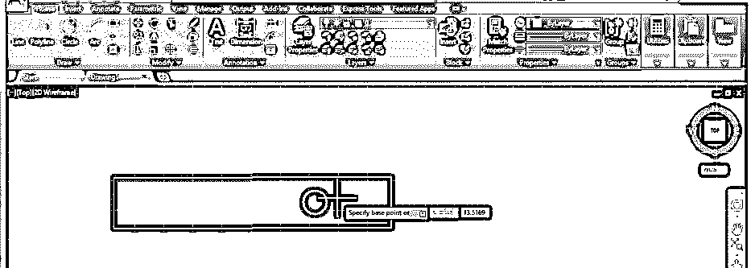

**步骤 20:** 现在，当你移动鼠标光标拉伸这个圆时，它只会这样移动。所以这个命令对圆形不起作用。

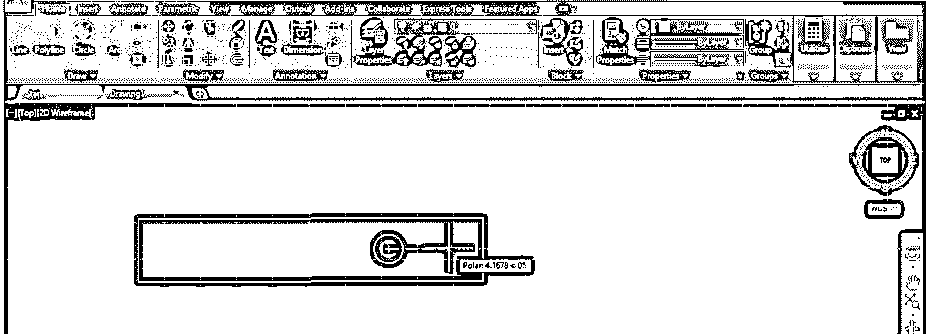

**步骤 21:** 你只能拉伸任何 2d 形状的同一截面。对于仅拉伸同一部分，再次通过按下键盘上的“S”和“Enter”按钮执行拉伸命令，然后通过像这样的方形选择框选择要拉伸的部分，并按下键盘上的“Enter”按钮。

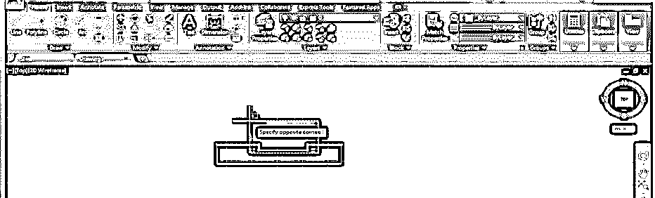

**步骤 22:** 现在把鼠标光标往你想拉伸的方向拖，就像这样。

### 结论–AutoCAD 拉伸

这样，您就可以在 AutoCAD 软件中使用拉伸命令，并通过使用它来制作专业的绘图。使用 Auto CAD 的这个令人兴奋的命令，您还可以节省时间。现在，看完本文后，您可以理解“什么是 AutoCAD 软件环境中的拉伸命令？”以及“如何使用它来编辑任何 2d 形状设计？”一旦开始在 AutoCAD 软件的绘图项目中使用该命令进行练习，您就可以很好地掌握 AutoCAD 软件的拉伸功能。

### 推荐文章

这是一个 AutoCAD 拉伸的指南。在这里，我们讨论一个介绍，如何使用 AutoCAD 拉伸一步一步的方式。您也可以浏览我们的其他相关文章，了解更多信息——

1.  [AutoCAD 中的放样](https://www.educba.com/loft-in-autocad/)
2.  [AutoCAD 中的样条](https://www.educba.com/spline-in-autocad/)
3.  [AutoCAD 3D Rotate](https://www.educba.com/autocad-3d-rotate/)
4.  [Hatch AutoCAD](https://www.educba.com/hatch-autocad/)

