# Polyline in AutoCAD

> 原文：<https://www.educba.com/polyline-in-autocad/>

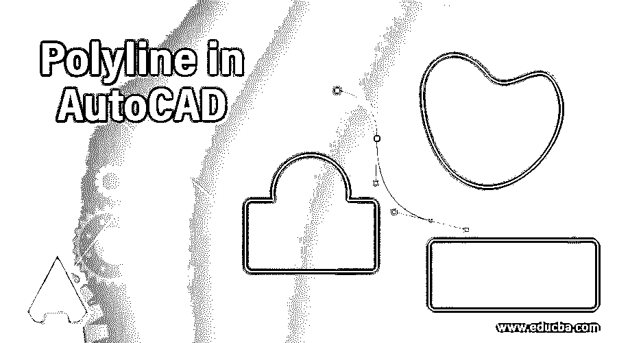

## AutoCAD 中的多段线介绍

AutoCAD 是计算机辅助设计软件，它有许多不同类型的二维和三维命令，使其工作变得容易。我们在这个软件中有许多 2d 命令来在我们的绘图工作中塑造这个软件。多段线是 2d 命令之一，它通过使用许多连接的线段来帮助制作 2d 形状。在本文中，我们将讨论 auto cad 的折线命令的不同参数，并了解如何使用它来创建形状。因此，让我们开始讨论这个话题，并开始了解它。

### 如何在 AutoCAD 中使用折线命令？

我们可以把 AutoCAD 中的多段线理解为一条由若干条相互连接的线连成一个形状，没有任何间断。我们将在本文中用一个例子来讨论它，但是在开始我们的学习之前，让我们看一下这个软件的工作屏幕。

<small>3D 动画、建模、仿真、游戏开发&其他</small>

**步骤 1:** 在工作屏幕的顶部，有一个菜单栏的功能区，上面有不同的选项卡，如主页选项卡、插入选项卡、查看选项卡等；在此栏下方，我们有一个工作窗口，显示我们在此软件中的工作，导航栏、UCS 图标和 view cube 帮助我们进行绘图工作，在此窗口下方，我们有一些导航命令，用于在此软件中进行绘图时处理我们的工作。

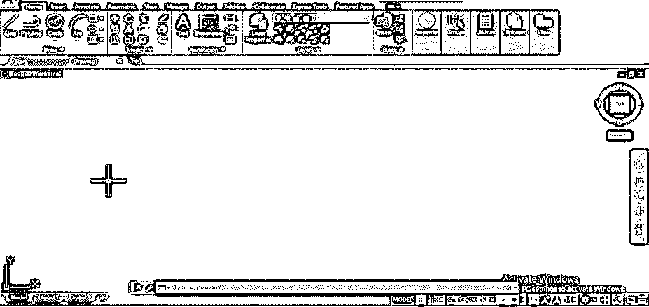

**第二步:**你可以在这个软件的 Home 标签的 Draw 菜单中找到这个图标的 Polyline 命令。

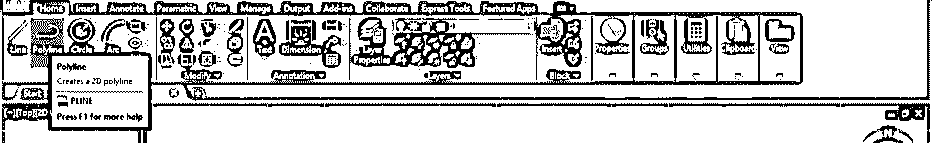

**步骤 3:** 或者您可以按下键盘上的 PL 键，然后按下键盘上的 enter 键激活该命令。

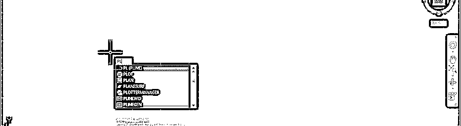

**步骤 4:** 现在，从你想要开始这条折线的地方取第一个点，然后用这条折线命令的延续线做出你想要的形状。

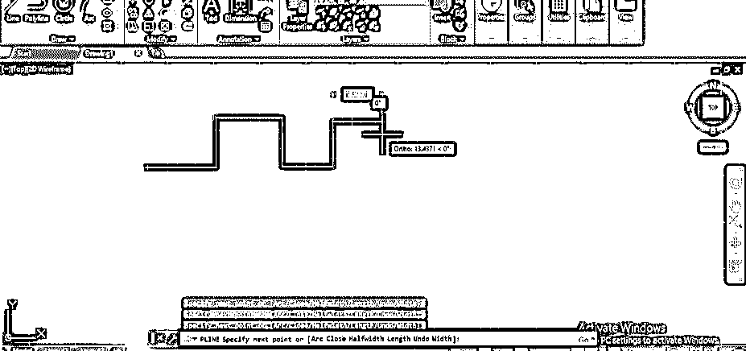

**第五步:**让我们拿着 line 命令，更清晰的理解折线。从“主页”选项卡的“绘图”菜单中选择“直线”命令。

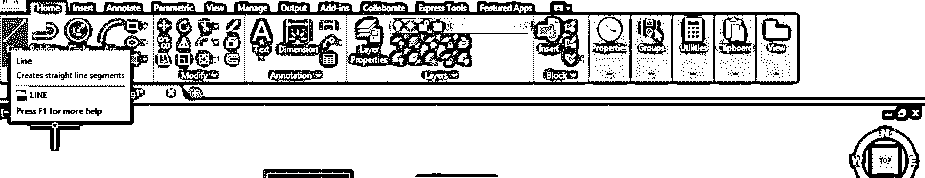

**步骤 6:** 用折线命令绘制相同的线条图案。现在，当您用鼠标光标选择它们时，您可以看到 polyline 将在单个选择中选择，并向您显示不同的连接线段，但如果我们看到“线型”命令，它将选择线型的一个线段。因此，polyline 给出了一个结构形状中相连线段的数量。

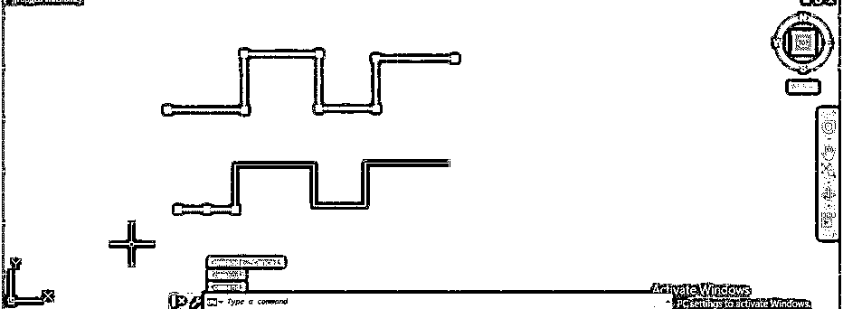

**第七步:**现在再次使用折线命令来分析它的不同参数。当你选择它的时候，你可以看到在这个软件的工作窗口的底部，在这个命令的参数框里有一个不同的折线选项。

**第八步:**现在画一条折线，然后按键盘的 A 键为该命令的圆弧选项，再按键盘的回车键。

**步骤 9:** 然后从该命令的选项列表中选择第二个点选项，用于指定弧的点，然后按键盘的 enter 键。

**步骤 10:** 现在点击一个点作为圆弧的中心点，然后再次点击另一个点作为圆弧的端点来制作圆弧。

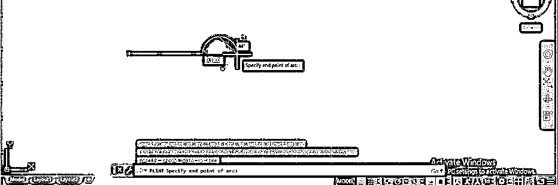

**步骤 11:** 现在在一个新的点上反复点击，作为下一个圆弧的端点，你可以这样用它对圆弧进行编号。

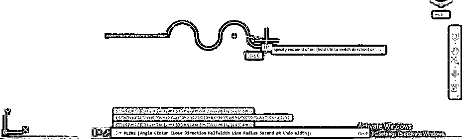

**步骤 12:** 要退出折线命令的圆弧选项，按键盘上的 L 键，然后按键盘上的 enter 键，回到折线命令的线型。

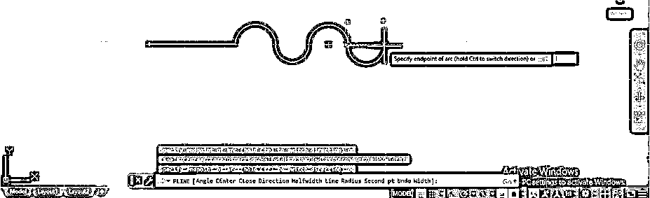

第 13 步:同样，你可以像这样用这个命令画线。

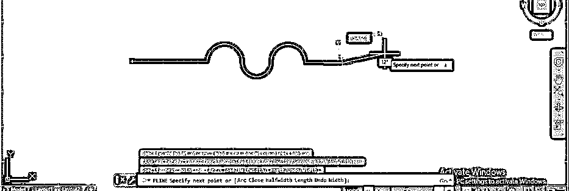

**步骤 14:** 现在，让我们从折线命令的选项中了解折线命令的半宽选项。对于半宽选项，按下键盘的 H 键，然后按下键盘的 enter 键。

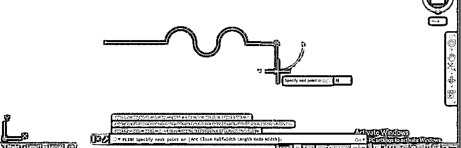

**步骤 15:** 现在，通过键盘输入给出半宽选项的起始值。我会给它 2，然后按键盘上的回车键。

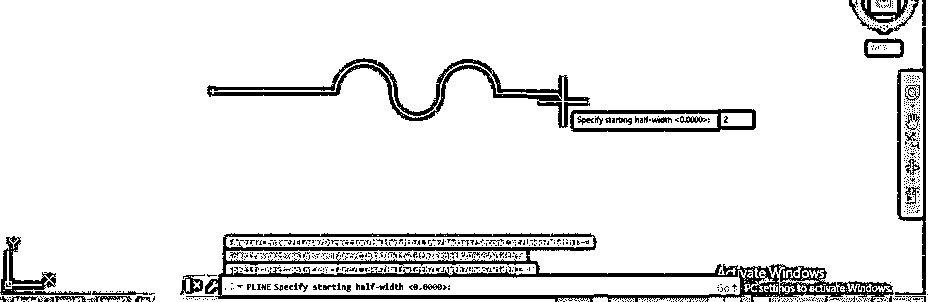

**步骤 16:** 再次从键盘输入中指定半宽选项的结束值。我会给它一个 0，然后按键盘上的回车键。

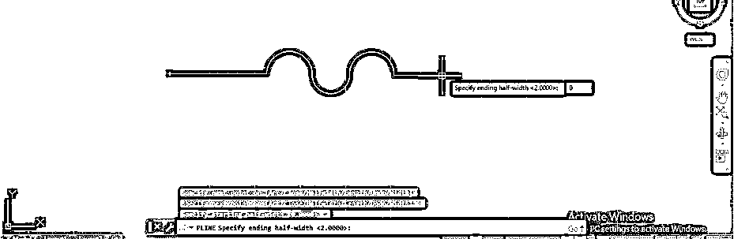

**第十七步:**现在拖动鼠标光标，就可以画出箭头状的结构，点击一下就可以给出这个箭头的长度，也可以用键盘输入法输入你想要的值。现在您可以再次绘制线条，因为我们已经将末端宽度的值设为 0。

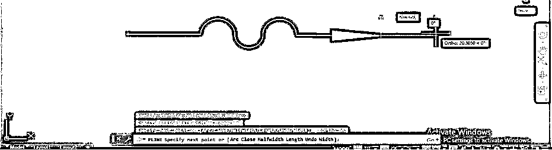

**步骤 18:** 你可以在任何结构的延续中增加折线的宽度。要增加折线的宽度，只需再次选择半宽选项并输入起始宽度的值，然后按键盘的 enter 按钮并输入结束宽度，然后按键盘的 enter 按钮以确保两个值应该相同。现在你可以像这样画一条宽度增加的线。你可以用这条线做任何结构。

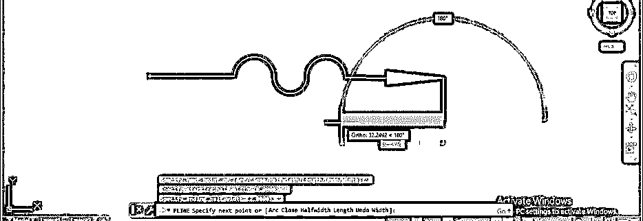

**步骤 19:** 你也可以用这条增加宽度的线做一个弧形。为此，通过按下键盘上的按钮并按下键盘的回车键，再次从折线命令选项中选择圆弧选项。然后像我们之前做的那样，选择 arc 选项的第二个 pt 选项。现在取弧的中点而不是端点来做弧。现在你可以像这样增加弧线的宽度。

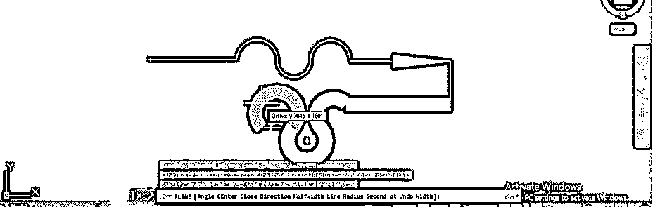

**步骤 20:** 现在，再次为了减小折线的宽度，再次选择折线命令的半宽选项，并遵循与前面相同的步骤；取起始宽度和结束宽度的值为 0 即可。现在你可以像这样再画一次线。如果要关闭该结构，请按键盘的 C 键，然后按键盘的 enter 键。

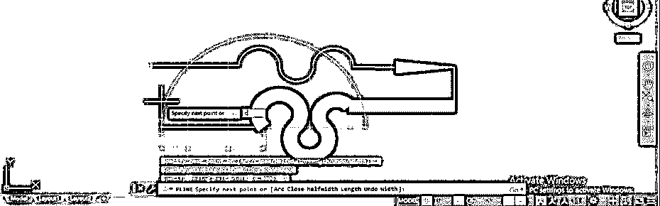

**第 21 步:**现在起点线的起点和终点线的终点会相互连接，你的结构会像这样闭合。

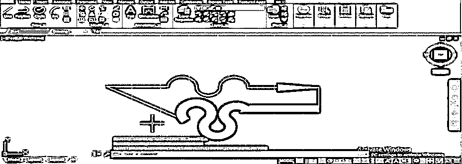

第 22 步:现在，当你选择这个形状时，它会向你显示连接成这个形状的不同线段。

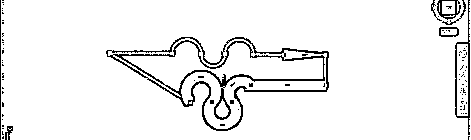

### 结论

现在，看完这篇文章后，你可以理解什么是 auto cad 中的折线，以及如何处理它的参数来制作一个形状。您可以通过在 auto cad 的 polyline 命令的帮助下对其进行练习来分析其参数，以便绘制出好的图形。

### 推荐文章

这是在 AutoCAD 中绘制折线的指南。这里我们讨论在 AutoCAD 中使用折线的介绍和步骤。您也可以浏览我们的其他相关文章，了解更多信息——

1.  [AutoCAD 中的工具栏|显示工具栏](https://www.educba.com/toolbars-in-autocad/)
2.  [在 AutoCAD 中挤出|创建挤出效果](https://www.educba.com/extrude-in-autocad/)
3.  [AutoCAD 中的放样|教程如何创建放样](https://www.educba.com/loft-in-autocad/)
4.  [AutoCAD 中的样条|完整教程](https://www.educba.com/spline-in-autocad/)

