# AutoCAD 中的极坐标阵列

> 原文：<https://www.educba.com/polar-array-in-autocad/>

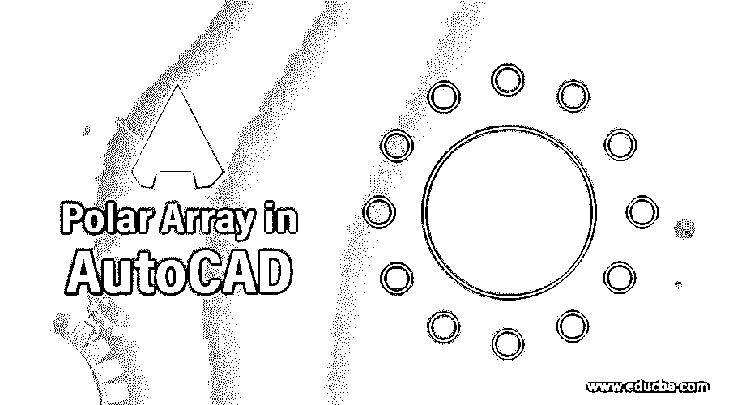

## AutoCAD 中的极坐标阵列介绍

Autocad 是一种用于二维和三维工程设计的计算机辅助设计软件。它是由汽车服务台开发的。借助一些 2d 和 3d 命令，我们可以在这个软件中完成不同类型的绘图工作。在本文中，我们将讨论极坐标阵列，这是一个 2d 命令，通过它我们可以围绕基点 360 度分布任何特定对象，并根据我们的要求管理它们的旋转和数量。因此，让我们讨论这个命令的不同类型的特性，并分析它的重要参数，以便更好地理解这个主题。

### 如何在 AutoCAD 中使用极坐标数组？

通过遵循其使用技巧，只需几个简单的步骤，您就可以在 auto cad 软件中使用环形阵列。我们将通过这个软件中的一个例子来理解这个命令，但是在开始我们的学习之前，让我们看一下这个软件的工作屏幕，以便更好地理解贯穿本文的这个主题。

<small>3D 动画、建模、仿真、游戏开发&其他</small>

**步骤 1:** 在工作屏幕的顶部，有一个功能区，其中有许多选项卡，如主页选项卡、插入选项卡、注释选项卡、查看选项卡，还有一些其他不同的选项卡，用于处理该软件的重要命令，在该功能区下面有一个工作窗口，我们可以在其中看到我们当前的绘图工作。 这个工作窗口也有一个导航立方体，帮助我们改变我们的绘图视图，如顶视图，前视图，左视图和其他一些等距视图，在这个工作窗口下面，我们有一些导航命令，使我们在这个软件中的工作变得容易。

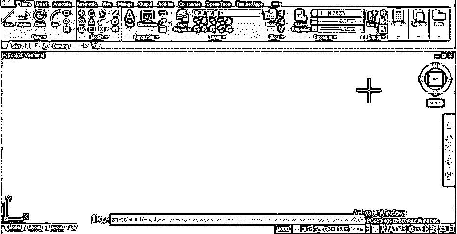

**第二步:**现在，让我们借助这样的圆形命令，一个接一个地绘制两个不同半径的圆，以了解极坐标命令。你可以根据自己的情况选择任何其他的学习形式。

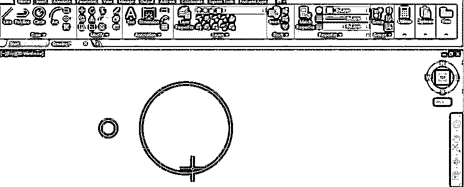

第三步:现在，你可以从这个软件的主页标签的修改菜单中选择极坐标命令。对于环形阵列，转到该软件主页选项卡修改菜单的矩形阵列命令图标，单击该图标的下拉箭头，然后通过单击从列表中选择环形阵列命令。

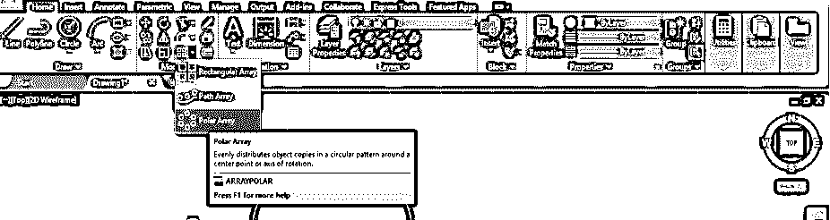

**步骤 4:** 或者您可以使用快捷键来执行该命令。对于快捷键，按键盘上的 AR 键，然后按键盘上的 enter 键，您的阵列命令将被激活。

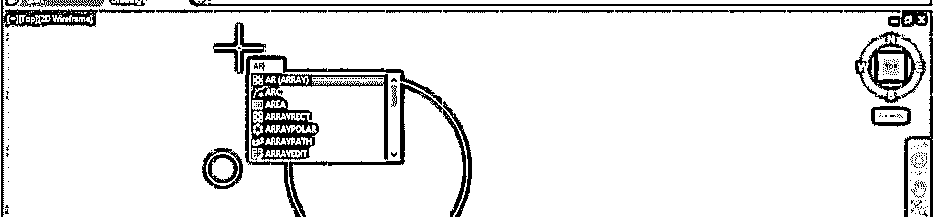

**步骤 5:** 现在它会要求你使用环形阵列命令选择你想要分布在这个圆周围的物体。所以我会用鼠标点击这个小圆来选择它。

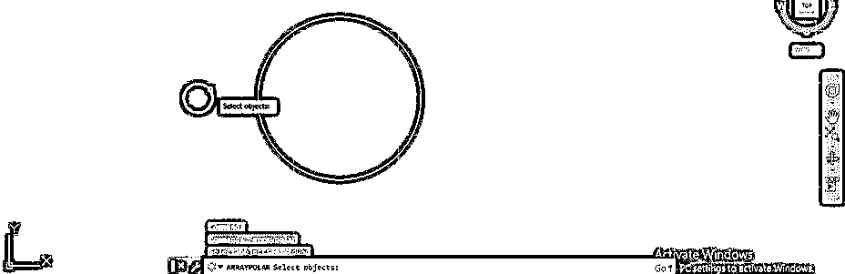

**步骤 6:** 现在，如果您使用此命令的快捷键，那么它会要求您从该选项中选择“环形阵列”命令，以便我单击“环形阵列”选项，或者如果您想跳过此步骤，那么您可以直接从“修改”菜单中选择“环形阵列”命令。

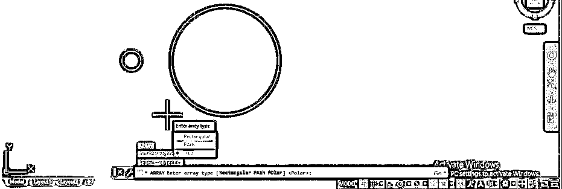

**第七步:**现在，它会要求您指定要围绕其分布这个小圆的点，因此我将选择这个大圆的中心点作为极坐标阵列的中心点。您可以根据您的绘图要求选择任何其他点。

**第八步:**一旦你点击这个圆的中心点，它会像这样将你选择的形状分布在这个圆的中心点周围，同时在这个软件的命令部分会打开一个数组创建框，你可以根据自己的需要对你应用的数组进行修改。

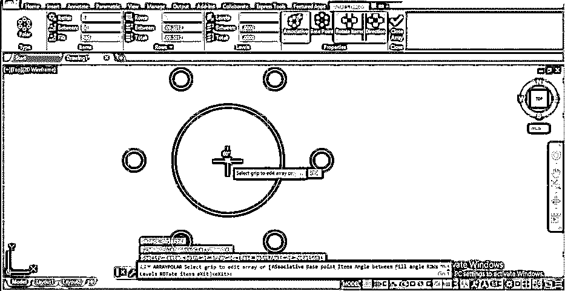

**第九步:**现在，您可以通过增加数组创建选项卡的此项选项的值来增加数组项数。我将给出 9 作为这个选项的值，我的数组中的项数将增加到 9 项。

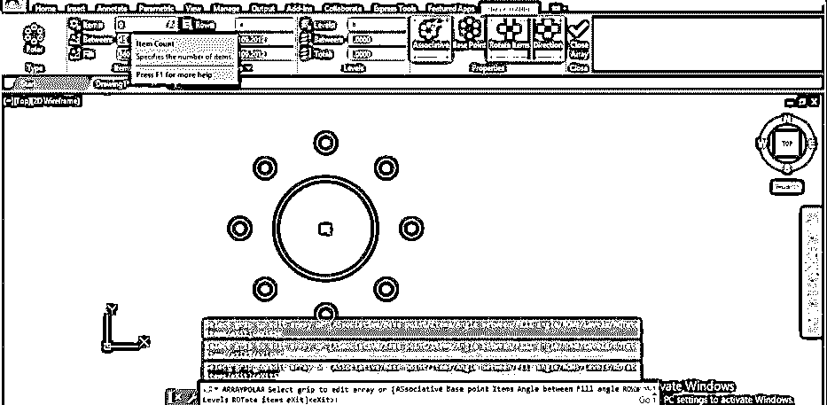

**第十步:**数组项之间的角度会根据数组的项数和数组旋转的填充角度进行调整。

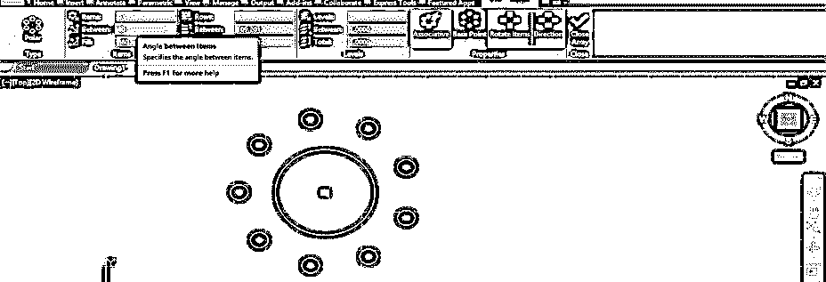

**步骤 11:** 你可以在 0 到 360 度之间改变填充角度的值。例如，如果我将 180 度作为填充角度，那么我的数组项将只围绕这个圆以 180 度排列。

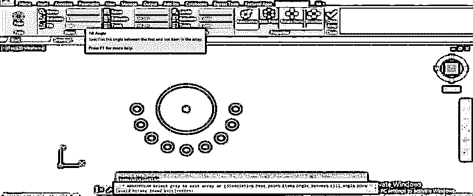

**步骤 12:** 您可以通过增加数组创建选项卡的此行选项的值来增加数组项的行数。我将输入 3 作为它的值，然后我的数组项将像这样分布在 3 行中。

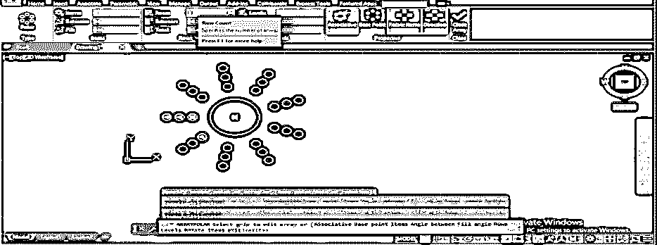

**第 13 步:**你也可以通过调整该选项的值来调整行间距，例如我将 15 作为行间距，那么我的项目将以 15 的行间距进行调整。

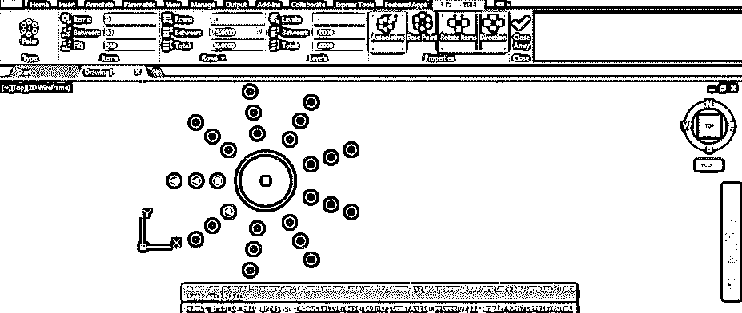

**第 14 步:**通过 total 选项，您可以指定行的长度，比如我给 50 作为 Total 选项的值，那么我的项目的行的长度将增加到 50，并且它将按照相同的比例调整行之间的距离。

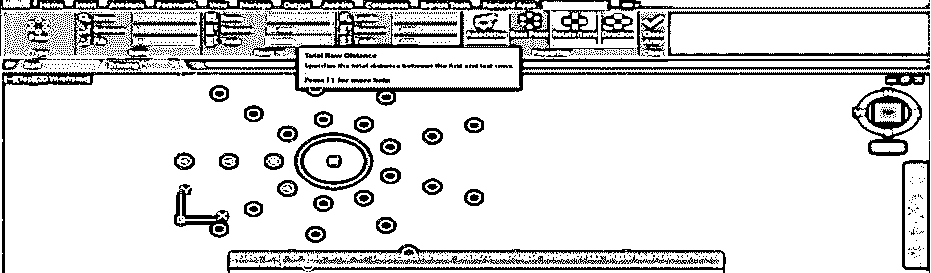

**第 15 步:**如果数组项分布在小于 360 度的范围内，可以从该数组创建页签的方向选项中给出数组项的方向。比如我把我的数组项分布在这个圆周围 180 度，点击这个方向选项；然后，数组项就从这个方向开始。

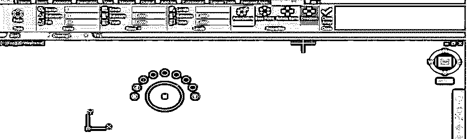

**第 16 步:**您还可以为 Levels 选项增加数组项的列数。例如，我将“标高”选项的值增加为 3，并将标高之间的间距增加为 10。现在，当您环绕此数组时，您可以在数组中看到 3 个级别的数组项目。

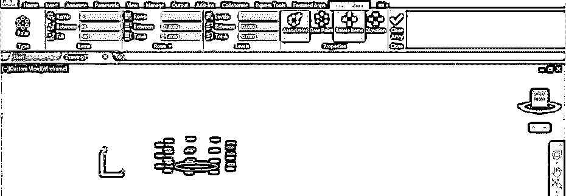

绘制阵列后，可以通过再次选择它来编辑它。通过这种方式，您可以在 auto cad 中使用“极轴阵列”命令，并使用它在 auto cad 中制作一个好的绘图。使用此命令，您还可以节省重复绘制同一项目的时间。

### 结论

现在看完这篇文章后，你可以理解什么是 auto cad 中的极坐标命令，以及你如何处理它的重要功能以在你的工作中获得最佳结果。通过反复练习这个命令，您可以非常容易地处理这个命令的参数。

### 推荐文章

这是一个 AutoCAD 中的极坐标阵列指南。在这里，我们讨论了介绍，如何在 AutoCAD 中使用极坐标阵列，以及如何处理它的重要功能，以获得最佳的工作效果。您也可以浏览我们的其他相关文章，了解更多信息——

1.  [AutoCAD 圆角](https://www.educba.com/autocad-fillet/)
2.  [AutoCAD 中的倒角](https://www.educba.com/chamfer-in-autocad/)
3.  [AutoCAD 中的样条](https://www.educba.com/spline-in-autocad/)
4.  [AutoCAD PressPull](https://www.educba.com/autocad-presspull/)

