# Autodesk Tinkercad

> 原文：<https://www.educba.com/autodesk-tinkercad/>

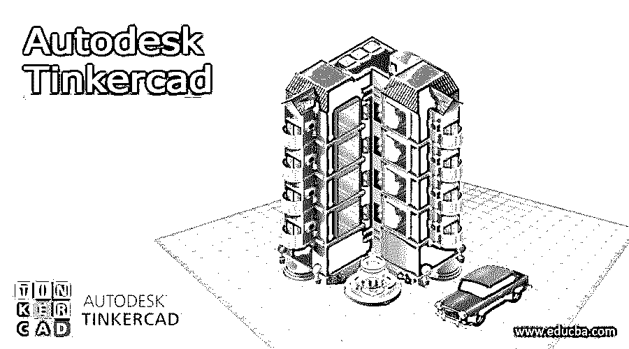

## Autodesk Tinkercad 简介

Tinkercad 是 Autodesk 公司收购并出售的免费软件程序。该计划拥有大量的观众，他们在初级水平上使用 Tinkercad 创建基本的 3D 几何形状和对象。Tinkercad 是一个用户友好的软件，不需要高级或专门设计的操作系统来创建 3d 对象，而是可以从任何有互联网连接的系统上操作。

### 什么是 Autodesk Tinkercad？

Tinkercad 通常本身就是一个程序。这个程序是由谷歌工程师凯·拜克曼创建的。他想要的只是创建一个通用平台，让用户可以创建和上传他们的 3d 设计。迄今为止，Tinkercad 用户已经在这个基于网络的平台上发布了超过 1000 万个 3d 设计。直到 2013 年，AutoCAD 才购买了 Tinkercad 的许可证并拥有了它。

<small>3D 动画、建模、仿真、游戏开发&其他</small>

Autodesk Tinkercad 是 Autodesk 为初学者、学生、教师和爱好者创建的平台，他们主要致力于创建基本的 3d 图形。该程序可以在有互联网连接的网络浏览器上运行。Tinkercad 是一个简单的 cad 程序，它基于构造立体几何(CSG)理论。这种技术通过将基本的和简单的形状结合在一起，帮助用户创建复杂的固体物体。

Tinkercad 是一个易于使用的 cad 程序，用户不仅可以创建 3d 模型，还可以使用 3D 打印机导出和打印它们。与 Autocad 或 Fusion360 等其他 Autodesk CAD 软件相比，Tinkercad 更容易学习 CAD 程序。

虽然初学者和学生使用 Tinkercad 非常方便，但同时高级专业人员和 3D 艺术家也可以使用该程序来创建复杂和更高级的设计。

### 如何使用 Autodesk Tinkercad？

在 Tinkercad 上创建的文件可以保存为 SVG、OBJ 和 STL 文件格式。而 STL 文件格式用于创建切片或打印程序的文件。OBJ 文件可用于导入和导出到其他 Autodesk 程序。

Tinkercad 还可以处理脚本和 AR 场景。由于 Tinkercad 基于 CSG 理论工作，该理论使用户能够创建具有实心基本形状的设计，为了创建更复杂的设计，用户需要在创建的原始形状中添加或删除形状。这一过程的简单性使 Tinkercad 成为学生和教师易于使用的程序。

使用 Tinkercad，用户还可以创建 3D 电子电路和设计，这些设计具有更先进的照明和相机功能。Tinkercad 是一个有趣而智能的程序，它可以帮助用户将 3d 模型导出到《我的世界》，还可以使用 JavaScript 编辑器创建自定义的 3d 几何形状。

### 如何创建 Autodesk Tinkercad？

因此，由于 Tinkercad 在 web 浏览器上工作，不需要任何特殊的操作系统，用户可以轻松地点击 Autodesk Tinkercad 网站，免费访问他们的程序。在接下来的步骤中，我们将学习如何在 Tinkercad 上创建设计-

1.游览 Tinkercad.com
2。您将被要求注册或登录网站
3。将上传如下所示的页面。

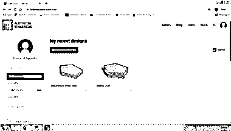

4.点击创建新设计，如下所示

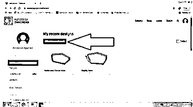

5.一旦你点击它，一个新的界面将被上传如下所示-

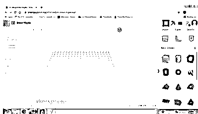

6.在右上角，我们可以看到不同的形状，如果我们单击下拉菜单，我们可以更改设置并查看其他选项，如下图所示-

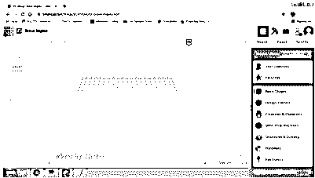

7.在右上角，我们可以看到如下所示的导入/导出选项

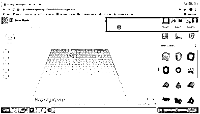

8.现在，使用基本的形状，我们在 Tinkercad 上创建一个设计

9.首先，选择圆柱体并单击工作区。只要我们单击，就会出现如下所示的对话框-

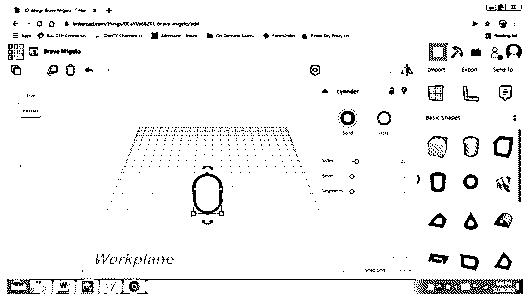

10.在左上角的视图立方体的帮助下，我们更改视图，如下所示

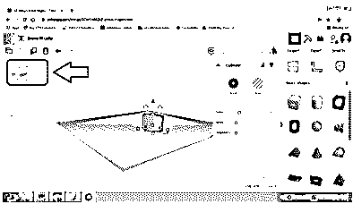

11.我们通过点击如下所示的实线来改变形状的颜色

12.借助对话框中的设置，如线段、斜面或边，我们可以根据需要更改或修改形状，如下所示

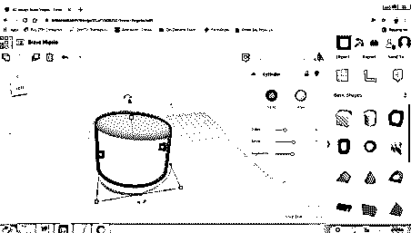

13.类似地，我们可以从右键菜单中更改选项，并使用这些函数中给出的不同形状。其中一个例子如下所示-

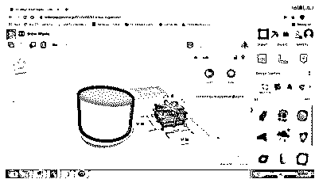

14.要导出设计，点击导出，如下所示

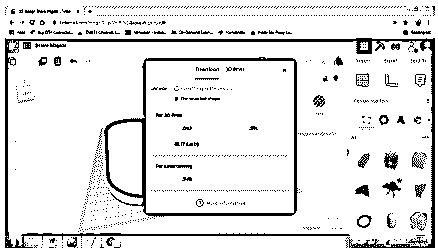

15.要更改设置或将设计导出至 3d 打印机，请点击功能并选择所需的打印机，如下所示

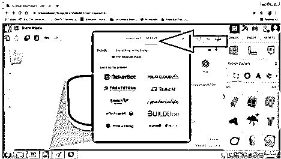

16.我们还可以在平台中导入 Tinkercad 支持的文件。为此，单击导入并选择所需的文件，如下所示-

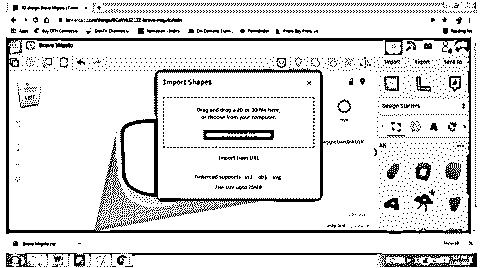

17.用户也可以将设计直接分享给其他应用程序或他人。点击发送到并选择所需的设置，如下所示-

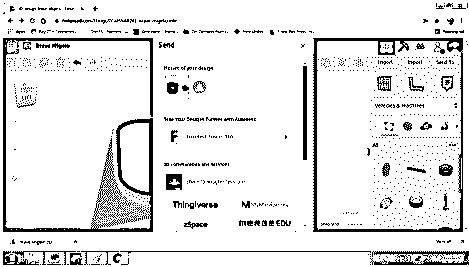

这样，在不使用任何额外资源或成本的情况下，用户可以使用 Tinkercad 创建独特的以及一些非凡的 3d 设计。

### 结论

在上面的文章中，我们详细研究了 Autodesk Tinkercad 的使用和功能。该计划有许多有用的好处，有助于许多用户和 3D 图形设计爱好者。Tinkercad 是一个简单但非常创新的平台，是为将想法和想象变成现实而创建的。

### 推荐文章

这是 Autodesk Tinkercad 的指南。这里我们讨论入门，什么是 Autodesk Tinkercad，如何使用 Autodesk Tinkercad？您也可以看看以下文章，了解更多信息–

1.  [Autodesk 卸载工具](https://www.educba.com/autodesk-uninstall-tool/)
2.  [什么是 Autodesk](https://www.educba.com/what-is-autodesk/)
3.  [Autodesk vs Autocad](https://www.educba.com/autodesk-vs-autocad/)
4.  [AutoCAD 中的 Leader](https://www.educba.com/leader-in-autocad/)

