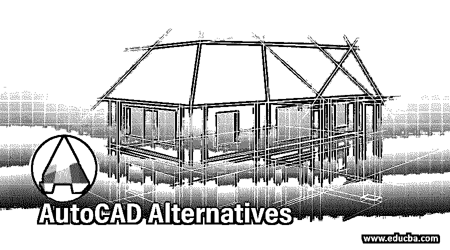

# AutoCAD 备选方案

> 原文：<https://www.educba.com/autocad-alternatives/>

## AutoCAD 备选方案介绍

AutoCAD 被公认为是最古老、最精确、使用简单的 CAD 计算机辅助绘图程序。问题是并非所有消费者都为此付出了代价。特别是，微型企业和工程、建筑和平面设计专业人员为自己或学生以及这些知识领域的支持者工作。投资者可以购买 AutoCAD 许可证，因为它是一个灵活的 2D、3D、设计和建模程序，具有各种行业应用程序，适合项目管理，是一个很好的投资。但是为什么要购买非永久的 AutoCAD 许可证——当你可以用其他替代软件做同样的事情时？

### 七大 AutoCAD 备选方案

以下是 AutoCAD 中最常见的 7 种备选方案的详细信息:

<small>3D 动画、建模、仿真、游戏开发&其他</small>

#### 1.通风瞄准器

专为个人和个人使用，这个 2D 绘图程序类似于 AutoCAD。这有一系列完全可用的工具来满足用户的所有绘图需求。对于那些刚开始接触建模环境的人来说，这是一个完美的系统，具有直观的用户界面，其开放的语言易于控制。根据图层设计元素进行准确的修订。DraftSight 现已可用于 Windows、Windows 的测试版、Mac 和 Ubuntu 等操作系统。这种替代的 AutoCAD 软件使您能够轻松地直接在程序中开发 g 代码，读取和交换 DWG 文件。下载只需要几分钟。

#### 2.草图

这个免费软件易于使用和理解。虽然它在 AutoCAD 和其他应用程序方面有许多缺点，但对于那些学习并开始进行初步设计的人来说，它是一个非常好的软件。这就是为什么它比建筑、建筑、设计、设计(甚至当它覆盖这些领域时)更受各种行业用户的欢迎，比如视频游戏和电影设计。对于初学者或专业人士来说，它对于设计或提炼概念很有用。如果你想处理 OBJ、DWG、XSI、DXF 和其他文件，免费版本非常好。它允许导出高清动画和 PDF，并可以轻松地与第三方的附加组件相结合。

#### 3.FreeCAD

这是 2D 制图公司在不断修订中的开源和自由软件，正如它的名字所暗示的那样，因为它有一个自由开发者的基础来改进它。几乎所有标准的 2D 绘图工具都包含在 FreeCAD 中。GUI 也很快，很吸引人，很敏捷，可以让你输入任何东西。它可以与 Windows 和 Mac OS 等操作系统配合使用，读取 DWG 文件。Qt，健壮的跨平台应用程序，被用来开发这个软件。AutoCAD 的概念和工具都差不多。这也是为什么懂 CAD 的人对它都很得心应手的原因。FreeCAD 的源代码可以根据客户的要求重新创建、修改和删除，而且是免费的。它最好的特性之一是 FreeCAD 用户可以使用的软件的不断变化，它每天都在改进，非常容易使用，并在使用免费源代码的工作中提供良好的结果。

#### 4.TrueCAD

该软件广受欢迎，是最好的 AutoCAD 选项之一。TrueCAD 是 2D 设计和三维可视化的基础软件。有一个类似的编程界面，具有相同的功能和命令，使其成为以前的 AutoCAD 用户最受欢迎的功能之一。TrueCAD 是专门为建筑商、机械工程师、建筑师以及 GIS 设计的，它提供了用户友好的建模软件的所有关键功能。因此，对于与 DWG 兼容的 AutoCAD 来说，这是一个简单的选择，其维护成本非常低廉。它提供了与 AutoCAD 相同的功能。

#### 5.SolidFace

我们将从自己开始，因为我们认为它是 AutoCAD 的最佳免费替代品。2D/3D 参数化历史建筑 CAD 建模程序是 SolidFace Professional。它的优点是，它还使您能够完全创建 2D 项目，如机械零部件，多种工程设计，一般图形设计，民用植物等。，除了 3D 建模。SolidFace 合成了 Parasolid Siemens 3D 建模核心，并添加了 15 年 UniCAD 2D/3D 设计经验，以提供强大功能的可靠、详细的建模、装配和参数化产品。你可以通过使用 X T，X B，DWG，DXF，常规 BMP 文件(AutoCAD，Solid-edge，SolidWorks 等等)完美的读取其他 CAD。

#### 6.无纳米涂层

这是一个简单易用的 NanoCAD 应用程序，当你表现出色时，它会提供最佳体验之一。它也是一个完全有能力的产品，具有经典的界面和原生支持。dwg 格式。它包括一整套用于创建 CAD 文件的基本和高级工具，所有这些工具都与标准 DWG 兼容。

#### 7.QCAD

这是另一个免费的开源二维 CAD 建模框架(2D)。该计划使之有可能建设一个广泛的技术图纸，如计划和室内房间，机械元件，图表，甚至图形。它兼容 Windows、macOS 和 Linux，其源代码是一个非常受欢迎的开源许可证，可在 GPL 版本 3 上获得。

### 结论

在本文中，我们已经看到了各种 AutoCAD 的替代品。您可以根据自己的需求选择其中的任何一个软件。我希望这篇文章对你有所帮助。

### 推荐文章

这是 AutoCAD 备选方案的指南。在这里，我们讨论了 AutoCAD 中的简介和 7 大备选方案，并给出了解释。您也可以浏览我们的其他相关文章，了解更多信息——

1.  [玛雅替代品](https://www.educba.com/maya-alternatives/)
2.  [3ds Max 替代品](https://www.educba.com/3ds-max-alternatives/)
3.  [Picmonkey 替代品](https://www.educba.com/picmonkey-alternative/)
4.  [喷墨替代](https://www.educba.com/inkscape-alternative/)

