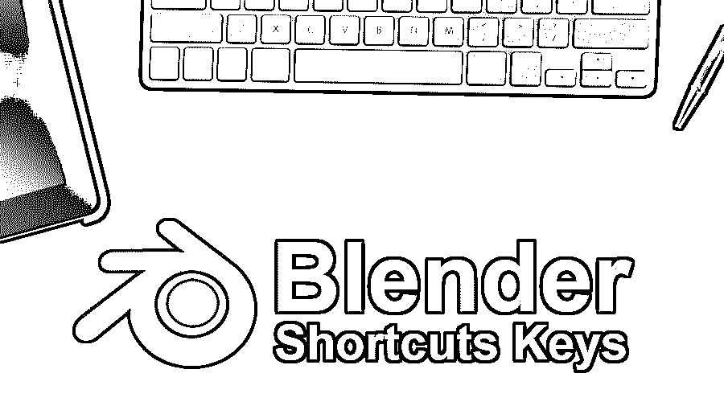

# 搅拌机快捷键

> 原文：<https://www.educba.com/blender-shortcuts-keys/>

## 搅拌机快捷键介绍

以下 Blender 快捷键提供了 Blender 中最常用功能的概述。这是一个用于 3D 计算机图形创作的开源软件。Blender 拥有全面承诺的动画、VFX 和游戏开发及其项目所需的所有工具。由于它是开源的，从初学者到有经验的专家都可以使用该软件界面进行工作。Blender 既有可视屏幕编辑，也有基于脚本的编辑选项；如果需要，我们可以在两者之间切换。

使用 blender 的一些聪明的方法和技巧是使用 python 脚本来定制工具和附件，使用动态细分的多分辨率，高级工具，以及用于雕刻的笔刷。该应用程序还可用于[设计 3D 模型](https://www.educba.com/careers-in-3d-modeling/)和绘画。该工具具有高分辨率标准的强大相机。我们可以对运动中的物体进行自动和手动跟踪。

<small>3D 动画、建模、仿真、游戏开发&其他</small>

可以很容易地对镜头和场景进行实时回顾。骨架、蒙皮、动作都可以自动完成；我们甚至有它们使用的模板。骨骼形状可以根据需要快速定制。除了素材，运行背景的声音在讲故事中也起着关键作用，因此该应用程序包含声音同步选项以及素材运行，以进行必要的编辑并创建有创意的合理输出。

### 解释搅拌机快捷键

该应用程序旨在 3D 环境工作空间中执行全面的设计，将 3D 概念带入视觉现实。对于像这样的软件，可以执行大量的工作，总是有键盘快捷键，以节省时间，并获得高质量的输出。频繁使用快捷键帮助是对工作的自由练习。五月电影 vfx 工作室制造商，游戏公司和许多其他与 blender 上的图形作品相关的公司。该工具具有工作的所有功能；我们甚至有第 3 个第 3 个团队来改进发动机和工具的性能。让我们讨论一些快捷方式和它们在应用中的用法。

#### 1.基本界面快捷方式

*   鼠标右键单击从工作屏幕中选择数据中的对象和项目。
*   按住 Shift 键并单击鼠标右键，从工作屏幕中选择多个项目对象。
*   鼠标左键点击设置一个操作动作，如按键设置等。
*   Ctrl +鼠标左键单击有助于编辑零件及其 ID 的 outlook 名称
*   鼠标左键单击+按住+拖动有助于拖动 X、Y 和 Z 3D 视图小部件手柄。
*   鼠标中键用于向上滚动和完成，也用于 3D 视图缩放。
*   Shift +鼠标中键在 3d 工作空间上滚动，以查看不同的角度。
*   Ctrl +鼠标中键缩放 3d 工作空间以修复闭合编辑。
*   鼠标中键+按住+拖动可向视口的任何角落旋转和移动。
*   g 是在 x、y 和 z 轴上平移对象的热键
*   s 是一个热键，用于在所有方向上缩放对象或调整对象大小
*   r 是向各个方向旋转对象的热键
*   a 是选择和取消选择对象
*   + Ctrl 键用于捕捉对象
*   +Ctrl +Shift 捕捉较小的对象
*   +Shift 用于降低移动速度

#### 2.3D 视觉方向快捷方式

*   原点将三维视图重置为视口中的等轴测视图，这是模型的原点位置。
*   相机视角设置的数字键盘“0”
*   数字小键盘“1”代表前侧矫形，Ctrl+数字小键盘“1”代表后侧矫形
*   x/y/z 轴方向的 Shift+NumberPad1
*   数字键盘“2/8，4/6”向上/向下，左右滚动场景。
*   数字键盘“3”右正交视图
*   数字键盘“7”表示顶部正交视图，Ctrl+数字键盘“7”表示底部正交视图
*   数字键盘“5”切换透视/正交
*   数字+放大，数字-缩小并编号。专注于选择。
*   数字键盘“2/8，4/6”向上/向下，滚动场景向左和向右平移。
*   数字/用于本地和全球定位。

#### 3.UV 展开快捷键

*   b 用于边界选择
*   c 是圆形选择
*   e 是展开的
*   g 是平移，移动，抓取
*   h 是隐藏的
*   Alt+H 取消隐藏
*   Ctrl + I 反转选择
*   Ctrl+M 是镜像或翻转面。
*   +X 至 X 轴和+Y 至 Y 轴
*   n 来获取属性
*   Alt+N 用于创建新图像
*   o 切换比例编辑和使用
*   Alt+O 指示打开新图像
*   P 锁定组件选择，Alt+P 取消锁定选择
*   切换 UV 雕刻以检查带有对象的贴图纹理的细节。
*   r 表示启用旋转
*   启用缩放
*   Shift+S 启用“对齐到[选项]”
*   测试以启用工具架
*   选项卡以启用切换 UV 和图像编辑器
*   v 启用缝合
*   w 启用焊接/对齐
*   y 拆分选择和映射
*   数字小键盘 1，2，4，8 缩放视图“全”，“半”，“四分之一”，“八分之一”大小的紫外线
*   F3 保存为不同位置的图像。
*   “，”用于枢轴点和。“对于光标

#### 4.最新版本快捷方式

*   Shift+F1 =链接/追加
*   Shift+F2 =逻辑编辑器
*   Shift+F3 =节点编辑器
*   Shift+F4 =控制台
*   Shift+F5 = 3D 视图
*   Shift+F6 =图形编辑器
*   Shift+F7 =属性
*   Shift+F8 =视频序列编辑器
*   Shift+F9 =大纲视图
*   shift+F10 = UV/图像编辑器
*   Shift+F11 =文本编辑器
*   Shift+F12 =摄影表

#### 5.3D 视图对象快捷键

*   Alt+D 复制选定的对象
*   Shift+D 复制未选中的对象
*   Alt+B 选择上一个选择(剪辑选择)
*   在整个视口中，按 Shift+B 缩放选定的对象
*   Ctrl+G 组合键将对象分组
*   Ctrl+Alt+G 从活动组中删除对象
*   Ctrl+Shift+G 将对象添加到活动组中
*   Shift+Ctrl+Alt+G 从所有组中删除
*   鼠标右键或 Esc 键取消操作

### 结论

应用程序在基于 3d 世界的项目的多个领域中具有广泛的用途，其所有效果、工具和属性将 3D 视觉动画、游戏和 VFX 的概念带到屏幕上，以获得令人敬畏的用户体验。根据这篇文章，我们已经看到了最常用的快捷方式，但是没有更多的快捷方式和最佳实践可以遵循。任何专业的平面设计师和艺术家都可以学习 Blender 来提高技能和实践，以获得更好的工作机会和简历附加技能。

### 推荐文章

这是搅拌机快捷键的指南。这里我们讨论了它的概念和 Blender 的一些重要快捷键。您也可以阅读以下文章，了解更多信息——

1.  [搅拌机替代品](https://www.educba.com/blender-alternatives/)
2.  [搅拌机插件](https://www.educba.com/blender-plugins/)
3.  [搅拌机工具](https://www.educba.com/blender-tools/)
4.  [搅拌机中的 3D 文本](https://www.educba.com/3d-text-in-blender/)

