# Blender 中的 3D 文本

> 原文：<https://www.educba.com/3d-text-in-blender/>

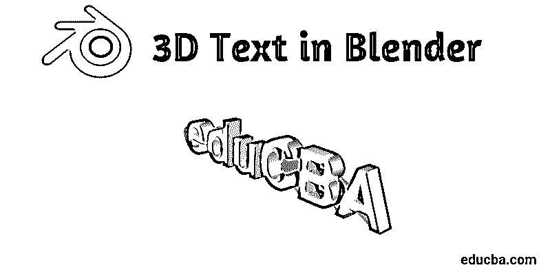

## Blender 中的 3D 文本简介

Blender 是 3d 计算机图形创作领域的一个免费开源应用程序，用于游戏、动画和其他系统图形视觉效果创作。该软件自 1998 年以来由 Blender 基金会开发和支持。blender 可以完成所有与 3D 相关的视觉作品和项目，例如游戏和电影的 3D 动画、3D 打印、艺术、gif、广告、视觉效果等等。许多工作室使用该工具进行 3D 建模、纹理、 [UV 展开](https://www.educba.com/uv-unwrapping-in-blender/)、光栅图形编辑、烟雾、流体、头发、皮肤、动力学、装配、渲染、柔体、[运动图形](https://www.educba.com/what-is-motion-graphics/)，以及视频创建和合成以及许多其他效果。

今天，我们将在下一节中看到如何制作广告的 3D 文本和电影的标题制作以及许多其他用途。

<small>3D 动画、建模、仿真、游戏开发&其他</small>

### 如何在搅拌机中创建 3D 文本？

单击 Blender 图标并移除默认立方体，这将打开默认项目屏幕。将项目保存在一个位置，然后按照下述步骤继续工作:-

**第一步:** Shift A，添加文字。从键盘上点击**Shift+A**，屏幕上打开一个列表；从那里选择“文本”选项。****

 ****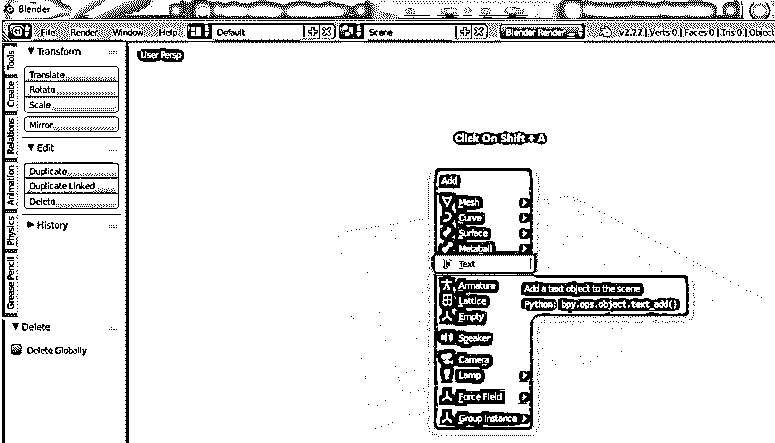

选择后，搅拌机将创建一个默认的文本和光标。键盘上的 Tab 键，可根据需要帮助将文本更改为文本模式和实体模式。要编辑文本，请选择文本区域，然后单击 tab 键。光标直接在文本的角上突出显示，和窗口 word 一样，现在我们可以单击退格键或选择完整的文本并删除它。键入必须按要求显示的文本。

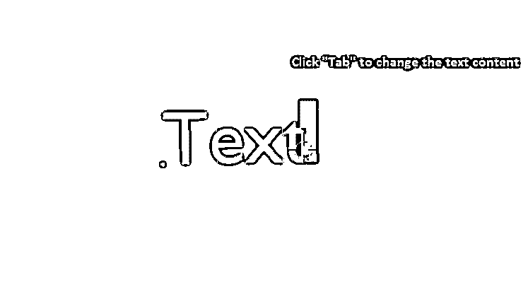

**第二步:**在区域中填入所需文本后，点击 TAB，文本模式变为对象模式。现在我们需要学习一些搅拌机的基本知识。

*   平移= Shift +鼠标中键
*   移动=轴+右键单击-拖动以移动对象
*   旋转=热键 R
*   规模大小=热键 S
*   选择=鼠标左键单击
*   旋转视图=鼠标中键并移动鼠标。

这些关键点有助于创建和移动对象，并从不同角度查看它们。

**

** 

**第三步:**选择文本，点击“Tab”打开文本模式。

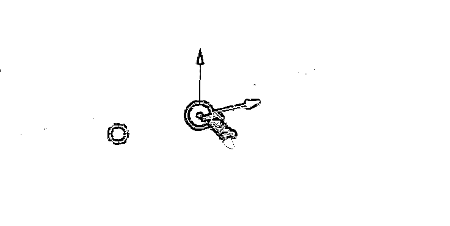

键入所需的文本，并删除不需要的单词或字母，就像我们在 windows word 文件中所做的那样。

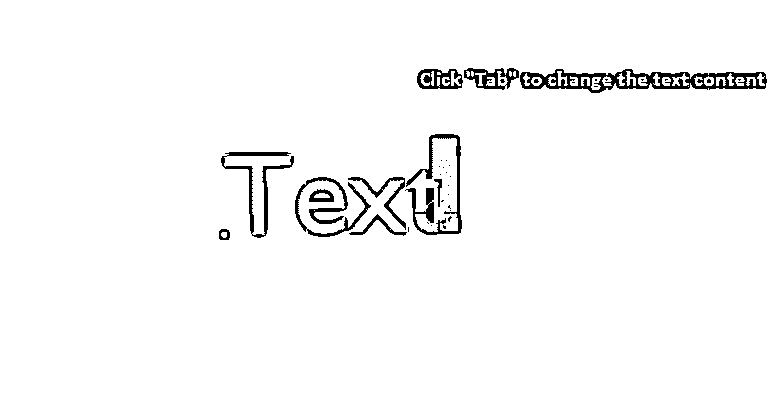

一旦在屏幕上键入单词 apiaries 并点击“Tab”使它成为一个对象，然后将它移动到网格的中心。

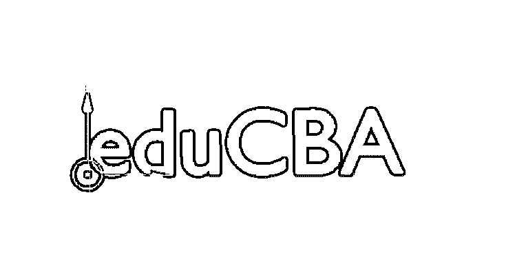

**步骤 4:** 3D 文本排除可以在中完成，如下图所示。

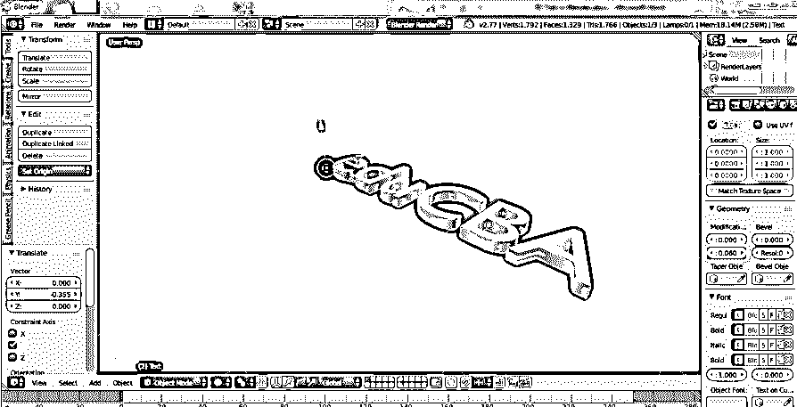

选择排除，并给出排除文本所需高度的所需值。

我们甚至可以通过点击并选择最大化选项来最大化窗口，或者使用 Ctrl 向上箭头和向下箭头来增加和减少值。

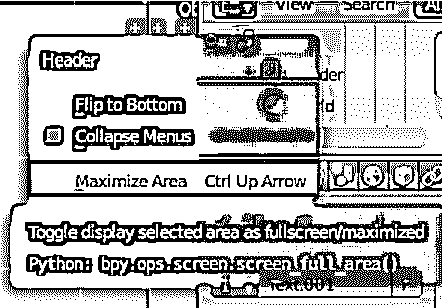

我们可以最大化并选择“ **F** ”图标，以获得从左侧窗格中选择的所有文本和前面相关的属性。

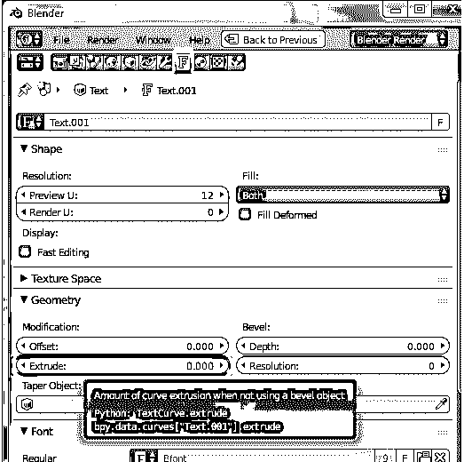

**第五步:旋转文本**

到目前为止，我们的文本在网格上是扁平的；让我们从正面视图中看到文本(让我们唤醒它)。

转到旋转选项，并在 X 轴，给值为 90 度。文字会改变方向，如图所示。

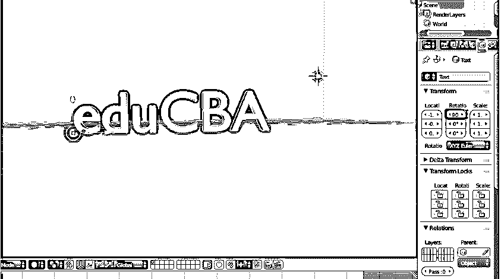

**步骤 6:** 转到左侧面板的 Fronts 图层，查看面板上所有与文本相关的属性。

前端->点击载入文件(文件夹符号)

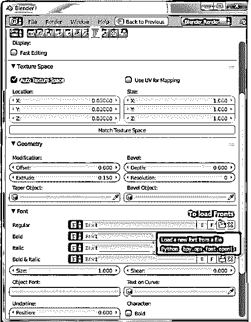

Blender 文件浏览器打开，然后点击 c 盘

c 盘->点击 windows 文件夹

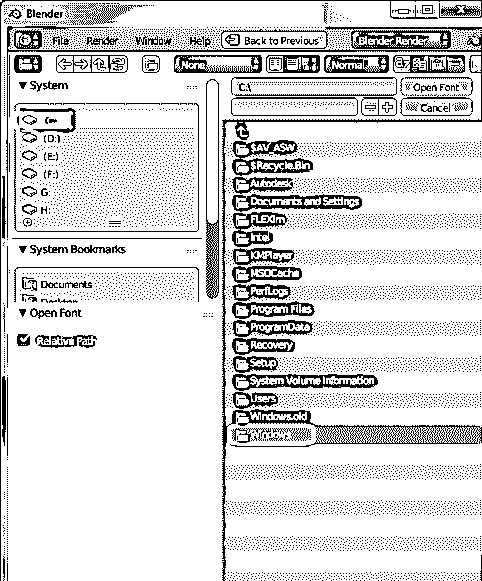

c:–windows->选择字体文件夹

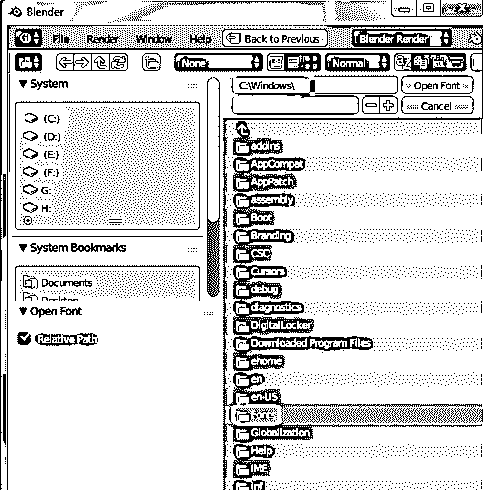

C:\windows\fonts 所有默认的 blender 安装访问字体都可以在这里找到。

许多在线插件也可供[在 Blender](https://www.educba.com/what-is-blender/) 中使用，以拥有独特的标题样式。默认情况下，应用程序包含几乎所有的正面。

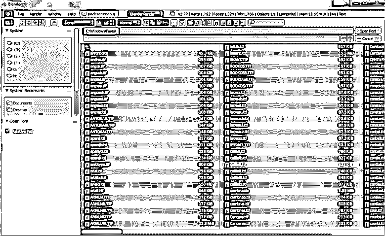

**第 7 步:**对文本应用适当的字体后，在左侧窗格中，我们有两个选项水平和斜面。两者都有助于塑造文本的角落，如果有太尖锐的角落。

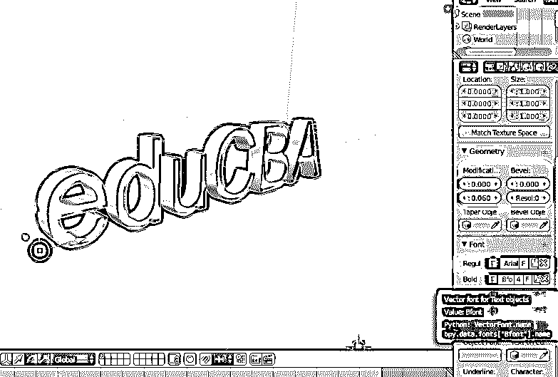

**步骤 8:** 增加分辨率给文本的角部增加曲线和平滑的半径。

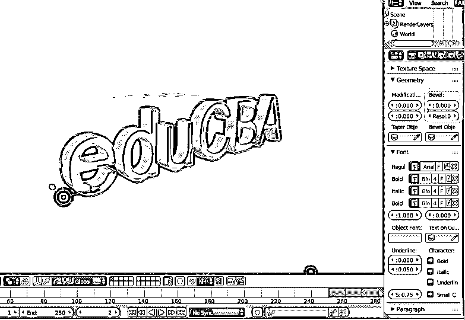

**第九步:**从文本转换为网格对象。

在这里，我们将通过给整个文本赋予网格属性来将文本转换为对象。

键盘上的 ALT +C 是将内容更改为网格的热键。

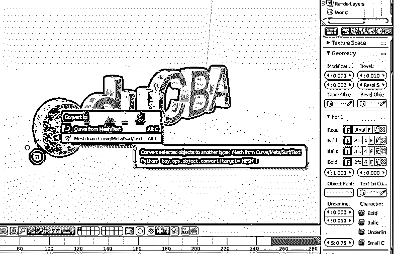

一旦文本变成网格，它就应用于多个点、线和面。如果我们将模式从对象更改为编辑模式

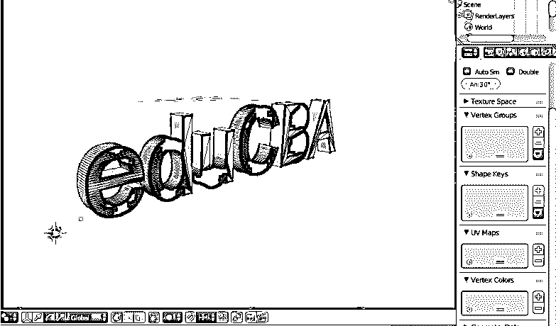

**第十步:**通过改变文本来网格化几个重复的矢量(顶点或点)，将它们删除创建；将屏幕保持在编辑模式，选择文本，然后单击 W 键从选项中选择移除双精度。

编辑模式->选择文本–> W –>删除双精度。

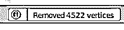

**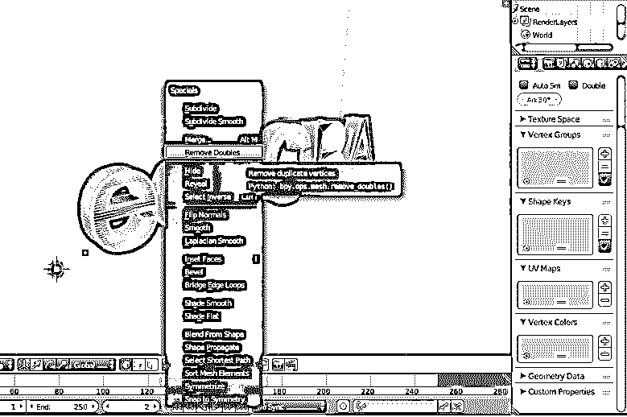

 **

在菜单栏的顶部，我们可以通过屏幕上的 blender 消息看到已经移除了多少个点。

**步骤 11:** 点击左侧窗格上的 Lambert 符号，很容易给文本添加纹理。

转到漫射窗口，点击选项下面的漫射和旁边的兰伯特。将出现一个完整的彩色窗口；我们可以从中选择准确的颜色。

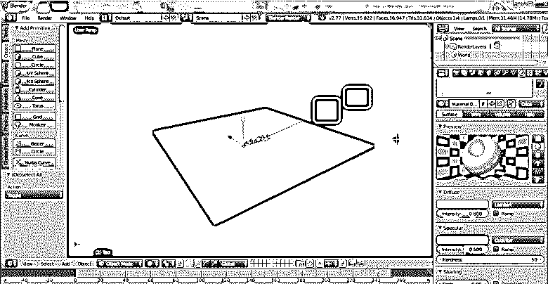

如果我们有的话。png 或者。jpg 纹理文件可用于纹理，我们可以使用+ new 选项将它们插入到对象的相同区域。

这里我们给单词 lambert 加上了水绿色。

**步骤 12:** 点击应用程序屏幕右上角的渲染选项，获得文本的渲染视图。

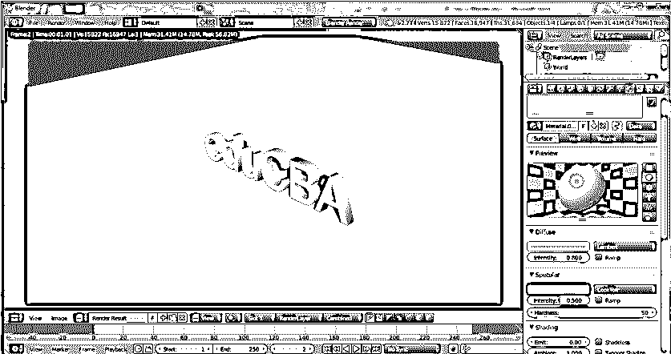

添加和定位相机和照明在显示文本的视图和阴影细节方面也起着关键作用。

### 结论

这种制作 3D 文本的过程有助于为广告、电影片头放映和许多其他项目制作可视的 3D 名称。大多数多媒体工作室和新闻频道用于促销和在屏幕上滚动。不断的练习使用户可以很容易地操作界面和属性。

### 推荐文章

这是 Blender 中 3D 文本的指南。在这里，我们讨论如何在 Blender 中创建 3D 文本的概念和一步一步的解释。您也可以浏览我们推荐的其他文章，了解更多信息——

1.  [Photoshop 中的锐化工具](https://www.educba.com/sharpen-tool-in-photoshop/)
2.  [搅拌机替代品](https://www.educba.com/blender-alternatives/)
3.  [Adobe Photoshop 工具](https://www.educba.com/adobe-photoshop-tools/)
4.  [搅拌机插件](https://www.educba.com/blender-plugins/)

****