# 搅拌机中的紫外线展开

> 原文：<https://www.educba.com/uv-unwrapping-in-blender/>

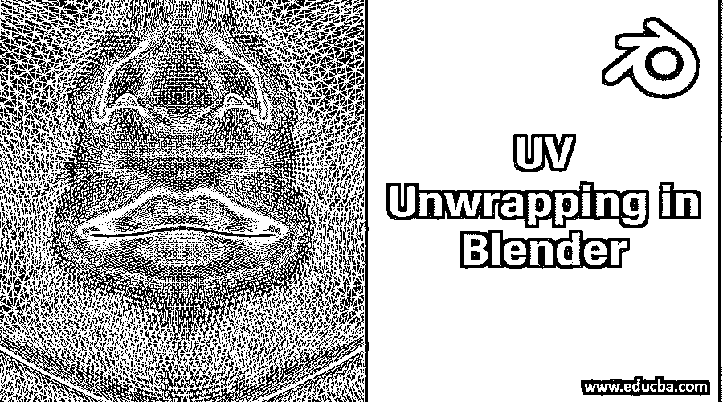

## Blender 中的 UV 展开介绍

在这篇文章中，我们将了解在搅拌机紫外线展开。UV 展开是指打开网格以制作覆盖 3D 对象的 2D 纹理的过程。如果您需要精确地给对象添加纹理，这种方法非常有效。你可以为 Blender 和外部[图像编辑器](https://www.educba.com/best-photo-editors/)创建纹理。与其他贴图程序相比，UV 展开提供了大量的控制。此外，它与游戏引擎高度兼容，有利于制作游戏资产。此外，对于创建选择性细节，您可以依赖 UV 展开。在本文中，我们将提到在 Blender 2.80 中使用解包模型，这是 Blender 的最新版本。

### 如何在 Blender 中进行 UV 展开？

UV 展开是展开网格以创建适合 3D 对象的 2D 纹理。让我们来看看同样的几个步骤。

<small>3D 动画、建模、仿真、游戏开发&其他</small>

**第一步:**首先你需要在你的系统中打开 Blender 2.80 应用。

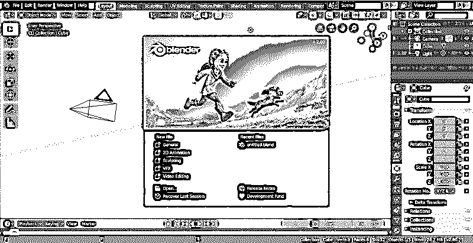

**注意:**如果您使用的是旧版本的应用程序，您可以前往 https://www.blender.org/download/releases/2-80/免费更新到最新的 Blender 2.80 版本。这个新版本包含一个设计更好的界面，可以更好地帮助你处理艺术品。它还包括一个黑暗主题和一组高级图标。另外，现在使用鼠标时,“左键选择”是默认的。

**第二步:**您会注意到工作区中有一个默认的立方体。在本练习中，我们将尝试解开这个魔方。

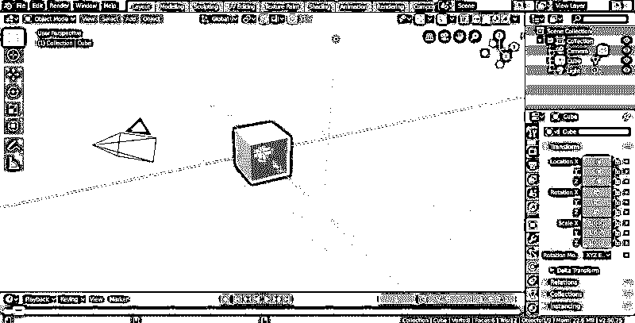

**第三步:**在此之前，你需要将视图设置为“UV/图像编辑器”。单击下图所示的图标，更改视图。选择“UV/图像编辑器”。就是这样。工作区准备好了。

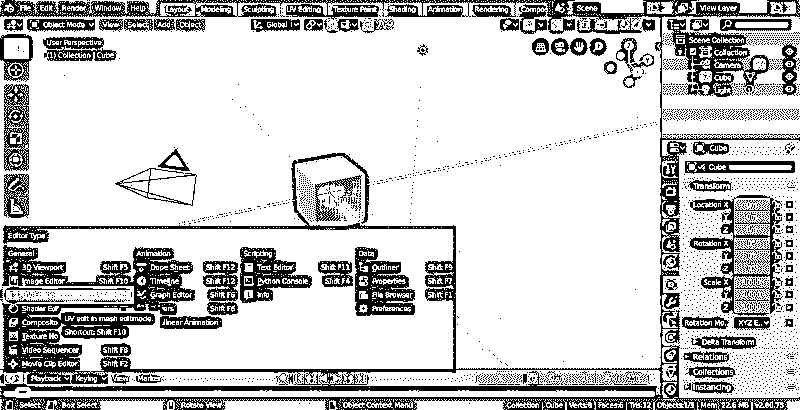

**第四步:**选择你要解包的模型。这里我选择了立方体。

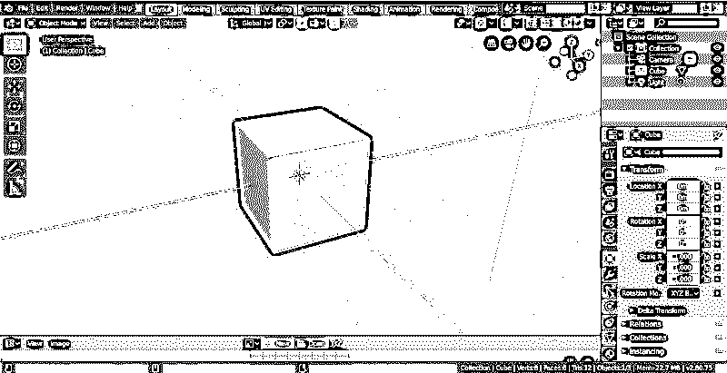

**第五步:**接下来，将模式从对象改为编辑。

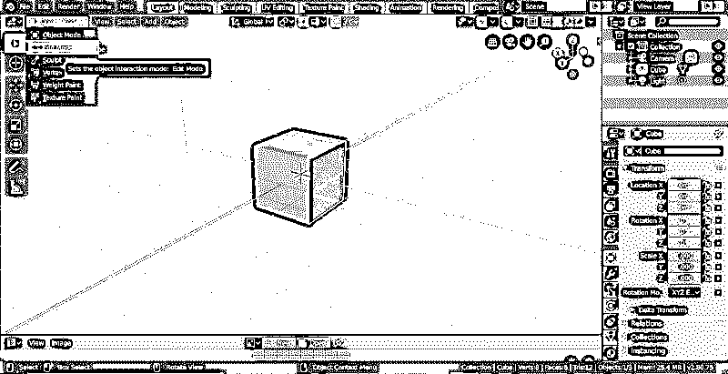

**第六步:**之后，我们要标记接缝。接缝仅仅是边缘；因此，该模式需要处于边沿选择模式。为了方便选择其他边的边缘，选择**‘透明显示整个场景’**。

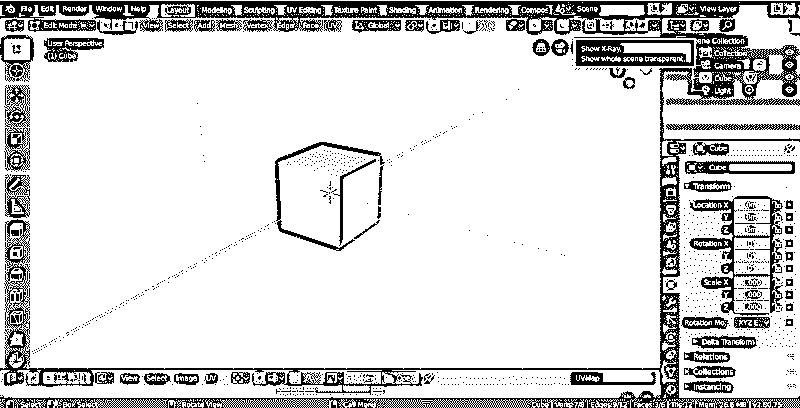

这使得场景中的所有对象都以半透明/半不透明的方式出现，而不管它们是处于更改模式还是编辑模式。

**注意:**对于以前 Blender 版本的用户，关闭“限制选择可见”功能，因为**“透明显示整个场景”**在旧版本中不可用。

步骤 7: 现在，我们可以开始选择边缘，使它们成为接缝。为了更好地理解，将接缝想象为在 3D 模型中制作的切口，用于将它们转换为 2D 形状。

现在，选择边，使用左上面板的边选择图标，如下所示。

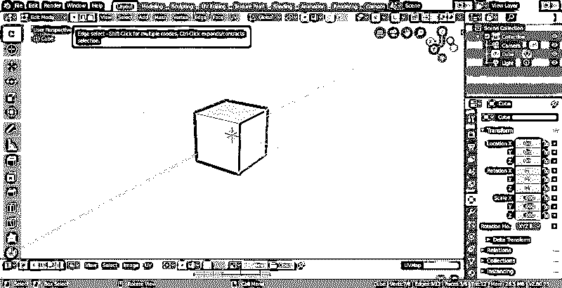

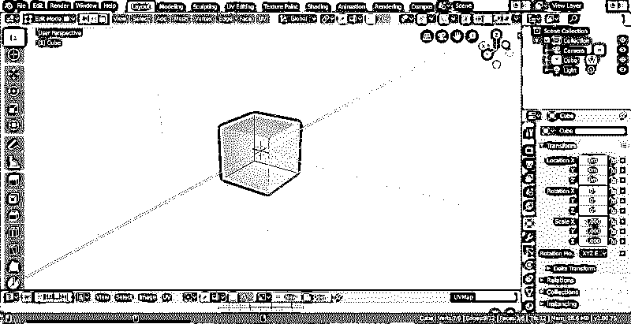

**第八步:**接下来，你可以将边缘标记为接缝。为此，选择边并单击 0n 标记接缝选项。

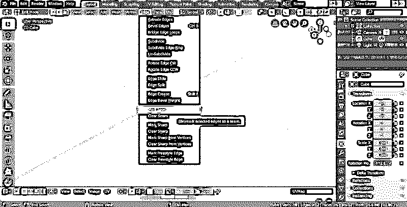

或者，您可以将鼠标停留在 3D 视图上，按下 **Ctrl+E** 并标记接缝。

接缝边缘将用红色标记。但是，如果没有，将鼠标放在 3D 视图上，按“n”。向下滚动并选择“显示接缝”选项。

第九步:我们已经标出了接缝。现在，我们将通过选择所有的面来打开它们(按“a”)。

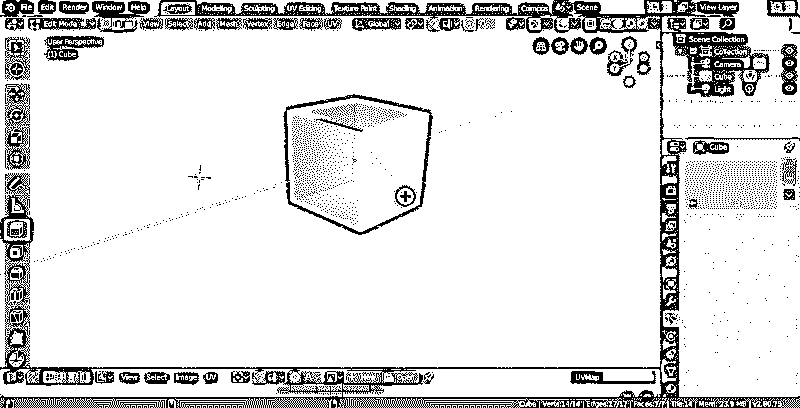

**步骤 10:** 展开你的选区，使用 UV，然后展开或将鼠标停留在 3D 视图上，点击(u 和展开)。你还会找到其他的解包选项。

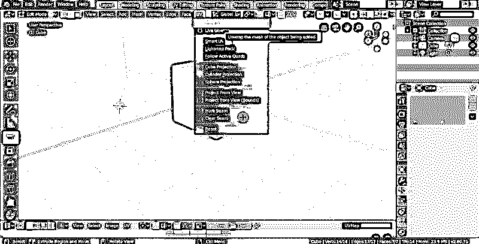

最后，立方体被打开。现在标记接缝的目的更加清楚了。

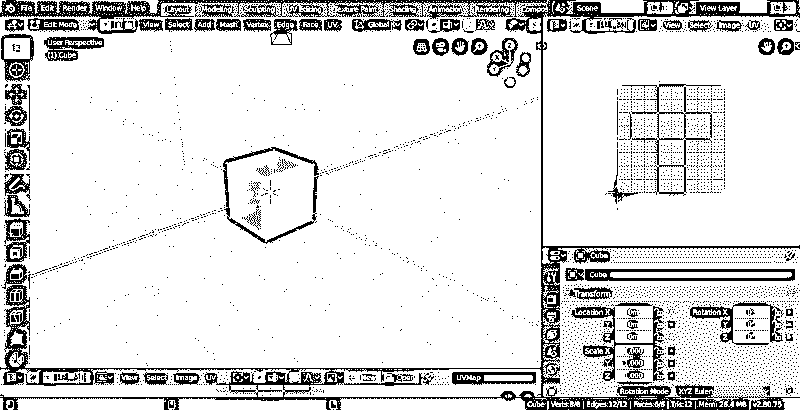

第 11 步:现在，我们拥有的是原始的紫外线数据。工作的时候有一些参考资料真的会很有用。为此，让我们开始添加纹理。在此之前，您需要更改 3D 视图来渲染纹理对象。

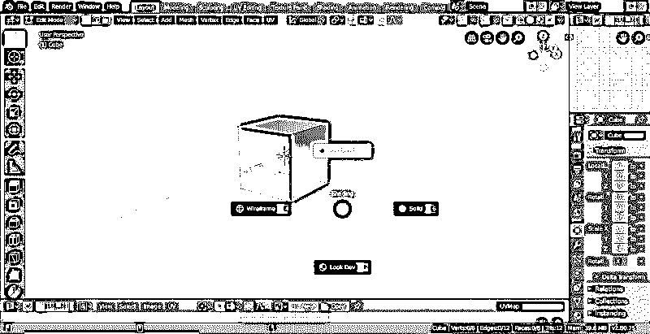

**注意:**有四种视窗着色模式，它们位于 X 射线模式旁边。您也可以通过按“Z”键来访问它们，这将在饼图菜单中显示这些模式，如图所示。显示的第一种模式是线框模式。它以线的形式显示网格。2 nd 是实体模式，可以用来以实体形式显示没有任何纹理或材质的网格。如果需要更改颜色、背景或照明，可以通过改变阴影属性来实现。第三种模式是 LookDev，允许纹理、材质和颜色可见。最后，第四个是渲染模式。它就像是一个预览，展示你的场景在渲染后是如何形成的。

**步骤 12:** 现在，网格在 3D 中绘制为纯白色，因为它没有任何纹理。因此，我们将创建一个。从 UV/图像编辑器视图中，选择“图像”,然后选择“新建图像”。

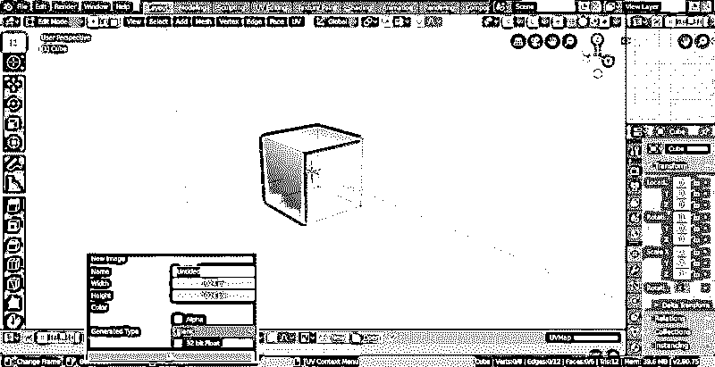

**步骤 13:** 暂时保留默认设置。唯一的变化将是为以前版本 Blender 的用户检查“紫外线测试网格”。这使得纹理成为一个棋盘图案。这有助于稍后编辑 UV 数据。您可以查看 3D 视图并检查 checker 中的更改，例如，您是否因网格的不必要挤压或拉伸而扭曲了像素。还可以知道纹理是否均匀分布在网格周围。

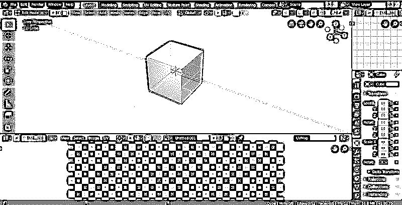

现在你有了最终展开的网格和一个参考纹理。现在，用户可以开始在编辑器中编辑 UV 数据，类似于在 3D 视图中编辑网格。很明显，打开包装的过程会变得越来越复杂。尽管如此，原理还是一样的。你切开一个三维网格，然后小心地扭曲它。

**注意:** Eevee 是 Blender 2.8 中默认的渲染引擎。但是，您也可以选择周期。

### 结论–搅拌机中的紫外线展开

在 Blender 中工作时，您可能需要使用 unwrap 方法给对象添加纹理。UV 展开工具用于展开对象的面。它可用于提供网格在图像中的最佳拟合方式。它基于接缝内连接的面。每个人脸都属于图像中的一个独特区域，不会与其他人脸重叠。

### 推荐文章

这是一个在搅拌机紫外线展开指南。在这里，我们讨论的方法展开一个网格，以创造一个 2D 纹理适合三维物体。您也可以浏览我们的其他相关文章，了解更多信息——

1.  [在 3ds Max 中制作对象动画](https://www.educba.com/animation-in-3ds-max/)
2.  [使用 Blender 框架](https://www.educba.com/what-is-blender/)
3.  [为什么 Maya 会被顶级公司使用？](https://www.educba.com/what-is-maya/)
4.  [Maya 中可用的顶级工具](https://www.educba.com/maya-tools/)
5.  [Blender 插件|十大有用插件](https://www.educba.com/blender-plugins/)

