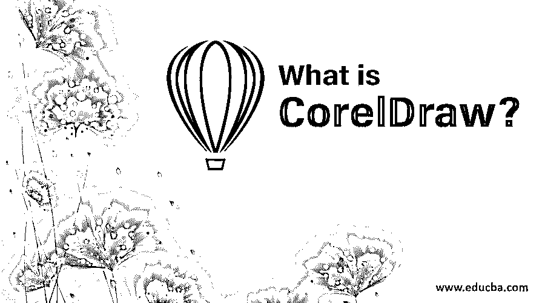
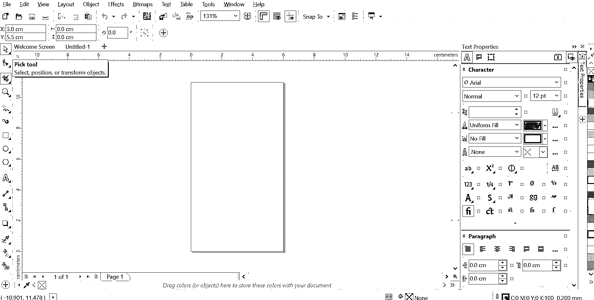
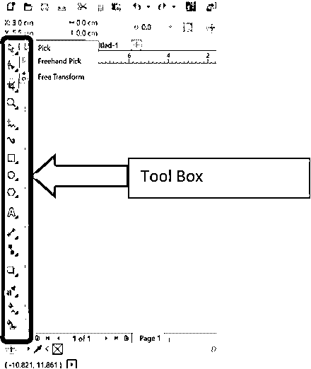
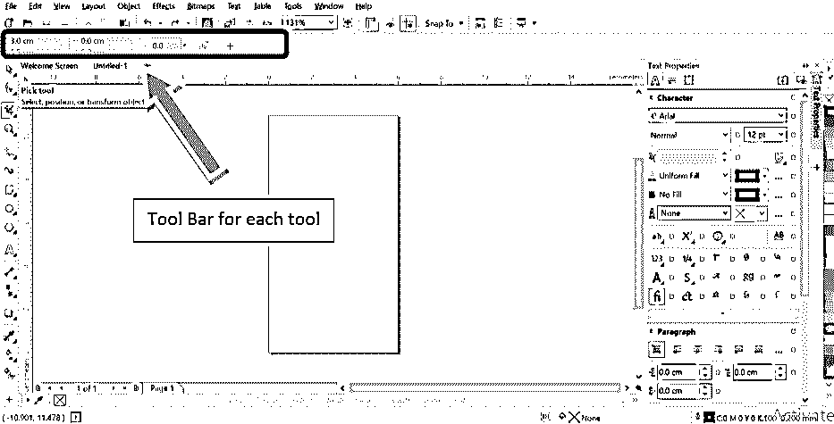

# 什么是 CorelDraw？

> 原文：<https://www.educba.com/what-is-coreldraw/>

## Coreldraw 简介

在本文中，我们将看到一个关于 Coreldraw 的概述。这是最终的数字 2D 平面设计解决方案。简单！Corel Draw 是由 Corel 公司开发的图形设计软件，用于开发矢量图形，使其具有更正式的定义。

在线和印刷广告、产品设计、建筑布局设计、各种领域的在线素描艺术家，以及我们在手机或杂志上看到的几乎所有漂亮的视觉效果，都曾在某个时候在 Corel Draw 中设计过。

<small>3D 动画、建模、仿真、游戏开发&其他</small>

### CorelDraw 中的工具

典型的 CorelDraw 窗口如下所示。

这是你可以找到工具箱的地方。

菜单栏中还有一个工具下拉菜单，但是几乎所有重要的菜单都包含在工具箱中。

当你选择每一个工具时，它会进一步有它的下拉选项，而且，它们也会在菜单栏下面的工具栏中单独显示它们的属性，就像这样。让我们先浏览一下每个工具。

*   **拾取工具:**它实际上是一个选择工具，行为类似于 Photoshop 中的移动工具，在工具的右下角，你会发现各种选项，如徒手拾取和自由变换。这些选项允许您调整图像大小，放大或缩小图像，甚至用鼠标创建镜像。

*   **形状工具:**在选中的图像、形状甚至文本上，这个工具会给出节点和句柄。因此，一旦节点被选中，该部分的对象可以弯曲成不同的纹理，如涂抹，涂抹，旋转等。

*   **裁剪工具:**顾名思义，它将帮助修剪选定的图像、形状或文本。它还可以让你像刀子一样切割图像(将形状分成可以单独编辑的不同切片)，甚至可以擦除图像(使用橡皮擦)。

*   **缩放工具:**让您缩放到正在创建或编辑的形状或文本的任何微小部分，以便设计师可以相应地纠正差异。

*   手绘工具:这个工具是大部分魔法发生的地方。此工具有许多绘图选项，可让您创建和绘制任何设计。所以这个工具在平面设计的第一阶段起着非常重要的作用。

*   **艺术媒体工具:**这个工具就像一个手绘的画笔或喷笔或钢笔。因此，如果你想创作书法文本或涂鸦，这个工具会很有用。

*   **矩形工具:**这个工具将帮助创建一个矩形的形状。它也有一个 3 点矩形的选项。这只意味着一旦绘制了矩形的两个节点，只需拖动鼠标就可以创建一个快速矩形。

*   **椭圆工具:**这个工具可以让你创建一个类似圆形的椭圆形状。它也有助于快速形状制作使用 3 点椭圆，就像矩形工具中的一个。

*   **多边形工具:**基本上，多边形工具用于创建超过 4 条边的形状。但是 Corel Draw 可以让你在同一个标题下创建许多现成的形状，如横幅形状、星形、螺旋形、箭头、图形纸网格。

*   **文本工具:**这里的文本工具将帮助创建文本字符和文本框。您可以使用工具栏中显示的属性和格式选项来编辑它们。如果您需要以表格形式创建文本，也可以使用此工具直接添加表格。

*   **平行尺寸工具:**很多土木工程师和建筑师都用 Corel Draw。这里有一个现成的工具，可以像这样显示各种形状的尺寸。

*   **直线连接器工具:**该工具将有助于连接不同边之间的任何形状或直角，同时保持边分离。

*   **阴影工具:**这是效果赋予工具。它将斜面，浮雕，阴影，挤压等。，所选形状的任何部分或正在设计的文本。

*   **滴管工具:**这是常用的拾色器工具。这里最酷的部分是属性滴管。因此，你也可以选择厚度，大小和所有其他的效果和形状的属性，并直接复制到你的形状。

*   交互式填充工具:这很像一个普通的填充工具，但是像渐变和全部这样的选项可以在这里应用，因此得名。这也有一个网格工具。该工具将在形状周围创建网格，然后在需要复杂着色或阴影的情况下，例如在水果或风景画中，可以给每个网格着色。

*   **智能填充工具:**该工具将帮助在封闭路径的形状中填充颜色。使用起来非常快。非常类似于 MS Paint 中的油漆桶工具。

### Corel Draw 的特点

其中一个主要的特点，在我看来，是它提供了一个友好的 UI，可以很快学会使用，因此对于初学者来说可以扩展他们的创造力，专业人士可以做出一些令人惊叹的设计和布局。它有活的多功能工具，如节点造型和网格填充等。，几乎在设计的任何地方都派得上用场。作为一个矢量图形软件不像素化其设计，保证高质量的印刷。因此，许多高清晰度打印机被编程为接受 Corel 格式文件进行打印。

其他功能包括接受多种文件格式进行编辑，能够在所有处理器上运行等等。

从用户的角度来看，CorelDraw 提供了一个易于设计的环境。所有印刷媒体、现场素描、产品设计等。，能够以同样的创造力和对细节的精确性来创作。

### 结论

在学习图形设计时，Corel Draw 比其他复杂的软件更容易，也比大多数软件更有用。其中一个好处是，他们不断更新功能，所以店内总是有更令人兴奋的东西。

### 推荐文章

这是一个什么是 CorelDraw 的指南？这里我们讨论 CorelDraw 中使用的介绍和工具及其特性。您也可以阅读以下文章，了解更多信息——

1.  [CorelDraw 中不同工具的特点](https://www.educba.com/coreldraw-tools/)
2.  [Illustrator 的 18 大快捷键](https://www.educba.com/illustrator-shortcut-keys/)
3.  [在 Photoshop 中使用矩形工具的步骤](https://www.educba.com/rectangle-tool-in-photoshop/)
4.  CorelDraw 的替代产品有哪些？
5.  [学会使用 Photoshop 中的裁剪工具](https://www.educba.com/crop-tool-in-photoshop/)
6.  [CorelDRAW 版本|特性](https://www.educba.com/coreldraw-versions/)

