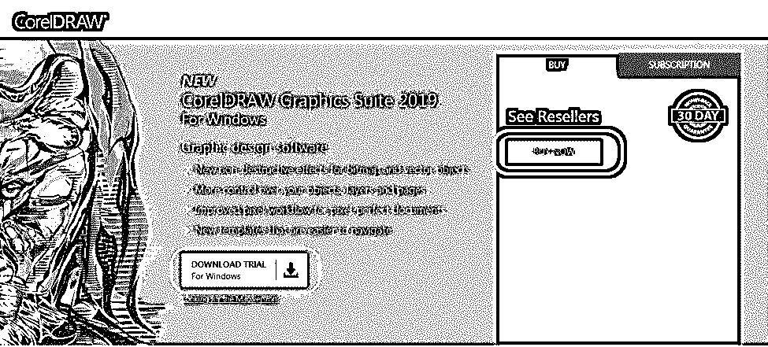
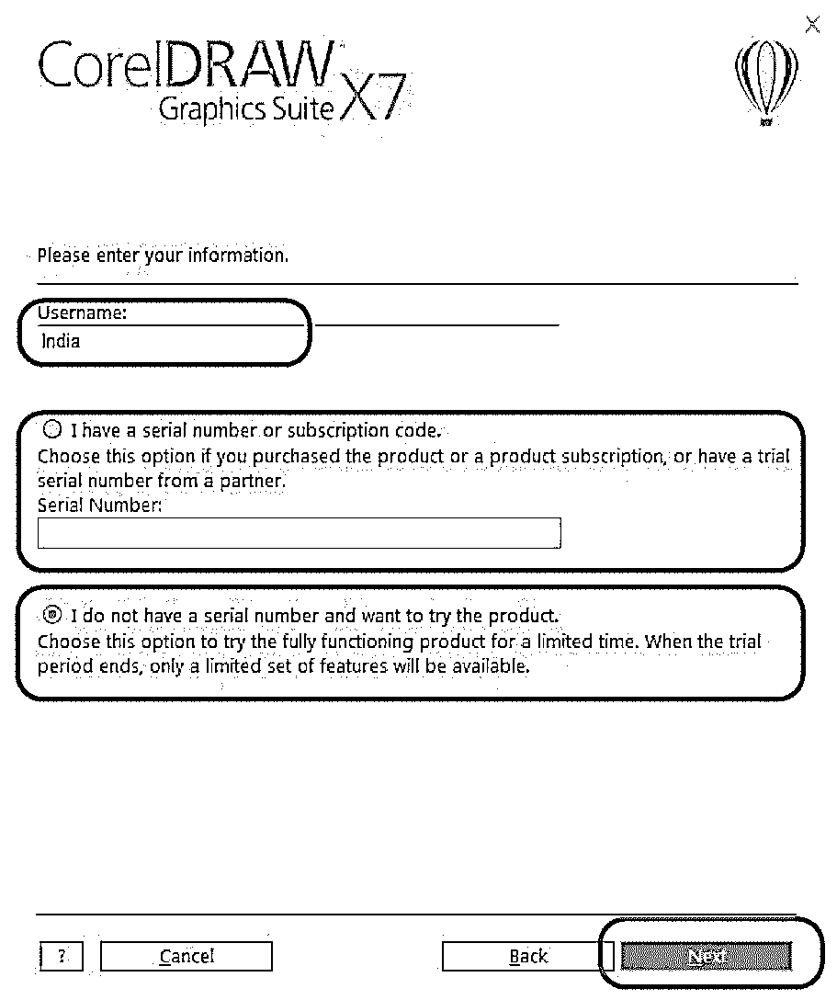
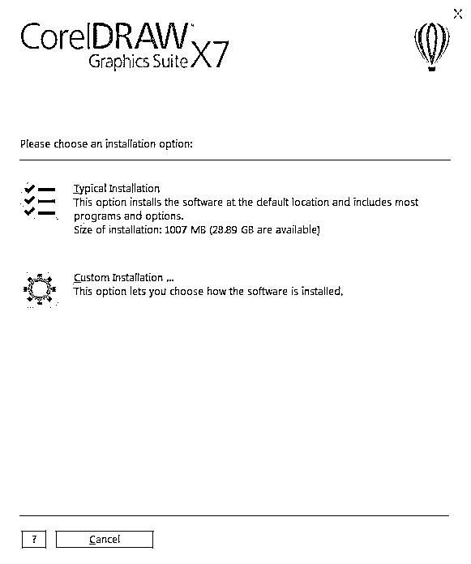
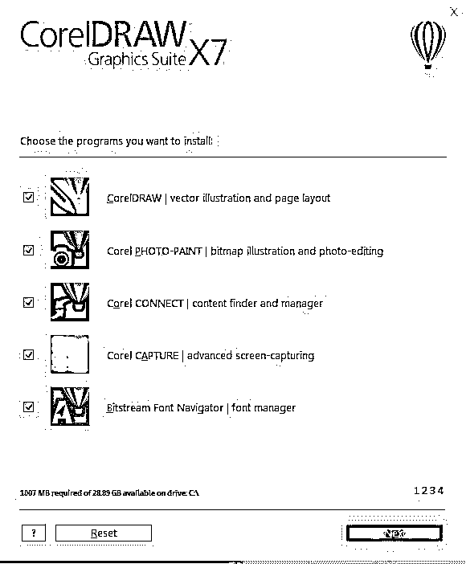
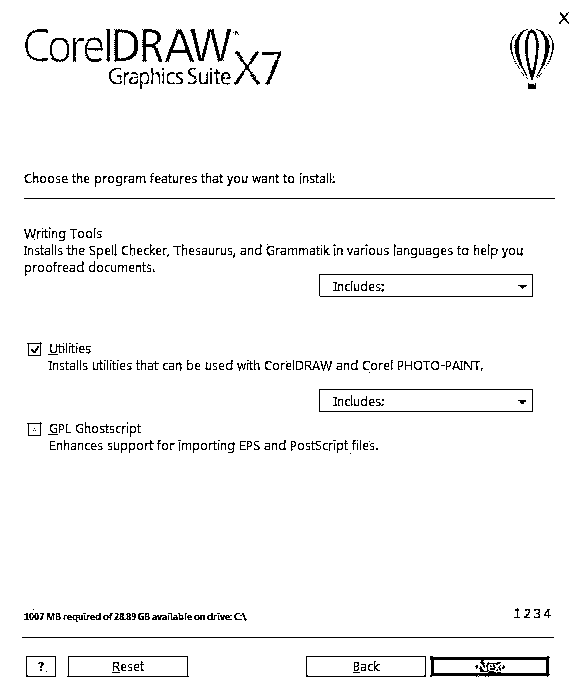
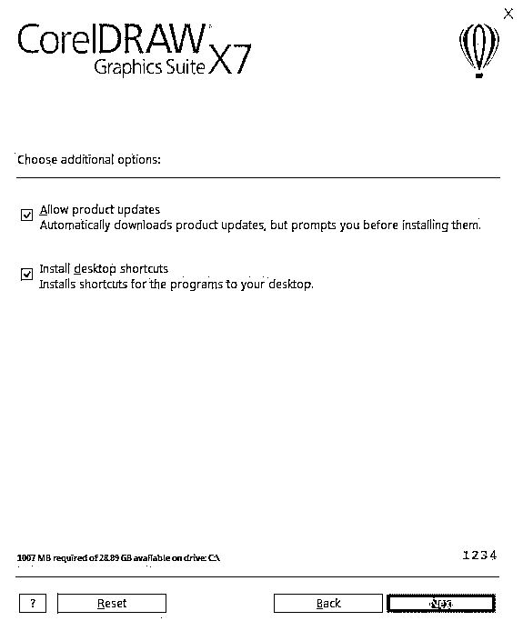
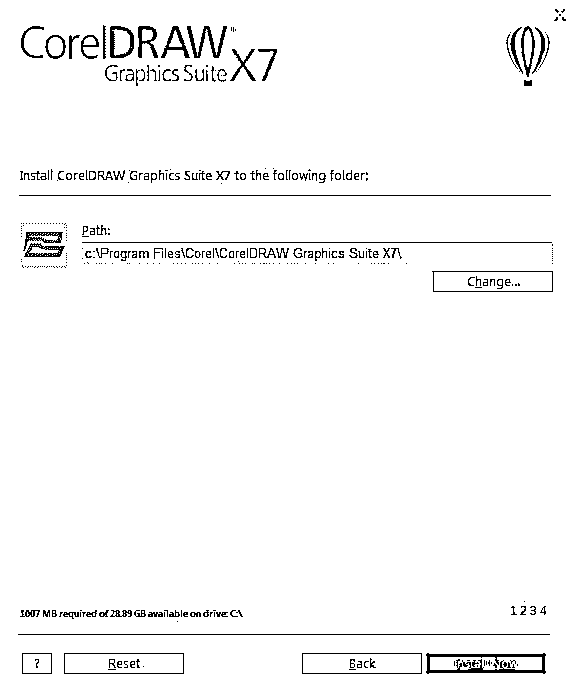
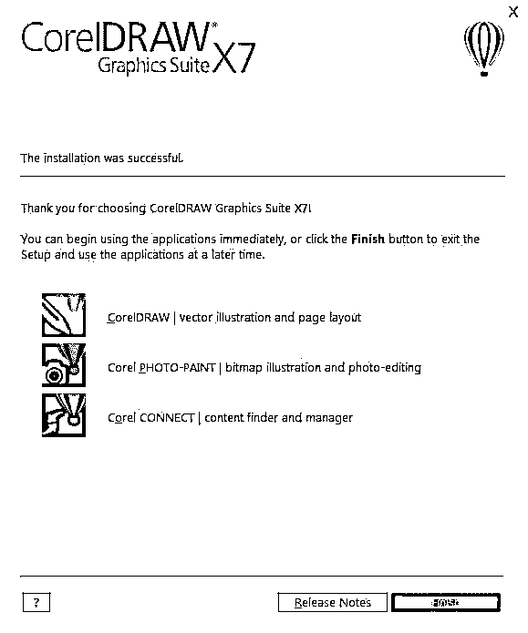
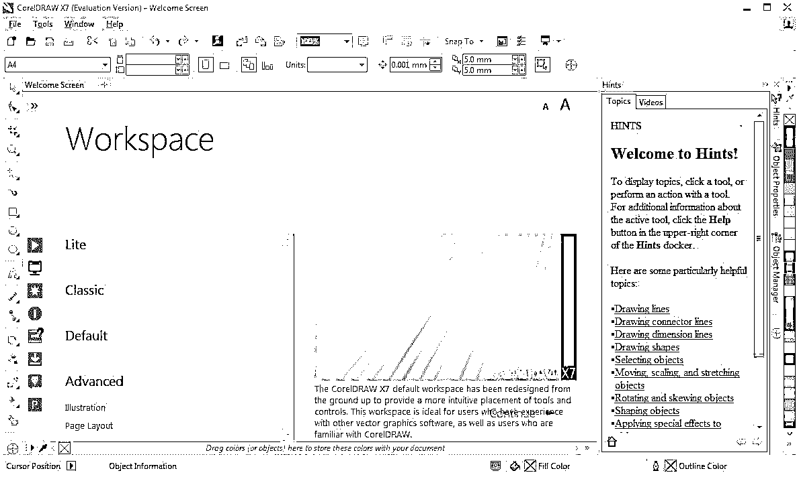

# 安装 CorelDraw

> 原文：<https://www.educba.com/install-coreldraw/>

## CorelDraw 安装简介

CorelDraw 是一款用于矢量图形编辑的软件，可以为徽标、标志、信头、海报、证书、发明信函、插图、基于网络的艺术作品以及各种其他二维图像相关项目编辑或创建图像。这个软件是由 Corel 公司开发和销售的。所有的图形属性都可以做。有兴趣成为平面设计师的人必须学习 Corel Draw，因为它是他们项目中常用的工具。该软件是用户友好的，易于学习，以及面向设计的最佳环境，为这类项目。这里我们将讨论如何安装 CorelDraw 软件。

安装之前，需要检查一些系统属性，如下所示:-

<small>3D 动画、建模、仿真、游戏开发&其他</small>

**1。** **硬盘** **磁盘空间**–c 盘 4GB 以上空闲空间，用于安装应用程序和工作。

**2。Ram-** 4GB 或更高(建议 8GB)。

**3。处理器-** 支持 4GHz 或更快速度的 64 位英特尔或 AMD。

**4。操作系统-**64 位配置的 Windows 或 IOS。

**5。互联网-** 连接必须足够好，以便注册并获得软件激活、订阅通知和访问所有在线服务等必要要求。

### 安装 CorelDraw

下面是安装 CorelDraw 最新版本的详细步骤。

#### 第一步

*   要下载并安装最新版本的 CorelDraw，请访问 CorelDraw 的官方网页。此网页包含 CorelDraw 中包含的所有最新功能。
*   [点击此处](https://www.coreldraw.com/en/product/coreldraw/?topNav=en)并选择下载试用包免费版(30 天)试用包。点击立即购买从 Corel 购买套餐。该工具具有学生和专业人士在多种使用状态下根据要求进行图形设计工作的所有个人和专业需求。该工具的最新版本有新的模板和简单的导航模式，像素工作流程的发展等等。

*   点击下载试用包后，浏览器将 Corel draw 执行文件下载到系统下载；确保在整个安装过程中保持 Wi-Fi 或互联网连接处于活动状态。试用包将在有限的时间内有效，而 Corel Corporation 将根据购买的包按年、月和季度发放购买的包。购买的序列号将被发送到用户的个人电子邮件 id，不应与他人共享。

#### 第二步

*   下载完成后，双击 CorelDraw Graphics Suite x 7 installer _ inquired bit . exe 文件，以向导方式运行安装应用程序。这样，软件开始在系统上安装。让应用程序与所有支持文件一起完全执行。

#### 第三步

*   在加载安装的所有支持文件后，该工具会要求阅读并接受 Corel 用户许可协议的条款和条件，其中包含版权用户许可细节和条件的详细信息。然后点击下一步。

#### 第四步

现在出现一个窗口询问用户名；默认情况下，工具会将用户登录名作为用户名使用；如果需要更改，用户可以更改它。

*   接下来，如果用户购买了序列号，那么我们可以选择“我有一个序列号”并输入购买后通过电子邮件收到的序列号。
*   如果用户希望使用 trail pack，则用户可以直接选择“我没有序列号，想试用该产品”，然后单击“下一步”。

#### 

#### 第五步

有两种不同类型的安装选项可供选择

*   **典型安装:–**选择此安装过程将在默认的 C:\ drive 中完成，包含所有程序和属性选项；在执行此操作之前，请确保 C:\驱动器中至少有 4 GB 空间来完成安装过程。将安装完整的应用程序。

#### 

*   **自定义安装:–**通过选择此选项，我们可以自定义套件中用户熟悉的有限应用程序。和 4 个安装集可以在安装前进行配置。这些将在下面详细论述。

#### 

#### 第六步

*   用户可以从套装中检查想要的应用程序列表，取消他们不熟悉的应用程序，然后单击下一步。

#### 

#### 第七步

*   可以配置的基本实用程序和编写工具很少，但大多数用户都默认使用它，因为该工具拥有方便使用的最佳工具安排，不要更改任何设置；单击下一步。

#### 

#### 第八步

*   选中并允许获取产品相关的更新，并在桌面上创建快捷方式；如果用户不想在桌面上有快捷方式，我们可以关闭它。然后点击下一步。

#### 

#### 第九步

*   确认安装软件的路径，这有助于安装所有要存储的支持文件和插件，并有助于在系统中启动应用程序。
*   如果需要，用户可以更改工具选择的驱动器或默认位置。然后点击立即安装。

#### 

#### 步骤 10

*   工具需要一些时间来安装所有的软件文件；等到应用程序安装完成。我们可以在 Corel Draw 上执行国际设计概念。

#### 

#### 步骤 11

*   一个窗口显示完整的安装成功状态，以及所选套件中已安装应用程序的详细信息。在此阶段，应用程序已安装在系统中，并准备好与桌面上的桌面快捷方式一起使用。
*   单击“完成”以完成安装过程。

#### 

#### 第 12 步

*   现在双击 CorelDraw 或右键单击
*   并选择“以管理员身份运行”,以便系统启动该应用程序，由于后端配置和设置的原因，安装后首次打开该应用程序时需要一些时间。

#### 

#### 步骤 13

*   应用程序主页打开，应用程序已准备好使用项目要求的所有属性、首选项、层和工具。在开始新项目之前，用户可以根据需要创建文件大小的概念。工作区有多种尺寸，如所有纸张尺寸，如 A4、A3、徽标制作、邀请函、海报和所有可在软件中使用的其他可打印内容。

#### 

**注:**购买套餐的用户将从 Corel Draw 收到一份已购买套餐的电子回执。保存它以备将来参考。

### 推荐文章

这是如何安装 CorelDraw 的指南。这里我们讨论了在我们的系统中安装 CorelDraw 的概念和步骤。您也可以阅读以下文章，了解更多信息——

1.  [什么是 CorelDraw？](https://www.educba.com/what-is-coreldraw/)
2.  [CorelDRAW Powerclip](https://www.educba.com/coreldraw-powerclip/)
3.  [CorelDraw 替代品](https://www.educba.com/coreldraw-alternatives/)
4.  [Corel Draw 的用途](https://www.educba.com/uses-of-corel-draw/)

