# CorelDRAW 标志设计

> 原文：<https://www.educba.com/coreldraw-logo-design/>

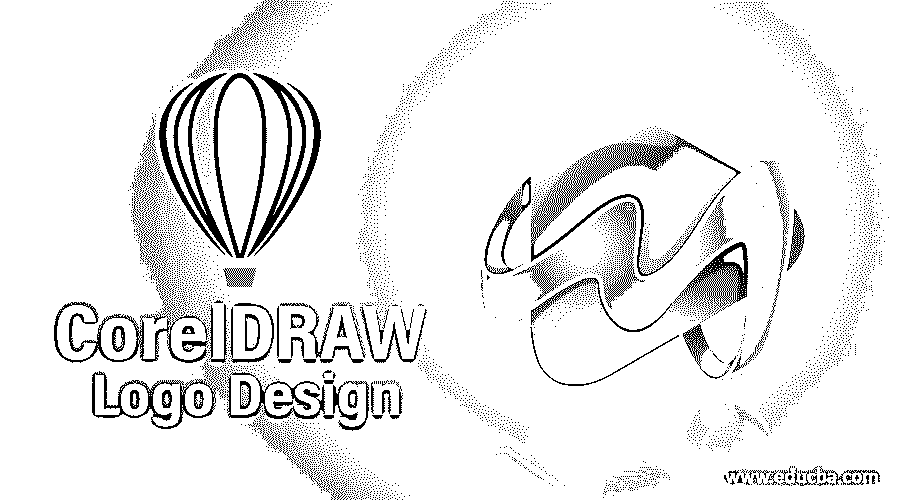

## CorelDRAW 标志设计简介

在 Corel draw 中设计一个 Logo 可以轻松搞定；我们需要做的就是创建基本的形状，并根据需要修改它们，或者我们可以简单地创建一个文本并添加效果，使其看起来更具视觉吸引力。使用合适的工具，如椭圆、矩形等，创建 Coreldraw 徽标设计很容易。以及诸如斜面、混合轮廓等效果。Corel draw 是图形设计师在 IT 行业中使用最多的图形软件。

### 如何在 CorelDRAW 中创建 Logo？

以下是创建 CorelDRAW 徽标设计的步骤。

<small>3D 动画、建模、仿真、游戏开发&其他</small>

第一步:第一步是创建一个空白文档空间，我们可以在这里设计和处理页面大小，文档的大小可以是网页、A4，也可以是定制的像素宽度和高度，例如 800* 600 像素。根据我们要创建的内容，方向可以是横向或纵向。主要颜色模式将是 CMYK 还有另一个选项，比如 RGB。最后一个选项是分辨率，这是在旧版本的 Corel 绘制渲染分辨率；它可以是 72、96、150、200 和 300。

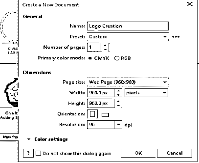

**第二步:**使用 Logo 模板。我们可以使用默认模板来创建标志设计；导航到文件- >从模板新建，然后选择类别为徽标。通过使用徽标设计，我们可以从模板中复制它，创建一个新文档并粘贴它。

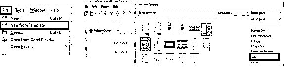

**第三步:**选择 Logo 模板，Logo 模板会自动加载到空白文档中。

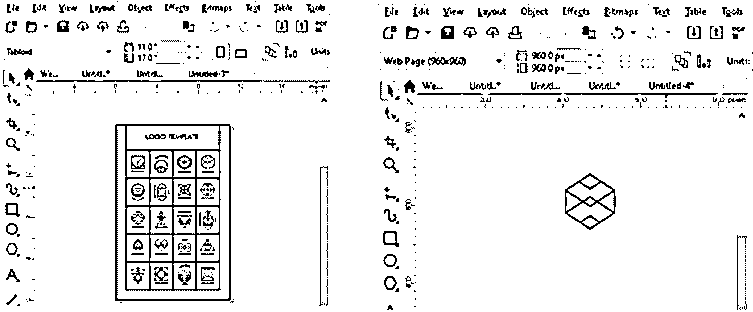

**步骤 4:** (或)使用形状工具–现在我们已经创建了文档，从左侧窗格的工具箱中，我们可以使用椭圆(快捷方式:F7)、多边形(快捷方式:Y)和矩形(快捷方式:F6)等形状工具在空白文档中创建所需的形状。下面的截图显示了一个标志的基本框架结构。单击右侧工具窗格上的椭圆工具并拖动以创建一个椭圆。同样，使用矩形工具创建一个矩形。下面是没有使用矩形&椭圆工具效果的样本标志。

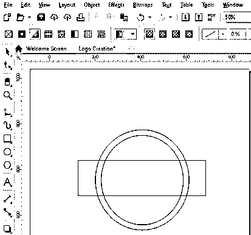

第五步:我们可以通过点击文本工具或按下 F8 键在形状中添加徽标名称。然后我们需要在需要 logo 名称的地方画一个文本框。右边有一个调色板；通过 CTRL + A 完全选择文本，然后单击所需的颜色。

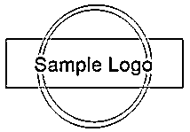

**第六步:**使用交互式填充工具。现在我们已经创建了一个基本的形状，我们需要给它着色或填充图案。我们可以使用交互式填充工具或按 G 来填充创建的形状；单击工具窗格中的图标将在顶部打开所有类型的填充。

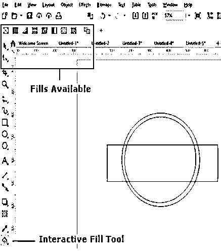

**第七步:**我们可以选择合适的填充工具，用合适的图案进行填充。我们可以应用不同的填充，如喷泉填充、矢量填充、均匀填充、位图填充等。下面的快照上有一个喷泉填充创建的标志设计。点击交互式填充工具，并将其应用于椭圆，这将使设计看起来如下。一旦你应用它，你将得到一个应用于物体的图案的方向；改变方向会影响对象的设计。

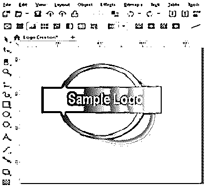

**步骤 8:** 应用阴影效果，使用工具窗格上的投影工具，给设计应用阴影；我们可以移动箭头——就像下面这张快照上的箭头一样，这将使阴影向它所指的方向流动。

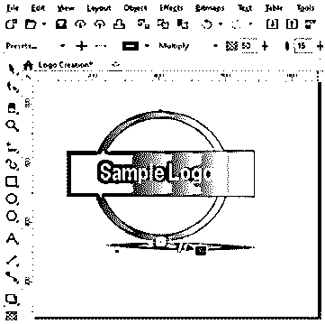

**步骤 9:** 我们可以通过点击文档顶部的位图图案填充图标，将位图图案添加到设计中，使其更具视觉吸引力，并将其应用到形状中。在下面的快照中，一个灰色图案被映射到椭圆的外环。

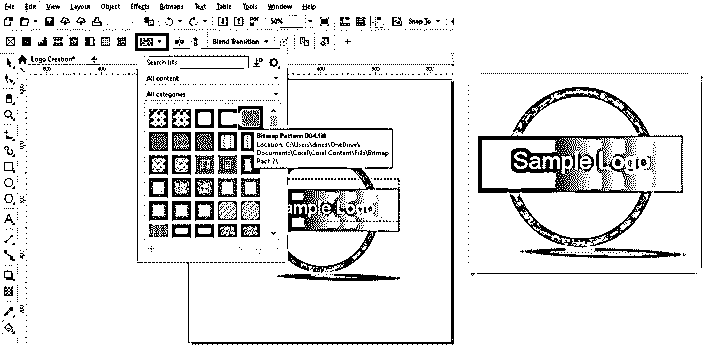

**步骤 10:** 通过导航文件- >导入，然后选择我们想要设置为背景的图像，就可以将背景图像添加到已创建的徽标中。完成后，我们可以通过右键单击图像顺序将图像移动到背景- >到页面背面，或者我们可以移除背景和外环，使其看起来更像一个符号。

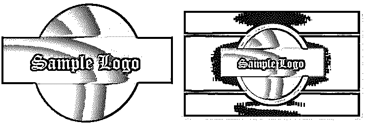

**第十一步:**我们甚至可以用简单的文字设计 logos，添加效果。像前面解释的那样在一个空白文档中创建一个简单的文本，如下图所示。

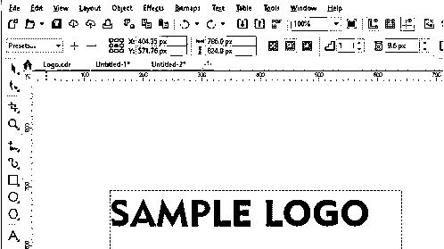

**第 12 步:**点击空白区域，按 F11 键改变 Logo 的背景。

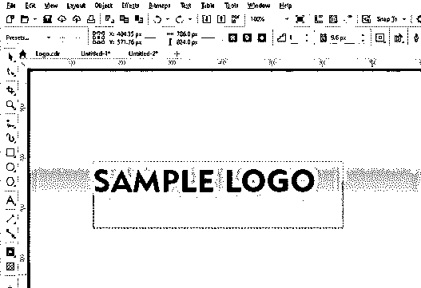

**第十三步:**点击文字，按 Ctrl+Q；使用右窗格中的轮廓工具或按 Ctrl + F9 挤压文本，如下图所示。

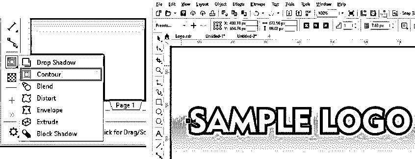

第 14 步:我们可以再次应用轮廓效果，使其更加不同；单击轮廓工具并拖动箭头，在原始文本内绘制另一个文本。

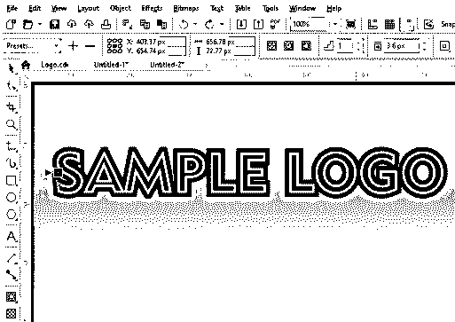

**步骤 15:** 这里，我们将使用混合/斜面/塑料效果，使用选择工具选择文本，并上下移动文本以创建效果。我们可以使用混合工具将其与旁边的对象混合。在应用混合效果和改变文字和背景的颜色后，Logo 看起来如下图所示。

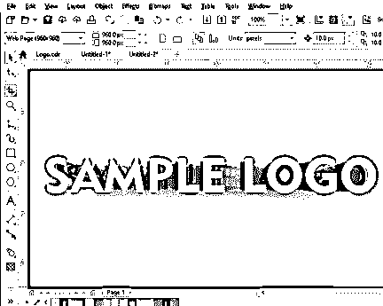

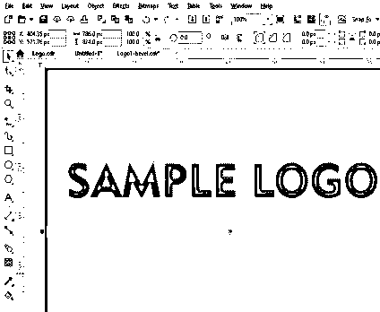

步骤 16: 我们也可以简单地通过应用斜角效果来斜角文本，要做到这一点，导航到效果- >斜角和改变风格为软边或浮雕。我们也可以通过效果- >纹理- >塑料来应用塑料效果，然后改变灯光颜色。下面的快照对文本有一个塑料效果。

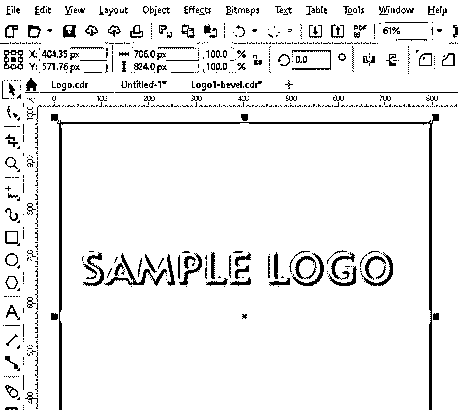

### 推荐文章

这是一个 CorelDRAW 标志设计指南。在这里我们讨论了如何使用 logo 模板创建一个 logo，也学习了在 Corel draw 中创建一个文本 logo 的各个步骤。您也可以浏览我们的其他相关文章，了解更多信息——

1.  [探索 CorelDRAW 工具的功能](https://www.educba.com/coreldraw-tools/)
2.  [如何安装 CorelDraw？](https://www.educba.com/install-coreldraw/)
3.  CorelDraw 的顶级替代产品有哪些？
4.  [常用的 CorelDRAW 快捷键](https://www.educba.com/coreldraw-shortcut-keys/)
5.  [CorelDRAW 版本特性指南](https://www.educba.com/coreldraw-versions/)

