# CorelDraw 查看器

> 原文：<https://www.educba.com/coreldraw-viewer/>

## CorelDraw 查看器简介

CorelDraw Viewer 是一个帮助用户查看 CorelDraw 文件的程序，无需下载 CorelDraw 软件。CorelDraw 是一个创建特定文件扩展名. CDR 的矢量软件。

.CDR 是一种文件扩展名，不能在所有软件上查看或打开，就像 JPG 格式一样。要查看带有这种扩展名的文件，用户需要一个明确的程序来帮助他们这样做。

<small>3D 动画、建模、仿真、游戏开发&其他</small>

### CorelDraw 查看器列表

帮助用户查看或编辑的一些程序。CDR 文件是有限的，但要么是可下载的免费软件程序，要么可以立即在线获得。

以下是开放和免费的程序，可以很容易地下载来查看。CDR 文件:-

#### 1.想像

这是一个市场上可以买到的免费软件程序。用户可以很容易地下载软件，并使用它来查看。CDR 文件。此外，这个程序还可以创建动画和批处理序列图像。对于寻找开源软件的平面设计师来说，这是一个非常有用的程序。以下是查看的步骤。CDR 文件:-

*   下载并安装软件。
*   打开软件

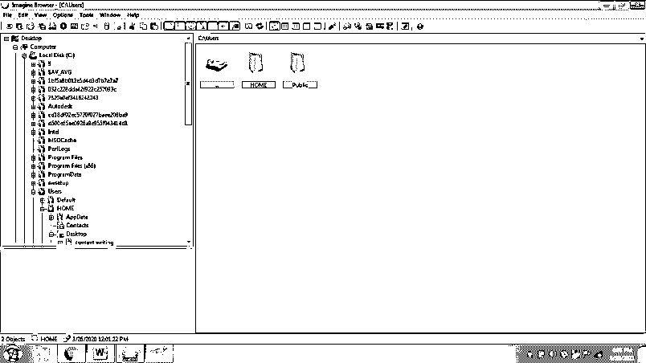

*   点击文件并打开。

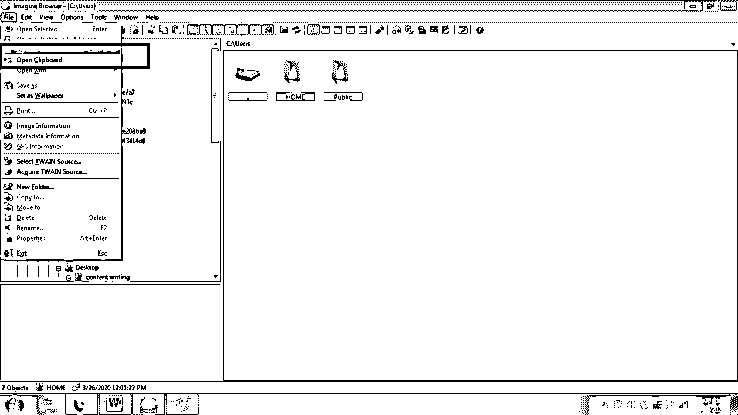

*   选择源文件夹。CDR 文件被保存以查看相同的

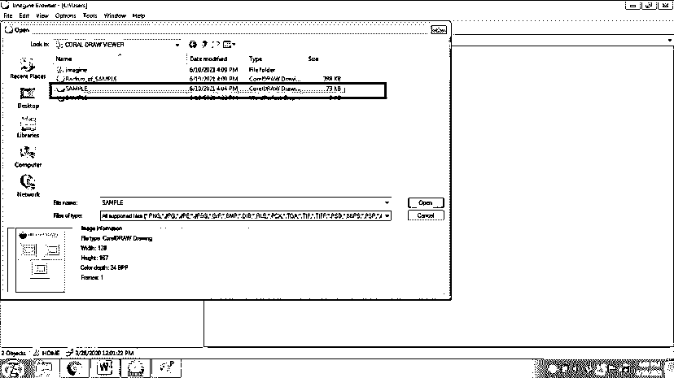

*   单击文件并查看。CDR 文件。

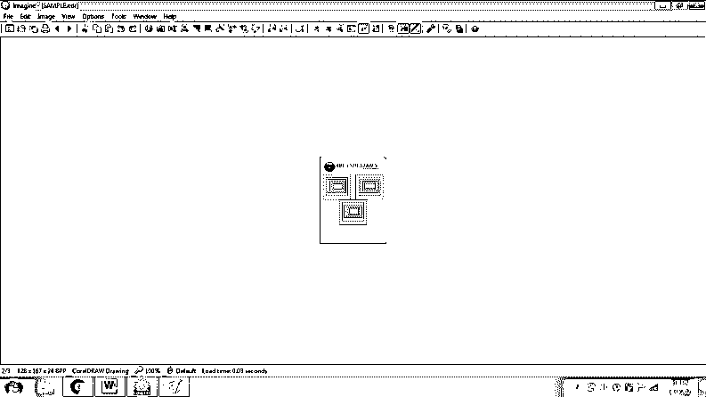

#### 2.Inkscape

这个程序是由 SODIPODI 开发人员创建的。INKSCAPE 是 Sodipodi 程序的继承者。这个程序是一个矢量图形程序，它在。SVG 格式(可缩放矢量图形)。其他矢量文件格式，如。可以在软件中查看和编辑 CDR。该程序证明是实用的和用户友好的。它有多种功能，可以很容易地用来创建矢量艺术品。

以下是查看的步骤。软件中的 CDR 文件:-

*   从互联网下载并安装该程序。
*   打开程序，点击文件。

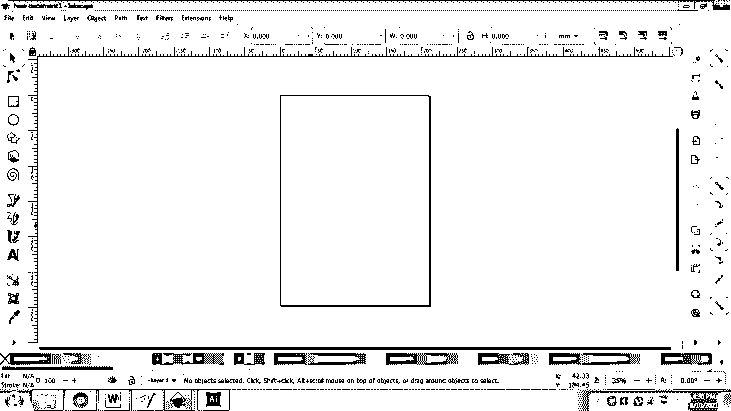

*   点击打开并选择需要查看的 CDR 文件

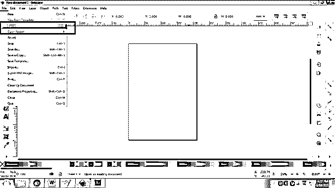

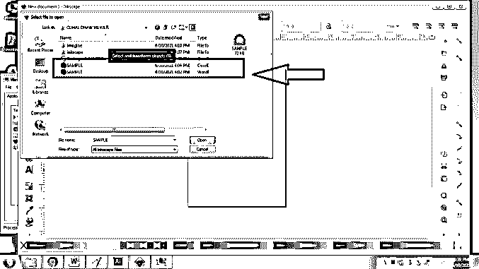

*   打开 CDR 文件。该程序也能够很容易地修改艺术品。

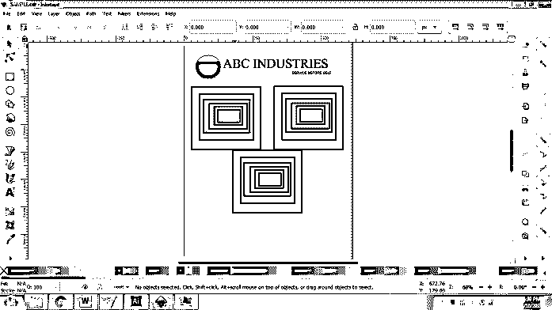

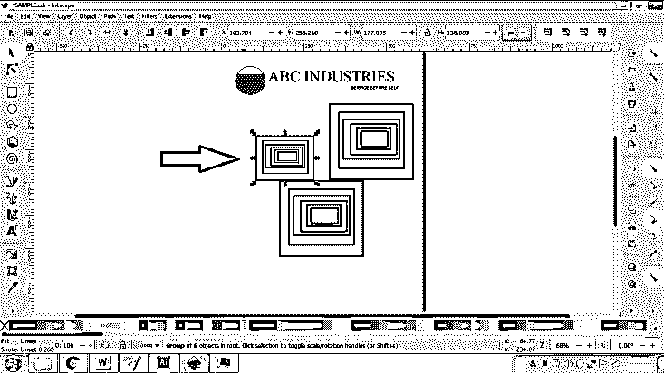

#### 3.伊尔凡观点

这是一个开源免费软件程序，由 Irfan Skiljan 于 1996 年创建。这个程序使用户能够创建、编辑和组织图形艺术作品。通过可下载的插件，这个程序可以用来观看 CorelDraw 的作品。该计划是一个巨大的成功，并因其快节奏的界面和用户友好的配置而受到图形设计师的欢迎。它可以安装在 Windows 32 位和 64 位操作系统上。

以下是查看的步骤。软件中的 CDR 文件:-

*   从互联网下载并安装该程序。
*   打开程序

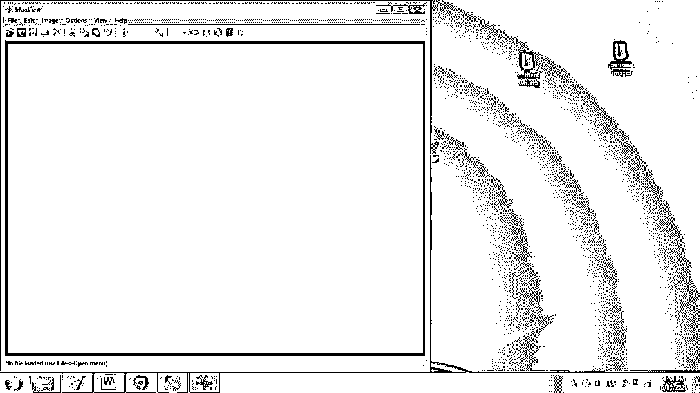

*   点击文件>打开

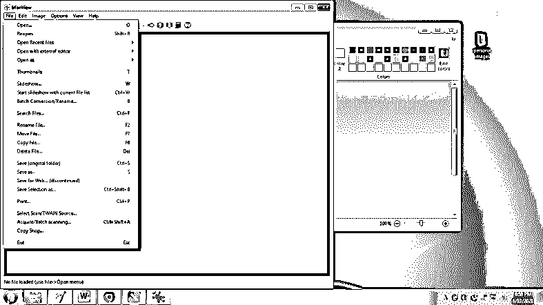

*   选择需要查看的 CDR 文件

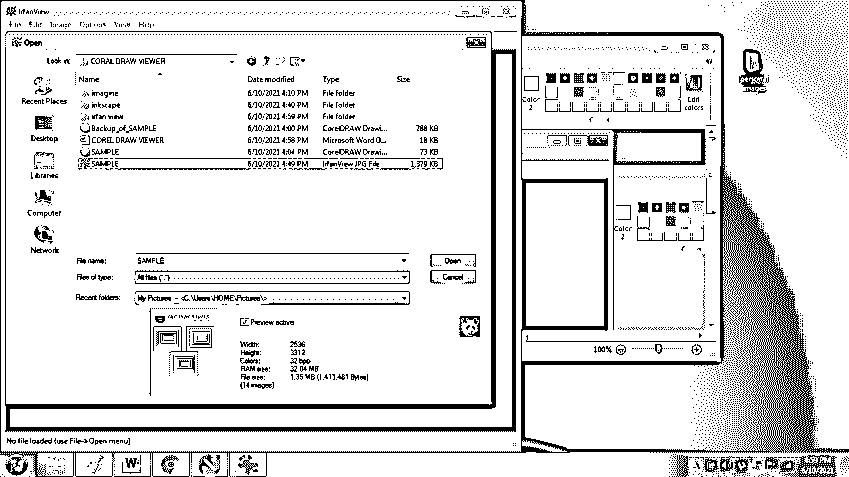

*   点击打开并查看 CDR 文件。

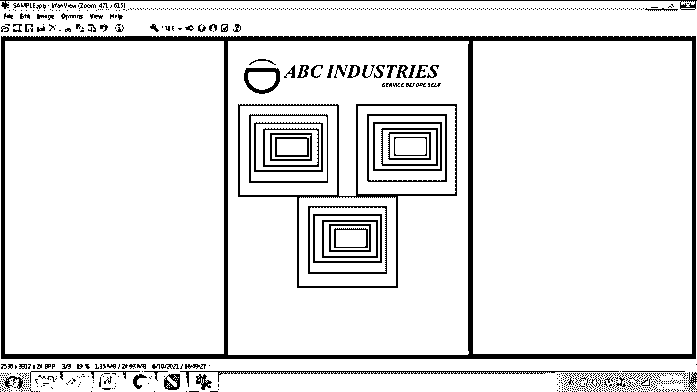

#### 4.书店老板

这个程序是开源软件，用于查看、创建和编辑图像和艺术品。这个程序是由文档基金会开发的。这个特别的程序也可以在网上用 LibreOffice Online 的名字获得。该程序可用于查看和编辑。CDR 文件。除了创建矢量图形，Libre Office 还能够进行文字处理，创建 excel 电子表格、PowerPoints，以及执行数学计算。这是一个有用的程序，具有多种功能，用户甚至可以免费使用。

要查看. CDR 文件，用户需要 CorelDraw Viewer 或将相同的文件扩展名转换为其他文件格式。这样，用户可以在任何软件上查看. CDR 文件。

帮助用户将。CDR 文件到任何其他文件格式是位恢复 CDR 转换器向导。

下面是用户转换的步骤。CDR 文件转换为任何其他文件格式。

*   从 internet 下载并安装位恢复 CDR 转换器向导
*   点击选择文件，如下图所示

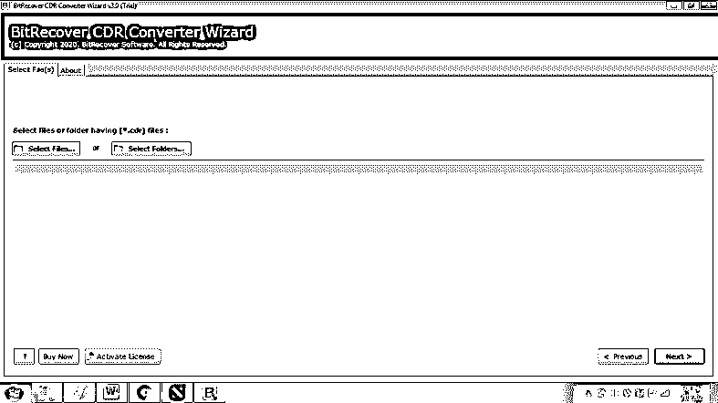

*   选择。需要转换的 CDR 文件。

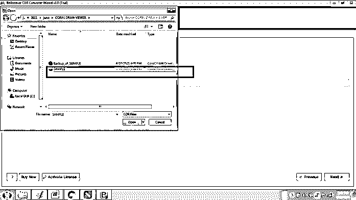

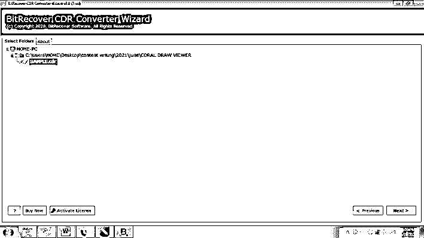

*   选择您需要转换的文件扩展名。CDR 文件到

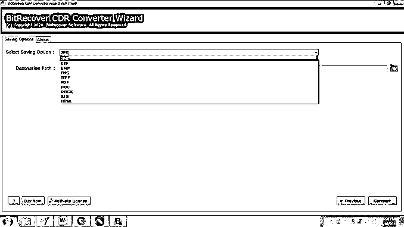

*   选择需要保存文件的目标文件夹

*   点击转换

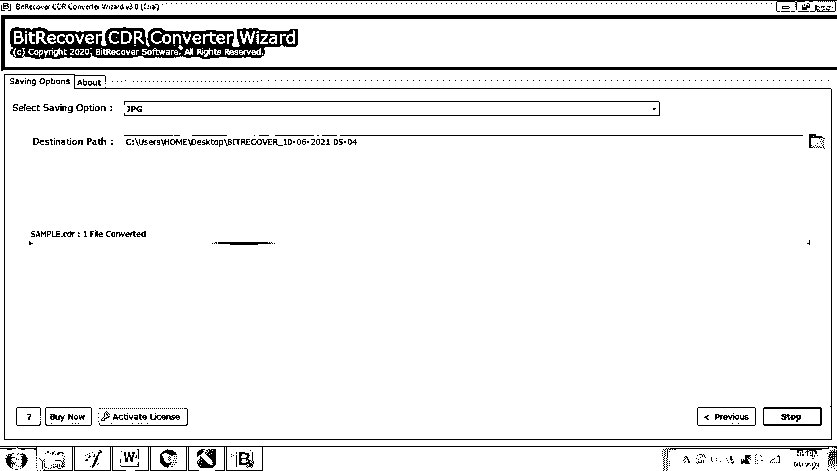

这个程序将帮助用户转换现有的。CDR 文件转换为任何其他文件格式。和程序一起。CDR 文件也可以在 Adobe Photoshop 或 Adobe Illustrator 程序中查看。

### 结论

要查看 CorelDraw 文件，用户可以使用上面列出的一些方法。由于 CorelDraw 是一个付费且昂贵的程序，不是每个用户都有能力购买该软件。在这种情况下，用户可以使用开源免费软件程序来查看或编辑图形艺术作品。

此外，这些开源程序只能用于查看和简单编辑。对于复杂和详细的修改，用户必须购买 CorelDraw 软件。

### 推荐文章

这是 CorelDraw 查看器的指南。在这里，我们详细讨论了 CorelDraw 查看器列表，如 Imagine、Inkscape、Irfan view 和 LibreOffice，并给出了解释。您也可以看看以下文章，了解更多信息–

1.  [CorelDraw 替代品](https://www.educba.com/coreldraw-alternatives/)
2.  [Corel Draw 的用途](https://www.educba.com/uses-of-corel-draw/)
3.  [CorelDRAW 快捷键](https://www.educba.com/coreldraw-shortcut-keys/)
4.  [什么是 CorelDraw？](https://www.educba.com/what-is-coreldraw/)

