# 核心原始字型

> 原文：<https://www.educba.com/coreldraw-fonts/>

## CorelDRAW 字体介绍

在这篇文章中，我们将学习如何使用 CorelDRAW 字体。我们将使用 Corel 字体管理器，它与 CorelDRAW 图形套件一起安装。它在 Windows 和 Mac 平台上都可用，并且其工作方式也相同。Corel 字体管理器是一个与 CorelDRAW 和 photo paint 配合使用的应用程序，用于搜索、过滤和组织字体，包括各种与字体相关的功能。它的字体管理功能有助于简化工作流程。这是一个存放所有字体的地方，不再需要从成千上万的字体中寻找你需要的字体。

### CorelDRAW 字体的步骤

下面提到以下步骤:

<small>3D 动画、建模、仿真、游戏开发&其他</small>

#### 第一步

首先，让我们看看在使用属性栏中的文本工具时，如何从主 CorelDraw 应用程序访问字体列表。显示字体的当前计数。有些字体来自 windows，其余的来自关注的文件夹。

#### 第二步

默认情况下，关注的文件夹位于文档-> Corel -> Corel 内容->字体中

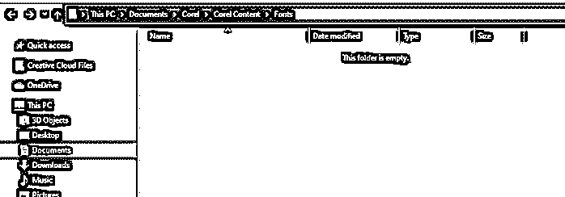

#### 第三步

有一个选项，甚至可以根据不同的标准过滤字体

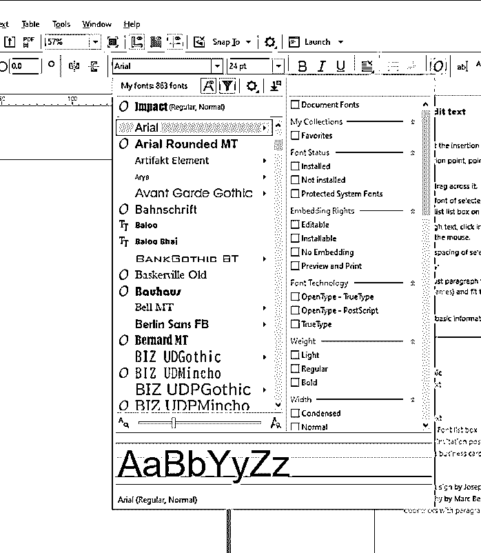

#### 第四步

让我们从打开 Corel 字体管理器开始。您可以使用桌面上的图标打开，或者对于 Windows 用户，可以选择从 Corel photo paint 或 CorelDRAW 工具栏启动它，这是应用程序启动器。

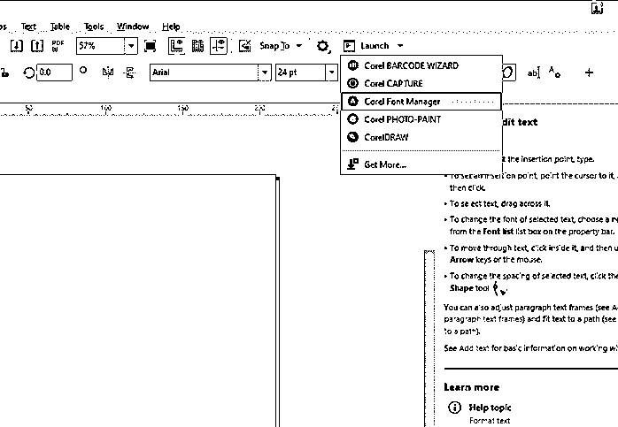

#### 第五步

打开后，我们可以看到底部的字体数量，与 Corel draw 中的字体列表相匹配。但是当我们使用这个独立的应用程序时，我们会得到更多关于字体本身的信息。

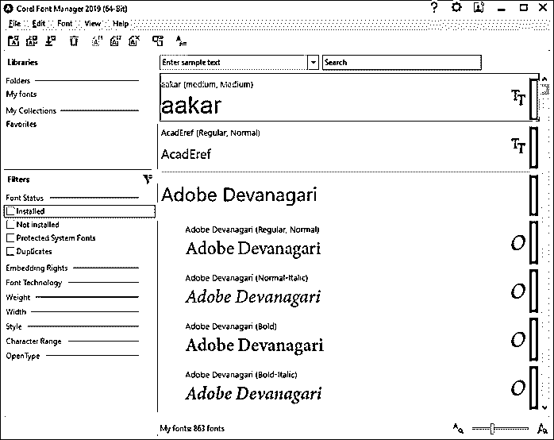

#### 第六步

从工具栏中启用显示字体属性，这将为我们提供关于字体的更多信息。

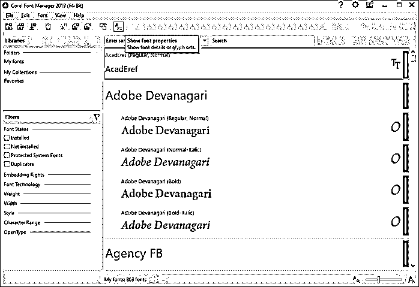

#### 第七步

默认情况下，当您在预览窗格中选择任何字体时，您将获得字形预览。我们将在后面详细讨论字形。

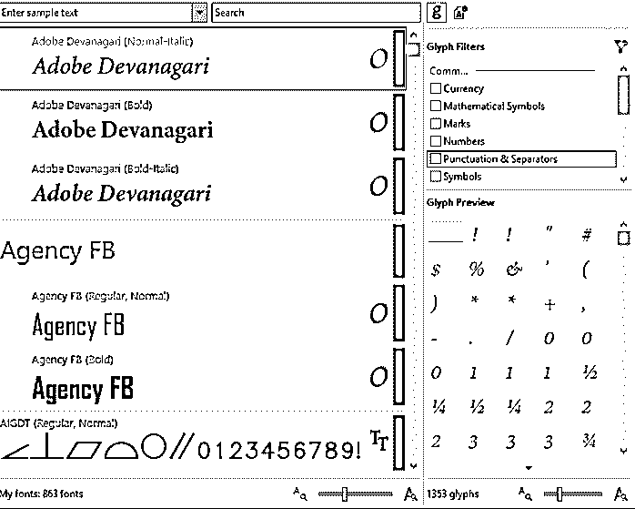

#### 第八步

通过点击细节图标，您将获得更多关于字体的信息，如其家族，文件路径，大小，版本，字体技术，斜体，重量，宽度，嵌入，制造商，设计师，版权，以及它是否在一个集合中。

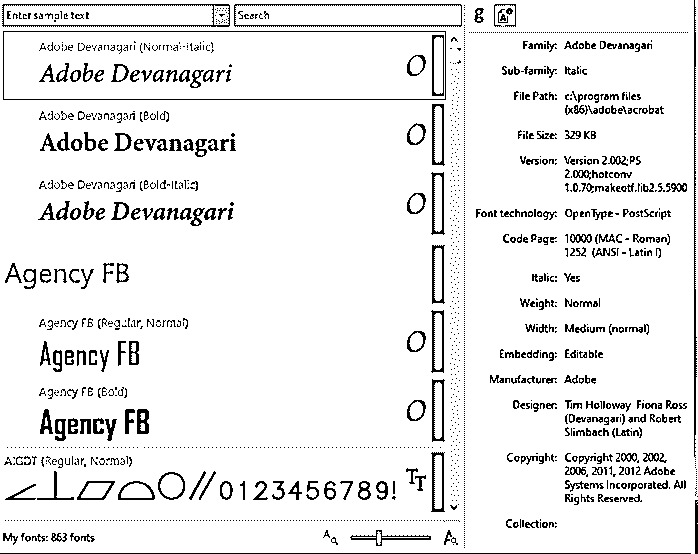

#### 第九步

底部有一个调整字体预览大小和调整字形大小的选项。

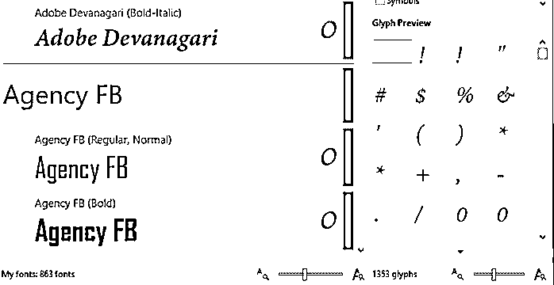

#### 步骤 10

右边的绿色条表示字体已安装。

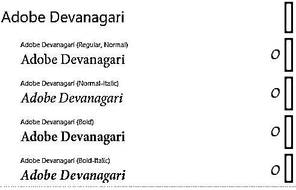

#### 步骤 11

受保护的系统字体也显示为绿色条，但带有锁图标。

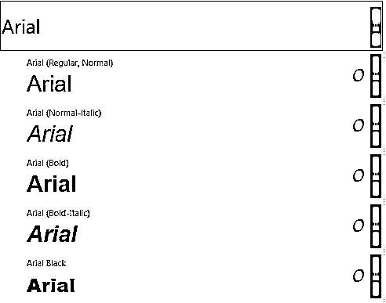

#### 第 12 步

仅在 CorelDraw 中可用且未安装的字体显示为黄色条。

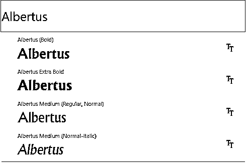

#### 步骤 13

如果您想要从“资源库”面板中查看特定类型的字体，可以应用滤镜。

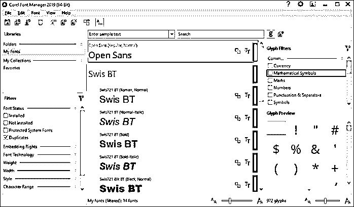

#### 第 14 步

我们可以右键单击字体来显示副本

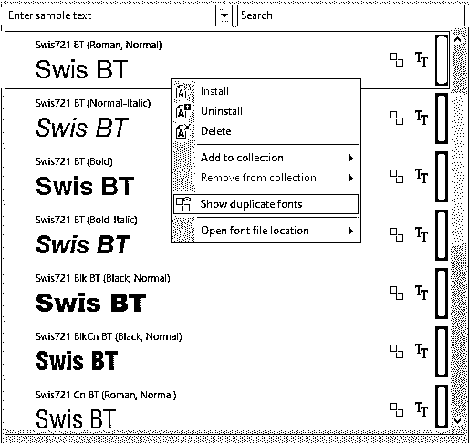

#### 第 15 步

然后再次右键单击以显示副本。

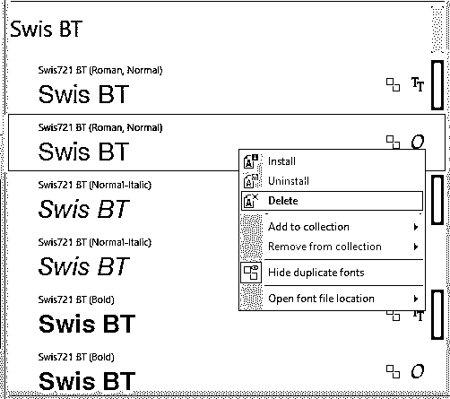

#### 步骤 16

如果字体标题为灰色，则该系列包含已安装和未安装的字体。

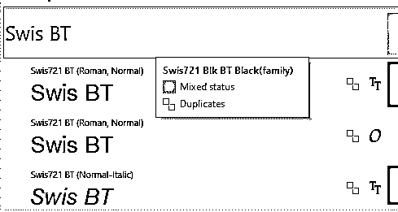

#### 第 17 步

您也可以右键单击任何字体，打开该字体的安装位置。

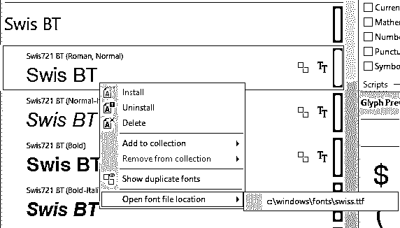

#### 步骤 18

您可以通过右键单击或从工具栏卸载任何已安装的字体，这将只能从 CorelDraw 访问，而不能从任何其他应用程序访问。

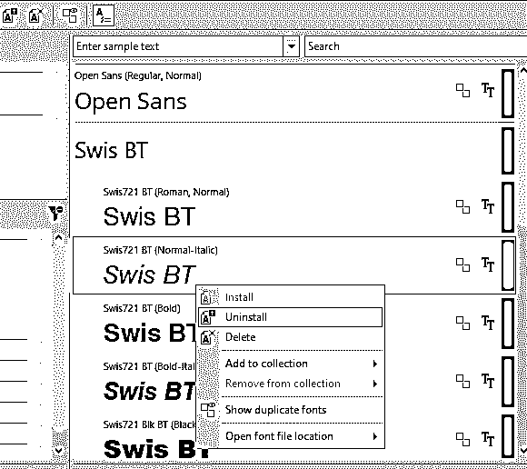

#### 步骤 19

同样，如果黄色条指示字体未安装，则右键单击安装或从工具栏安装。

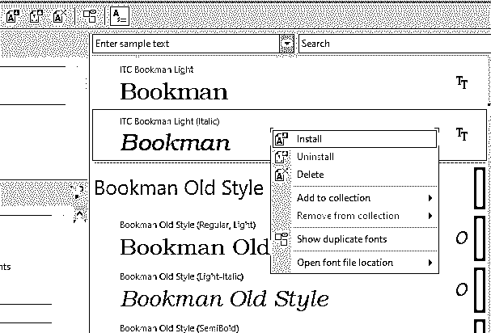

#### 第 20 步

您可以输入示例文本来查看字体的外观，而不是默认的字体名称。清除样本文本字段将给出默认字体名称预览。

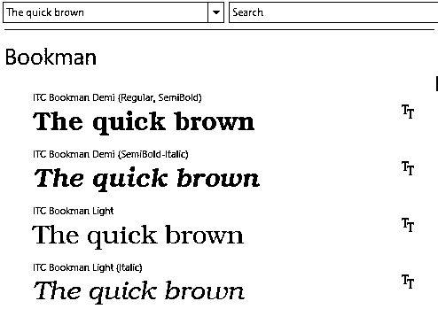

#### 步骤 21

也可以从搜索栏中搜索特定的字体名称。

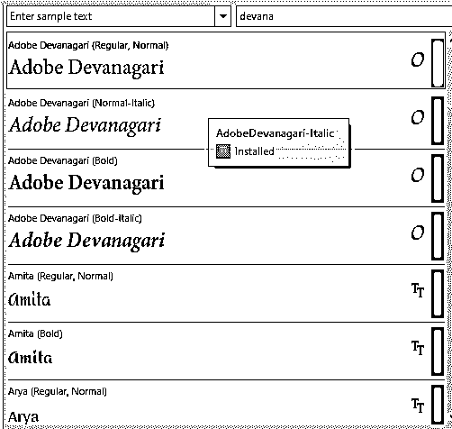

#### 第 22 步

边上的字母表示字体的类型。t 表示真实字体，O 表示开放字体。

#### 步骤 23

当选择一种字体时，我们在属性面板上得到字形预览，并且有各种过滤器。如果字体属于 OpenType 类型，则过滤器被分为诸如 common、scripts、OpenType 之类的类别。

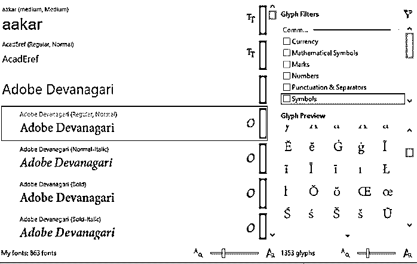

#### 第 24 步

在“库”面板中，一些文件夹包含字体。如果您想添加一个文件夹，您可以浏览到该文件夹添加那些字体。

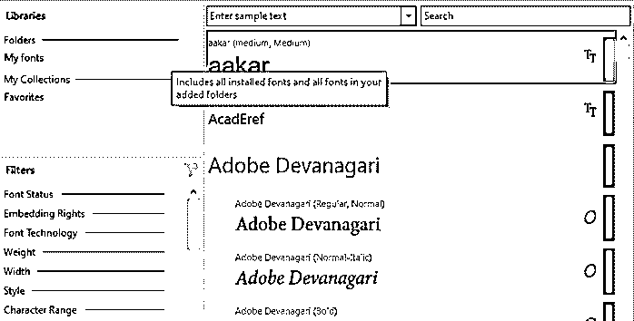

#### 第 25 步

正如我们所看到的，我们已经使用文件菜单或工具栏添加了一个包含字体的文件夹。

#### 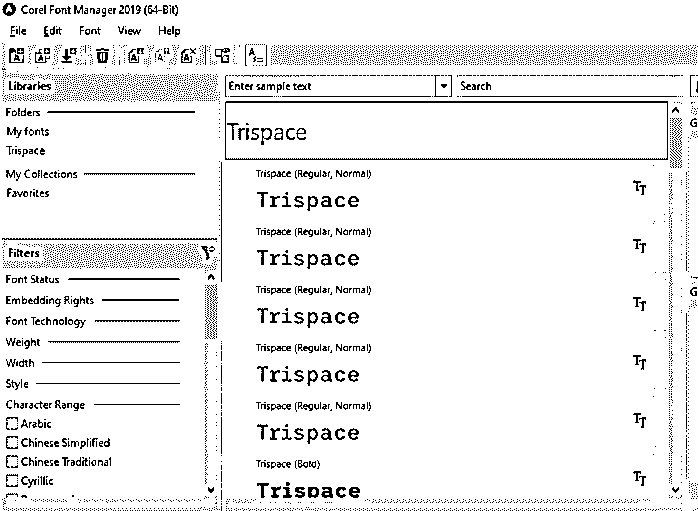

#### 第 26 步

然后是我的收藏，其中有一个收藏叫做收藏夹。我们可以右键单击该字体并将其添加到集合中，或者可以将它拖动到文件夹内的字体中。

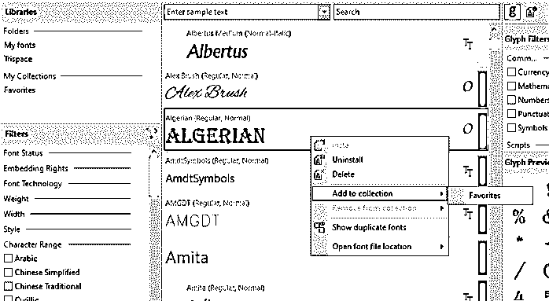

#### 第 27 步

我们还可以通过在收藏中单击鼠标右键来删除收藏。这不会删除或卸载它。

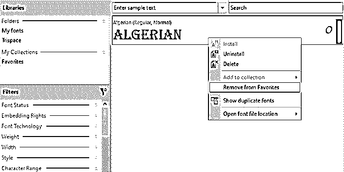

#### 步骤 28

单击获取更多…从 CorelDRAW 字体包中获取更多字体，您可以购买这些字体包。

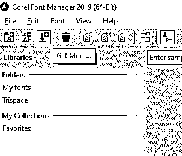

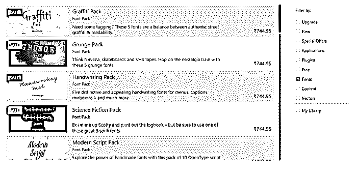

#### 步骤 29

然后，让我们从工具栏或文件菜单添加一个集合。我们添加了一个名为脚本的集合。

#### 步骤 30

现在转到我的字体并搜索脚本，然后拖动到脚本文件夹或右键单击并添加到脚本集合。

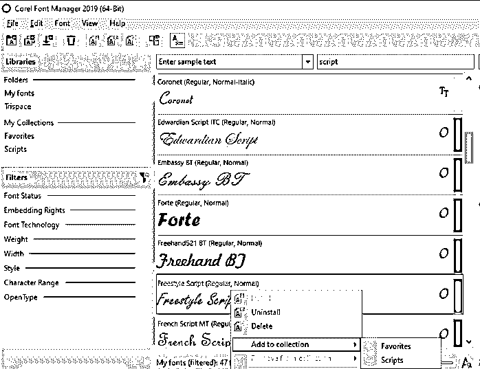

#### 步骤 31

然后，当您右键单击字体集时，您可以选择安装或卸载字体。还有一个删除文件夹的选项。

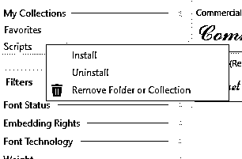

#### 步骤#32

还有各种字体过滤器，包括字体状态、嵌入权限、字体技术、粗细、宽度、样式、字符范围和 OpenType

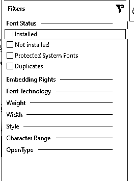

#### 步骤#33

然后是一些用户界面定制，从右上角的设置图标，像改变主题从轻，中，暗，黑。此外，窗口边框颜色可以调整。窗口的大小可以根据显示的内容进行缩放。

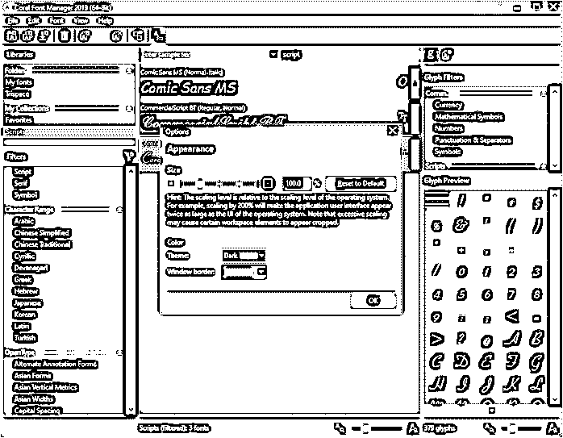

#### 步骤#34

回到 CorelDraw 主应用程序，我们可以找到我们已经创建的文件夹和脚本集合。

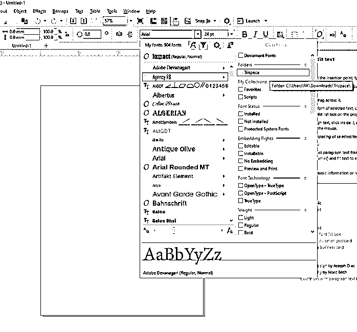

### 结论

在本文中，我们看到了 Corel 字体管理器如何在 CorelDRAW 图形套件生态系统中工作。我们已经看到了如何管理和组织字体，以了解系统字体和已安装的字体，以及仅在 CorelDRAW 应用程序中可用的字体。除此之外，我们还看了过滤器、集合和字形。

### 推荐文章

这是一个 CorelDRAW 字体指南。这里我们讨论 Corel 字体管理器如何在 CorelDRAW 图形套件生态系统中工作。您也可以看看以下文章，了解更多信息–

1.  [CorelDraw 替代品](https://www.educba.com/coreldraw-alternatives/)
2.  [Corel Draw 的用途](https://www.educba.com/uses-of-corel-draw/)
3.  [CorelDRAW 快捷键](https://www.educba.com/coreldraw-shortcut-keys/)
4.  [什么是 CorelDraw？](https://www.educba.com/what-is-coreldraw/)

