# CorelDraw 模板

> 原文：<https://www.educba.com/coreldraw-templates/>

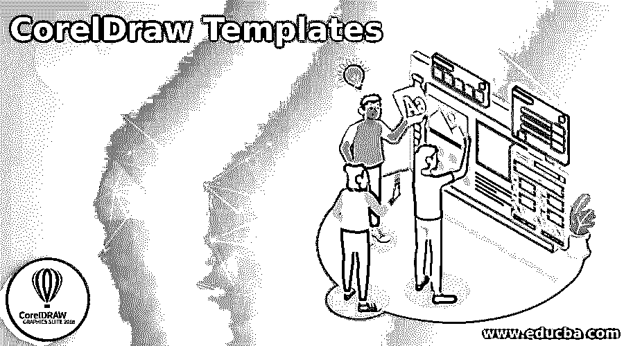

## CorelDraw 模板简介

Corel Draw 模板是一组预定义的页面样式和布局格式，是为方便设计者和用户而现成的。模板也称为图形设计软件中的模板。在本主题中，我们将了解 CorelDraw 模板。

### 如何创建 CorelDraw 模板？

在 Corel draw 中，用户可以创建和编辑模板，也可以根据需要使用预定义的模板。Corel Draw 是一个矢量程序，用于创建通常用于打印和媒体目的的矢量图形。

<small>3D 动画、建模、仿真、游戏开发&其他</small>

**如何在 CorelDraw 中创建模板**

当用户找不到预定义的模板时，他们可以创建自己的模板。以下步骤将有助于在 Corel Draw 中创建模板:-

1.  打开 Corel 绘图软件。
2.  我们将看到一个包含所有工具栏的欢迎屏幕。

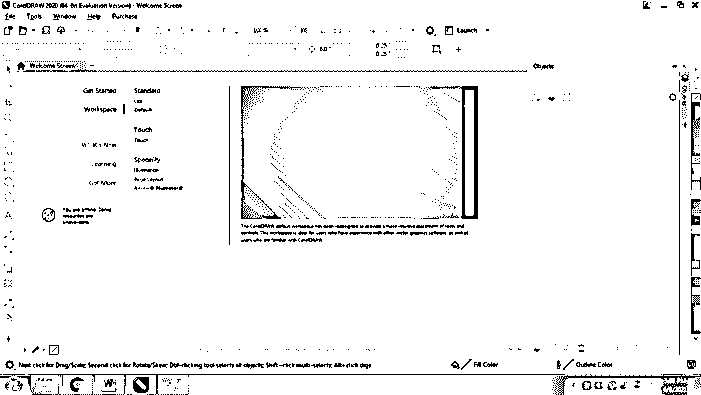

3.  从“文件”菜单创建新文件

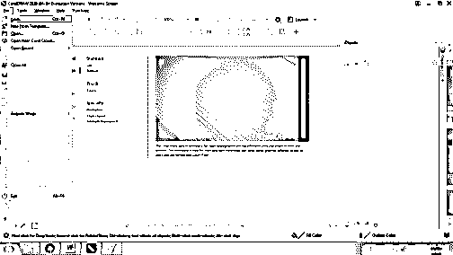

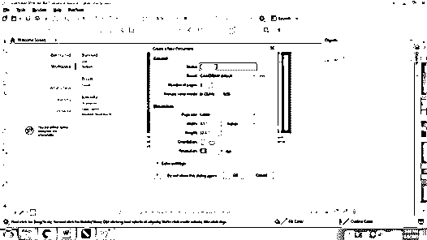

4.  创建一个你选择的模板，使用不同的样式和格式选项，如下所示。模板只是可以存储和保存的文件，并且可以在任何给定的时间点进行编辑或修改。

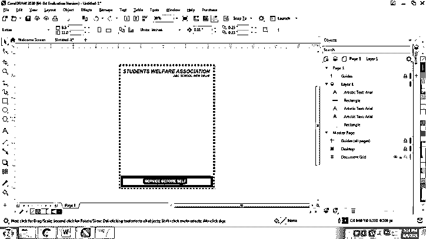

5.  创建模板后，转到文件>另存为模板。

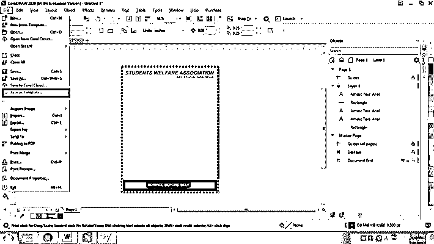

6.  用特定的名称保存模板，以便您可以随时对其进行编辑。

7.  当要求保存时，将出现如下所示的对话框:-

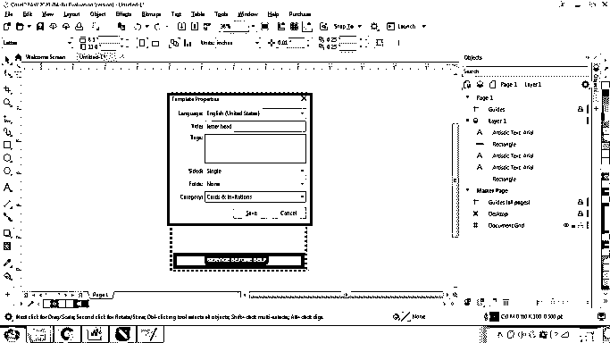

8.  这个对话框有几个需要记住设置:-
    *   **标题**:这是模板的名称。该标题名称与模板的缩略图一起显示。
    *   **标签**:额外的标签可以在本节提及。
    *   **双面**:该选项让您选择是单面模板还是双面模板。
    *   **折叠** :-该选项将告知已使用或将要使用的折叠次数
    *   **类别**:该类别包含一个列出的可以用于模板的行业列表。
9.  完成后，模板将被保存，并可用于编辑和格式化。

### 如何使用模板？

Corel Draw 模板可以用作新文档的样本布局，或者我们可以创建一个新文档并将现有的模板导入其中。

当我们使用软件中预装的模板时，CorelDraw 会编辑原始文件，并使用模板编辑文件的格式和布局。

在 CorelDraw 中，有一个可用的各种预安装模板的列表。

按照以下步骤将模板应用到新文档:-

1.  开启 coreldraw
2.  转到文件并选择从模板新建

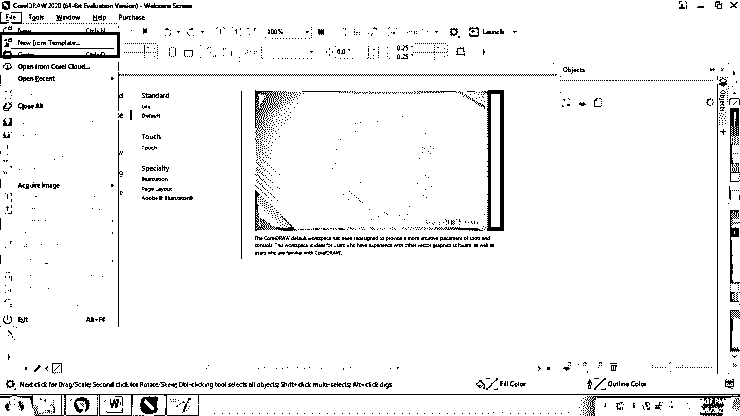

3.  该选项将帮助用户从软件中可用的不同模板中进行选择。
4.  例如，用户想要创建海报。因此，从对话框中，选择所有模板和海报。

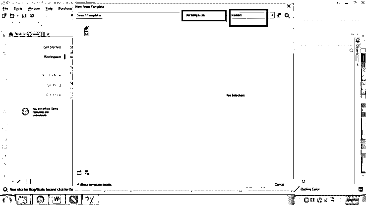

5.  之后，选择软件中可用的特定模板，然后单击打开。

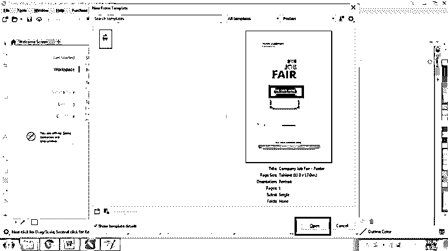

6.  模板打开后，用户可以根据需要编辑和重新格式化模板。

### 如何编辑或修改模板？

Coral draw 模板是平面设计师的必去之地。可以根据需要创建、修改或从互联网下载模板。例如，用户需要创建一份具有良好定义的布局和格式风格的简历。因此，CorelDraw 模板可以快速使用，甚至可以根据用户进行修改。

以下是编辑模板的步骤:

1.  转到文件并从模板中选择新建

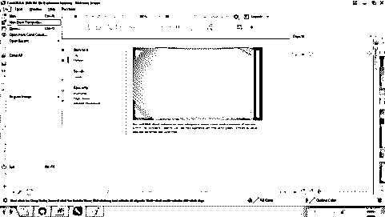

2.  选择所有模板，然后在筛选内容框中选择简历。

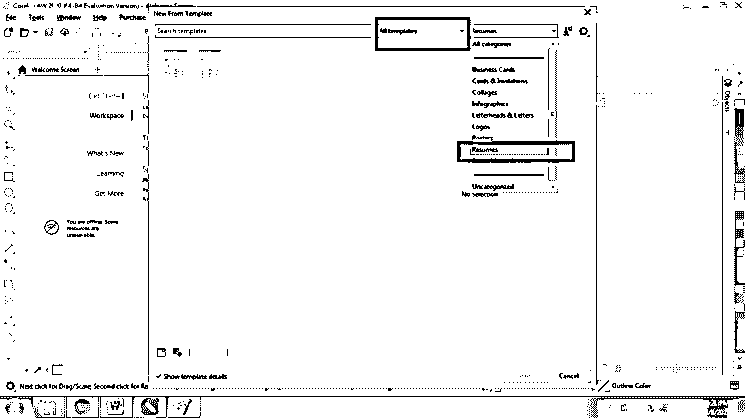

3.  现在点击打开

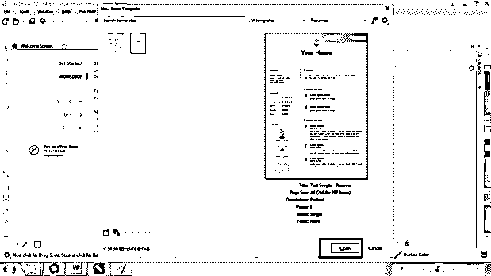

4.  转到窗口，选择 Dockers 和选择选项对话框

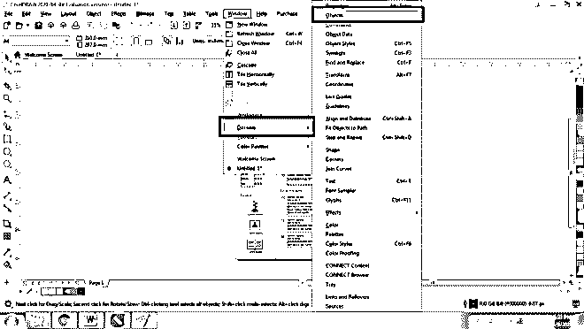

5.  “选项”选项卡帮助用户按顺序查看页面上的每个对象、文本或符号。

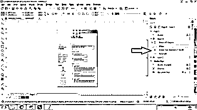

6.  用户可以通过从选项选项卡中选择特定的文本或符号来编辑格式、文本、文本样式、字体、大小、颜色。

7.  这使得工作变得简单明了。
8.  同样，用户可以创建任何模板或从互联网上下载任何模板，并根据需要进行编辑。

### 结论

Corel Draw 中的模板给设计人员带来了额外的好处，既省时又省力。Corel 绘图模板被证明是用户友好的，同时，它们为在规定时间内创建图形设计提供了重要支持。

创建后，用户可以根据需要轻松格式化和编辑模板。当用户需要在指定的时间内创建一个复杂的设计时，模板被证明是非常有用的。用户可以简单地下载设计的格式和布局，然后按照上述方法进行编辑。

### 推荐文章

这是 CorelDraw 模板指南。这里我们讨论如何在 CorelDraw 中创建模板以及如何编辑或修改模板。您也可以看看以下文章，了解更多信息–

1.  [什么是 CorelDraw？](https://www.educba.com/what-is-coreldraw/)
2.  [CorelDRAW 标志设计](https://www.educba.com/coreldraw-logo-design/)
3.  [CorelDRAW Powerclip](https://www.educba.com/coreldraw-powerclip/)
4.  [CorelDRAW 工具](https://www.educba.com/coreldraw-tools/)

