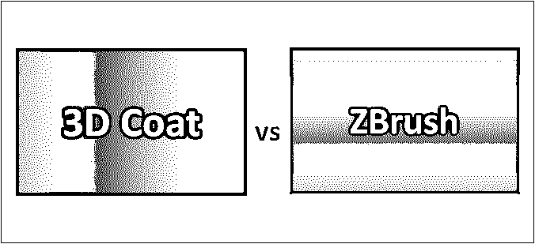
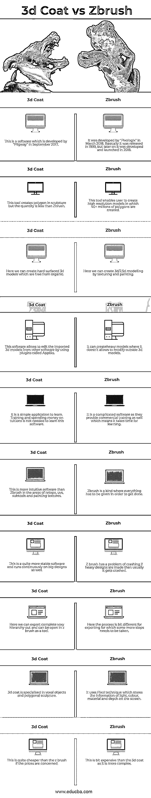

# 3D 外套 vs ZBrush

> 原文：<https://www.educba.com/3d-coat-vs-zbrush/>

 

## 3d Coat 和 ZBrush 的区别

许多 3d 动画电影和动画片都使用了 3d 雕塑。这些 3d 雕塑和漫画是使用一些软件专业创作的。当我们需要明确软件的用途时，我们需要了解 3D Coat 和 ZBrush 之间的区别。有很多软件有助于制作这些雕塑，但其中，我们将在这里讨论其中的几个。在动画领域有名气的两大软件是“3d Coat”和“Zbrush”。3D Coats 和 ZBrush 的工作原理是一样的，即使用不同的工具制作雕塑。那么让我们来看看它们是如何分类的。

### 3d Coat 和 ZBrush 之间的直接对比(信息图)

下面是 3d Coat 与 ZBrush 的 10 大区别

<small>3D 动画、建模、仿真、游戏开发&其他</small>

### 3d Coat 和 ZBrush 的主要区别

两者都是网站设计工具，但有很多不同之处:

*   #### Some features of 3D coat are as follows

1.  **纹理和基于物理的渲染:-** 它拥有智能材质，可通过设置选项进行编辑。它还包含了用于绘画任务、多个绘画层、层组和混合模式的工具。它有 Microvertex，ptex 绘画方法，纹理大小达到 16k。对于一些图片的帮助，我们也可以借助 photoshop。
2.  **重新拓扑工具:-** 它有一个工具或选项 AUTOPO，我们可以在其中创建用户定义的边循环。在这里，我们可以导入参考网格做重新拓扑化。我们已经用调色板重新修改了组，以在这个工具中获得合适的网格和更好的管理。
3.  **UV 贴图:**是一种用于创建和编辑 UV 集的专业工具。该工具支持平面展开算法和 ABF。

*   #### Some functions of Z brush are as follows

1.  **3D 笔刷:-** 安装包后，我们默认获得 30 个用于雕刻的 3D 笔刷，如果需要可以下载更多。每个画笔都有独特的功能，使我们能够用可编辑的画笔绘制不同形状和大小的特定图案。
2.  这是一个允许我们在多边形的每个部分填充颜色的工具。
3.  Zspheres:- 用户可以创建一个基础模型，然后将其转换为可雕刻模型。在这种情况下，我们可以从一个球体开始，并从中提取更多的 Z 球体。
4.  **Dynamesh 和 Fibermesh:-** 这些是允许用户制作均匀多边形并进一步生长多边形纤维的工具。这也是操纵大量多边形的一种方式。

*   3d Coat 与 ZBrush 软件之间的主要区别是用户界面和易用性，Z brush 很难使用，但它提供了更多的细节功能；你可以通过增长多边形从任何一边增长你的雕塑。与此同时，在 3d 外套中，我们得到的网格更少，因为细微的细节是不可能的，精细的雕塑也不是由它制成的。
*   在 3d 外套中处理 8600 万个多边形模型时，用户的体验之一是工作流畅，没有中断。嗯，这是在如此重的负载下工作时[很多次 z 刷倒塌](https://www.educba.com/zbrush-digital-sculpting/)的主要原因，即这些是用户提出的投诉。

### 3d Coat 与 ZBrush 对比表

以下是 10 个最重要的比较:

| **比较的基础 ZBrush** | **3d 涂层** | **Zbrush** |
| **1。** | 这是 2017 年 9 月由“Pilgway”开发的软件。 | 它是由“Pixologic”于 2018 年 3 月开发的。基本上是 1999 年发布，后来在 2018 年开发推出。 |
| **2。** | 这个工具在 sculpture 中创建一个多边形，但是数量小于 Zbrush。 | 该工具使用户能够创建高分辨率模型，其中创建了 4000 多万个多边形。 |
| **3。** | 在这里，我们可以创建没有有机物的表面坚硬的 3d 模型。 | 在这里，我们可以通过纹理和绘画来创建 3d/2.5d 模型。 |
| **4。** | 该软件允许通过使用名为 Appliques 的插件来编辑从其他软件导入的 3d 模型。 | 它可以在不允许修改外部 3d 模型的地方创建笨重的模型。 |
| **5。** | 这是一个简单的应用学习。学习这个软件不需要培训和花钱。 | 这是复杂的软件，因为他们也提供商业培训，这意味着它需要时间来学习。 |
| **6。** | 这是比 Zbrush 在修图、uv、子工具和绘制纹理方面更直观的[软件。](https://www.educba.com/zbrush-tools/) | Zbrush 是那种为了完成任务什么都得付出的人。 |
| **7。** | 这是一个相当稳定的软件，也可以在大型设计上持续运行。 | Z brush 有一个崩溃的问题，如果设计很重，那么通常它会崩溃。 |
| **8。** | 在这里，我们可以导出一个完整的体素层次，并可以在 z 刷打开作为一个工具。 | 这里的过程与导出略有不同，需要采取更多的步骤。 |
| **9。** | 3d coat 擅长于体素物体和多边形雕塑。 | 它使用像素技术，在屏幕上存储光线、颜色、材料和深度的信息。 |
| 10。 | 就价格而言，这比 z 型刷子便宜多了。 | 这比 3d 外套要贵一点，因为它更复杂。 |

### 结论

嗯，很难对 3d Coat vs ZBrush 软件做出评价；尽管如此，我们还是可以说这两个软件各有千秋。两者都是不同的，并且具有使它们彼此不同的独特特征。

即使 3d 外套提供较少的多边形级别，其渲染仍然是最好的功能和修改，这增强了整体雕塑设计。

在 Z brush 中，他们在非常精细的水平上工作，以制作更精确的雕塑，从而提供电影和卡通中使用的更逼真的雕塑。

### 推荐文章

这是 3d Coat 与 ZBrush 之间最大差异的指南。在这里，我们还将讨论信息图和比较表的主要区别。您也可以看看以下文章，了解更多信息–

1.  [Adobe Photoshop 与 CorelDraw](https://www.educba.com/adobe-photoshop-vs-coreldraw/)
2.  [ZBrush vs Blender](https://www.educba.com/zbrush-vs-blender/)
3.  [Photoshop vs Paint](https://www.educba.com/photoshop-vs-paint/)
4.  [Autocad vs Inventor](https://www.educba.com/autocad-vs-inventor/)

