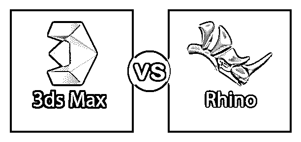

# 3DS Max vs Rhino

> 原文：<https://www.educba.com/3ds-max-vs-rhino/>

## 3DS Max 和 Rhino 的区别

商业 3D 计算机图形和计算机辅助设计(CAD)软件通常被称为犀牛(Rhino)。它是在 1980 年由一家名为 Robert McNeel & Associates 的美国私有员工公司发明的。Rhino 通常由 NURBS 数学模型组成，其目的是在计算机图形中产生曲线和自由曲面的精确数学描述。Rhino 在转换 NURBS 曲线、曲面和实体时，对复杂性、程度或大小没有限制。它以创建、编辑、渲染和动画图形而闻名。创建的几何图形也可以导出到激光切割机、铣床或 3D 打印机。

用于制作 3D 动画、游戏、模型和图像的专业 3D 计算机图形程序。它于 1996 年发布，由 Autodesk Media and Entertainment 创建和制作。Microsoft Windows 平台与使用 3DS Max 兼容。3DS Max 是工具和功能的工厂，非常适合室内建筑、工业设计、珠宝模型、动画模型、有机形态等。它也用于电影效果和电影预视。此外，3DS Max 还有高级的渲染工具，如；材质编辑器和 V-Ray。

<small>3D 动画、建模、仿真、游戏开发&其他</small>

### 3DS Max 和 Rhino 的正面比较(信息图)

以下是 3DS Max 与 Rhino 之间的四大区别:

### 3DS Max **和 Rhino** 的主要区别

两者都是市场上的热门选择；让我们讨论一些主要的区别:

*   3DS Max 更多的是用于复杂建模的专业应用，而 Rhino 是用于简单和基本建模的商业软件。
*   结合 3DS Max 和 VRay 可以为用户提供高渲染和高质量的结果，而将 Rhino 与 VRay 结合使用可能会对用户造成困难。
*   而 Rhino 支持 Mac OS，功能有限，3DS Max 根本不支持。
*   3DS Max 有一个默认的渲染方法，称为扫描线渲染，而 Rhino 没有自己的渲染软件。
*   3DS Max 有一个比较慢的 NURBS 建模，而 Rhino 以 NURBS 建模著称。

### 3DS Max 与 Rhino 对比表

我们来看最上面的对比:—

| **比较的基础** | **3DS Max** | **犀牛** |
| **定义** | 这是一个专业的 3D 计算机图形程序，用于创建模型、游戏、几何图形和动画。 | 这是一个商业三维 NURBS 建模。 |
| **用途** | 用于高端渲染和动画。 | 它很大程度上是一个通用建模器。 |
| **优点** | 3DS Max 是一款非常灵活的软件，拥有易于理解的最佳建模工具。*   UV tools provide users with the satisfaction of working in the same software instead of switching software, which makes the work more simplified.*   3DS is a versatile application that allows users to convert one format to another, and then save files in different formats.*   The biggest advantage of 3DS is its rendering software, V-Ray.*   3DS Max an internal scripting language called MAXScript, which allows users to write their own tools.*   Max also supports importing and linking DWG files.*   Scene Explorer is a tool that provides a systematic view of scene data and helps to deal with more difficult scenes. It is also a part of 3DS Max.T15】 | 

*   Rhino is a very useful software. Users don't need to know all the commands, but they can use them without any difficulty.
*   Rhino has file import and export converters in various CAD and design formats. In addition, users can extend them with the help of plug-ins.
*   It has an impressive license because it doesn't have any subscriptions and mandatory annual updates. It also has an open policy for educational users.
*   Rhino's function is simple and very human.
*   Rhino is a very dynamic program, which uses the simple functions of 2D CAD drawing and combines it with 3D functions, enabling users to quickly prototype and manufacture. Rhino has many plug-ins like Grasshopper or Visualarq, which makes it a demanding software.
*   It relies on some plug-ins that contribute to 3D printing and allows them to be exported. STL and. OBJ file format, both of which are supported by many 3D printers.

 |
| **缺点** | 

*   工具选项板包括许多不同的功能，这导致非常高的学习时间和非常长的执行时间。
*   对于初学者来说，3DS Max 是一个很难理解的软件，因为要学的东西太多了。
*   3DS Max 的一个主要缺点是它经常崩溃和挂起。
*   3DS Max 有大量的动画工具，但有时它们对用户并不友好。
*   一些类型的建模需要作为修改器添加，因为它们是过时的和隐藏的。不使用插件，粒子物理很难使用。

 | 

*   Rhino's Mac version does not support Grasshopper, so users have to use windows version.
*   Rhinoceros is a bit inaccurate and imprecise. In addition, some tools sometimes don't work properly.
*   It has no parametric modifier tool, which means it is impossible to edit the created shape; Instead, the user needs to repeat the whole process.
*   Rhino is not an independent product. This means that users should know any related software, such as & Grasshopper's VRay for rendering complex parametric geometry.
*   It is a bit difficult for users to use VRay with Rhino. The mapping and animation tools are also limited.

 |

### 结论

两者在很多方面都不一样，服务的功能也不一样。3DS Max vs Rhino 之间没有选择。3DS Max 在高质量渲染和动画方面有专长，而对于一般的设计建模，Rhino 是最佳选择。

虽然 Rhino 是一个简化的应用程序，但 3DS Max 是一个复杂得多的软件。不过，Rhino 不能单独使用，因为用户必须使用不同的软件来实现不同的功能。比如渲染用的 VRay，设计用的 illustrator，参数化建模用的 Grasshopper。而 3DS Max 有内置的渲染器，可以作为 solo 软件使用。

### 推荐文章

这是 3DS Max 与 Rhino 之间最大差异的指南。在这里，我们还讨论了 3DS Max 与 Rhino 的关键差异，并提供了信息图表和比较表。你也可以看看下面的文章来了解更多-

1.  [Maya vs 3Ds Max](https://www.educba.com/maya-vs-3ds-max/)
2.  [AutoCAD vs Microstation](https://www.educba.com/autocad-vs-microstation/)
3.  [影院 4d vs 3ds Max](https://www.educba.com/cinema-4d-vs-3ds-max/)
4.  [Lightroom vs Photoshop](https://www.educba.com/adobe-lightroom-vs-photoshop/)

