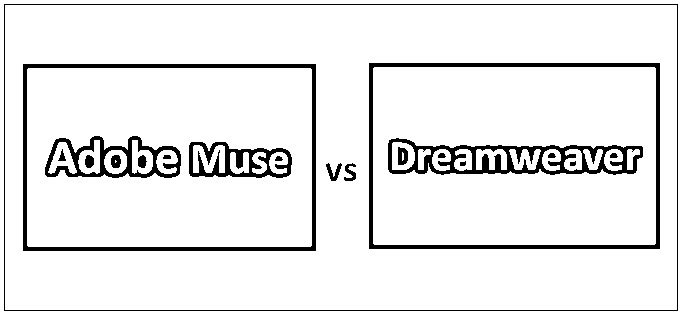
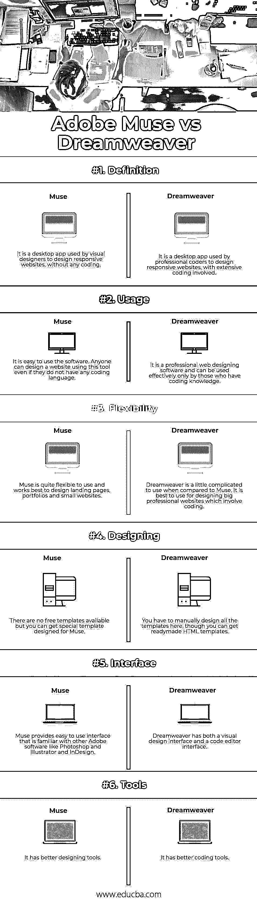

# Adobe Muse vs Dreamweaver

> 原文：<https://www.educba.com/adobe-muse-vs-dreamweaver/>

## Adobe Muse 和 Dreamweaver 的区别

当你想到设计或编码时，Adobe 是唯一会跳出来的名字。Adobe Muse 可以归入 Adobe 提供的桌面[网页设计软件](https://www.educba.com/top-10-web-design-software/)下。它越来越受那些对编码网站知之甚少或一无所知的人的欢迎。基本上，它是视觉设计师的完美选择。你甚至不用打开编码页面就可以创建一个完美的响应网站。Adobe Dreamweaver 是一款专业的网站设计软件，最适合那些对 HTML、CSS 等编码语言有丰富知识的人。它也有可视化编辑器，但其核心是通过编码进行设计。它是有经验的编码人员首选的工具。在本主题中，我们将了解 Adobe Muse vs Dreamweaver。

### Adobe Muse 和 Dreamweaver 之间的直接比较(信息图表)

以下是 Adobe Muse 与 Dreamweaver 之间的 6 大差异

<small>3D 动画、建模、仿真、游戏开发&其他</small>

### Adobe Muse 和 Dreamweaver 之间的主要区别

两者都是由 Adobe Creative Suite 创建的网站设计工具，但它们有很多不同之处。这两个软件不是直接的竞争对手，但它们的用途或多或少是相同的，只是功能不同。

*   如上所述，Adobe Muse 和 Dreamweaver 都是网页设计工具，但 Muse 是为那些对 HTML、CSS、PHP、JavaScript 等编码语言知之甚少或一无所知的视觉设计师设计的软件。而 Dreamweaver 是一种更高级、更专业的软件，程序员和开发人员使用它来设计涉及大量编码的大型网站。
*   即使你没有任何[编码经验](https://www.educba.com/what-is-coding/)，你也可以在 Muse 中设计一个响应式网站。但是对于 Dreamweaver 来说，如果你对不同的编码语言没有深入广泛的了解，你就无法设计网页。
*   相对来说，这是一款易于使用的软件，有着像其他 Adobe 软件一样熟悉的界面。在 Muse 上工作的原理和 Photoshop 是一样的。如果你知道如何使用 Photoshop，你很快就能掌握 Muse。而 Dreamweaver 界面更类似于其他 Adobe 编码软件。即使是该工具最基本的用法也可能需要 HTML 和 CSS 的知识。
*   Muse 支持插件和小部件安装，增强了工具的功能性。可以设计登陆页，作品集，小网站等。，只需通过拖放即可。而对于 Dreamweaver，你必须为设计写编码语言引用。它还支持 [LESS 和 Sass 预处理器](https://www.educba.com/sass-vs-less/)。
*   Muse 对编码者和非编码者都有用。在 Muse 上工作，你不需要有编码语言知识。Dreamweaver 只对专业程序员有用。如果你没有编码语言知识，你就不能在这个工具上做任何事情。

### Adobe Muse 与 Dreamweaver 对比表

下面是最上面的比较:

| **比较的基础** | **土坯缪斯** | **Dreamweaver** 版 |
| **定义** | 它是一个桌面应用程序，视觉设计师使用它来设计响应式网站，无需任何编码。 | 它是一个桌面应用程序，由专业编码人员用来设计响应性网站，涉及大量编码。 |
| **用途** | 这个软件很容易使用。任何人都可以使用这个工具设计网站，即使他们没有任何编码语言。 | 这是一个专业的网页设计软件，只有具备编码知识的人才能有效使用。 |
| **灵活性** | Muse 使用起来非常灵活，最适合设计登录页面、文件夹和小型网站。 | 与 Muse 相比，Dreamweaver 使用起来有点复杂。最好用于设计涉及编码的大型专业网站。 |
| **设计** | 没有免费的模板，但是你可以得到一个为 Muse 设计的特殊模板。 | 您必须手动设计这里的所有模板，尽管您可以获得现成的 HTML 模板。 |
| **界面** | Muse 提供易于使用的界面，熟悉其他 Adobe 软件，如 Photoshop、Illustrator 和 InDesign。 | Dreamweaver has both a visual design interface and a code editor interface. |
| **工具** | 它有更好的设计工具。 | 它有更好的编码工具。 |

### 结论

Adobe Muse vs Dreamweaver 都是 Adobe [桌面软件](https://www.educba.com/what-is-desktop-software/)用于设计响应式网站。Adobe Muse 与 Dreamweaver 的主要区别在于编码部分。如果你是一个精通所有编码语言的专业程序员，并且想设计大型网站，那么你应该选择 Dreamweaver。但是如果你是一个视觉设计师，喜欢赋予你的想象力以形状，并且很快想要设计不涉及任何编码的网站，Muse 是你最好的选择。

如果您希望快速设计和发布一个小型响应网站，Adobe Muse 可能是一个不错的选择。你得到现成的元素和一整套工具来设计或改变网页。当我们说它是注重视觉的设计师的完美选择时，它提供了拖放设计元素的功能来匹配您的视觉。

可以使用 Dreamweaver 创建大型定制响应网站，使用 JavaScript、PHP 等不同语言编写高级脚本和代码。尽管该软件提供了一些所见即所得的元素(所见即所得)，但如果您计划使用 Dreamweaver 设计一个网站，您需要尽可能多地了解编码语言。

### 推荐文章

这是 Adobe Muse 与 Dreamweaver 之间最大差异的指南。在这里，我们还将讨论信息图和比较表的主要区别。您也可以看看以下文章，了解更多信息–

1.  [Adobe Illustrator vs Adobe Photoshop](https://www.educba.com/adobe-illustrator-vs-adobe-photoshop/)
2.  [玛雅 vs 搅拌机](https://www.educba.com/accounting-vs-financial-management/)
3.  [Maya vs 3Ds Max](https://www.educba.com/maya-vs-3ds-max/)
4.  [影院 4d vs 3ds Max](https://www.educba.com/cinema-4d-vs-3ds-max/)

