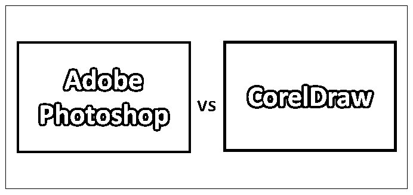
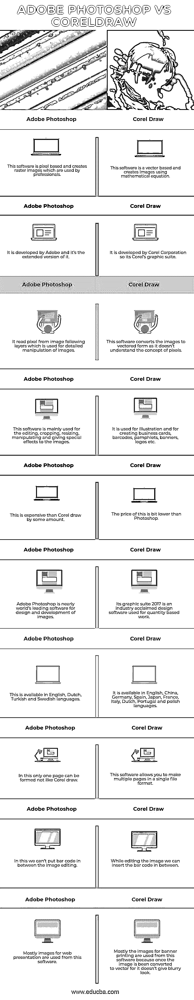

# Adobe Photoshop 与 CorelDraw 比较

> 原文：<https://www.educba.com/adobe-photoshop-vs-coreldraw/>

## Adobe Photoshop 和 CorelDraw 的区别

Adobe Photoshop 软件是基于像素的，可以创建专业人士使用的光栅图像。这个软件主要用于编辑、裁剪、调整大小、操作和给图像添加特殊效果。 [Corel Draw 是一款](https://www.educba.com/what-is-coreldraw/)基于矢量的软件，用于大公司和自由职业者打印大横幅和任何大型实体。它用于插图和创建名片，条形码，小册子，横幅，标志等。在本主题中，我们将了解 Adobe Photoshop 和 CorelDraw。

**让我们详细研究一下 Adobe Photoshop 和 CorelDraw:**

<small>3D 动画、建模、仿真、游戏开发&其他</small>

在当今世界，有大量的软件可以用来编辑、制作和修改照片。这其中，有的是专业人士用的，有的是新手用的。但是对每一个设计者来说，掌握软件和设计的基本知识是必要的。我们可以看到，其中一些网站还提供在线/现场照片编辑支持；我们只需上传图像，并得到他们现有的模板免费修改。现在来讨论一下市场上比较火爆的两大软件是 Adobe Photoshop vs CorelDraw。Adobe Photoshop vs CorelDraw 软件有一些优点和缺点，所以下面将详细讨论其中的一些功能。

### Adobe Photoshop 和 CorelDraw 之间的直接比较(信息图表)

以下是 Adobe Photoshop 和 CorelDraw 的 10 大区别:

### Adobe Photoshop 和 CorelDraw 之间的主要区别

两者都是市场上的热门选择；让我们来讨论一些显著的区别:

*   Adobe Photoshop 的一些功能是:-

1.  曲率笔工具。
2.  360 全景工作流程。
3.  工具提示。
4.  复制粘贴图层。
5.  画对称。
6.  笔画平滑。
7.  从凯尔 t 刷。
8.  每个图层都有属性面板。
9.  访问 Lightroom 照片。
10.  快速共享菜单。

*   Corel Draw 的一些特征如下

1.  高斯模糊特征。
2.  修复克隆工具。
3.  实时素描工具。
4.  自定义节点形状。
5.  多显示器。
6.  Corel 字体管理器。
7.  字体过滤和搜索。
8.  强大的手写笔。
9.  顾接口道。

*   如果我们检查市场上这两个软件的实时客户端，那么可以发现小企业人士和自由职业者都在使用 Photoshop。同时，大型企业、中型企业和自由职业者也在使用 Corel Draw。
*   如果我们根据客户体验对这些软件进行调查，看哪一个最受用户欢迎，并标出百分比，那么 Adobe Photoshop 获得 98%的百分比，Corel Draw 获得 99%的百分比。
*   Photoshop 能够将任何文本层、矢量和图形转换为像素图像，类似地，Corel draw 可以将任何图像转换为矢量图像。
*   Adobe Photoshop 和 CorelDraw 软件的主要区别之一是艺术控制。我们看到的任何创意效果都是在 Photoshop 中完成的，因为 Corel Draw 中没有创意效果。但是如果我们想把这两个软件结合起来，那么我们就能创造出好看的巨大图形。
*   Photoshop 具有制作 3d 艺术的优势，而在 Corel draw 中，我们可以获得名片和徽标的预定义布局。我们不必浪费时间去创造新的。
*   关于软件学习的另一个区别可以说，有人说 Corel draw 容易，有人说 Photoshop 容易。Adobe Photoshop 和 CorelDraw 相对来说都是一样的，因为母公司提供了等量的教程和数据。但是，远非如此，我们可以说 Photoshop 有点复杂，Corel draw 更容易。

### Adobe Photoshop 与 CorelDraw 比较表

我们来看顶部对比:

| **Sr 号** | **Adobe Photoshop** | **Corel Draw** |
| **1。** | 该软件是基于像素的，可以创建供专业人士使用的光栅图像。 | 这个软件是基于矢量的，使用数学公式创建图像。 |
| **2。** | 它是由 Adobe 开发的，是它的扩展版本。 | 它是由 Corel 公司开发的，所以它是 Corel 的图形套件。 |
| **3。** | 它从图像下面的层中读取像素，这些层用于图像的详细操作。 | 这个软件将图像转换成矢量形式，因为它不理解像素的概念。 |
| **4。** | 这个软件主要用于编辑、裁剪、调整大小、操作和给图像添加特殊效果。 | 它用于插图和创建名片，条形码，小册子，横幅，标志等。 |
| **5。** | 这比 Corel draw 贵了一些。 | 这个价格比 Photoshop 低一点。 |
| **6。** | Adobe Photoshop 几乎是世界领先的图像设计和开发软件。 | 其 graphics suite 2017 是业界公认的设计软件，用于基于数量的工作。 |
| **7。** | 这有英语、荷兰语、土耳其语和瑞典语版本。 | 它提供英语、中国、德国、西班牙、日本、法国、意大利、荷兰、葡萄牙和波兰语言版本。 |
| **8。** | 在这种情况下，只能形成一页，不像 Corel Draw。 | 这个软件允许你用一种文件格式制作多个页面。 |
| **9。** | 在这种情况下，我们不能把条形码放在图像编辑之间。 | 编辑图像时，我们可以在中间插入条形码。 |
| 10。 | 大多数用于网络演示的图像都是从这个软件中使用的。 | 大部分横幅印刷的图像都是从这个软件中使用的，因为一旦图像被转换为矢量，它就不会给人一种模糊的感觉。 |

### 结论

*   这两种软件的区别在于它们所基于的技术。正如我们所看到的 Adobe Illustrator，类似于 Corel Draw。无论如何，两者都是基于向量的程序，所以它们的命令几乎是相似的，用户界面也几乎是相同的。
*   这两个软件都很好，它们的价格不同，这可能是用户考虑它的原因。此外，更多的原因是考虑他们的功能和工具，尽管如此，适当的 3d 质量不能在 Corel 绘制中实现，但缩放和非模糊可以实现。
*   因此，用户必须决定他想要的是什么质量，即无模糊面还是 3d 打印质量类型。
*   最后，这两个软件都是不错的选择，取决于用户根据自己的需求进行选择。

### 推荐文章

这是 Adobe Photoshop 和 CorelDraw 之间最大差异的指南。在这里，我们还将讨论信息图和比较表的主要区别。您也可以看看以下文章，了解更多信息–

1.  [Adobe Photoshop](https://www.educba.com/adobe-illustrator-vs-adobe-photoshop/)[vs Adobe Illustrator](https://www.educba.com/adobe-illustrator-vs-adobe-photoshop/)
2.  [Photoshop vs Photoshop Elements](https://www.educba.com/photoshop-vs-photoshop-elements/)
3.  [Adobe Premiere vs 索尼维加斯 Pro](https://www.educba.com/sony-vegas-pro-vs-adobe-premiere/)
4.  [Photoshop vs 亲和照](https://www.educba.com/photoshop-vs-affinity-photo/)

