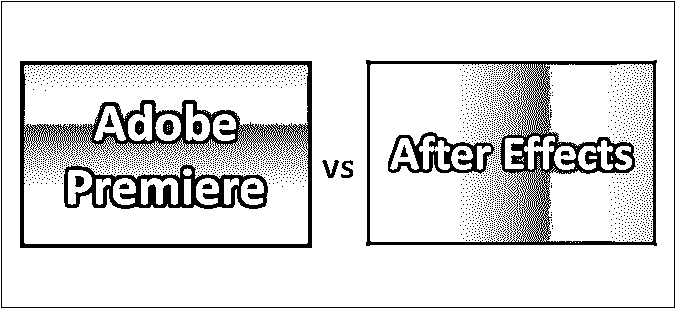

# Adobe Premiere vs After Effects

> 原文：<https://www.educba.com/adobe-premiere-vs-after-effects/>

 

## Adobe Premiere 和 After Effects 之间的差异

当你和朋友出去的时候，是什么让你兴奋？你是如何记住所有你去过的地方的事情的。是的，我们说的是我们在聚会、生日、郊游等场合拍摄的视频。因此，拍摄视频和快照是一个节目永恒的一部分。他们中的许多人喜欢拍摄“自拍”视频和快照；需要为这类人开发合适的应用程序。

现在，当我们必须编辑视频时，我们需要知道哪个软件对我们有好处。编辑视频是一项重要的任务，因为我们需要删除一些东西，保留一些东西；我们不能保留原始帧而不进行编辑。嗯，编辑通过应用一些效果和修剪不想要的场景，添加或删除额外的颜色，并给出我最喜欢的模糊效果来提高视频的质量。

<small>3D 动画、建模、仿真、游戏开发&其他</small>

市场上有大量的软件。每个人都在互相推动。下面我们要讨论的两个软件是“Adobe premiere”和“after effects”。Adobe Premiere vs After Effects 软件都是 Adobe 的产品，价格几乎相同。它们不相似；两者是不同的，必须一个接一个地使用。

### Adobe Premiere 和 After Effects 的直接对比(信息图表)

以下是首映和后期效果的 10 大不同点

### Adobe Premiere 与 After Effects 之间的主要区别

两者都是市场上的热门选择；让我们讨论一些主要差异:

*   **时间轴面板–**Adobe premiere 有一个很大的时间轴面板，具有许多功能，允许用户按照自己的意愿进行操作。后效有较少的选择来处理它，因为它处理复合剪辑，而不是多个。
*   编辑工具-Premiere 是为编辑视频而设计的，因此它拥有一流的、简单而精确的音频和视频编辑工具。虽然 After effects 有一些编辑工具，但它们对用户不友好，因为用户必须学习操作程序。
*   **混音器–**这是一个主要因素，因为即使是音频也和视频一样重要。Premiere 有一个完美的面板，叫做“混音器”，它赋予音频所有可能的效果。After effects 没有完美的音频编辑工具。
*   **multi cam—**这是 premiere 开发的令人兴奋的工具，它从视频中提取所有可能的单个图像，并允许保留和删除哪些图像。同样，这些是编辑工具的一部分，所以这类工具的后期效果会滞后。
*   与首映相比,这是一个工具，在这个工具中，After 的效果得到了极大的提升。这是一个在场景之间跟踪的选项，有利于效果创建和合成。这是以后编辑工具的时候了；像往常一样，首映没有这些种类的工具。
*   **相机追踪器–**这是一款多功能的 After effects 工具，允许用户制作相机运动的多个副本，从而进一步允许添加与原始运动精确匹配的新层。而这个功能是 premiere 没有的。
*   **Effects—**After Effects 有大量的这些工具。它是围绕创造无限和巨大的各种影响。它有运动控制效果工具，颜色控制工具，模糊阴影和过渡；尽管 premiere 得到了一些现成的工具来对编辑过的视频进行一些特效处理，但它们的数量较少。由于 premiere 的 pro 版也没有太多有效的工具来放特效。

### Adobe Premiere 与 After Effects 对比表

以下是以下两者之间最重要的比较:

| **比较的基础** | **Adobe Premiere** | **后效** |
| **1。** | 这有利于编辑直接来自相机和便携式摄像机的视频。 | 这有利于在编辑后给视频添加效果或标题。 |
| **2。** | 专业人士使用它进行视频编辑和电影制作。 | 它用于在编辑的视频中添加运动图形和视觉效果。 |
| **3。** | 如果就价格而言，成本比后果要低一点。 | 由于一些修改的效果和图形，价格保持略高于 Adobe premiere。 |
| **4。** | 在这个软件包中，包含了 Adobe 产品和微软团队。 | 在这个软件包中，包括视频协作工具、3d 图形程序和项目管理解决方案。 |
| **5。** | 它有一个创建虚拟现实环境的工具。 | 它有很好的运动图形模板。 |
| **6。** | 语言包括英语、中国、德国、日本、西班牙、法国、俄罗斯、意大利和葡萄牙。 | 语言包括英语、中国、德国、印度、日本、西班牙、法国、俄罗斯、意大利、荷兰、葡萄牙、波兰、土耳其和瑞典。 |
| **7。** | 编辑工具是完美的，它让用户可以使用各种各样的工具，解放双手。 | 为了增加效果，用户可以创建或使用各种各样的效果来提高视频的质量。 |
| **8。** | 可以编辑多个视频，并通过适当的编辑进行合成。 | 使用多个视频并组合不是一项工作；它只处理编辑过的合成视频。 |
| **9。** | 当原始视频在你手中时，这是专业人士的首选。 | 很明显，第二个选择是这个，因为它会在需要的时候出现。 |
| 10。 | 这个应用很难在 android 手机上使用，因为这个用户界面似乎不是那么友好。用户必须通过到处搜索选项来添加效果。 | Android 应用程序非常有用，更容易使用，因为用户可以获得现成的幻灯片，当他只需点击编辑过的幻灯片时，他就会很高兴，他就完成了工作。 |

### 结论

根据讨论，似乎 Adobe Premiere 和 After Effects 彼此有很多重叠。如果有人想推荐 Adobe Premiere vs After Effects，那么显然两者都应该是答案。为了得到完整的编辑，视频效果和编辑工具一样必不可少。

因此，对于编辑来说，Adobe premiere 应该是首选，对于提供效果来说，“After effects”应该是首选。根据客户评论，人们通常同时使用 Adobe Premiere 和 After Effects。使用一个软件对学习者有好处，对专业人士没有好处。

### 推荐文章

这是 Adobe Premiere 与 After Effects 之间最大差异的指南。在这里，我们还将讨论信息图和比较表的主要区别。您也可以看看以下文章，了解更多信息–

1.  [Adobe Premiere Pro vs After Effects](https://www.educba.com/adobe-premiere-pro-vs-after-effects/)
2.  [Adobe Premiere vs Final Cut Pro](https://www.educba.com/adobe-premiere-vs-final-cut-pro/)
3.  [Adobe Premiere vs 索尼维加斯](https://www.educba.com/adobe-premiere-vs-sony-vegas/)
4.  [Adobe Illustrator vs Adobe Photoshop](https://www.educba.com/adobe-illustrator-vs-adobe-photoshop/)

