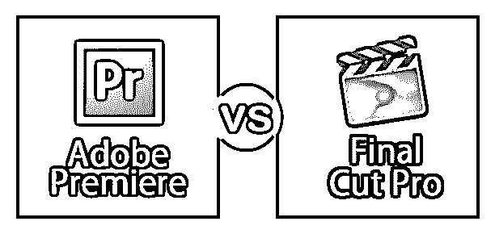
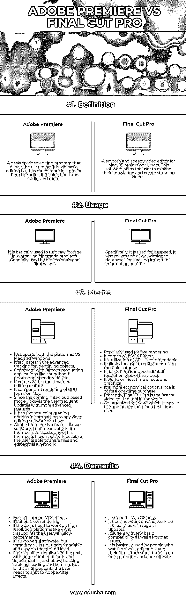

# Adobe Premiere vs Final Cut Pro

> 原文：<https://www.educba.com/adobe-premiere-vs-final-cut-pro/>

## Adobe Premiere 和 Final Cut Pro 之间的区别

Final Cut Pro 是一系列非破坏性视频编辑软件程序。它首先由 Macromedia Inc .发明，后来由 Apple Inc .发明。Final Cut Pro 允许用户编辑、处理和提供各种格式的视频结果。这个软件一般用于小规模业务，也支持离线编辑。Final Cut Pro 是一款 Mac 软件，Windows 用户必须寻找视频编辑的替代产品。它是一个稳定的软件，一次性付款定价。电影制作人和业余爱好者最常用的 Final Cut Pro 是一款要求苛刻的软件。Adobe Systems 开发的基于时间轴的视频编辑软件是 Adobe Premier。它于 1991 年首次推出。Adobe Premiere 可以在 windows 和 Mac 操作系统上使用。Premiere 的最新版本是作为 Adobe Creative Cloud 许可计划的一部分发布的。Adobe Premiere 与 Adobe After Effects 等支持应用程序一起工作。Adobe Premiere 有最好的颜色分级选项。它更面向专业观众。

### Adobe Premiere 和 Final Cut Pro 之间的直接比较(信息图表)

以下是 Adobe Premiere 与 Final Cut Pro 之间的 4 大区别

<small>3D 动画、建模、仿真、游戏开发&其他</small>

### Adobe Premiere 和 Final Cut Pro 之间的主要区别

两者都是市场上的热门选择；让我们讨论一些主要差异:

*   更有经验的视频编辑瞄准 adobe Premiere，因为它与 Final Cut Pro 相比不太直观，Final Cut Pro 具有最令人惊叹、适应性最强和最有吸引力的界面。
*   Final Cut Pro 为视频提供了较低的渲染和导出时间，即使是 4K 质量，也不会消耗太多能量。而 Adobe premiere 在导出和渲染方面要慢得多。
*   在 Final Cut Pro 中导出和渲染是一项非常流畅的任务。一旦用户开始将视频输出到一个特定的地方——比如说脸书——这是实时发生的。首先导出文件，然后保存到电脑上，然后再等待它上传到脸书，这样不会浪费时间。
*   Adobe Premiere 有一个更加传统和灵活的时间线。它允许用户在视频、音频、图像、文本的不同层面上工作。也就是说，它准确地作用于单个元素。而 Final Cut Pro 有时可能不灵活且受限制。
*   Final Cut Pro 可以简单地用插件来增强。它提供插件，帮助用户创建 3D 视觉效果，重新映射时间以创建慢动作场景等等。而在 Premiere 中，用户同样需要去 After Effects。

### Adobe Premiere 与 Final Cut Pro 对比表

我们来看最上面的对比:—

| **比较的基础** | **Adobe Premiere** | **Final Cut Pro** |
| **定义** | 一个桌面视频编辑程序，允许用户不仅做基本的编辑，还可以做更多的事情，比如调整颜色，微调音频等等。 | 适用于 Mac OS 专业用户的流畅快速的视频编辑器。这个软件帮助用户扩展他们的知识，创造出令人惊叹的视频。 |
| **用途** | 它基本上是用来把原始镜头变成惊人的电影产品。一般由专业人士和电影制作人使用。 | 具体来说，它是用于其速度。它还利用精心设计的数据库及时跟踪重要信息。 |
| **优点** | 

*   支持操作系统 Mac 和 Windows 操作系统
*   Two platforms, which facilitate the advanced tracking of identified objects.
*   Consistent with well-known production applications such as sound booth, photoshop, speed grade, etc.
*   It has multi-camera editing function.
*   It can render GPU forms on Mac.
*   Since its inception, if its cloud-based model, it will bring users more frequent updates of advanced functions. Compared with any video editing software, it has the best color grading options.
*   Adobe Premiere is a team alliance software. This means that any team member can access any of their members' files on the network, because users can share files and edit them on the network.

 | 

*   Commonly used for fast rendering.
*   It has VFX special effects.

*   Allows users to edit videos using multiple cameras.
*   Final Cut Pro is independent of the resolution type of video.
*   It handles real-time effects and graphics.
*   It is a more economical choice, because it only needs one-time purchase.
*   At present, Final Cut Pro is the fastest video editing tool in the world.
*   A well-organized software is easy to use and understand for first-time users.

 |
| **记过** | 

*   VFX special effects are not supported.
*   Slow rendering
*   If users need to work on a high-resolution platform like 4K, slow performance will disappoint users.
*   It is a powerful software, but sometimes it is not easy to understand and use on the ground level. Premier provides the details of the title text, with a large number of fonts and adjustments, such as shading, tracking, stroke, line spacing and kerning. But for 3D layout, users need to turn to Adobe after the special effects are completed.

 | 

*   Only Mac OS is supported.
*   It doesn't work on the network, so it usually lacks regular updates.
*   It has some basic compatibility and format problems.
*   Basically, it's for people who want to shoot, edit and share their own films from beginning to end on one computer and one software.

 |

### 结论

Adobe Premiere 和 Final Cut Pro 都提供几乎相同类型的视频编辑，但它们仍有许多不同之处。Adobe Premiere 与 Final Cut Pro 之间最常见的区别是，Final Cut Pro 仅适用于 Apple Mac 用户，而 Adobe Premier 可用于 Windows 和 Mac 用户。

当用户处理导出、渲染和稳定时，Final Cut Pro 是专家。与 Adobe Premiere 相比，它所获得的结果非常清晰。尽管这两款软件都不便宜，但 Final Cut Pro 是更合理的选择，因为它只需一次性购买。

所以，这完全取决于用户和他们的工作性质。如果用户比较新鲜，还想要一个学习速度快，产品质量高的简单工具，就必须使用 Final Cut Pro。如果用户想要一个更高级的工具，有更广泛的编辑选项，那么他应该选择 Adobe Premiere。

### 推荐文章

这是 Adobe Premiere 与 Final Cut Pro 之间最大差异的指南。在这里，我们还将讨论信息图和比较表的主要区别。您也可以看看以下文章，了解更多信息–

1.  [索尼维加斯专业版 vs Adobe Premiere](https://www.educba.com/sony-vegas-pro-vs-adobe-premiere/)
2.  [Adobe Illustrator vs Adobe Photoshop](https://www.educba.com/adobe-illustrator-vs-adobe-photoshop/)
3.  [AutoCAD vs AutoCAD LT](https://www.educba.com/autocad-vs-autocad-lt/)
4.  [Adobe Premiere vs After Effects](https://www.educba.com/adobe-premiere-vs-after-effects/)

