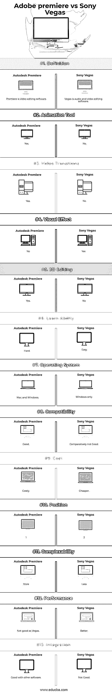

# Adobe Premiere vs 索尼维加斯

> 原文：<https://www.educba.com/adobe-premiere-vs-sony-vegas/>

## Adobe Premiere 和 Sony Vegas 的区别

Adobe Premiere 是用于视频编辑的软件。它由 Adobe system 开发，是 creative cloud 软件(CC)之一。Adobe 首次推出是在 2003 年。Adobe Premiere Pro 是 Adobe Premiere 的升级版本。Adobe premiere 于 1991 年推出，它是第一个在 Mac 系统上发布的基于计算机的非线性编辑系统。但后来，从版本 6.0 开始，Adobe premiere 大量支持 Mac，直到 Adobe Premiere Pro 2.0 (CS)推出。索尼维加斯是一个视频编辑软件。其非线性编辑软件最初由 Sonic Foundry 在 1999 年至 2003 年期间开发，然后由 Sony creative software 在 2003 年至 2013 年期间更新和运行，最后由 Magix 在 2016 年至今运行。该软件仅支持 Windows 平台。这个软件的名字变成了它的开发者维加斯创意开发者的名字。

### Adobe Premiere

Adobe Premiere Pro 和 Adobe Premiere Element 是兄弟软件。Adobe premiere pro 用于专业人员的视频编辑，Element 用于消费市场(家庭用户)的视频编辑。Adobe Premiere Pro 和 Element 都支持 window 7 和更高版本以及 Mac OS X 和更高版本。有各种优势超过 Adobe premiere Element，像 Pro 有能力支持多个序列，多摄像机编辑，时间重新映射，范围，先进的色彩校正工具和先进的音频混合器。Premiere Pro 还有一个 encore，用于更复杂的蓝光和 DVD 创作选项以及直接磁盘录制的位置。

<small>3D 动画、建模、仿真、游戏开发&其他</small>

它允许编辑高达 10240 X 8192 像素的高分辨率视频，每通道高达 32 位 RGB 和 YUV 颜色。它有能力编辑音频和环绕声混合能力以及，它还支持 VST 音频插件。它支持多种文件格式的进口，出口，视频和音频文件。它能够支持 3D 编辑，能够在 CineForm 新的插件系列的帮助下，使用 2D 显示器观看 3D 材料。

Adobe System 在 1991 年推出了第一个版本，名为 Adobe Premiere 1.0，仅支持 Mac。支持窗口的 Adobe premiere 的第一个版本是 1993 年 8 月推出的 Adobe Premiere 1.0。从 1998 年开始，他们推出了 Adobe Premiere 5.0 版本，支持 Mac 和 Windows。从 2003 年开始，Adobe 推出了名为 Adobe Premiere Pro 1.0 (CS)的 Premiere Pro 版本。这个包下的最后一个版本是 Adobe Premiere Pro 6.0 (CS)。后来，他们在 creative Cloud 系列下推出了 Pro 版本，从 Premiere Pro 13.0 (CC)到 Premiere Pro 19.0 (CC)，后者最近由 Adobe system 于 2018 年 10 月 15 日推出。

与 Pixel 类似的 pixel 技术，除了它之外，还包含关于深度、方向和材质信息的 Z 方向信息，而 pixel 仅包含 X 和 Y 位置和颜色信息。

### 索尼维加斯

Sonic Foundry 最初将 Vegas 作为音频编辑软件推出，但后来，他们计划从 Vegas 2.0 版开始推出这款音频和视频软件。

索尼代工在 1999 年 6 月推出了预览版。它被称为多轨道媒体编辑系统，于 1999 年 7 月正式发布，仅用于音频编辑，名为 Vegas 1.0。他们在 2006 年推出了与拉斯维加斯 7.0 相同的系列。后来，在 2006 年他们推出了名为 Vegas Pro 8.0 等。该系列的最新版本于 2018 年 8 月 27 日发布，拉斯维加斯专业版 16.0。

#### 应用程序

主要应用是视频和音频编辑。该软件主要由广播公司使用。几个你块茎，社交网站，内容创作者，电影制作人等。各种各样的获奖者在像电影票价奖这样的大舞台上展示自己的视频和特写时使用这个软件。它比其他任何竞争软件都相对便宜。

拉斯维加斯有一些独特的特征。

*   无限轨道上的实时多轨道视频和音频编辑。
*   独立于分辨率的视频序列。
*   支持千兆像素图像
*   VST 和 DirectX 插件效果
*   杜比数字环绕和混音
*   复杂效果和合成工具
*   24 位 192KHz 音频支持

#### Vegas Pro 产品系列

*   维加斯专业编辑
*   拉斯维加斯专业版
*   维加斯 Pro 365
*   维加斯职业套装
*   电影工作室产品线
*   维多利亚女王。
*   附加

### Adobe Premiere 和 Sony Vegas 的直接对比(信息图)

以下是 Adobe Premiere 与索尼 Vegas 之间的 13 大差异。

### Adobe Premiere 和 Sony Vegas 之间的主要区别

两者都是市场上的热门选择；让我们讨论一些主要差异:

#### Adobe Premiere Pro

*   全新首映热潮下的移动编辑。
*   智能音频清理
*   选择性颜色分级
*   数据驱动的信息图
*   运动图形模板
*   端到端 VR 180
*   沉浸式媒体的空间标记
*   Adobe stock 增强
*   团队项目的群组邀请
*   显示颜色管理
*   性能改进
*   扩展格式支持
*   创意云图书馆改进
*   澳大利亚隐藏式字幕标准
*   键盘快捷键的语言支持
*   adobe 沉浸式环境中的剧院模式

#### 索尼维加斯

*   运动跟踪
*   视频稳定
*   简化您的工作流程
*   动态故事板和时间线交互
*   广泛的文件备份选项
*   将媒体夹拖到时间线
*   可调整大小的媒体缩略图
*   项目媒体悬停搓擦
*   项目媒体入点/出点
*   预览多个选定的项目媒体文件
*   从 crushor 中选择一个事件
*   高 DPI 缩放
*   从时间轴区域或文件自动创建字幕
*   添加缺失的流
*   HDR 支持
*   360 度媒体编辑
*   贝塞尔遮罩 OFX 插件
*   置换贴图和高清几何
*   插件

### Adobe Premiere 与索尼维加斯对比表

以下是最重要的比较:

| **比较的基础** | **Adobe Premiere** | **索尼维加斯** |
| **定义** | 首推的是视频编辑软件 | 维加斯是音频和视频编辑软件 |
| **动画工具** | 是 | 不 |
| **视频过渡** | 是 | 不 |
| **视觉效果** | 不 | 是 |
| **3D 编辑** | 是 | 不 |
| **可学性** | 困难的 | 容易的 |
| **操作系统** | Mac 和 Windows | 仅 Windows |
| **兼容性** | 好的 | 相对来说不太好 |
| **成本** | 昂贵的 | 比较便宜的 |
| **位置** | One | Two |
| **络合能力** | 更大的 | 较少的 |
| **性能** | 没有拉斯维加斯好 | 较好的 |
| **整合** | 与其他软件配合良好 | 不好 |

### 结论

毫无疑问，Adobe Premiere 比索尼 Vegas 更有能力，更好，Adobe Premiere vs 索尼 Vegas 都是专业软件。Adobe premiere 与其他软件的兼容性良好。它与其他应用程序的集成也比任何其他软件都好，但 Vegas 等许多东西的性能都比 Adobe Premiere 好。相当人性化的软件；这个软件唯一的缺点就是兼容性和集成性；否则，它可能比 Adobe Premiere 更好。

### 推荐文章

这是 Adobe Premiere 与索尼 Vegas 之间最大差异的指南。在这里，我们还讨论了 Adobe Premiere 与 Sony Vegas 的主要区别，并提供了信息图表和比较表。您也可以看看以下文章，了解更多信息–

1.  [Adobe Premiere vs After Effects](https://www.educba.com/adobe-premiere-vs-after-effects/)
2.  [索尼维加斯专业版 vs Adobe Premiere](https://www.educba.com/sony-vegas-pro-vs-adobe-premiere/)
3.  [Adobe Photoshop](https://www.educba.com/adobe-illustrator-vs-adobe-photoshop/)[vs Adobe Illustrator](https://www.educba.com/adobe-illustrator-vs-adobe-photoshop/)
4.  [AutoCAD vs AutoCAD LT](https://www.educba.com/autocad-vs-autocad-lt/)

