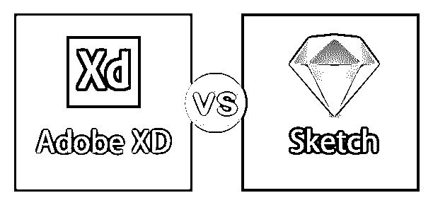
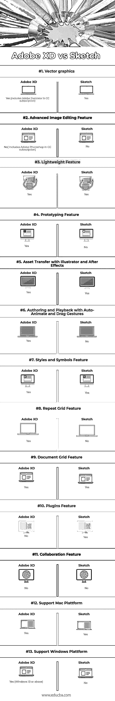

# Adobe XD 与 Sketch

> 原文：<https://www.educba.com/adobe-xd-vs-sketch/>

## Adobe XD 与 Sketch 的区别

以下文章提供了 Adobe XD vs Sketch 的概要。利用素描，我们可以得到富有表现力的图画和绘画。素描为什么有用？

*   规划
*   通过想法获得输出
*   想象事情将会怎样
*   早期的想法将帮助其他人做新的设计

索尔·格林伯格(Saul Greenberg)等人说，“草图不一定要漂亮、漂亮，甚至不一定要能被他人立即理解。然而，当有人问起时，你应该能够解释你的草图和想法”，比尔·巴克斯顿说，“草图的保真度应该反映我们思考的深度。”

Adobe XD 是 Adobe MAX 2015 上推出的一款轻量级矢量图形编辑器和原型制作工具，因为 Project Comet Adobe 支持市场上的几种工具。Adobe 因其交互式软件设计和工具而闻名。

Adobe XD 是为所有类型的创作者开发的，例如 UX/UI 设计师、交互设计师、体验设计师、产品设计师、网页设计师、应用程序设计师、视觉设计师、企业家等等。Adobe Experience Design (XD)在 UX 设计师中引起了关注，并被迅速采用。Adobe XD 是一个用于网站和移动应用程序设计和原型制作的跨平台工具。

**Adobe XD 支持一系列属性来设计应用:**

*   黑暗未来派用户界面
*   科技字体
*   鲜艳的颜色
*   按钮上的硬边
*   输入字段上的小圆角半径

### Adobe XD 与 Sketch 之间的直接比较(信息图表)

以下是 Adobe XD 与 Sketch 的 13 大区别:

### Adobe XD 与 Sketch 的主要区别

两者都是市场上的热门选择；让我们讨论一些主要差异:

#### 1.Adobe XD

**重复网格:**

*   Adobe XD 是一种工具，可让您创建一组对象，选择一个或一组对象，并将它们转换为重复网格。例如，移动联系人列表包含图像和姓名。

**使用 Adobe XD 的原型:**

*   Adobe XD 让 Photoshop 、Illustrator 和[在特效](https://www.educba.com/after-effects-tracking/)中平等参与。继续首选应用程序的设计部分，将资产放入 XD，然后使用 XD 创建和共享原型。
*   XD 支持 SVG 和位图文件，没有任何保真度损失。然后，您可以在 Adobe XD 中进一步增强这些资源，或者使用它们来开发交互式原型。
*   一个以用户为中心的概念验证是在一个样本的帮助下建立的，这个样本是之前准备好的，用来了解产品的型号。
*   原型是一种获得将一个想法或概念推销给顾客预期需求的方法的能力。
*   它有助于理解用例或工作流背后的业务逻辑。
*   快速演示系统的任务。
*   发现问题的早期阶段是很有用的。
*   客户可以探索并与最终用户交流他们的想法。
*   估计开发成本、时间表、技能和潜在的资源需求。
*   它可以作为跨职能团队的参考点。
*   重用 XD Creative Cloud 库中的创意资产。
*   提供一种机制，在 Sketch 不支持的各种应用程序之间共享设计资产。

#### 2.素描

*   粗略地描绘一个地方或一种情况的外观或动作的速写。草图通常是为更大、更详细的艺术作品做准备。
*   深度排序算法是 sketch 使用的一种非常古老的技术，因为它对于实时图形表示来说是一个非常慢的过程。但对于速度不太快的地方，它是我们必需品的理想选择。
*   草图支持多种编辑几何图形的技术。一些人通过识别由笔画组成的编辑手势来利用纸笔编辑技术。
*   Sketch 可识别由纸和铅笔编辑技术的笔画组成的编辑手势，并使用多种技术进行几何编辑规范。
*   Sketch 使用非真实感渲染技术渲染它们，旨在帮助观众看到他们想看的东西。
*   素描广泛运用的艺术绘画。它支持三维视图，包括物体的长、宽、高。
*   草图通过启动手势输入和建模功能之间的映射，向用户传递清晰和直接的对应关系。并且，它没有艺术制图准备的规则和标准。
*   草图在设计过程中的作用将为设计教育奠定基础，有效地使用草图和计算机工具来支持基于草图的设计。
*   通过制定许多专门的符号和惯例，清晰准确地传递技术信息。
*   在工业设计和产品设计环境中，草图也是一种交流的形式。
*   绘制直线直线和曲线通常用于绘制草图。直线可分为水平线、垂直线和斜(斜)线。徒手画水平线的标准方法是右手从左到右，左手从右到左。徒手画等间距的水平线需要相当多的技巧。
*   当处理由于其尺寸和复杂性而需要所有细节的详细说明的对象时，也使用程序草图。
*   呈现物体形状的最简单方法是用空间绘图，因为这也使得呈现复杂的细节或结成为可能。

### Adobe XD 与 Sketch 比较表

以下是 Adobe XD 与 Sketch 之间最重要的比较:

| **比较的基础** | **Adobe XD** | **草图** |
| 向量图形 | 是(包括 CC 订阅中的 Adobe Illustrator) | 是 |
| 高级图像编辑功能 | 否(包括 CC 订阅中的 Adobe Photoshop) | 不 |
| 轻量特征 | 是 | 是 |
| 原型特征 | 是 | 不 |
| 使用 illustrator 和 after effects 进行资产转移 | 是 | 是 |
| 使用自动动画和拖动手势进行创作和回放 | 是 | 不 |
| 样式和符号功能 | 是 | 是 |
| 重复网格特征 | 是 | 不 |
| 文档网格功能 | 是 | 是 |
| 插件功能 | 不 | 是 |
| 协作功能 | 不 | 不 |
| 支持 mac 平台 | 是 | 是 |
| 支持 windows 平台 | 是(Windows 10 或更高版本) | 不 |

### 结论

尽管 Adobe XD 和 Sketch 都是很好的软件，但它们既不轻便也不适合这种类型的工作。原型制作的艺术和科学在不同的行业中都有所体现。在产品开发研究环境中，相当多的注意力放在了原型开发上。一个原型是一个活跃而有用的工具，它可以帮助设计团队有效地处理工作，并确定需求的各个方面。

### 推荐文章

这是 Adobe XD vs Sketch 的指南。在这里，我们讨论 Adobe XD 与 Sketch 与[信息图](https://www.educba.com/what-is-an-infographics/)和对照表的主要区别。您也可以看看以下文章，了解更多信息–

1.  [QuarkXPress vs InDesign](https://www.educba.com/quarkxpress-vs-indesign/)
2.  [Photoshop vs InDesign](https://www.educba.com/photoshop-vs-indesign/)
3.  [Adobe Lightroom vs Photoshop](https://www.educba.com/adobe-lightroom-vs-photoshop/)
4.  [Adobe Premiere vs 索尼维加斯](https://www.educba.com/adobe-premiere-vs-sony-vegas/)

