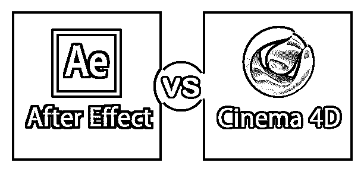
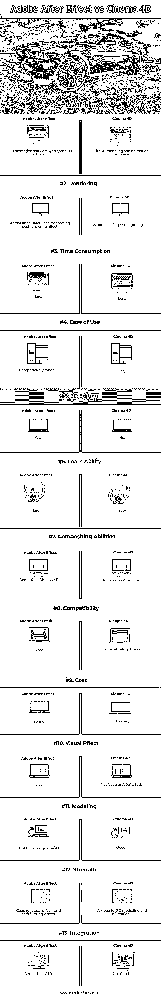

# 后效 Vs 电影院

> 原文：<https://www.educba.com/adobe-after-effect-vs-cinema-4d/>

## 后效和 4D 电影的区别

Adobe After Effect 是一款用于创建运动图形、特殊效果、视觉效果以及合成应用程序和计算机动画的软件。Adobe Systems 在 1993 年开发了这个。After Effect 支持平台 Windows 以及 Mac Os。Cinema 4D 是一款用于 3D 建模、渲染、动画、运动图形绘制等的软件。这个软件是由马辰计算机公司在 1990 年开发的，它是一家德国公司。最初，它是专为 Amiga 计算机开发的，在这个特殊的平台上有三个连续的版本。Maxcon 从第四版(4.0 版)开始为 Mac 和 Windows 平台开发它。

### Adobe After Effect 的应用

该软件在电影行业中的应用，用于电影制作和电视制作的后期制作。它是用来键控，跟踪的。合成、动画制作、非线性编辑器、音频编辑器和媒体转码。这个软件被艺术家、电影制作人、视频制作人广泛使用。平面设计师，动画师，社会媒体和数字媒体设计师。

<small>3D 动画、建模、仿真、游戏开发&其他</small>

#### 版本

科学与艺术公司在 1993 年推出了该软件的前两个版本，版本 1.0 和 1.1。Aldus 在 1994 年推出了它的 3.0 版本。Adobe 从 1997 年的 3.0 版本开始推出它的版本。在 1999 年首次为 Mac 和 Windows 发布 4.0 版之后，1997 年发布了第一次 Windows 支持版本 3.1 版。版本 5.5 于 2002 年发布，首次支持 OS X。从 2007 年 7 月开始，他们开始推出其新系列 CS came with CS3.0，并继续这一系列直到 CS6.0 (2012)。后来，Adobe 在 2013 年以 CC (12.0)开始其新系列，并持续到 2018 年 10 月的最新版本 CC(16.0)。

#### 插件

在 Effect 有了各种插件支持后，这些插件创建了一个额外的效果，例如一个粒子系统，用于雨、雪、火等的真实效果。在这些插件的帮助下，我们实现了以下效果

*   工作流程改进和视觉效果
*   添加高端色彩校正
*   从 fcp 或 avoid 翻译时间线
*   消除闪烁、噪音或扭曲
*   计算 2D 视频镜头中相机的 3D 运动
*   创建动画图表、图形和其他数据可视化
*   粒子系统，慢动作
*   模拟火、烟或水

### Cinema4D 的应用

4D 电影院是一个灵活和强大的软件，为 3D 艺术家提供了一个极好的结果。主要应用领域是程序和多边形建模、动画、电影/VFX、照明、纹理、渲染、建筑设计、游戏、广播、可视化等。这些是为数不多的受欢迎的电影，其中很多都是由 4D 电影院制作和渲染的，例如《速度与激情 7》、《钢铁侠 3》、《死亡之地》、《盗梦空间》、《世界大战》等等。

#### 4D 电影院有四个版本。

1.  **4D 电影院工作室:-** 这个模块优化了 3D 艺术家的能力。它提供高级 3D 图形。
2.  **4D 影院广播:-** 此模块帮助创建动态广播图形的简单方法。它基本上是一个三维运动图形丰富的模块。
3.  4D 电影院视觉化:- 这个模块增加了更好的视觉化效果，给你的想象增加了真实感。
4.  **4D 影院 prime:-** 这是一个完全专业的模块，是图形设计师和 3D 艺术家的完美选择。

#### 版本

第一个版本于 1990 年推出；后来，他们陆续推出了逐年更新的版本。

1996 年首次为 4D 电影院推出多处理器版本。到 2000 年，Body paint 3D 从其版本 6.0 开始与 4D 电影院集成在一起。到 2010 年，4D 电影院从 R 10 版本开始成为第一个 3D 专业 3D 图形应用程序。4D 影院 R11.5 可与 Mac Ox 和 Windows 7 完全兼容。4D 电影院的最后一个版本是 R20，于 2018 年 9 月推出。

#### 渲染插件

*   红色衬衫
*   最终渲染阶段 2.0 sp4
*   毛球 GPU 渲染
*   油炸和靛蓝渲染
*   麦克斯韦渲染
*   精神射线和 V 射线
*   来自 Thickbox 的喀拉喀托火山
*   Mental ray & Iry
*   辛烷渲染

### After Effect 和 4D 电影院的面对面比较(信息图)

以下是《After Effect》和《4D 电影院》的 13 大区别

### After Effect 和 4D 电影院的主要区别

两者都是市场上的热门选择；让我们讨论一些主要差异:

#### 后效特征

*   用于网格雕刻的高级木偶工具
*   原生 3D 深度路径
*   更简单、更快速的表达
*   响应设计时间
*   使用 lumetri 颜色进行选择性颜色分级
*   显示色彩管理
*   改进了与 premiere pro 的运动图形模板文件交换
*   原生摩卡 AE 插件后的效果
*   在 VR 180 中创建，在耳机中预览
*   性能和 GPU 优化
*   主属性细化
*   学习面板
*   与 Animate 和 XD 更紧密的集成
*   团队项目的群组邀请
*   格式支持改进
*   创意云改进
*   使用 lumetri 颜色进行选择性颜色分级
*   显示色彩管理
*   在 VR 180 中创建，在耳机中预览它们
*   性能和 GPU 优化
*   主属性细化
*   学习面板
*   与 Animate 和 XD 更紧密的集成
*   团队项目的群组邀请
*   格式支持改进
*   创意云改进

#### 4D 影院专题片

*   增强建模内核
*   更快的图片浏览器回放
*   速度和内存优化
*   安装程序命令行界面模式
*   节点基础材料
*   一个节点多个连接
*   材料概述
*   自定义界面
*   可重用资产和版本控制
*   波动图
*   场和变形修改器
*   归档为 VDB 源和过滤器
*   修改选择和地图
*   字段对象
*   径向场
*   声场
*   随机场
*   场层
*   样条对象
*   可变标签
*   点目标
*   字段修饰符
*   衰退
*   数字转换
*   冻结
*   Cad 数据导入
*   简单、灵活、可靠的导入
*   体积建模
*   次表面散射
*   啰嗦运动
*   多通道渲染
*   运动跟踪
*   多实例

### After Effect 与 4D 电影院对比表

以下是最重要的比较:

| **比较的基础** | **土坯后效** | **4D 电影院** |
| **定义** | 它的 2D 动画软件带有一些 3D 插件 | 它的三维建模和动画软件 |
| **渲染** | 用于创建后期渲染效果的 Adobe after effect | 它不用于后期渲染 |
| **耗时** | 更大的 | 较少的 |
| **易用性** | 比较难 | 容易的 |
| **3D 编辑** | 是 | 不 |
| **可学性** | 困难的 | 容易的 |
| **合成能力** | 比 4D 电影院好 | 不如后效好 |
| **兼容性** | 好的 | 相对来说不太好 |
| **成本** | 昂贵的 | 比较便宜的 |
| **视觉效果** | 好的 | 不如后效好 |
| **建模** | 不如 Cinema4D | 好的 |
| **强度** | 适用于视觉效果和合成视频 | 这对 3d 建模和动画很有好处 |
| **整合** | 比 C4D 好 | 不好 |

### 结论

Adobe After Effect 软件适用于一些应用程序，如合成视频、添加视觉效果、重新渲染，而 cinema4D 则适用于建模和动画，因此 After Effect Vs Cinema 4D 软件适用于一些特定领域。After Effect Vs Cinema 4D 的使用取决于您想要使用哪种类型的应用程序；after Effect Vs Cinema 4D 软件相互集成。Adobe After Effect 最初是由爱尔兰的科学与艺术公司开发的。这家公司推出了它的前两个版本，1.0(1993 年 1 月)和 1.1。之后，Aldus Corporation 于 1993 年 7 月收购了该软件，这是 adobe 在 1994 年进一步收购的。所以 Adobe 第一次推出这个软件的版本是 Adobe After Effect 版本。

### 推荐文章

这是《After Effect》和《4D 电影院》之间最大差异的指南。在这里，我们还将讨论信息图和比较表的主要区别。您也可以看看以下文章，了解更多信息–

1.  [影院 4d vs 3ds Max](https://www.educba.com/cinema-4d-vs-3ds-max/)
2.  [Adobe Photoshop 与 CorelDraw](https://www.educba.com/adobe-photoshop-vs-coreldraw/)
3.  [Adobe Illustrator vs Adobe Photoshop](https://www.educba.com/adobe-illustrator-vs-adobe-photoshop/)
4.  [Adobe Premiere vs After Effects](https://www.educba.com/adobe-premiere-vs-after-effects/)

