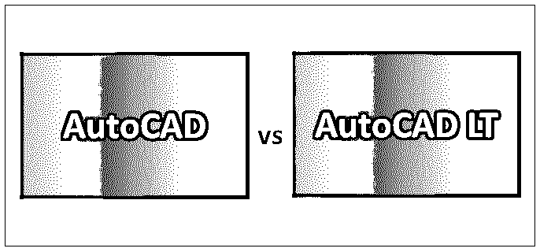
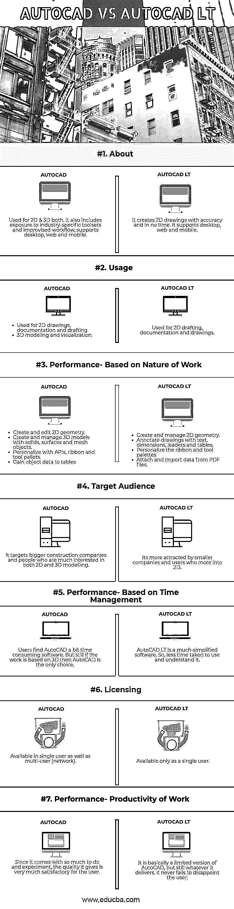

# AutoCAD vs AutoCAD LT

> 原文：<https://www.educba.com/autocad-vs-autocad-lt/>

## AutoCAD 与 AutoCAD LT 的区别

商业制图和计算机辅助设计(CAD)软件应用程序被称为 AutoCAD。主要用于 2D 制图、绘图和文档以及 3D 建模和可视化。1982 年，Autodesk 首次发布了这款桌面应用，运行在内置图形控制器的微型计算机上。2010 年，AutoCAD 作为移动和 web 应用程序发布，俗称 AutoCAD 360。AutoCAD 还帮助用户使用网络许可在多台机器上使用和管理它。

AutoCAD LT 本质上是 AutoCAD 的一个较低版本，Autodesk 发布该版本是为了吸引更多客户。这是一款入门级 CAD 软件，使用 AutoCAD 的精简功能开发而成。它由 Autodesk 于 1993 年首次发布。2015 年，AutoCAD LT 推出了桌面订阅。因此，AutoCAD LT 是一个可靠但有些有限的设计包。AutoCAD LT 是一款初学者软件，也兼容 Windows、Mac 和移动应用程序。

<small>3D 动画、建模、仿真、游戏开发&其他</small>

### AutoCAD 和 AutoCAD LT 的直接比较(信息图表)

以下是 AutoCAD 与 AutoCAD LT 之间的 7 大区别:

### AutoCAD 和 AutoCAD LT 的主要区别

两者都是市场上的热门选择；让我们来讨论一些显著的区别:

*   由于 AutoCAD LT 是 AutoCAD 的迷你版本，它仅提供 2D 功能，而 AutoCAD 具有三维功能。
*   AutoCAD LT 更多地用于 2D 制图，甚至提供比 AutoCAD 更低的价格。因此，如果有人的优先考虑是 2D，那么他甚至可以单独工作在 AutoCAD LT 上，而不需要花费任何精力去学习 AutoCAD 的复杂性。
*   对于 3D 专业化，AutoCAD LT 对用户来说是不够的，因为它只能移动、复制或删除 3D 模型，而不能创建新模型。而 AutoCAD 自带 3D 功能。
*   AutoCAD 帮助用户自定义选项，而无需做任何额外的工作。AutoCAD 支持各种应用程序编程接口(API)，包括 AutoCAD 的默认编程语言 AutoLISP。然而，在 AutoCAD LT 中，用户可以进行简单的定制，如创建和调整工具栏以及编写脚本，但不能执行高级编程。
*   AutoCAD LT 不提供网络许可，而使用 AutoCAD，用户可以获得网络许可，从而使他们的工作变得容易。例如，用户可以拥有一个 10 席位的许可，允许 AutoCAD 在办公室 20 台机器中的任何 10 台机器上运行，前提是一次运行的机器不超过 10 台。而对于 AutoCAD LT 用户，他们必须为 20 台机器购买 20 个许可证，每台机器一个。
*   Express tools 是一组官方不支持但仍然可靠的额外工具。express 工具大部分是使用 API 编写的，因此它们在 AutoCAD LT 中不起作用，但是它们可以在 AutoCAD 中使用。
*   在 AutoCAD LT 中，参数化受到极大限制。用户可以看到“参数化”选项卡和管理器，但在 AutoCAD LT 中几乎没有影响。用户不能在 LT 中创建参数，但可以删除它们，这将破坏 DWG 文件。因此，为了在改变尺寸值的同时改变几何图形，应该考虑 AutoCAD。
*   AutoCAD LT 不支持图纸集管理器和动作记录器的管理和自动化功能，但 AutoCAD 支持它们。
*   在“选项”对话框中，用户可以根据自己在软件上工作的意愿来平衡图形特定设置和系统范围设置。配置文件是用户保存的设置，甚至可以在选项对话框中进行切换。遗憾的是，在 AutoCAD LT 的“选项”菜单中没有“轮廓”选项卡，但在 AutoCAD 中，用户可以使用它。
*   AutoCAD LT 缺少数据提取向导，该向导从对象以及属性化和非属性化块中获取信息。相反，用户需要使用 AutoCAD LT 来提取数据。

### AutoCAD 与 AutoCAD LT 对照表

下面是最上面的比较:

| **比较的基础** | **AUTOCAD** | **AUTOCAD LT** |
| **关于** | 用于 2D 和 3D。它还包括接触特定行业的工具集和临时工作流，支持桌面、web 和移动。 | 它能准确而迅速地创作出 2D 的作品。它支持桌面、网络和移动。 |
| **用途** | 

*   Used for 2D drawings, documents and drawings.
*   3D modeling and visualization.

 | Used for 2D drafting, documentation, and drawings. |
| **绩效-基于工作性质** | 

*   Create and edit 2D geometry.
*   Create and manage 3D models with solid, surface and mesh objects.
*   Personalize with API. And a ribbon and a tool tray.
*   Get the object data into the table.

 | 

*   Create and manage 2D geometry.
*   Mark the drawings with text, dimensions, leaders and tables.
*   Personalized Ribbon and Tool Palette
*   Attach and import data from PDF files.

 |
| **目标受众** | 它的目标是更大的建筑公司和对 2D 和 3D 建模感兴趣的人。 | 它更受更多进入 2D 的小公司和用户的吸引。 |
| **绩效-基于时间管理** | 用户发现 AutoCAD 是一个有点费时的软件。但是，如果工作是基于 3D 的，那么 AutoCAD 是唯一的选择。 | AutoCAD LT is a much-simplified software. So, less time is taken to use and understand it. |
| **发牌** | 可用于单用户和多用户(网络)。 | 仅作为单个用户可用。 |
| **绩效-工作生产率** | 因为它有这么多可以实验的东西，所以用户对它的质量非常满意。 | 这是 AutoCAD 的一个有限版本，但是无论它提供什么，它总是让用户失望。 |

### 结论

AutoCAD LT 可以称为 AutoCAD 的一个子部分。它是其母软件的受限版本。虽然 AutoCAD 和 AutoCAD 都被同等使用。AutoCAD 在特性和功能上更为详尽，很多都是 AutoCAD LT 没有的，它们的不同之处只是 AutoCAD LT 不支持 3D 建模，没有自己的编程语言。此外，它还没有推出网络许可证。

然而，等式中最重要的部分是客户想要什么。如果市场坚持 3D 设计和制图文件，AutoCAD LT 就不够用了。同样，开发使用 AutoCAD 的能力可以为新的商业机会打开大门。但是如果目标受众是 2D 的专家，那么他可以选择 AutoCAD LT

### 推荐文章

这是 AutoCAD 与 AutoCAD LT 之间的主要区别的指南。在这里，我们还讨论了信息图和比较表的主要区别。您也可以看看以下文章，了解更多信息–

1.  [Adobe Photoshop vs GIMP](https://www.educba.com/adobe-photoshop-vs-gimp/)
2.  [QuarkXPress vs InDesign](https://www.educba.com/quarkxpress-vs-indesign/)
3.  [Adobe Illustrator vs Adobe Photoshop](https://www.educba.com/adobe-illustrator-vs-adobe-photoshop/)
4.  [Adobe Muse vs Dreamweaver](https://www.educba.com/adobe-muse-vs-dreamweaver/)

