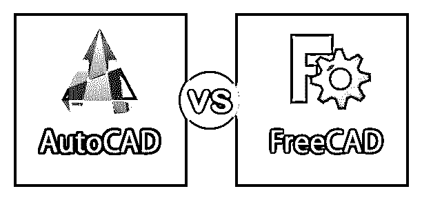
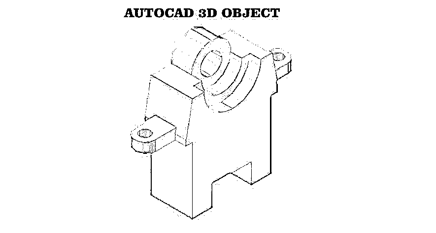
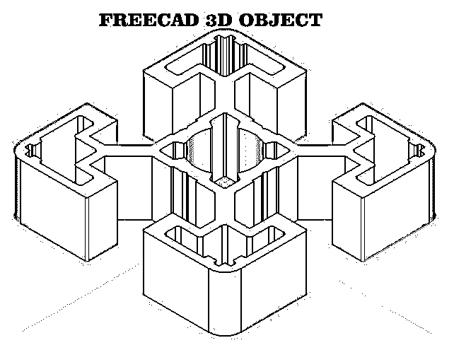
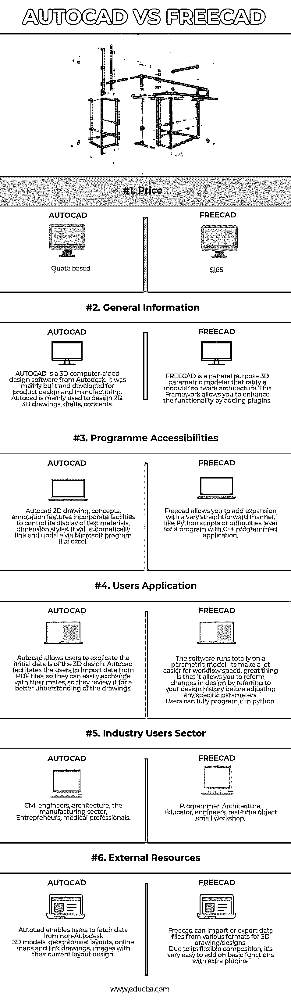

# AutoCAD vs FreeCAD

> 原文：<https://www.educba.com/autocad-vs-freecad/>

## AutoCAD 和 FreeCAD 的区别

设计世界因其时尚、创新、有创意的设计产品而令人着迷。

每天都有不同的技术引入市场。我们需要一些特别制作的软件来构建任何一个小的设计，其中 Autocad 和 Freecad 发挥了作用。

<small>3D 动画、建模、仿真、游戏开发&其他</small>

AutoCAD 是一种商用计算机辅助设计(CAD)和绘图(技术制图)软件应用程序。在技术绘图中，我们必须在开始绘制任何绘图之前考虑许多方面，比如视觉表示、对某个东西如何工作的度量。

Autocad 于 1982 年 12 月作为微型计算机上的桌面应用程序推出。微型计算机是一种价格不高的小型计算机，以微处理器为中央处理器(CPU)。

FreeCAD 的名字本身解释了自由和开源软件。这意味着任何人都可以根据自己的需求自由地使用或学习或更改软件，因此可以公开地与有勇气自由/有目的地分享。

Freecad 是一个参数化的 3D CAD 建模工具。参数化建模器意味着它使用某些准则(如尺寸、测量、特征)。这个特定的规范将决定设计模型的特征、材料密度、任何特定的公式导入数据。如果需要，可以在该阶段的后期调整这些参数。这些变化将反映修改。

通常，在零件、组件和绘图之间建立了链接。零件由各种特征组成，组件由多个零件组成。可以从零件或组件设计绘图。

### AutoCAD 和 FreeCAD 的直接比较(信息图表)

下面是 AutoCAD 与 FreeCAD 的 6 大区别

### AutoCAD 和 FreeCAD 的主要区别

两者都是市场上的热门选择；让我们讨论一些主要的区别:

*   Autocad 具有 2D 绘图的内置功能，可以包含文字的外观和尺寸样式。它还链接和更新 Microsoft Excel 电子表格和表格。Freecad 允许添加额外的插件来加快工作流程。Freecad 使用户能够运行大规模的 python 脚本，甚至是错综复杂的 C++脚本结构。
*   为了创建三维对象，AutoCAD 为用户提供了向材质添加照明或阴影的功能，以获得完美的绘图渲染效果。Freecad 提供了一个完整的用户界面(UI)，它是基于框架的。它有一个开放的 3D 浏览器，可以显示图形，也可以快速渲染最终图形的效果。
*   Autocad 建立 SHF 文本格式的 PDF 导入。这些文本在 Autocad 中创建，并作为几何图形引入程序。Freecad 是所有资源丰富的库的组合，如 open-cascade，它管理几何图形的构造，Coin3D，用于显示几何图形，Qt，它将所有这些与图形用户界面结合在一起。
*   AutoCAD 帮助用户防止产品故障和保修问题。由于 Freecad 是一个开源的参数化建模器，所以总是有可能出现 bug，但是您仍然可以报告 FreeCad Tracker。
*   AutoCAD 可在 Window、Android iPhone/iPad、Mac 网络版上使用。FreeCAD 在 Windows Linux Mac 上可用。

### AutoCAD 与 FreeCAD 比较表

以下是以下两者之间最重要的比较:

| **的基础** | **AUTOCAD** | **FREECAD** |
| **价格** | 基于报价 | $185 |
| **General Information** | AUTOCAD is a 3D computer-aided design software from Autodesk. It was mainly built and developed for product design and manufacturing.Autocad 主要用于设计 2D、3D 图纸、草图、概念。 | FREECAD is a general-purpose 3D parametric modeler that ratify a modular software architecture. This Framework allows you to enhance the functionality by adding plugins. |
| **Programme****可访问性** | Autocad 2D 工程图、概念、注释功能包含控制其文字材料、标注样式显示的工具。它会自动链接和更新，通过像 excel 的微软程序。 | Freecad 允许你以一种非常直接的方式添加扩展，就像 Python 脚本或 C++编程应用程序的难度级别。 |
| **用户申请** | Autocad allows users to explicate the initial details of the 3D design. Autocad facilitates the users to import data from PDF files, so they can easily exchange with their mates, so they review it for a better understanding of the drawings. | The software runs totally on a parametric model. It makes it a lot easier for workflow speed; the great thing is that it allows you to reform changes in design by referring to your design history before adjusting any specific parameters.用户完全可以用 python 来编程。 |
| **行业用户部门** | Civil engineers, architecture, the manufacturing sector,企业家、医疗专业人士 | Programmer, Architecture,教育家、工程师、实时对象小作坊 |
| **外部资源** | Autocad enables users to fetch data from non-Autodesk三维模型，地理布局，在线地图和链接图纸，图像与他们当前的布局设计。 | Freecad can import or export data files from various formats for 3D drawing/designs.由于其灵活的组成，它很容易添加额外的插件的基本功能 |

### 结论

如果您想购买 AUTODESK AUTOCAD，但在购买之前，了解并自我分析 CAD 软件市场上的各种选项总是一个好主意。由于市场上有一堆优秀的软件可用，首先要搞清楚自己的业务需求、预算、技能水平，这些在购买软件时起着重要的作用。回顾一些[实时用户体验](https://www.educba.com/real-time-analytics/)，它们对做出任何决定都很有帮助。

### 推荐文章

这是 AutoCAD 与 FreeCAD 之间最大差异的指南。在这里，我们还讨论了 AutoCAD 与 FreeCAD 的关键差异，包括信息图表和比较表。您也可以看看以下文章，了解更多信息:

1.  [Autocad 和 Inventor](https://www.educba.com/autocad-vs-inventor/)
2.  [Photoshop 和 Paint](https://www.educba.com/photoshop-vs-paint/)
3.  [Autodesk 和 Autocad](https://www.educba.com/autodesk-vs-autocad/)
4.  [CorelDraw 与 Adobe Photoshop](https://www.educba.com/adobe-photoshop-vs-coreldraw/) 的比较

