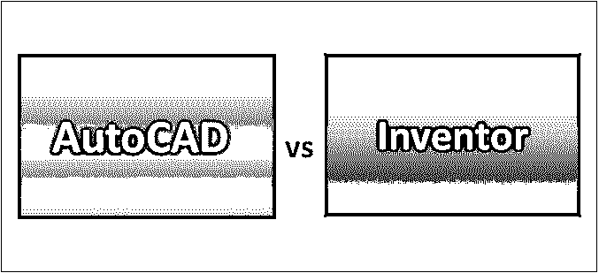
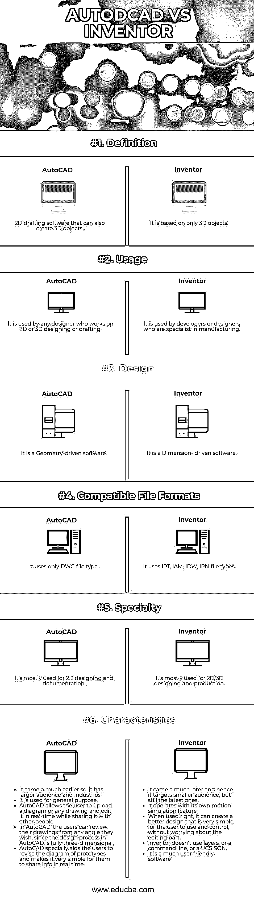

# Autocad 与 Inventor

> 原文：<https://www.educba.com/autocad-vs-inventor/>

## Autocad 与 Inventor 的区别

AutoCAD 是一个具有后开发功能的重量级设计制作平台。由 Autodesk 开发和营销的 AutoCAD 最初于 1982 年发布，是一款在带有内部图形控制器的微型计算机上运行的桌面应用程序。AutoCAD 的最新版本是 AutoCAD 360，它也支持移动和 web。项目经理、工程师、建筑师、城镇规划者和许多其他专业人员广泛使用。Inventor 的美妙之处在于，它允许用户将 2D 和 3D 数据融合到一个环境中，从而创建输出产品的虚拟演示，帮助用户在构建产品之前验证产品的形式、适合度和功能。inventor 是基于尺寸驱动的设计开发的。使用 inventor 可以更轻松地绘制任何形状或对象。

### Autocad 与 Inventor 的直接对比(信息图表)

以下是 Autocad 与 Inventor 的 6 大区别

<small>3D 动画、建模、仿真、游戏开发&其他</small>

### Autocad 与 Inventor 的主要区别

Autocad vs Inventor 都是市场上的热门选择；让我们讨论一下 Autocad 与 Inventor 之间的一些主要差异:

*   AutoCAD 因其通用领域而难以使用和适应，而 Inventor 因其行业特殊性而易于使用。
*   AutoCAD 的工作基于设计和发现新项目，而 Inventor 的目标用户是希望在运动中测试某些东西的用户。例如，AutoCAD 用于设计机器人机器，而 Inventor 可用于模拟该机器在使用时的移动方式。
*   由于 AutoCAD 用于设计和绘图，它比 Inventor 更常用，因为它可以确保在任何测试之前使用正确的材料。
*   如果用户需要使用程序或设备的技术方面，那么使用 Inventor 将比使用 AutoCAD 更完美。
*   默认情况下，Inventor 包含 3D 建模功能，而 AutoCAD 缺少这些功能，因为它主要是一个 2D 软件，后来它采用了 3D 模块。
*   与 AutoCAD 相比，inventor 在视觉上和技术上都是用户友好的软件。
*   与 Inventor 相比，AutoCAD 不是一个非常智能的程序。如果用户以后想在图中改变或移动任何东西，他必须重新画线。
*   与 AutoCAD 不同，发明家可以区分组件、零件和 2D 绘图。
*   inventor 可以基于几何图形基础零件内的更新来更新现有几何图形。而此基础零件比例在 AutoCAD 中不可用。
*   AutoCAD 是一个巨大的设计制作应用程序，具有横截面、基于人工照明的渲染和虚拟漫游的全景渲染等功能。而发明人是在设计制造之后使用的应用程序。
*   当用户创建倒角、孔、圆角等三维零件时，所有零件都作为独立特征存储在 Inventor 中。而在 AutoCAD 中，用户发现这很困难，他们必须删除并重新创建特定的特征。
*   发明者主要是为制造公司创造的。而 AutoCAD 是为更多的用户设计的。它是为土木工程、工厂设计、FM、AEC 等设计的。
*   发明家不使用图层。这意味着它一次设置所有参数，然后从该点开始自动将它们分配给零件。而在 AutoCAD 中使用图层是一件麻烦的事情。
*   Inventor 允许用户使用任何特定的文件格式或单个零件和部件。它有一个惊人的基于几何的引擎，旨在确保所有读数和分析报告都是实时生成的。
*   自从 AutoCAD 问世以来，人们越来越倾向于 AutoCAD。另一方面，发明家是很晚才被引进的。
*   一个发明家更像是一个实用的演示软件，让用户了解他的设计是如何工作的。而 AutoCAD 更多的是出于想象创造新的模型。
*   Inventor 是两者中最新的，具有最短的学习曲线，给出快速的结果，具有非常吸引人的工作流程和界面，而 AutoCAD 不亚于它，但仍然缺乏一些功能。

### AutoCAD 与 Inventor 对照表

我们来看看 AutoCAD vs Inventor 的顶级对比；–

| **AutoCAD 与 Inventor 对比的依据** | **AutoCAD** | **发明者** |
| **定义** | 2D 绘图软件，也可以创建三维物体 | 它仅基于三维对象。 |
| **用途** | 它被任何从事 2D 或 3D 设计或绘图的设计师使用 | 它由擅长制造的开发人员或设计人员使用 |
| **设计** | 这是一个几何驱动的软件 | 这是一个尺寸驱动的软件 |
| **兼容文件格式** | 它只使用 DWG 文件类型 | 它使用 IPT，IAM，IDW，IPN 文件类型。 |
| **专业** | 它主要用于 2D 设计和文档 | 它主要用于 2D/3D 设计和制作。 |
| **特性** | 

*   It came much earlier, so;

*   It is used for general purposes.
*   AutoCAD allows users to upload charts or any drawings, edit them in real time, and share them with others.
*   In AutoCAD, users can view their drawings from any angle they want, because the design process in AutoCAD is completely three-dimensional. AutoCAD especially helps users to modify prototype drawings and makes it very simple for them to share information in real time.

 | 它来得更晚，因此它的目标受众更小，但仍然是最新的受众。*   With its own motion simulation function*   Run, when used correctly, it can create a better design that users can use and control very simply without worrying about editing parts.*   Inventors don't use layers, command lines, and UCSISON.*   This is a very user-friendly software. |

### 结论

AutoCAD 和 Inventor 是两个程序，它们的功能不同。此外，如果将 Autocad 与 Inventor 结合在一起，那么对于任何企业来说，在设计不同的项目并在工作场所使用它们方面，都将更容易做到更多。总的来说，在 3D 绘图方面，Inventor 是一个更好的选择。Autodesk Inventor 是 Autodesk 在 1999 年发明的一种用于 3D 机械设计、模拟、可视化和文档编制的应用程序。CAD 软件的唯一职责是帮助后期设计制造过程。

AutoCAD 提供了极限控制，而 Inventor 提供了易用性。AutoCAD 提供生产前的灵活性和独特的设计；Inventor 关注的是后期开发和制造潜力。

### 推荐文章

这是 Autocad 与 Inventor 之间最大差异的指南。在这里，我们还讨论了 Autocad 与 Inventor 在信息图表和比较表方面的主要差异。您也可以看看以下文章，了解更多信息–

1.  [Autodesk vs Autocad](https://www.educba.com/autodesk-vs-autocad/)
2.  [Maya vs 3Ds Max](https://www.educba.com/maya-vs-3ds-max/)
3.  [玛雅 vs 胡迪尼](https://www.educba.com/maya-vs-houdini/)
4.  [3ds Max vs Sketchup](https://www.educba.com/3ds-max-vs-sketchup/)

