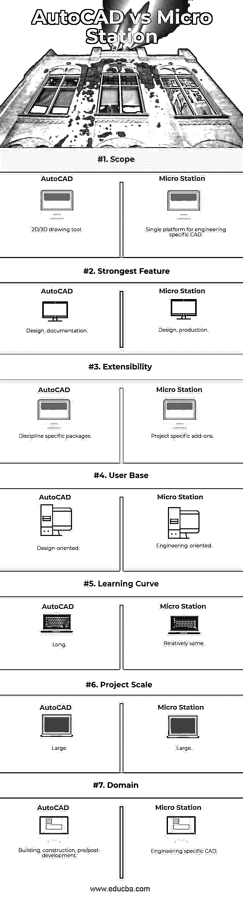

# AutoCAD 与 Microstation

> 原文：<https://www.educba.com/autocad-vs-microstation/>

## AutoCAD 和 Microstation 的区别

AutoCAD 缩写为商用计算机辅助设计(CAD)和绘图软件应用。欧特克被开发出来并推向市场；该软件于 1982 年 12 月首次发布，作为一个桌面应用程序运行在带有内部图形控制器的微型计算机上。Micro Station 是一种 CAD 软件，是一种用于二维和三维设计和绘图的平台，由 Bentley Systems 开发和销售，用于建筑和工程行业。Micro Station 提供了一个高度可互操作的环境，确保您的团队可以根据需要集成和访问来自不同来源的信息，从而能够整合任何设计数据，无论其格式如何。

### AutoCAD 和 Microstation

使用 CAD，你可以画一次东西，然后复制几百次，甚至几千次。改变设计可以像按一个按钮一样简单。图纸可以通过计算机网络在房间内甚至世界各地即时共享。

<small>3D 动画、建模、仿真、游戏开发&其他</small>

CAD 的这些和其他优势包括:

*   提高生产率
*   绘图内容可以不断重复使用。
*   可以自动创建和更新文本和尺寸。
*   可以通过一次拾取来放置图案填充和图案填充。
*   修改和编辑图纸可以不费吹灰之力快速完成。
*   提高精度
*   数字信息精确到小数点后 14 位。
*   使用笛卡尔坐标系精确定位几何图形。
*   可以捕捉到现有工程图几何图形上的控制点和特征，以精确定位工程图信息。
*   极坐标和物体跟踪功能可用于精确的角度测量。
*   更好的协作
*   可以通过网络共享图形(本地和全局)。
*   可以通过通知实时参考和更新图形。
*   修订和标记可以通过电子邮件和基于互联网的文档管理系统进行电子化管理。
*   3D 可视化和分析

Microstation 生成 2D/3D 矢量图形对象和元素，并包含 BIM 功能。20 世纪 80 年代，宾利系统公司开发了 MicroStation。为微软视窗操作系统发布的最新版本的 Micro station 软件，但它已经可用于 Macintosh 平台和使用 CAD 的 Unix 操作系统，

### AutoCAD 和 Microstation 的特点

#### 1.广泛的格式互操作性

从广泛的 AECO 和地理空间格式中精确合并现有数据，包括 DGN、RealDWGTM、DXF、PDF、点云、U3D、3DS、Rhino 3DM、IGES、Parasolid、ACIS SAT、CGM、STEP AP203/AP214、STL、OBJ、VRML world、Google Earth KML、Sketch-Up SKP、Collada、ESRI SHP、IFC 等。

#### 2.地理坐标

地理空间信息的自动转换和集成支持数百个地理空间坐标系统，并确保空间信息始终显示在其正确的上下文中。

#### 3.灵活的文件引用

无论身处何地，所有项目参与者都可以实时查看和共享多种格式的实时设计信息。

#### 4.编程可扩展性

广泛的选项来定制 Micro Station 的行为和与其他系统的数据交换，包括可定制的用户界面、用户定义的宏、对 VBA、> NET、C++、C#和 Bentley MDL 的支持。

#### 5.超级建模

业界领先的功能，支持建模和文档工作流的融合。它自动完成绘图制作和注释任务，并通过嵌入其中的链接将相关文档和信息集成到 3D 模型中。

#### 6.完整的建模工具集

各种 2D 和 3D 设计工具，可轻松创建信息模型，包括复杂的几何图形和关系，如曲面、网格、特征和实体模型。

#### 7.简化的设计环境

简化和加快设计任务和相关工作流程的创新，包括 AccuDraw(带平视显示器的动态输入)、可定制菜单、键盘位置映射以及智能和交互式捕捉。

### AutoCAD 和 Microstation 的直接对比(信息图)

以下是 AutoCAD 与 Microstation 之间的 7 大区别

### AutoCAD 与 Microstation 的主要区别

两者都是企业中推荐的选项。让我们检查一些关键的区别:

*   AutoCAD 是基于命令软件；微站是那里的一个工具基础软件；你可以使用工具栏。
*   微型工作站的内部数据存储是基于整数(32 位)的，但 AutoCAD 是基于浮点的，这意味着你可以在太阳系的任何地方绘制一个小物体的比例图，你可以在其中插入另一幅图。这在 AutoCAD 中完全可以，但在 Microstation 中却不容易
*   Autocad 比 MicroStation 更快更好地支持对象捕捉。
*   Autocad 的大部分程序都是通过使用对话框模式实现的。这个特性对 MicroStation 用户来说是最令人恼火的因素。在微型工作站中，屏幕很快被对话框填满。
*   在 AutoCAD 中，当完成某些步骤后刷新多个窗口时，不能在多个视口中同时看到橡皮带和光标。
*   微型工作站允许参数化绘图。但是 AutoCAD 不允许这个功能。
*   Microstation 支持技术接口。它有一个用户友好的功能，但需要大量的培训才能更好地理解。
*   Microstation 支持典型的图层控件。
*   Micro Station 具有自动检测冲突和模拟进度的能力，设计和施工团队可以在问题成为现场的昂贵问题之前识别并解决问题。与 AutoCAD 难以识别的问题。
*   Micro Station 为其他特定学科的仿真应用提供了一个强大的平台。它自动完成绘图制作和注释任务，并通过嵌入其中的链接将相关文档和信息集成到 3D 模型中。

### AutoCAD 与 Microstation 比较表

以下是顶部对比:

| **比较的基础** | **AutoCAD** | **微站** |
| **范围** | 2D/3D 绘图工具 | 工程专用 CAD 的单一平台 |
| **最强特性** | 设计、文档 | 设计、生产 |
| **扩展性** | 特定学科包 | 特定于项目的附加组件 |
| **用户群** | 面向设计 | 面向工程的 |
| **学习曲线** | 长的 | 相对相同 |
| **项目规模** | 大的 | 大的 |
| **域** | 建筑、施工、前期/后期开发 | 工程专用 CAD |

### 结论

AutoCAD 和 Microstation 哪个好？嗯，从个人的角度来看，当谈到 2D 设计时，AutoCAD 是一个明显的赢家。这可能是因为它是我学会如何使用的第一个 CAD 软件，也是我经常使用的一个。但我并不是唯一一个这样认为的人:许多使用 AutoCAD 的专业人士都认为“AutoCAD 仍然凭借其先进的 2D 绘图功能胜过 Micro Station”(Chief，2012)

说到 3D 支持，不得不把这个给微站。在电脑渲染 3D 设计时，我数不清自己喝了多少杯咖啡。这几乎要花很长时间，所以最好的办法是让机器变魔术，休息一下。(阿尔瓦雷斯，2006 年)

总之，AutoCAD 和 Microstation 工具都提供了可归类为高级绘图工具的功能。CAD 设计师可以使用这些工具来绘制和设计 2D 和三维设计，而不考虑它们的复杂性。(普拉科索，2011 年)

### 推荐文章

这是 AutoCAD 与 Microstation 之间最大差异的指南。在这里，我们还将讨论信息图和比较表的主要区别。您也可以看看以下文章，了解更多信息–

1.  [Maya vs 3ds Max vs Blender](https://www.educba.com/maya-vs-3ds-max-vs-blender/)
2.  [玛雅 vs 印加](https://www.educba.com/maya-vs-inca/)
3.  [Photoshop vs Photoshop CC](https://www.educba.com/photoshop-vs-photoshop-cc/)
4.  [Photoshop vs Lightroom](https://www.educba.com/photoshop-vs-lightroom/)

