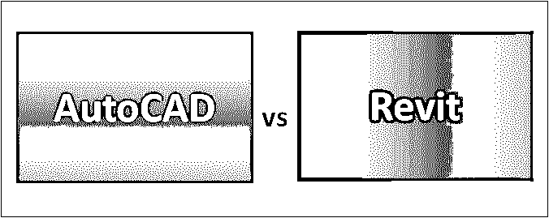
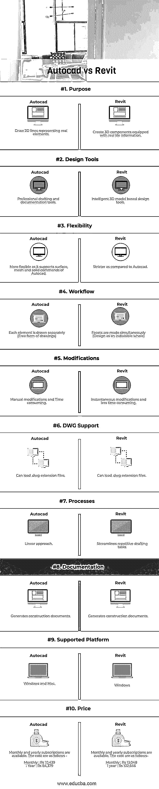

# AutoCAD 与 Revit

> 原文：<https://www.educba.com/autocad-vs-revit/>

## AutoCAD 和 Revit 的区别

Autocad 是最早在个人电脑上运行的计算机辅助程序之一。它目前被建筑师、工程师广泛用于许多应用中，以创建和修改设计中的几何形状，用于创建建筑物、桥梁、计算机芯片等的蓝图。该设计可以在网络和手机上创建和修改。另一方面，Revit 是一个用于创建带有真实信息的几何图形的应用程序。换句话说，它是一个 4D 建筑信息建模(BIM)工具，具有建筑设计、结构工程和施工功能。

### Autodesk 公司的计算机辅助设计软件

Autocad 2D 和 3D design 计算机辅助设计(cad)绘图工具，由于 1982 年 12 月开发、发布和上市。Autocad 提供了很多功能。其中一些如下

<small>3D 动画、建模、仿真、游戏开发&其他</small>

*   **DWG 比较–**可以比较并展示一张图纸的两个版本之间的差异。
*   **网络和移动支持—**可通过网络和移动设备查看和编辑图纸。
*   **2D 图形–**缩放、订单变更和图层属性速度提高 2 倍
*   **共享视图–**设计视图可以通过网络浏览器共享，以供评论。
*   **PDF 导入–**将几何图形、SHX 字体文件、光栅图像从 PDF 导入绘图。
*   **工作区—**使用定制的菜单、工具栏保存和恢复工作区
*   **渲染–**可以应用光照和材质来赋予 3D 模型逼真的外观。
*   **DGN 文件—**导入、导出和附加 DGN 文件以重复使用数据。

### Revit

Revit 所基于的 BIM 是一种新的 CAD 范式，支持智能、3D 和参数化的基于对象的设计。Revit 的当前版本仅受 windows 支持，但不能在 Mac OS 等其他操作系统中使用。Revit 功能丰富，其中一些功能如下

*   **建筑信息模型(BIM)–**模型可以用真实信息创建，并且不可分割。
*   **参数化组件—**用于设计和表单制作的开放式图形系统
*   **工作共享—**贡献者可以共享和保存他们的工作。
*   **Schedules—**模型的表格显示可以从元素的属性中提取。
*   **互操作性—**以常用格式导入、导出和链接数据。
*   **注释—**所见即所得编辑允许您控制文本外观。
*   **建筑设计—**向建筑模型添加元素，包括墙、门、窗和组件
*   **云渲染–**在云上生成逼真的可视化效果。

Autodesk 同时拥有 AutoCAD 和 Revit。

### AutoCAD 和 Revit 的直接对比(信息图表)

以下是 AutoCAD 与 Revit 之间的 10 大差异

### AutoCAD 和 Revit 的主要区别

两者都是市场上的热门选择；让我们讨论一些主要的区别:

*   Autocad 的工作方式更像一张图纸，您可以在其中创建代表项目真实元素的 2D 设计，而 Revit 更侧重于将项目作为一个整体来考虑，并且更接近真实情况。它用于构建配有真实信息的 3D 组件。
*   Autocad 侧重于项目的单个构件，而 Revit 将整个项目视为一个整体，这为建筑师提供了将设计视为不可分割的优势。
*   在 Revit 中进行客户建议的修改和最后修改比在 Autocad 中更容易，因为后者的修改几乎都是手动的，而且很耗时。
*   与 Revit 相比，Autocad 更灵活，因为它支持 Autocad 的曲面、网格和实体命令，而对于后者，它更严格，因为需要正确构建这些东西，因为为此，我们不仅要构建 3D 模型，还要构建能够协调工作和更多工作的模型。
*   Autocad 遵循线性坐标，涉及所有关联组之间的不断往复。另一方面，Revit 具有优势，因为所有模型都可以链接到中心建筑模型，以跟踪它们之间的实时冲突。
*   Windows 和 Mac 都支持 Autocad，而 Revit 目前只能在 Windows 上运行。
*   Autocad web app 可用于通过浏览器和移动设备创建、编辑和共享 cad 设计，而 Revit 作为软件提供，可在 windows 中安装后使用。
*   Autocad 和 Revit 都需要从 Autodesk 订阅，并基于需求；人们可以选择每月或每年的计划。在相同期限内，Revit 的订阅成本高于 Autocad。

### AutoCAD 与 Revit 的比较表

下面是顶部对比

| **比较的基础** | **Autocad** | **Revit** |
| **目的** | 画代表实元素的 2D 线 | 创建配有真实信息的 3D 组件。 |
| **设计工具** | 专业的制图和文档工具 | 智能三维模型设计工具 |
| **灵活性** | 更灵活，因为它支持 Autocad 的曲面、网格和实体命令 | 与 Autocad 相比更严格。 |
| **工作流程** | 每个元素都是单独绘制的(绘图的自由形式) | 刻面同时制作(作为不可分割的整体设计) |
| **修改** | 手动修改和耗时 | 即时修改和更少的时间消耗。 |
| **DWG 支持** | 可以加载。dwg 扩展文件 | 可以加载。dwg 扩展文件 |
| **流程** | 划一减税办法 | 简化重复性的绘图任务 |
| **文档** | 生成施工文件 | 生成施工文件 |
| **支持的平台** | Windows 和 Mac | Windows 操作系统 |
| **价格** | 每月和每年的订阅是可用的。费用如下—
每月:10，439 卢比
一年:84，379 卢比 | 每月和每年的订阅是可用的。费用如下—
每月:13，048 卢比
一年:102，646 卢比 |

### 结论

总之，AutoCAD 和 Revit 都是由 Autodesk 开发和销售的。AutoCAD vs Revit tools 用于商业目的，为建筑物、桥梁、计算机等创建 2D-3D 蓝图。AutoCAD 和 Revit 都需要每月或每年从 Autodesk 订阅以创建蓝图和模型。Autocad 的用途是绘制代表真实元素的 2D 线，而 Revit 可用于创建包含真实信息的三维构件。Autocad 侧重于项目单个图元的设计和修改，而在 Revit 中，项目被认为是不可分割的。

与 Autocad 相比，Revit 中的修改和最后修改很容易完成，因为 Autocad 中的修改是手动的，非常耗时。Autocad 有 web 和移动应用两种版本，可以在 Windows 和 Mac 平台上使用。Revit 只能在 Windows 操作系统上使用。根据要求、可用硬件和设计要求，可以在 Autocad 和 Revit 之间进行选择来创建蓝图。

### 推荐文章

这是 AutoCAD 与 Revit 之间最大差异的指南。在这里，我们还讨论了 AutoCAD 与 Revit 在信息图表和比较表方面的主要差异。您也可以看看以下文章，了解更多信息–

1.  [AutoCAD vs SolidWorks](https://www.educba.com/autocad-vs-solidworks/)
2.  [Maya vs 3Ds Max](https://www.educba.com/maya-vs-3ds-max/)
3.  [Autocad vs Inventor](https://www.educba.com/autocad-vs-inventor/)
4.  [玛雅 vs 玛雅 LT](https://www.educba.com/maya-vs-maya-lt/)

