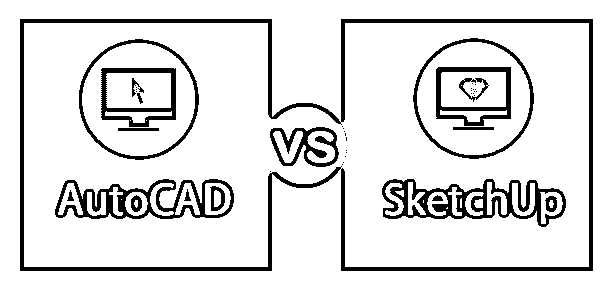
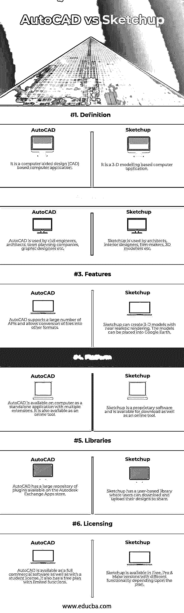

# AutoCAD vs SketchUp

> 原文：<https://www.educba.com/autocad-vs-sketchup/>

## AutoCAD 和 SketchUp 的区别

AutoCAD 的开发着眼于计算机辅助设计(CAD)架构，是一款绘图软件。AutoCAD 主要用于各种生产和建筑公司的蓝图和平面图设计。该软件最初由 Autodesk 作为一个独立的微型计算机应用程序开发和销售。最终，它作为一个成熟的基于操作系统的软件发布了。AutoCAD 后来也以 AutoCAD 360 的名称作为在线工具发布。在 AutoCAD 中创建的文件扩展名为. DWG。Sketchup 是 Google 和 Last Software 最初开发的另一个基于 3D 建模的设计软件。它是以谷歌 Sketchup 的名字发布的。Trimble Inc .拥有该软件。如今，Sketchup 对于创建土木、机械工程、电影制作等模型非常有用。Sketchup 是一款高度通用的软件，是一款基于网络的免费应用程序，付费版本提供更多功能。Sketchup 中的设计以 SKP 格式保存，扩展名为. skp

### AutoCAD 和 SketchUp 的正面比较(信息图表)

以下是 AutoCAD 与 SketchUp 之间的 6 大区别:

<small>3D 动画、建模、仿真、游戏开发&其他</small>

### AutoCAD 和 SketchUp 的主要区别

两者都是市场上的热门选择；让我们来讨论一些显著的区别:

*   AutoCAD 是一种工具，主要用于起草和设计 2D 设计并将这些设计打印在纸上以供实地使用，而 SketchUp 是一种 3D 建模工具，可帮助您根据模型在现实生活中的外观来设计模型。
*   AutoCAD 有许多可用的功能和插件，因此您可以根据自己的需要精确地定制设计。这使得学习 AutoCAD 成为一项耗时的任务。另一方面，SketchUp 的界面更简单，可以相对快速的学会。
*   AutoCAD 没有导入许多不同的文件类型[用于编辑](https://www.educba.com/adobe-editing-softwares/)和集成，而 SketchUp 对此不太坚持。AutoCAD 只能导入。dwg 文件，而 SketchUp 也可以加载 3DS 文件，这是一种流行的格式。
*   在渲染细节方面，AutoCAD 比 SketchUp 要好。AutoCAD 中的模型可以在各种光照条件下有效地复制阴影。与 AutoCAD 相比，SketchUp 中的设计没有那么详细，人们可以从设计中看出来这是软件工作。
*   AutoCAD 为特定学科的应用开发了 12 个扩展。SketchUp 没有为不同的应用程序提供不同的垂直方向。
*   AutoCAD 每月订阅计划起价为 10，000 印度卢比。Sketchup 是免费软件，有两个付费计划；一个每月 8500 印度卢比的计划。SketchUp 也可以购买终身许可，价格约为。50000 印度卢比。
*   AutoCAD 没有可供不同用户上传和共享设计的官方库。SketchUp 有一个庞大的库，名为 3D Warehouse，涉及成千上万的用户，他们定期直接从门户网站上传和下载不同的设计。
*   AutoCAD 不允许直接从 internet 导入文件。在将它加载到软件中之前，必须先将其下载到您的系统中。SketchUp 可以直接获取高达 50MB 的设计，并将它们直接加载到软件中，您可以稍后下载。
*   AutoCAD 也有学生版，价格较低，而 SketchUp 不提供学生优惠。
*   AutoCAD 可以支持许多 API，如 AutoLISP、Visual LISP、VBA 等。，以便您可以在一定程度上定制和/或自动化您的任务。SketchUp 不支持许多 API，并且具有布局 API 的本机集成。
*   虽然 AutoCAD 有自己的大量插件可用于集成，但它不支持和第三方插件。所有插件都必须从 Autodesk 应用商店安装。SketchUp 可以集成第三方插件，这些插件可以从 Extension Warehouse 添加，Extension Warehouse 是一个用于相同目的的站点。
*   AutoCAD 有 10 多种语言版本，文档也可以用其他语言编写。另一方面，Sketchup 目前只有 9 种语言版本。
*   由于 AutoCAD 有很多工具可供选择，用户界面有时可能会显得混乱。SketchUp 有一个相对简单的用户界面，可以让用户很快熟悉。

### AutoCAD 与 SketchUp 比较表

下面是最上面的比较:

| **比较的基础** | **AutoCAD** | **SketchUp** |
| **定义** | 它是基于计算机辅助设计(CAD)的计算机应用程序。 | 这是一个基于三维建模的计算机应用程序。 |
| **用途** | 土木工程师、建筑师、城市规划公司、平面设计师等都使用 AutoCAD。 | Sketchup 被建筑师、室内设计师、电影制作人、3D 建模师等使用。 |
| **特性** | AutoCAD 支持大量 API，并允许将文件转换为其他格式。 | Sketchup 可以创建接近真实渲染的三维模型。模型可以放入谷歌地球。 |
| **平台** | AutoCAD 在计算机上作为具有多个扩展的独立应用程序可用。它也是一个在线工具。 | Sketchup 是专有软件，可以下载，也可以作为在线工具。 |
| **图书馆** | AutoCAD 在 Autodesk Exchange 应用商店中有一个大型插件库。 | Sketchup 有一个基于用户的库，用户可以下载和上传他们的设计来分享。 |
| **发牌** | AutoCAD 是一个完整的商业软件，也有学生许可证。它还有一个功能有限的免费计划。 | Sketchup 有免费版、专业版和 Make 版，根据计划的不同有不同的功能。 |

### 结论

总之，AutoCAD 和 Sketchup 都是以专业的方式为不同事物创建和发布设计的优秀软件。虽然 AutoCAD 非常适合围绕土木、机械工程和建筑的 [2D 和 3D](https://www.educba.com/2d-and-3d-shapes/) 设计，SketchUp 也可以帮助您设计 3D 对象并在世界地图上渲染它们。您对软件的选择取决于客户的需求以及您的工作性质。

如果你是一名工程师或建筑师，需要设计平面图和/或大型设计，那么 AutoCAD 将是你的首选软件。另一方面，如果你碰巧是一名电影制作人或平面设计师，或者需要设计零件 3D 模型的制作工程师，那么 SketchUp 将是你的选择。从经济上来说，AutoCAD 比 SketchUp 相对昂贵。同时，与 SketchUp 相比，AutoCAD 提供了更多的自定义选项。

AutoCAD 和 SketchUp 平台都很棒，运行得非常好。AutoCAD vs SketchUp 都可以很快学会，不需要太多时间就能习惯。最后，这完全取决于你的偏好和要求，你觉得哪一个更适合你的需要。

### 推荐文章

这是 AutoCAD 与 SketchUp 之间最大差异的指南。在这里，我们还讨论了 AutoCAD 与 SketchUp 在信息图表和比较表格方面的主要差异。您也可以看看以下文章，了解更多信息–

1.  [Autocad vs Inventor](https://www.educba.com/autocad-vs-inventor/)
2.  [3ds Max vs Sketchup](https://www.educba.com/3ds-max-vs-sketchup/)
3.  [AutoCAD vs AutoCAD LT](https://www.educba.com/autocad-vs-autocad-lt/)
4.  [AutoCAD 与 Revit](https://www.educba.com/autocad-vs-revit/) 的比较

