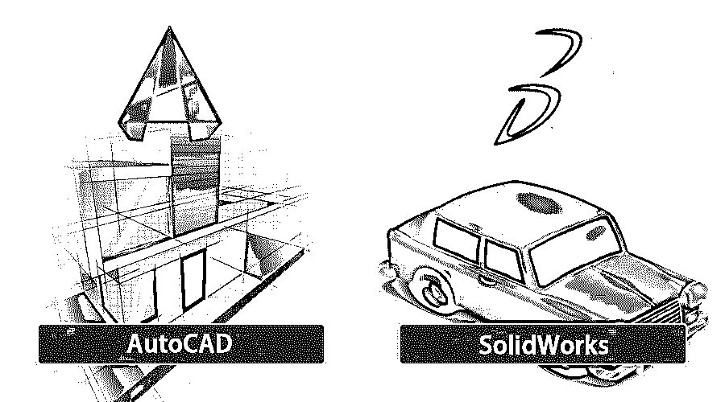

# AutoCAD vs SolidWorks

> 原文：<https://www.educba.com/autocad-vs-solidworks/>

## AutoCAD 与 SolidWorks 的区别

在本文中，我们将看到 AutoCAD vs SolidWorks 的概述。 [AutoCAD 软件](https://www.educba.com/what-is-autocad/)是计算机辅助二维(2d)和三维(3d)设计绘图软件，兼容操作软件、[微软视窗](https://www.educba.com/what-is-windows/)和 macOS，而 SolidWorks 软件是三维(3d)建模机械设计软件，仅兼容操作软件微软视窗。我们可以将它们用于工程设计目的、建筑作品和图形设计目的。这两个软件被不同行业的工程师和专业人员用于许多专业工作。在本文中，你将很容易区分 AutoCAD 软件和 SolidWorks 软件。我们将讨论这两个软件的各个方面，以更好地理解 AutoCAD 软件和 SolidWorks 软件。

### AutoCAD 和 SolidWorks 软件的直接比较(信息图表)

以下是 AutoCAD 与 SolidWorks 软件之间的 4 大区别:

<small>3D 动画、建模、仿真、游戏开发&其他</small>

### AutoCAD 和 SolidWorks 软件的主要区别

AutoCAD 软件和 SolidWorks CAD 软件之间有许多差异，一旦您在个人基础上与这两个软件进行交互，您就可以发现这些差异。在本文中，您将发现 AutoCAD 软件和 SolidWorks 软件之间的主要差异，并了解该软件的功能。

AutoCAD 软件对于许多设计专业人员来说是非常熟悉的，即使是工程专业的学生也对 AutoCAD 软件非常熟悉，他们开始学习 AutoCAD 软件进行设计，但是当有人倾向于三维(3d)建模学习时，SolidWorks 进入了学习者的知识范围。所以这两种软件对于想要使用它的人来说有不同的基本要求。您可以将这两个软件用于学习或专业目的。

目前，AutoCAD 软件和 SolidWorks 软件是工程设计领域中设计人员最需要的软件。这两个软件之间有一些差异，这使得它们彼此不同。让我们来讨论这些主要差异。

*   第一个是 AutoCAD 软件最初是 36 年前的 1989 年 12 月由 Autodesk 发布，现在由 Autodesk 维护，而 SolidWorks 是 24 年前的 1995 年 11 月开发的软件 Dassault Systemes，1997 年 [CATIA 软件](https://www.educba.com/what-is-catia/)的开发者。
*   第二个是 2019 年 7 个月前发布的最新版 AutoCAD 软件；另一方面，SolidWorks 软件的最后一个版本是 SolidWorks 2019，1 年前的 2018 年 11 月。
*   第三种是从 Autodesk 官方网站下载 AutoCAD 软件，即[autodesk.com](https://www.autodesk.com/)。Autodesk 为学生提供了一个名为“学生版”的免费版本，仅供学习之用，而要下载 SolidWorks 软件，您必须访问 SolidWorks 的官方网站，即 www.solidworks.com。
*   第四个是 AutoCAD 软件，它有许多不同的语言版本，如英语、德语、意大利语、汉语、法语和俄语等等，但是 SolidWorks CAD 软件只有英语版本。
*   最后，AutoCAD 软件广泛用于不同的行业，被城市规划者用于建筑工程，被图形设计者用于为其他图形设计软件准备附加模型，而 SolidWorks CAD 软件被数以百万计的公司使用，这些公司致力于工程项目的三维(3d)建模以及设计项目等。

### AutoCAD 与 SolidWorks 软件对照表

我们来讨论一下最上面的对比:

| **比较的基础** | **AutoCAD 软件** | **SolidWorks CAD 软件** |
| **支持文件格式** | AutoCAD 软件支持 Auto LISP、VBA、.NET 等等。在 AutoCAD 软件中，我们有很多支持的插件，图纸交换格式，并且这个软件还允许导出和导入一些格式。 | SolidWorks CAD 软件支持微软的存储文件。这个文件有不同的内置部分。您可以使用第三方工具从 SolidWorks 软件的存储文件中提取子文件。这个软件将三维模型保存在。步骤'文件格式。 |
| **软件的性质** | AutoCAD 软件是二维(2d)绘图和三维(3d)建模软件，被建筑师、房屋建筑商以及土木工程师广泛用于结构工程。 | 机械工程师通常使用 SolidWorks CAD 软件来制作机械附件的机械零件，这些零件既需要机械加工，也需要数控加工。 |
| **升级后的变化** | AutoCAD 软件最初是为二维(2d)绘图而设计的，但后来用三维(3d)功能进行了改进。后来，Autodesk 开发了具有三维建模功能的软件，该软件与 SolidWorks CAD 软件非常相似，即“Inventor 软件”。 | [SolidWorks CAD](https://www.educba.com/autocad-vs-solidworks/) 软件用于参数化三维(3d)建模，并具有许多支持三维(3d)建模的标准库。该软件的开发人员不时升级 SolidWorks CAD 软件，以便从该软件中获得越来越好的结果。 |
| **软件级别** | 您可以将 AutoCAD 软件视为用于二维制图(2d)的高级软件，而视为用于三维(3d)建模的中级软件。 | 您可以将 SolidWorks CAD 软件视为三维(3d)建模的高级软件。 |

### 结论

从头到尾仔细阅读本文后，您现在可以更好地理解 AutoCAD 软件和 SolidWorks CAD 软件之间的主要差异，并可以在您的设计或建模项目中很好地使用它们。在这篇文章之后，选择其中之一对你来说变得非常容易，你可以从这个软件中获得越来越多的好处。

### 推荐文章

这是一个 AutoCAD vs SolidWorks 的指南。在这里，我们讨论了 AutoCAD 与 SolidWorks 的四大主要区别，包括信息图和比较表。您也可以阅读以下文章，了解更多信息——

1.  [如何在 AutoCAD 中插入图像？](https://www.educba.com/insert-image-in-autocad/)
2.  [在 AutoCAD 中创建挤压效果](https://www.educba.com/extrude-in-autocad/)
3.  [AutoCAD 中的 16 大工具](https://www.educba.com/autocad-tools/)
4.  [11 大 AutoCAD 插件](https://www.educba.com/autocad-plugins/)
5.  [Photoshop 中的插件](https://www.educba.com/plugins-in-photoshop/)
6.  [AutoCAD 中的样条|技巧](https://www.educba.com/spline-in-autocad/)

