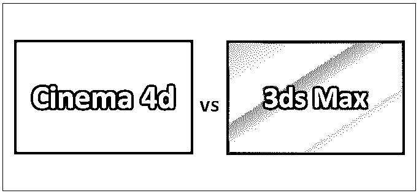
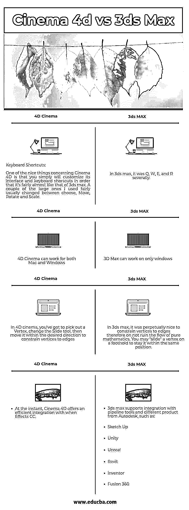

# 4d 影院 vs 3ds Max

> 原文：<https://www.educba.com/cinema-4d-vs-3ds-max/>

## Cinema 4d 和 3ds Max 的区别

4D 影院可能是 MAXON 打造的强大的 3D 建模、运动图形、绘画、[动画软件系统](https://www.educba.com/animation-software/)。Cinema 4D 将在每一个 Windows 和 MAC OS 上运行，可能是一个很好的程序，非常适合个人设计师或较小的风格团体。一个用于游戏风格、开发和风格可视化的 3D 建模、动画和渲染软件系统，为用户提供制作和编辑动画、视觉效果和环境的灵活性。在本主题中，我们将了解 Cinema 4d 与 3ds Max。

**让我们更详细地了解一下 cinema 4d 和 cinema 3d:**

<small>3D 动画、建模、仿真、游戏开发&其他</small>

3D 设计有其挑战性。设计师通常需要克服他们的感知和偏见，然而他们生产和学习一些深入的程序，以有效地使用 3D 风格的软件系统。市场上有两个流行的程序用于 3D 风格；因此，关于哪一个对你的愿望最有效，这将是令人困惑的。如果你是 3D 新手或者正在寻找一个新的软件系统，一旦它涉及到最重要的广泛使用的程序，我们有一些见解可以考虑。让我们更深入地了解一下 Cinema 4d 与 3ds Max 之间的差异。

一个好的 3D 软件系统应该有以下选项:-

*   一个直观的界面，简单的回忆。
*   优质文件的可获得性。
*   智能学习路径
*   社区支持
*   漂亮的真实感渲染引擎的可访问性
*   稳定性

### 什么是 3D Max？

3DS Max 几乎不能在 Windows 上运行，这可能会限制您是否能够从它的选项中受益。然而，3DS Max 的插件绝对值得受限制的软件包支持。

3DS Max 由 Autodesk 创建，能够进行 3D 动画、建模和合成。该工具由 play and screenland 使用，甚至用于较小的动画、视觉 3D 效果和研究可视化，因为它将随 AutoCAD 一起移动。3DS max 可能需要额外购买和安装 Visual Dynamics 的 V-ray，以提供照片级的逼真效果。

3D max 被认为是 2 个 Autodesk 3D 风格软件系统中非常直观的一个。它往往需要更少的时间被告知，并开始与它的不太复杂的计算机程序。唯一的缺点是有限的包装能力。

#### 3d MAX 功能

*   渲染引擎和 V-ray，Octane，Fstorm，Corona，Maxwell 等的巨大选择。
*   非常强大的快速循环工具(C4D:刀工具)，有很好的修饰键选择。
*   iToo 的森林包看起来像是一个非常好的散布工具，用来制作自然森林。
*   用于制作原始形状的强大交互模式(类似于 Maya)
*   学术版是额外免费的！
*   阿诺德渲染引擎目前封闭。

### 什么是 4D 电影院？

由马辰开发，4D 电影院能够运动图形，建模和纹理。它的渲染引擎会产生奇妙的效果，类似于 Autodesk 的程序。

4D 电影院允许你立即玩素描和雕刻，这是令人震惊的，这将是 Maya 或 3DS Max 中更深入的任务。动画和渲染会在一段时间内被磨损。Adobe when Effects 使内容共享变得非常简单。

在这两个节目中，《4D 电影院》被认为是最好的节目之一，而且是最直观的 3D 入门节目。如果价值点是一个决定性的问题，它另外是两者中最便宜的开始。

#### 4D 电影特写

*   非常直观的界面
*   伟大的建模工具(易于被告知和设计的效率)
*   MoGraph
*   奇妙的噪声阴影(也很快！)
*   可定制性
*   灰度大猩猩可能是 C4D 初学者的梦想成真。
*   内置渲染引擎(AR)完全可用，非常好，这要归功于开始学习渲染和材质。但是，可以获得几个第三方渲染引擎。
*   学术/教育用户的真实评价。

### Cinema 4d 和 3ds Max 之间的直接比较

以下是 Cinema 4d 与 3ds Max 的 4 大区别

### Cinema 4d 和 3ds Max 之间的主要区别

两者都是市场上的热门选择；让我们讨论一些主要的区别:

1.关于 4D 电影的一个问题是，它没有边界和部分模式。关于 3ds max，这经常是我喜欢的一个问题。

2.默认情况下，在 3ds max 中，多条边在每个单独的轴上旋转。这通常由 3ds max 中的“使用轴目的中心”选项支持。在 4D 影院中，一旦你选择了多条边，它将产生一个主要基于所选边的中心旋转的关联轴。

3.3D max 可能是一个不错的选择，可以定制。另一方面，对于平面设计师来说，4d 是最好的 3D 软件系统。这是卓越计划。

4.在 3D max 中，每一种可能性都像是一个秘密，建模其实很难。另一方面，在 4D Cinema 中，材质编辑器没有 3Ds max 中的“可编辑多边形”功能；然而，在这里，我们不会对同一个对象使用多个通道

### Cinema 4d 与 3ds Max 对比表

下面是最上面的比较

| **序列号** | **4D 电影院** | **3D 最大值** |
| One | Keyboard Shortcuts:关于 4D 电影院的一件好事是你可以简单地定制它的界面和键盘快捷键，这样它就和 3ds max 差不多了。我使用的几个大按钮通常在选择、移动、旋转和缩放之间变化。 |  在 3ds max 中，分别是 Q，W，E 和 R。 |
| Two | 4D 影院可以在 Mac 和 Windows 上运行 | 3D Max 只能在 windows 上工作 |
| Three | 在 4D 电影院，你必须选择一个顶点，改变滑动工具，然后在所需的方向移动它，以限制顶点的边缘。 | 在 3ds max 中，将顶点约束到边上永远是一件好事，因此不会破坏纯数学的流程。你可以在一个立足点上“滑动”一个顶点来保持它在同一位置。 |
| Four | 目前，4D 电影院提供了一个有效的集成时效果 CC。 | 3ds max 支持与 pipeline 工具和 Autodesk 的不同产品集成，例如:

*   画草图
*   一致
*   虚构的
*   Revit
*   创造者
*   融合 360

 |

### 结论

如果你打算使用 4D 电影院，这是一个步入 3D 世界的神奇套餐。德国软件系统制造商马辰极其创造了一个软件包，这是简单的告诉，但也奖励用户与选择性的捷径，他们开始虐待随着时间的推移，不断加快他们的进步。事实上，我希望我表示为缺乏的项目将被修复；然而，与 Autodesk Cinema 的 3D Max 相比，4D 提供了一个真正令人兴奋的包，可用于 3D 市场以外的白天工作。我希望现在你对这两者已经有了更好的理解。请继续关注我们的博客，了解更多类似 3ds Max vs Cinema 的文章。

### 推荐文章

这是 Cinema 4d 与 3ds Max 之间最大差异的指南。在这里，我们还将讨论信息图和比较表的主要区别。您也可以看看以下文章——

1.  [Maya 或 Blender](https://www.educba.com/maya-vs-blender/)
2.  [3DS Max vs Blender](https://www.educba.com/3ds-max-vs-blender/)
3.  [AutoCAD vs AutoCAD LT](https://www.educba.com/autocad-vs-autocad-lt/)
4.  [AutoCAD 与 Revit](https://www.educba.com/autocad-vs-revit/) 的比较

