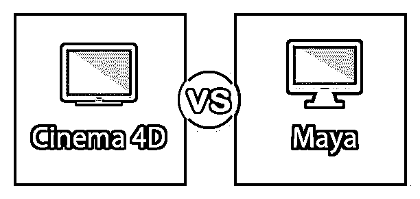
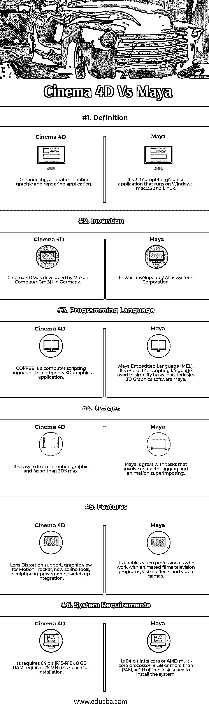

# 4D 电影 vs Maya

> 原文：<https://www.educba.com/cinema-4d-vs-maya/>

## 4D 电影和玛雅电影的区别

4D 影院是一个 3D 建模、动画、运动图形和渲染应用程序，由德国 MAXON Computer GmbH 开发。最初，它是在 20 世纪 90 年代初为 Amiga 计算机开发的。使用任何 Cinema 4D 对象，包括新的场对象，在程序上构建有机或硬面体。Autodesk Maya 就是这些程序中的一个。在这个软件包中，艺术家可以模拟人物、车辆、环境等。，使它们可以移动，并通过动画赋予它们生命。与大多数 3D 应用程序一样，如果您以前从未接触过 3D 程序，那么习惯在 Maya 中工作需要一个不错的学习曲线。

**让我们更详细地研究一下 4D 电影院 vs 欧特克梅斯:**

<small>3D 动画、建模、仿真、游戏开发&其他</small>

初学者和经验丰富的专业人士都可以利用 4D 电影院的各种工具和功能，快速实现惊人的效果。无论我们能想象到什么，它都将由 4D 电影院创作，无论我们的想法有多复杂，因为我们可以依靠 4D 电影院来渲染动画以获得最终输出。我们可以创建简单的对象到更高的对象，以提供最高的专业编辑，就像 Autodesk Maya，通常被推卸给 Maya，这是一个运行在 Windows，macOS 和 Linux 上的 3D [计算机图形应用程序](https://www.educba.com/application-of-computer-graphics/)。它用于创建交互式 3D 应用程序，如视频游戏、动画电影、电视剧或视觉效果。它最初是由 Alias Systems Corporation(以前称为 Alias)开发的。电影院 4D vs 玛雅的文章，一个共同的 3D 功能的概述将被审查，因为它涉及到在玛雅 2011 年的[。Autodesk Maya 就是这些程序中的一个。在这个软件包中，艺术家可以模拟人物、车辆、环境等。，使它们可以移动，并通过动画赋予它们生命。与大多数 3D 应用程序一样，如果您以前从未接触过 3D 程序，那么习惯在 Maya 中工作需要一个不错的学习曲线。](https://www.educba.com/maya-animation/)

### 4D 影院和玛雅影院的正面对比(信息图)

以下是 4D 电影院和玛雅电影院的 6 大区别:

### 4D 电影院和玛雅电影院的主要区别

两者都是市场上的热门选择；让我们来讨论一些显著的区别:

今天，Maya 正被用于为真人特效和视频游戏、运动图形、全 CG 动画特征、2D/3D 动画混合以及其他几种可能的媒体创建视觉效果。Autodesk Maya 已成为为众多行业创建一流视觉效果的领先解决方案之一。

让我们讨论以下几点的区别:

*   Maya 很快成为几家知名工作室的选择，如迪士尼和工业光魔，并被用于创造电影中的突破性视觉效果，如侏罗纪公园，迪士尼的恐龙，深渊和终结者 2:审判日。
*   Maya 总是帮助设计师、工程师、绘图员和机械师获得更好的工作，赚更多的钱，设计更好的产品和游戏，变得更具创新性和创造力，并超越他们的竞争对手。
*   在 4D 电影院，将创建一些动态的形状，路径模拟，黑色的头发，动物的设计，还使用了广泛的行业发光，包括电影，视觉效果，广播，设计，产品设计，建筑设计，机械制造工程，科学和医学等。,
*   自 1994 年以来，我们已经培训了数千名来自摩托罗拉、卡特彼勒、John Deere、Harley Davidson 和 NASA 等公司的设计师和工程师。我们增加您对软件的理解。但更重要的是，我们增加了我们的具体设计和工程技术的知识。这意味着在我们所有的项目中使用软件变得更加优雅、轻松和灵活。
*   BodyPaint 3D(直接在 UVW 网格上绘画；现在包含在核心中。4D 影院的 Core/Prime 和 BodyPaint 3D 产品是相同的。两者之间唯一的区别是启动时显示的闪屏和默认的用户界面。)
*   使用 Cinema4D 的专论模块设计 hexSphere 设计，以实现最大的可扩展性，允许自然的迭代过程优化最终设计。

### 4D 电影院 vs 玛雅比较表

下面是最上面的比较:

| **比较的基础** | **4D 电影院** | **玛雅** |
| **定义** | 它是建模、动画、运动图形和渲染应用程序。 | 这是一个运行在 Windows、macOS 和 Linux 上的 3D 计算机图形应用程序。 |
| **发明** | 4D 电影院是由德国马辰计算机有限公司开发的。 | 它是由 Alias 系统公司开发的。 |
| **编程语言** | COFFEE 是一种计算机脚本语言。这是一个专有的 3D 图形应用程序。 | Maya Embedded Language (MEL)，它是 Autodesk 的 [3D 图形软件](https://www.educba.com/3d-graphics-software/) Maya 中用于简化任务的脚本语言之一。 |
| 用途 | 在 motion graphic 中很容易学习，而且比 3DS Max 更快。 | Maya 非常擅长涉及角色操纵和动画叠加的任务。 |
| **特性** | 镜头失真支持，运动跟踪器的图形视图，新的样条工具，雕刻改进，草图集成。 | 它使从事动画电影、电视节目、视觉效果和视频游戏的视频专业人员。 |
| **系统要求** | 它需要 64 位(R15-R18)，8 GB RAM 需要 75 MB 磁盘空间用于安装。 | 其 64 位英特尔酷睿或 AMD 多核处理器，8 GB 以上 RAM，4 GB 空闲磁盘空间安装系统。 |

### 结论

在建模 nurbs 时，Maya 比 3ds Max 有很大的优势，因为它使用不同的方法，并且更加用户友好。许多 3D 动画师认为 Maya 是制作 3D 动画的更好的软件，因为它有更大的能力来模拟真实的动画和效果。Maya 广泛用于电影制作和电视制作。在影院行业，对于 CG 作品、3D 建模、动画以及艺术家的渲染作品，Maya 的作用非常重要。因此，它以设计者友好的界面和他们工作方式的强大工具集而闻名，也深深地融入了最受欢迎的数字艺术家的角色。他们想为顾客创造令人叫绝的艺术。角色动画在设计人员的装备中是重要的角色扮演，可以更好地移动它的工具，包括所有的控制器和按钮，将是滑块和移动器，可以帮助使特定的角色与我们的生活行为相似。

“虚拟用户界面的感知指南”是由约翰·勒波尔先生开发的。他是 perception 的首席创意官，与他的同事(Russ Gautier、Doug Appleton 和 Justin Molush)一起将基于感知的虚构作品作为一些创意设计。他曾经说过，4D 电影院使用了动画功能和渲染选项，这将适合未来 UI 的发展，他们将成为未来的超级英雄及其产品和车辆。它的功能和后效整合是一个有用的可视化工具。Cineversity 是 4D MAXON Cinema 的教育和资源网站，CG 艺术家需要学习为用户界面创建未来运动图形的技术方面，以增强 3D 动画和用户友好的 [VFX 数字体验](https://www.educba.com/vfx-softwares/)。

### 推荐文章

这是 4D 电影院和玛雅电影院之间最大差异的指南。在这里，我们还将讨论信息图和比较表的主要区别。您也可以看看以下文章，了解更多信息–

1.  [影院 4d vs 3ds Max](https://www.educba.com/cinema-4d-vs-3ds-max/)
2.  [玛雅 vs ZBrush](https://www.educba.com/maya-vs-zbrush/)
3.  [After Effect Vs 4D 电影院](https://www.educba.com/adobe-after-effect-vs-cinema-4d/)
4.  [玛雅 vs 玛雅 LT](https://www.educba.com/maya-vs-maya-lt/)

