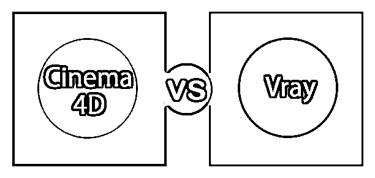
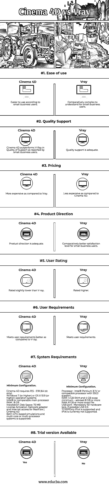

# 4d 影院与 v-ray

> 原文：<https://www.educba.com/cinema-4d-vs-vray/>

## Cinema 4d 和 v-ray 的区别

4D 影院是由马辰计算机有限公司开发的应用程序，用于 3D 建模、动画、运动图形和渲染。通俗易懂，极其生动。这些功能包括程序和多边形/子模型、动画、照明、纹理、渲染和 3D 建模应用程序中的其他常见功能。该应用程序最初是在 20 世纪 90 年代初为 AmigaOS 开发的，但现在它在所有主要操作系统上都得到支持，即微软 Windows 和 macOS。

4D 电影院的一些核心特色如下

<small>3D 动画、建模、仿真、游戏开发&其他</small>

*   **拍摄系统**:允许灵活的场景管理和大量的场景拍摄。
*   **镜头变形支持**:允许生成和移除变形轮廓，用于跟踪和场景创建
*   **运动跟踪器的图形视图**:突出显示可从计算中移除的问题跟踪点
*   **样条工具**:操纵点、线、切线和圆弧。使用布尔运算符，如交集、差集、并集，
*   **动画工作流程增强**:用加权切线控制 F 曲线，用欧拉移除万向节锁
*   **雕刻改进**:自动为每个雕刻层创建变形目标，帮助从设计过渡到
*   **胡迪尼引擎集成**:加载 HDA，像原理影院 4D 一样操作它们。
*   **Sketchup 集成**:为场景加载随时可用的对象

另一方面，保加利亚公司 Chaos Group 于 1997 年开发了 V-ray，这是一种计算机生成图像渲染软件应用程序。它是一个商业插件，用于媒体、娱乐、视频、电影、产品设计和建筑等行业的可视化。它改变了计算机图形的面貌，并为当今生成的最先进的照片级逼真图像提供了动力。

V-ray 支持 Maya、Cinema 4D、Modo、SketchUp、 [Blender，其中的一些核心特性](https://www.educba.com/how-to-blend-images-in-photoshop/)如下

*   **精确的闪电**:不真实的引擎场景可以用物理上精确的光线追踪来渲染
*   **全局照明**:使用 V-Ray 的 brute 可以渲染真实的反弹光
*   **渲染动画**:从虚幻序列编辑器渲染序列，创建动画。
*   **GPU 加 CPU 渲染**:在您所有的
*   **虚幻树叶支持**:兼容虚幻的原生树叶
*   **V 射线代理支持**:渲染时加载高分辨率资源
*   **渲染元素**:堆肥支持多种渲染元素。
*   **分布式渲染**:提高渲染和光照速度

### Cinema 4d 和 v-ray 之间的直接对比(信息图)

以下是 Cinema 4d 与 v-ray 的 8 大区别

### Cinema 4d 和 v-ray 的主要区别

两者都是市场上的热门选择；让我们来讨论一些主要的区别。

发现 V-ray 对于深入理解至关重要，但对于开始却很容易。表面上，V-ray 提供了预制的材料以及其他基本插件。但是当你在灯光和材质上工作的时候，你能掌握的理解的深度是非常强大的。随着每次更新，渲染变得更好，V-ray 提供了提高质量的改进选项。另一方面，4D 影院为设计 3D 软件解决方案提供了模块化系统，易于学习和掌握。核心应用程序提供了创建图像和动画的功能。它提供了很棒的工具和增强功能，可以立即使用，并且可以窥见未来的基础。选择它是因为它快速、简单的工作流程和坚如磐石的稳定性。

根据小型企业用户的说法，4D 电影院的成本相对高于 V-ray，因为他们发现 4D 电影院更贵。与 V-Ray 相比，小型企业用户也认为 Cinema 4D 在满足要求方面做得更好。在一段时间内，这两个应用程序的评级更加接近，但有趣的发现是，小企业主更喜欢 V-ray，而大企业更喜欢 4D 影院。属于平面设计的大多数人更喜欢 4D 电影院，而来自建筑领域的人更喜欢 V-ray，因为他们发现 4D 电影院在质量上优于 V-ray，但他们也表示 V-ray 接近满足他们的用户要求。

### Cinema 4d 与 v-ray 对比表

下面是最上面的 8 个对比

| **比较的基础** | **4D 电影院** | **V 射线** |
| **易用性** | 小型企业用户认为更易于使用 | 对于小型企业用户来说，理解起来相对复杂 |
| **质量支持** | 根据小型企业用户的报告，4D 影院在支持质量方面优于 V-Ray。 | 质量支持是充分的。 |
| **定价** | 与 V-ray 相比更贵 | 比 4D 电影院便宜 |
| **产品方向** | 产品方向是充分的 | 小型企业用户的满意度相对较高。 |
| **用户评分** | 额定略低于 V 射线 | 评级更高 |
| **用户需求** | 与 V-ray 相比，能更好地满足用户需求 | 满足用户要求。 |
| **系统要求** | **Minimum Configuration**

*   4D 电影院要求 R15–R18(仅 64 位)
*   Windows 7(或更高)或 OS X 10.9(或更高)操作系统
*   英特尔或类似的主处理器
*   内存:8 GB
*   安装磁盘空间:75 MB
*   许可证激活:RealFlow &#124;电影院的网络适配器和互联网接入
*   支持基于 GPU 的模拟和多核或多处理器系统。

 | **Minimum Configuration**

*   处理器:英特尔奔腾
*   支持 SSE3 的 IV 或兼容处理器。
*   RAM:最低 4 GB RAM 和 4 GB 交换空间–建议 8 GB 或更多 RAM，8 GB 或更多交换文件
*   USB 端口:对于硬件锁是强制性的，如果可能的话，USB 2.0
*   仅支持 TCP/IP IP v4，目前不支持 IPv6。

 |
| **试用版可用** | 是 | 不 |

### 结论

两者都是基于商业的应用程序，用于媒体、娱乐、视频、电影等行业的可视化和设计。两者都需要许可证才能在 Windows 和 Macintosh 上运行，对于小型和大型企业来说各有利弊。人们更喜欢 4D 电影院[创作平面设计](https://www.educba.com/what-is-graphic-design/)，而建筑领域和规划领域的大多数人更喜欢 V-Ray。人们发现 4D 电影院更容易使用，并发现它比 V-Ray 的价格昂贵。

### 推荐文章

这是电影 4d 与 v-ray 之间最大差异的指南。在这里，我们还通过信息图和比较表讨论了 Cinema 4d 与 v-ray-key 的差异。你也可以看看下面的文章来了解更多。

1.  [影院 4d vs 3ds Max](https://www.educba.com/cinema-4d-vs-3ds-max/)
2.  [玛雅 vs 阿兹特克 vs 印加](https://www.educba.com/maya-vs-aztec-vs-inca/)
3.  [4D 电影院 vs 玛雅](https://www.educba.com/cinema-4d-vs-maya/)
4.  [Maya vs 3Ds Max vs Blender](https://www.educba.com/maya-vs-3ds-max-vs-blender/)

