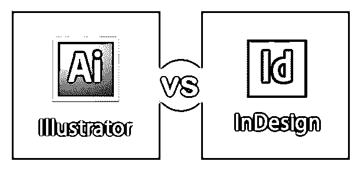
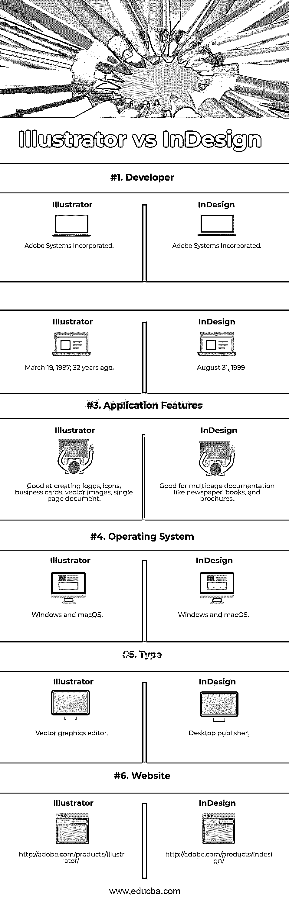

# 插画师 vs InDesign

> 原文：<https://www.educba.com/illustrator-vs-indesign/>

## Illustrator 和 InDesign 简介

在为图像、视频和声音创建行业领先的设计应用程序方面，Adobe 是一个关键角色。现在我们将进入该公司两款旗舰矢量设计软件——[Adobe Illustrator](https://www.educba.com/adobe-illustrator-for-windows-8/)和 [Adobe InDesign](https://www.educba.com/what-is-adobe-indesign/) 之间的“图形大战”。在为印刷品或网页设计时，它们都有自己的长处和短处。以上两个几乎是任何其他应用程序所无法比拟的，用于设计从标志、图标到印刷媒体的任何东西。当您决定在 Illustrator 和 InDesign 之间进行选择时，有必要了解它们在应用于您的创意项目时的变化动态。

我们已经为您做了功课，列出了 Adobe 的两个设计巨头之间的所有关键差异。这将帮助您理解这两个设计软件的用途、工作界面、优势和目的。

<small>3D 动画、建模、仿真、游戏开发&其他</small>

#### 什么是 Adobe Illustrator？

Illustrator 是 Adobe 公司开发的矢量图形软件，其开发始于 1985 年，最初计划为苹果 Macintosh 发布。该软件的最新版本是 Illustrator CC 2019，它是 Adobe Creative Cloud 的一部分，通过互联网向用户提供月度/年度订阅包。

现在来看界面，在启动 Illustrator 时，欢迎您根据自己的需要选择多种画板尺寸，用于印刷、web、电影和视频艺术和插图。您也可以选择创建自定义大小的画板。一旦你选择了一个你喜欢的画板，你将被转移到画板，在那里所有的动作都是真实的。

在这里，您可以使用各种工具和面板来修改您的绘图设计。Illustrator 中的分享和导出[设置也毫不费力。除了常用的导出选项，Illustrator 还允许您将作品上传到 creative cloud 文件夹。这是对 Behance 网站上的电子邮件共享和发布的补充。](https://www.educba.com/photoshop-vs-illustrator/)

以后，如果您想使用其他 Adobe 软件(如 InDesign 或 Photoshop)来完善您的作品，您也可以轻松完成。使用 Illustrator 创建的任何内容都可以调整大小，而不会失去清晰度或导致像素化。它可以用来创建小图标到大广告牌。这种保持艺术作品质量的品质使 Illustrator 成为创建徽标的首选软件。

#### 什么是 Adobe InDesign？

InDesign 是 Adobe 在 1999 年推出的桌面出版行业中使用的应用程序。它取代了被收购的 PageMaker。InDesign CC 2019 是当前版本，是 Adobe CC 的一部分。InDesign 是设计报纸、杂志、书籍、海报和电子书等数字出版物的首选软件。

它非常适合处理包含大量文本的设计。InDesign 的另一个重要功能是，它允许用户设置母版页模板，以实现页面间的无缝设计布局。编号系统也是自动化的，具有修改、复制和交换到多个页面的选项。

### Illustrator 和 InDesign 之间的直接比较(信息图表)

以下是 Illustrator 与 InDesign 之间的六大对比:

### Illustrator 与 InDesign 的主要区别

让我们了解主要区别:

#### 1.单页和多页项目

在处理单页项目时，Illustrator 比 InDesign 更有优势。尽管 InDesign 也适用于单页设计，但 Illustrator 的与众不同之处在于它对修改图像和字体提供了更好的控制。因此，您可以使用 Illustrator 设计徽标、名片、海报、矢量图像、图标、传单、封面图像、信息图等。

然而，说到多页项目，InDesign 独占鳌头。InDesign 提供了许多有用的功能，例如“母版页”选项，使工作变得更加轻松。使用此功能，您可以编辑多个页面而不是每个单独的页面来进行更改。另一个有趣的功能是页面的自动编号，这使得工作更有条理。但是，您可以在 Illustrator 中添加多个画板，以便更容易地处理多页设计。

#### 2.易于设计

Illustrator 更高级，为创建设计元素提供了更优越的功能。此外，Illustrator 中的画板针对拥有大量工作空间的用户进行了优化。Illustrator 的缺点是它不能按照你的要求编辑图像。

在 InDesign 中，您可以找到一些基本的绘图工具，如铅笔、形状和线条。此外，如果您想要增强在 InDesign 中创建的页面，可以轻松地从 Illustrator 中导入作品。这对处理多页项目非常有帮助。

#### 3.创建标志和设计操作

Illustrator 是最受欢迎的创建徽标的软件，因为它允许任意次数地调整艺术品的大小，而不会失去其原始质量。因此，在 illustrator 中创建的徽标可以调整到不同的位置和尺寸。此外，通过利用排版功能，您可以根据自己的喜好更改文本。但是，使用 InDesign，您可以通过操作字体来创建令人惊叹的印刷徽标。它还可以让你在工具的帮助下进行矢量设计。

### Illustrator 与 InDesign 对比表

下面是 Illustrator 和 InDesign 之间的最高层比较:

| **比较基础** | **插画师** | **InDesign** |
| **开发者** | Adobe 系统公司 | Adobe 系统公司 |
| **初始发布** | 1987 年 3 月 19 日；32 年前 | 1999 年 8 月 31 日 |
| **应用功能** | 擅长创建徽标、图标、名片、矢量图像、单页文档 | 适用于多页文档，如报纸、书籍和小册子 |
| **操作系统** | Windows 和 macOS | Windows 和 macOS |
| **类型** | 矢量图形编辑器 | 桌面发布者 |
| **网站** | http://adobe.com/products/illustrator/ | http://adobe.com/products/indesign/ |

### 结论

使用正确的软件，无论是 Illustrator 还是 InDesign，都是创造令人惊叹和视觉愉悦的作品的关键。作为兄弟产品，Illustrator 和 InDesign 可以无缝结合，以在您的设计任务中获得最佳效果。一旦您确定了最适合您的应用程序，通过探索众多的功能和选项，在您的工作中发挥其潜力，从而制作出令人惊叹的美学杰作，让您引以为豪。您也可以参考各种在线教程，了解设计软件的基本和高级功能。

### 推荐文章

这是 Illustrator 和 InDesign 之间最大区别的指南。在这里，我们还将讨论 Illustrator 或 InDesign 与信息图的主要区别。您也可以看看以下文章，了解更多信息–

1.  [什么是 Adobe InDesign](https://www.educba.com/what-is-adobe-indesign/)
2.  [InDesign 文档设置](https://www.educba.com/indesign-document-setup/)
3.  [什么是 Adobe Muse](https://www.educba.com/what-is-adobe-muse/)
4.  [Indesign 的替代方案](https://www.educba.com/alternative-to-indesign/)

