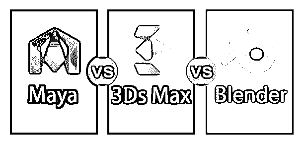
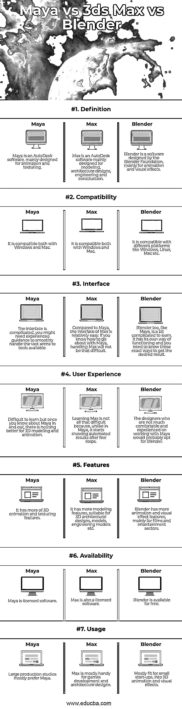

# Maya vs 3ds Max vs Blender

> 原文：<https://www.educba.com/maya-vs-3ds-max-vs-blender/>

## Maya 与 3ds Max 和 Blender 的区别

PUBG 游戏确实给游戏世界带来了一场革命。整个世界都在谈论和玩这个游戏，而不是仍然沉迷于它；10 个人中至少有 8 个人试过一次，我想包括我在内。我不是一个游戏爱好者，但 PUBG 是如此的轰动，我想抓住机会。老实说，我一进入场景就死了，但让我惊叹的是它的图形。这个游戏中的战区、背景、资产、人物，所有的一切都让你感受到真正身处战场的寒意。我的观点是这整个拐弯抹角是三维图形。

游戏世界达到了另一个水平，不要忘记其他领域，如建筑，3D 设计的需求；当涉及到 3D 图形时，你需要知道什么是最适合你的。既然我们在谈论 3D，所有已经进入 3D 设计的人一定听说过像 Maya，Max 和 Blender 这样的软件。但你们中的许多人可能会困惑于哪一个是用于什么目的的最佳选择。让我们来看看。

<small>3D 动画、建模、仿真、游戏开发&其他</small>

**Maya:** Maya 是 Autodesk 的产品，最初只为动画和纹理设计。建模的附加特征后来被添加到软件中。在设置关键帧和利用曲线时，Maya 的工具集通常比其他软件工具更受欢迎。

**Max:** Max 也是 AutoDesk 的产品；然而，它更适合建模、建筑设计、工程和建筑。虽然 Max 允许动画，但它最适合材质和渲染，因为它提供了对材质设置的轻松访问。

**Blender:**Blender 基金会开发这个软件。它是一个开源的 3D 软件，可以创建动画、视觉效果、模型、游戏资产、3D 背景等。

让我们比较一下 Maya vs 3ds Max vs Blender，看看哪一个最适合什么类型的工作。

### Maya vs 3ds Max vs Blender 的面对面比较(信息图)

以下是 Maya vs 3ds Max vs Blender
的 7 大区别

### Maya 与 3ds Max 和 Blender 的主要区别

这三个都是 3D 设计工具，但 Maya 与 3ds Max 与 Blender 之间有许多差异。所有这些软件都不是直接的竞争对手，但它们的用途或多或少是相同的，只是功能不同。玛雅 vs 3ds Max vs 搅拌机。

虽然这三个工具都是 3D 设计软件，但在功能和用法上有很多不同。

1.  Maya、Max 和 Blender 最基本的区别在于，Maya 和 Max 是 AutoDesk 的产品，而 Blender 是 Blender Foundation 的产品。
2.  Maya 最初是一个 3D 动画和纹理软件，后来添加了建模功能。虽然 Max 不是动画软件，但它是 3D 建模师和设计师创建对象、背景、建筑等的首选。搅拌机也是一个动画软件；然而，它并不是大型 3D 动画制作工作室的首选。
3.  与 Max 相比，Maya 和 Blender 都很难处理和学习。虽然这三个都是 3D 设计工具，但 Max 是其中最容易学的。Maya 和 Blender 为每个小任务都配备了复杂的工具，而 Max 的工具与其他两个相比较少，但功能更强，更容易掌握。
4.  Maya 和 Max 的人气远不止 Blender。它已经在市场上很久了，但 Blender 相对来说是一个新的参与者。大型动画和电影制作工作室更喜欢 Maya 和 Max，而 Blender 是寻求小型动画和视觉效果的小型初创公司的选择。
5.  玛雅几乎可以做任何事情；它可以做建模，纹理，索具，照明，动画一切。但是 Max 和 Blender 可能做不到全部。马克斯可能擅长建模，但在动画方面却乏善可陈。Blender 可能擅长动画，但如果我们谈论建模和纹理，可能会落后。

### Maya 与 3ds Max 与 Blender 对比表

以下是 Maya 与 3ds Max 和 Blender 之间的最重要的比较

| **比较的基础** | **玛雅** | **最大** | **搅拌机** |
| **定义** | Maya 是一个 AutoDesk 软件，主要设计用于动画和纹理。 | Max 是一款 AutoDesk 软件，主要用于建模、建筑设计、工程和建筑。 | blender 是 Blender 基金会设计的软件，主要用于动画和视觉效果。 |
| **兼容性** | 它与 Windows 和 Mac 都兼容。 | 它与 Windows 和 Mac 都兼容。 | 它兼容不同的平台，如 Windows，Linux，Mac 等。 |
| **界面** | 界面复杂；你可能需要经验丰富的指导，以顺利处理可用工具的巨大舞台。 | 相比 Maya，Max 的界面相对容易一些。如果你知道如何与玛雅相处，控制马克斯就不会那么困难。 | Blender 也和 Maya 一样，学起来有点复杂。它有自己的运行方式，你需要知道那些确切的方式来得到想要的结果。 |
| **用户体验** | 很难学，但是一旦你对 Maya 了如指掌，没有什么比 3D 建模和动画更好的了。 | 学习 Max 并不那么困难，因为与 Maya 不同，它在几步之后就开始显示自动结果。 | 那些对使用 Maya 不太熟悉也没有经验的设计师可能会选择 Blender。 |
| **特性** | 它有更多的 3D 动画和纹理功能。 | 它有更多的建模功能，适用于三维建筑设计，模型，工程模型等。 | Blender 有更多的动画和视觉效果功能，主要用于电影和娱乐领域。 |
| **可用性** | Maya 是授权软件。 | Max 也是一个授权软件。 | 搅拌机是免费的。 |
| **用途** | 大型制作工作室大多偏爱 Maya。 | Max 主要用于游戏开发和架构设计。 | 最适合 3D 动画和视觉效果的小公司。 |

看了对比表，有一点多多少少清楚了，Maya 和 Blender 都可以作为动画软件，但是 Max 主要是为了建模的目的。当谈到难度时，界面和软件的使用有些相同。让我们更深入地了解一下 Maya 与 3ds Max 与 Blender 之间的区别。

### 结论

Maya vs Max vs Blender，三个都是 3D 设计软件。但它们都有自己的专业和功能。然而，相比其余两个，玛雅或多或少是一个多面手。它可以完成 Max 和 Blender 的任务。但这最终取决于设计者，他喜欢使用哪种工具，以及他所期待的结果。

### 推荐文章

这是 Maya 与 3ds Max 与 Blender 之间最大差异的指南。在这里，我们还将讨论信息图和比较表的主要区别。您也可以看看以下文章，了解更多信息–

1.  [Maya vs 3Ds Max](https://www.educba.com/maya-vs-3ds-max/)
2.  [玛雅 vs 印加](https://www.educba.com/maya-vs-inca/)
3.  [3DS Max vs Blender](https://www.educba.com/3ds-max-vs-blender/)
4.  [ZBrush vs Blender](https://www.educba.com/zbrush-vs-blender/)

