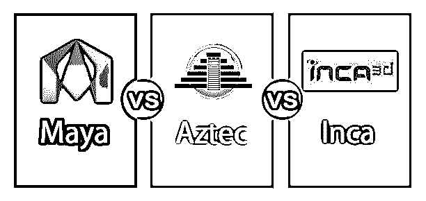
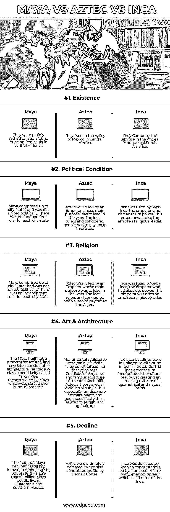

# 玛雅 vs 阿兹特克 vs 印加

> 原文：<https://www.educba.com/maya-vs-aztec-vs-inca/>

## 玛雅、阿兹特克和印加的区别

墨西哥东南部、危地马拉和伯利兹的全部、洪都拉斯和萨尔瓦多的西部由玛雅人组成。一个中美洲文明始于公元前 2600 年左右，由玛雅人创造，以其象形文字(前哥伦比亚美洲人唯一熟悉的完全发展的书写系统)而闻名，被称为玛雅。玛雅人幸存于尤卡坦半岛和南部高地的农村。玛雅由王子和祭司统治，没有像其他文化一样被废除，而是适度地消失了。

墨西哥谷是马德雷山脉的一个大的高海拔盆地，从 1300 年到 1521 年是阿兹特克的中心。这个山谷适合农业，因为它气候温和，自然资源丰富。特诺奇蒂特兰是阿兹特克人最大的首都，建在特斯科科湖的一个岛上。阿兹特克人成为了著名的农民、战士和寺庙建筑者。最后，由埃尔南·科尔特斯率领的西班牙征服者征服了特诺奇蒂特兰，并于 1521 年征服了阿兹特克。

大约在 1200 年，印加人开始在秘鲁中部安第斯山脉的库斯科山谷定居。它是最大的帝国，从北到南延伸了大约 2500 英里，包括大约 1600 万人口。印加通过修建一个穿越山脉和河流的巨大道路网来统一它的帝国。印加以石工和不用灰泥建造石庙而闻名。

### 玛雅人与阿兹特克人与印加人的正面对比(信息图)

下面是玛雅、阿兹特克和印加之间的五大区别

### 玛雅、阿兹特克和印加的主要区别

这些是市场上流行的选择；让我们讨论一些主要差异:

*   玛雅人是墨西哥和中美洲的土著人，而阿兹特克人在公元 1345 年至 1521 年之间覆盖了中美洲北部的大部分地区，而印加人在公元 1400 年至 1533 年之间在古代秘鲁繁荣，并扩展到南美洲西部。
*   玛雅人信奉多神教，但他们没有任何特定的神，而阿兹特克人崇拜 Huitzilopochtli 作为他们的主神，印加人崇拜 Inti 作为他们的主神。
*   玛雅人创造了象形文字的书写系统，阿兹特克人创造了著名的使用绿松石镶嵌的 Xuihetecuhtli 面具，印加人创造了穿越山脉和河流的庞大道路网。
*   玛雅人建造高耸的庙宇和精致的宫殿，阿兹特克人在一个岛上建造他们的首都特诺奇蒂特兰，而印加人建造石头庙宇时没有使用砂浆，然而石头结合得如此之好，以至于刀子都插不进石头之间。
*   玛雅人使用两种历法。一个是基于太阳年，而另一个是一种神圣的历书。玛雅人也使用三个符号的数字系统，允许他们记录数百万的数字。阿兹特克人使用神圣的日历和 365 天的农业日历，而阿兹特克人的书写系统是基于象形文字，代表声音或单词的符号。印加人没有发展出书写系统；他们的记录保存在一捆捆被称为 quipus 的打结绳子上。
*   玛雅建筑师使用当地材料，如石灰石，他们在帕伦克和蒂卡尔使用，而金属加工是阿兹特克人最主要的技能。绿松石主要用于阿兹特克艺术家；最常见的例子是代表 Tezcatlipoca 神的装饰过的人类头骨。印加人受到奇姆文明艺术和技术的影响。

### 玛雅人 vs 阿兹特克人 vs 印加人对照表

我们来看顶部对比:

| **比较的基础** | **玛雅** | **阿兹特克** | **印加** |
| **存在** | 他们主要定居在中美洲的尤卡坦半岛及其周围 | 他们住在墨西哥中部的墨西哥谷 | 他们在南美洲的安第斯山脉组成了一个帝国 |
| **政治状况** | 玛雅由城邦组成，政治上并不统一。每个城邦都有独立的统治者。 | 阿兹特克由一位皇帝统治，他的主要目的是领导战争。当地统治者和被征服的人必须向阿兹特克人纳税。 | 印加由拥有绝对权力的皇帝迈塔·卡帕克统治。这位皇帝也是帝国的宗教领袖。 |
| **宗教** | 玛雅人实践人祭，信奉多神教 | 阿兹特克人信奉多神教。他们建造巨大的庙宇和金字塔来供奉他们的神 Huitzilopochtli。 | 印加人信奉多神教。他们崇拜他们的主神，因蒂，他们称之为太阳神。 |
| **艺术&建筑** | 玛雅人建造了大量的建筑，留下了大量的建筑遗产。玛雅人重建了一座名为“蒂卡尔”的古典时期城市，占地 20 平方公里。公里。 | 纪念雕塑是最受欢迎的。他们建造像巨大的 Coatlicue 一样的雕像，或者非常生动和著名的坐着的 Xochipilli 雕塑。阿兹特克艺术描绘了一个主题的所有种类，但尤其著名的是动物、植物和神，尤其是那些与生育和农业有关的。 | 印加建筑与巨大的帝国建筑保持一致。印加建筑融合了自然美，创造了几何和自然形式的惊人结合。 |
| **拒绝** | 考古学家仍然不知道玛雅人衰落的事实，但目前有超过 200 万玛雅人生活在危地马拉和墨西哥南部。 | 阿兹特克最终被赫尔南·科尔特斯领导的西班牙征服者击败。 | 印加被弗朗西斯科·皮萨罗领导的西班牙征服者击败。此外，天花蔓延，杀死了大多数印加人。 |

### 结论

玛雅人对阿兹特克人对印加人在许多方面都很相似，就像他们都建造金字塔；玛雅、阿兹特克和印加都是多神教徒，进行人类祭祀，但他们仍然是三种不同的文化，在不同的时间因不同的原因而兴衰。

最后，玛雅是第一个创造了书写系统和日历的人。玛雅人开始萎缩后大约 400 年，阿兹特克人紧随其后。印加人来自一个完全不同的地区；他们不能发明自己的书写系统；相反，他们保留了一捆被称为 quipus 的打结绳索作为他们的记录，持续了不到 300 年。在被废除之前，他们在短暂的生命中设法成为最先进的。

### 推荐文章

这是玛雅、阿兹特克和印加之间最大差异的指南。在这里，我们还将讨论信息图和比较表的主要区别。您也可以看看以下文章，了解更多信息–

1.  [Maya vs 3Ds Max](https://www.educba.com/maya-vs-3ds-max/)
2.  [Autocad vs Archicad](https://www.educba.com/autocad-vs-archicad/)
3.  [玛雅 vs 搅拌机](https://www.educba.com/maya-vs-blender/)
4.  [After Effect Vs 4D 电影院](https://www.educba.com/adobe-after-effect-vs-cinema-4d/)

