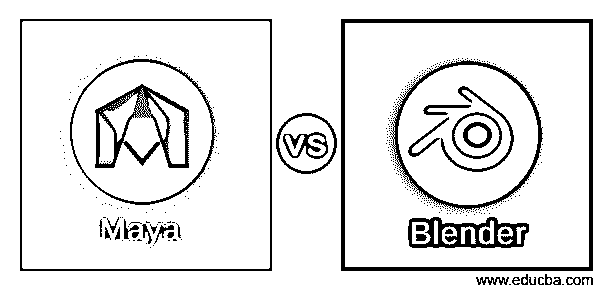
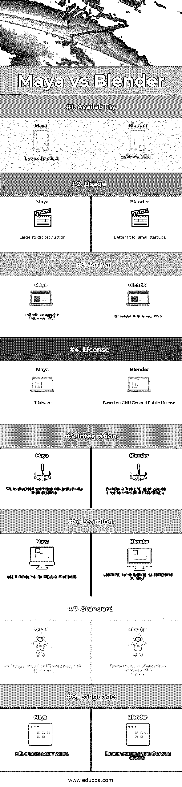

# 玛雅 vs 搅拌机

> 原文：<https://www.educba.com/maya-vs-blender/>

## Maya 和 Blender 之间的差异

Maya 是由 Alias Systems Corporation 开发的 3D 计算机图形应用程序，目前归 Auto desk，Inc .所有。它可以在 Windows、Mac OS 和 Linux 上高效运行。Maya 用于创建 3D 应用程序，包括各种产品，如视频游戏、动画电影、电视剧、视觉效果等。在本主题中，我们将了解 Maya vs Blender。

Blender 是由 Blender Foundation 开发的开源 3D 计算机图形软件工具集。它用于创建动画电影、视觉效果、3D 模型和视频游戏。它可以在 Windows、Mac OS 和 Linux 上使用。

<small>3D 动画、建模、仿真、游戏开发&其他</small>

Maya 为 3D 创建工作提供了一套全面的工具，包括建模、动画等。开发人员可以编辑和创建各种格式的 3D 模型，然后使用 Maya 套件提供的动画工具制作这些模型的动画。使用 Maya 提供的工具，可以高效地渲染基于动画 3D 场景的照片级真实感图像和动画视觉效果。

Blender Foundation 是一个非营利组织，它实际上是让 Blender 继续运行并组织这个开源项目。它有各种各样的工具，适用于几乎任何类型的媒体项目。使用 Blender 可以高效地创建动画电影、游戏、交互式应用，包括信息亭和科学研究。

Maya 以集成软件应用程序的形式提供给用户，旨在提高生产率和易用性。其软件界面可定制；因此，熟练的开发人员可以将他们的生产力提高到一个更高的水平。它允许开发人员通过提供对(MEL) Maya 嵌入式语言的访问来扩展其 Maya 功能。使用 MEL，开发人员可以通过写下脚本和宏来自定义界面。

Blender 是一个跨平台的应用程序，能够在 Linux、Mac OS 和 Windows 系统上运行。与其他 3D 创建工具相比，它具有较小的内存和硬盘需求。Blender 的界面使用 OpenGL 在所有支持的硬件和平台上提供一致的体验。

全套 API(应用程序编程接口)可用于提高 Maya 的能力和功能。它还为那些希望使用它的用户提供了一个基于 Python 的 API。

Blender 附带了广泛的基本工具，如建模、渲染、动画、视频编辑、VFX、纹理、装配、模拟和游戏创建。Blender 增加了复杂性和术语。有多个术语，如 UV 贴图、材质、网格、着色器等。，是艺术家的媒介；理解这些术语将有助于开发者更好地使用 Blender。

Maya dynamics 可以帮助开发人员创建令人信服的视觉模拟。也有 n 个动力学工具可用。为了模拟和渲染粘性流体，可以使用大气，烟火，海洋效果，Maya 流体效果。对于衣服和织物，n Cloth 效果可用，而 nParticles 可用于包括液体、云、烟雾、喷雾和灰尘在内的效果。

### Maya 和 Blender 之间的直接比较

下面是 Maya 与 Blender 之间的前 8 名比较

### Maya 和 Blender 之间的主要区别

Maya 与 Blender 之间的差异在以下几点进行了解释:

1.  Maya 通过 MEL (Maya 嵌入式语言)提供定制；接口可以用它来扩展，而 Blender 嵌入了 Python3，可以用来写插件，绑定角色等等。
2.  多年来，Maya 一直是 3D 建模和动画的行业标准，而 Blender 3D 绘画和雕刻工具并不符合 Maya 这样的标准。
3.  Maya 更适合大型工作室制作，而 Blender 是小型初创公司的理想选择。
4.  Maya 拥有 Autodesk 和世界各地用户的广泛支持，而 Blender 是开源软件，在其网站上有大量文档，其余支持通过社区教程提供。
5.  Maya 公开了一个节点图形体系结构，其中每个节点都有自己的属性和自定义，而 Blender 有一个基于节点的合成器，可以提供全面的视频排序和后处理功能。
6.  使用 Maya，第一次渲染动画可能是一个相当大的挑战，而 Blender 可以使渲染过程稍微容易一些，以便渲染动画或一系列帧。
7.  Maya 是 3D 动画的行业标准，被世界各地的专业人士使用，而 Blender 生活在 Maya 的阴影下，对自由职业者和小型初创项目非常有用。
8.  Maya 更强大，但这种强大伴随着许多复杂性的代价，而 Blender 可以解决 Maya 的一些复杂问题，如渲染引擎。
9.  Maya 作为授权产品，bug 较少，而 Blender 则容易出现 bug，导致每个版本都有中缀。
10.  Maya 有一个适中的学习曲线，它的工具集更具表现力，而使用 Blender，当第一次试图掌握主题时，它可能会令人生畏。

### Maya 与 Blender 对比表

以下是 Maya 与 Blender 的对比表

| **比较的基础** | **玛雅** | **搅拌机** |
| **可用性** | 许可产品 | 免费提供 |
| **用途** | 大型工作室制作 | 更适合小型创业公司 |
| **到达** | 最初发布于 1998 年 2 月 | 1998 年 1 月发布 |
| **执照** | 试用软件 | 基于 GNU 通用公共许可证 |
| **整合** | 许多工作室将 Maya 集成到他们的管道中 | Blender 是免费开源的；任何人都可以相应地编辑它 |
| **学习** | Maya 的学习曲线是适中的 | 与 Maya 相比，学习曲线很陡 |
| **标准** | 3D 建模和动画的行业标准 | 3D 雕刻和绘画与 Maya 不相上下 |
| **语言** | MEL 支持定制 | Blender 嵌入 python3 写插件 |

### 结论

毫无疑问，Maya 是 3D 应用程序的行业标准，也有很好的理由支持它。这是一个非常强大的程序，允许用户建模，纹理，渲染，运行模拟和动画。另一方面，Blender 总是生活在 Maya 的阴影下，被认为是 3D 行业的失败者。但这并不意味着 Blender 是比 Maya 更差的工具。

Blender 在某些方面比 Maya 更直观。用户可以在 Maya 或 Blender 中创建相同的动画、资源或渲染。这取决于开发者或艺术家的技能和效率，这主导了产品的创作。

Blender 并不比 Maya 好，反之亦然。Maya vs Blender 可以比另一个做得更好。有许多独特的搅拌机功能，有助于加快工作流程或简单的任务更容易。Maya 提供了一些比 Blender 更好的组件。归根结底，这取决于艺术家的成本、要求和技巧，这很重要。在选择 Maya 或 Blender 之前，需要高度考虑项目时间表和成本。

### 推荐文章

这是 Maya 与 Blender 之间最大差异的指南。在这里，我们还讨论了 Maya 与 Blender 的关键区别，包括信息图和比较表。您也可以看看以下文章——

1.  [Splunk vs Tableau](https://www.educba.com/splunk-vs-tableau/)
2.  [Mudbox vs Zbrush](https://www.educba.com/mudbox-vs-zbrush/)
3.  [3D Coat vs ZBrush](https://www.educba.com/3d-coat-vs-zbrush/)
4.  [Autocad 和 Inventor](https://www.educba.com/autocad-vs-inventor/)

