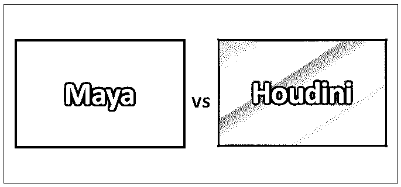
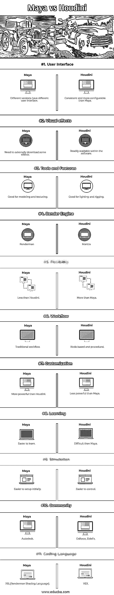

# 玛雅 vs 胡迪尼

> 原文：<https://www.educba.com/maya-vs-houdini/>

## 玛雅和胡迪尼的区别

3D 现在无处不在，从立体电影到在线标识，再到街道上的广告牌。它已经成为创意产业的主要产品。大量的工具，如玛雅 vs 胡迪尼，已经允许制作 3D 效果和动画。

Maya 是一个强大的 3D 建模、效果、动画和渲染解决方案，已用于从产品设计到故事片的所有领域。它于 1998 年 2 月首次发布，经过一系列收购后，于 2005 年被 Autodesk 收购。使用 Maya 制作的 3D 场景已经出现在电影、电视、游戏、广告、产品可视化和互联网中。

<small>3D 动画、建模、仿真、游戏开发&其他</small>

使用 Maya，可以创建自己的 3D 场景并设置动画，然后将其渲染为静止图像或动画序列。它可以产生任何可以想象的图像，从令人回味的绘画到高度实用的动画和特殊效果，如果在合适的人手里。Maya 具有过多的功能，由于其强大的功能，乍一看似乎很复杂。

玛雅非常迅速地发展和利用新的技术和思想。它的目的是成为一个一站式、灵活、可扩展、可定制和复杂的工具。

Houdini 是一个 3D 动画和特效应用程序，专为从事 3D 动画的艺术家和电影、电视、游戏和虚拟现实的 VFX 设计。它由副作用软件公司(加拿大多伦多)开发，于 1996 年 10 月首次发布。

Houdini 独特的基于节点的程序工作流程使您在优化工作时探索迭代变得简单，并允许多次迭代，以便轻松地进行更改和发展您的动画和效果。

它允许您使用过程生成一个适当的系统来控制模型的特征。它对于模拟也是有用的，并且允许柔韧的生产。

### 玛雅和胡迪尼的对决(资料图)

以下是玛雅和胡迪尼之间的 11 大区别

### 玛雅和胡迪尼的主要区别

两者都是市场上的热门选择；让我们讨论一些主要差异:

*   与其他 [3D 动画软件](https://www.educba.com/3d-animation-software/)相比，Houdini 利用了基于节点的程序工作流，这使得在您改进工作时更容易遍历迭代。像 Maya 这样的软件将更改存储在用户历史中，这使得很难返回到工作的以前版本。程序性是胡迪尼和玛雅的区别。
*   有了胡迪尼，就不用担心外挂了。它是全套的。在 Maya 中，您需要编写或购买额外的插件来实现某些效果。
*   与 Maya 相比，您需要使用的大多数模拟都包含在 Houdini 功能的核心中，这可以节省时间和金钱。胡迪尼擅长处理大量数据的复杂模拟。如果要创建 3D 模型或更简单的模拟，那么胡迪尼可能不是正确的选择。
*   对于单个角色的建模，人们倾向于选择 Maya。胡迪尼是用于建模或修改大量的模型轻快而有效。
*   就用户界面而言，Maya 非常不稳定。在 Maya 中，有三种不同的方式来访问节点排名，每种方式都缺少一些在一个或两个其他方式中可用的属性。另一方面，胡迪尼在所有背景下都是公正一致的。无论是建模、装配、照明还是渲染，连接和断开节点的方式都是一样的。
*   玛雅比胡迪尼学起来更容易也更快。胡迪尼需要技术知识以及编程和数学背景。
*   行业工作室通常会使用像 Maya 这样的工具来处理建模。胡迪尼将用于合并现有电影场景和动画中复杂的模拟效果。
*   一般来说，项目团队会喜欢与 Houdini 一起工作，因为项目的每个部分都可以在开发过程中的任何点进行修改，没有项目会像 Maya 一样保持完成或关闭。
*   Maya 的主要前提是破坏性工作流，这意味着单击按钮来执行动作。胡迪尼是以不同的方式构建的，因为它是一个非破坏性的工作流程。
*   在 Houdini 中，你可以随时删除、添加和重新排列节点，这使得修改变得非常简单。Maya 在其“历史”中有一些类似的东西，它创建了一些选项卡，您可以使用这些选项卡来更改以前动作的参数，但这些选项卡真的很难操纵，并且不能重新排序。
*   胡迪尼也有一些制作工具的好资源。如果你想在 Maya 中制作一些程序化的东西，你必须使用 Mel 或 Python 编写代码。有了 Houdini，你可以很容易地制作一个节点树，然后右键点击，把它变成一个工具。

### 玛雅与胡迪尼对比表

下面是最上面的比较:

| **比较的基础** | **玛雅** | **胡迪尼** |
| **用户界面** | 不同的版本有不同的用户界面。 | 比 Maya 更一致、更可配置。 |
| **视觉效果** | 我们需要从外部下载一些效果 | 在软件中随时可用。 |
| **工具和功能** | 适用于建模和纹理。 | 适合照明和索具。 |
| **渲染引擎** | Renderman | 咒语 |
| **灵活性** | 比胡迪尼还少 | 比玛雅还多 |
| **工作流程** | 传统工作流程 | 基于节点和程序的。 |
| **定制** | 比胡迪尼更强大 | 不如玛雅强大 |
| **学习** | 更容易学习 | 比玛雅还难 |
| **模拟** | 初始设置更容易 | 更容易控制 |
| **社区** | 美国电脑软件公司 | Odforce，SideFx |
| **编码语言** | RSL(Renderman 着色语言) | 使困惑 |

### 结论

对于初学者来说，胡迪尼有一个陡峭的学习曲线，因为其功能的程序设计比玛雅。战胜胡迪尼的关键是对数学和算法的精通。

与玛雅相比，胡迪尼尤其以创造动态模拟和流体效果而闻名。Maya 在动画或建模方面更好，而 Houdini 擅长照明，因为 Maya 的引用编辑器已损坏且不稳定。

工作室依靠胡迪尼来构建大型特效系统，整合成复杂的场景。然而，Maya 将是工作室处理建模或动画的首选。

不管你是选择胡迪尼还是玛雅，你都要记住，软件的坚固程度取决于它的用户。熟悉这个软件是一个巨大的幸事，能够学习它的界面会让工作更有效率。

### 推荐文章

这是玛雅和胡迪尼之间最大区别的指南。在这里，我们也讨论了玛雅人与胡迪尼的关键差异，信息图表和比较表。您也可以看看以下文章，了解更多信息–

1.  [Maya vs 3Ds Max](https://www.educba.com/maya-vs-3ds-max/)
2.  [玛雅 vs 搅拌机](https://www.educba.com/maya-vs-blender/)
3.  [3ds Max vs Sketchup](https://www.educba.com/3ds-max-vs-sketchup/)
4.  [玛雅替代品](https://www.educba.com/maya-alternatives/)

